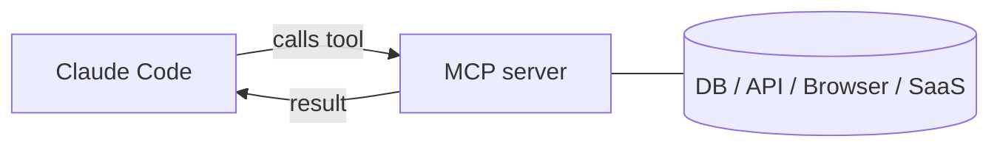

<LevelBadge level="advanced" />

<VerifyNote lastVerified="2026-06-20" source="https://code.claude.com/docs/en/mcp">
MCP कॉन्फ़िगरेशन सिंटैक्स, स्कोप, और ट्रांसपोर्ट विकसित होते रहते हैं — आधिकारिक Claude Code MCP डॉक्स और modelcontextprotocol.io पर पुष्टि करें।
</VerifyNote>

**Model Context Protocol (MCP)** AI को बाहरी टूल्स और डेटा से जोड़ने के लिए एक खुला मानक है। एक **MCP सर्वर** क्षमताएँ उजागर करता है (किसी डेटाबेस को क्वेरी करना, एक GitHub PR खोलना, किसी ब्राउज़र को चलाना); Claude Code इससे जुड़ता है और एक सत्र के दौरान **उन टूल्स को कॉल कर सकता है**। यह वह तरीका है जिससे आप Claude को अपने फ़ाइलसिस्टम और शेल से परे विस्तारित करते हैं।

## इसका स्वरूप



आप उन सर्वरों की घोषणा करते हैं जिन्हें Claude उपयोग कर सकता है; प्रत्येक सर्वर स्कीमा के साथ टूल्स का एक सेट प्रकाशित करता है; Claude उन्हें किसी भी अन्य टूल की तरह चुनता और कॉल करता है।

## ट्रांसपोर्ट्स

- **stdio** — एक स्थानीय प्रोसेस जिसे Claude लॉन्च करता है (स्थानीय टूल्स/CLI के लिए बढ़िया)।
- **रिमोट (HTTP/SSE)** — एक होस्ट किया गया सर्वर, अक्सर OAuth के साथ।

## सर्वर कॉन्फ़िगर करना

सर्वर एक कमांड/URL और किसी भी ऑथ के साथ कॉन्फ़िगर किए जाते हैं (आमतौर पर एक `.mcp.json` में और/या सेटिंग्स के माध्यम से)। स्कोप यह नियंत्रित करते हैं कि कोई सर्वर कहाँ उपलब्ध है (केवल आप, या प्रोजेक्ट के साथ साझा)। कॉपी-पेस्ट स्टार्टर्स के लिए [MCP Config और सर्वर स्कैफ़ोल्ड्स](/docs/templates/mcp-config) देखें।

```json
{
  "mcpServers": {
    "github": { "command": "npx", "args": ["-y", "@modelcontextprotocol/server-github"] }
  }
}
```

## विश्वास और सुरक्षा

:::warning MCP सर्वरों को सॉफ़्टवेयर इंस्टॉल करने जैसा मानें
एक MCP सर्वर कोड चलाता है और डेटा पढ़ सकता है और कार्रवाई कर सकता है। केवल उन्हीं सर्वरों से जुड़ें जिन पर आप भरोसा करते हैं, उन्हें आवश्यक **न्यूनतम विशेषाधिकार** दें, और याद रखें कि वे जो भी बाहरी सामग्री लौटाते हैं वह [प्रॉम्प्ट इंजेक्शन](/docs/security/prompt-injection) ले जा सकती है। तृतीय-पक्ष सर्वरों की पहले समीक्षा करें — देखें [तृतीय-पक्ष कोड की समीक्षा करना](/docs/security/reviewing-third-party-code)।
:::

## ऐप्स में भी MCP

MCP Claude ऐप्स में **Connectors** को भी शक्ति प्रदान करता है — वही मानक, अलग सतह। देखें [ऐप्स में Connectors (MCP)](/docs/claude-app/connectors) और, API के लिए, [MCP और टूल्स से कनेक्ट करना](/docs/api/mcp)।

## आगे

- [अपना पहला MCP सर्वर बनाएँ और जोड़ें (वॉकथ्रू)](/docs/walkthroughs/first-mcp-server)
- [MCP Config और सर्वर स्कैफ़ोल्ड्स](/docs/templates/mcp-config)
- [एजेंट्स और टूल्स को सुरक्षित करना](/docs/security/securing-agents)
