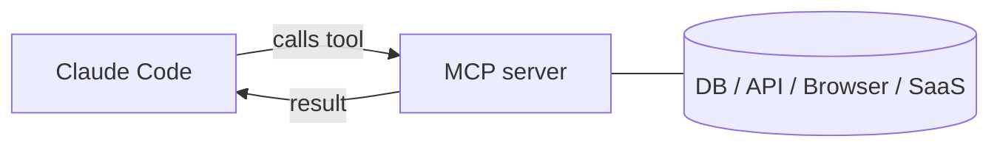

<LevelBadge level="advanced" />

<VerifyNote lastVerified="2026-06-23" source="https://code.claude.com/docs/en/mcp">
`claude mcp` कमांड, कॉन्फ़िगरेशन स्कोप, और ट्रांसपोर्ट विकसित होते रहते हैं — आधिकारिक Claude Code MCP डॉक्स और modelcontextprotocol.io पर पुष्टि करें।
</VerifyNote>

**Model Context Protocol (MCP)** AI को बाहरी टूल्स और डेटा से जोड़ने के लिए एक खुला मानक है। एक **MCP सर्वर** क्षमताएँ उजागर करता है (किसी डेटाबेस को क्वेरी करना, एक GitHub PR खोलना, किसी ब्राउज़र को चलाना); Claude Code इससे जुड़ता है और एक सत्र के दौरान **उन टूल्स को कॉल कर सकता है**। यह वह तरीका है जिससे आप Claude को अपने फ़ाइलसिस्टम और शेल से परे विस्तारित करते हैं।

## इसका स्वरूप



आप उन सर्वरों की घोषणा करते हैं जिन्हें Claude उपयोग कर सकता है; प्रत्येक सर्वर स्कीमा के साथ टूल्स का एक सेट प्रकाशित करता है; Claude उन्हें किसी भी अन्य टूल की तरह चुनता और कॉल करता है।

## ट्रांसपोर्ट्स

- **stdio** — एक स्थानीय प्रोसेस जिसे Claude लॉन्च करता है (स्थानीय टूल्स/CLI के लिए बढ़िया)।
- **रिमोट (HTTP/SSE)** — एक होस्ट किया गया सर्वर, अक्सर OAuth के साथ।

## सर्वर कॉन्फ़िगर करना

सबसे तेज़ रास्ता `claude mcp add` कमांड है — यह आपके लिए कॉन्फ़िग लिख देता है:

```bash
# A local stdio server (everything after -- is the launch command)
claude mcp add github -- npx -y @modelcontextprotocol/server-github

# A remote HTTP server, shared with everyone on the project
claude mcp add --transport http --scope project linear https://mcp.linear.app/mcp
```

पर्दे के पीछे वह बस JSON है। एक **project**-स्कोप वाला सर्वर रेपो रूट पर एक `.mcp.json` में आता है — इसे चेक इन करें और आपकी पूरी टीम को समान टूल्स मिल जाते हैं:

```json
{
  "mcpServers": {
    "github": { "command": "npx", "args": ["-y", "@modelcontextprotocol/server-github"] }
  }
}
```

**स्कोप तय करता है कि सर्वर किसे दिखता है:**

| स्कोप | कहाँ रहता है | किसके लिए उपयोग करें |
|---|---|---|
| `local` (डिफ़ॉल्ट) | आपकी उपयोगकर्ता सेटिंग्स, केवल यह प्रोजेक्ट | व्यक्तिगत प्रयोग, सीक्रेट्स |
| `project` | रेपो में `.mcp.json` (कमिट किया हुआ) | वे टूल्स जिन्हें पूरी टीम को साझा करना चाहिए |
| `user` | आपकी उपयोगकर्ता सेटिंग्स, सभी प्रोजेक्ट्स | वे सर्वर जिन्हें आप हर जगह चाहते हैं |

जो कनेक्ट है उसे देखने के लिए `claude mcp list` चलाएँ और टूल्स का निरीक्षण करने तथा रिमोट सर्वरों को प्रमाणित करने के लिए किसी सत्र के अंदर `/mcp` चलाएँ। कॉपी-पेस्ट स्टार्टर्स के लिए [MCP Config और सर्वर स्कैफ़ोल्ड्स](/docs/templates/mcp-config) देखें।

## व्यावहारिक उदाहरण: Claude को अपना डेटाबेस दें

मान लीजिए आप चाहते हैं कि क्वेरी परिणाम पेस्ट करने के बजाय Claude एक स्थानीय Postgres के विरुद्ध प्रश्नों का उत्तर दे। सर्वर जोड़ें (project स्कोप, ताकि टीम के साथी इसे विरासत में पाएँ):

```bash
claude mcp add --scope project db -- npx -y @modelcontextprotocol/server-postgres "postgresql://localhost/app"
```

अब किसी सत्र में आप पूछ सकते हैं: *"How many users signed up last week? Check the DB."* Claude सर्वर का `query` टूल कॉल करता है, पंक्तियाँ वापस पाता है, और उत्तर देता है — कोई कॉपी-पेस्ट लूप नहीं। चूँकि यह project-स्कोप वाला है, रेपो खींचने वाले एक टीम साथी को Claude Code खोलते ही वही क्षमता मिल जाती है। यदि आप केवल पठन चाहते हैं तो कनेक्शन स्ट्रिंग को केवल-पठन रखें।

## विश्वास और सुरक्षा

:::warning MCP सर्वरों को सॉफ़्टवेयर इंस्टॉल करने जैसा मानें
एक MCP सर्वर कोड चलाता है और डेटा पढ़ सकता है और कार्रवाई कर सकता है। केवल उन्हीं सर्वरों से जुड़ें जिन पर आप भरोसा करते हैं, उन्हें आवश्यक **न्यूनतम विशेषाधिकार** दें, और याद रखें कि वे जो भी बाहरी सामग्री लौटाते हैं वह [प्रॉम्प्ट इंजेक्शन](/docs/security/prompt-injection) ले जा सकती है। तृतीय-पक्ष सर्वरों की पहले समीक्षा करें — देखें [तृतीय-पक्ष कोड की समीक्षा करना](/docs/security/reviewing-third-party-code)।
:::

## ऐप्स में भी MCP

MCP Claude ऐप्स में **Connectors** को भी शक्ति प्रदान करता है — वही मानक, अलग सतह। देखें [ऐप्स में Connectors (MCP)](/docs/claude-app/connectors) और, API के लिए, [MCP और टूल्स से कनेक्ट करना](/docs/api/mcp)।

## आम गलतियाँ

- **गलत स्कोप।** `local` स्कोप पर जोड़ा गया सर्वर टीम के साथियों के लिए नहीं दिखेगा; जो आप केवल अपने लिए चाहते थे उसे `project` स्कोप पर कमिट नहीं किया जाना चाहिए। सोच-समझकर चुनें।
- **बहुत सारे सर्वर, बहुत सारे टूल्स।** प्रत्येक जुड़ा सर्वर अपने टूल स्कीमा को संदर्भ में जोड़ता है। कार्य को जो चाहिए उसे जोड़ें, अपना पूरा कैटलॉग नहीं।
- **अति-विशेषाधिकार प्राप्त कनेक्शन।** किसी डेटाबेस सर्वर को एक केवल-पठन भूमिका दें जब तक कि Claude को सचमुच लिखने की ज़रूरत न हो। MCP क्षमताओं को वास्तविक बनाता है — उन्हें संकीर्ण करें।
- **इंजेक्शन जोखिम को भूलना।** सर्वर जो भी लौटाता है (एक वेब पेज, एक issue बॉडी, एक पंक्ति) वह अविश्वसनीय टेक्स्ट है जो [प्रॉम्प्ट इंजेक्शन](/docs/security/prompt-injection) ले जा सकता है। सोचे-समझे बिना एक शक्तिशाली write-सक्षम सर्वर को किसी अविश्वसनीय read-सक्षम सर्वर के बगल में न जोड़ें।

## आगे

- [अपना पहला MCP सर्वर बनाएँ और जोड़ें (वॉकथ्रू)](/docs/walkthroughs/first-mcp-server)
- [MCP Config और सर्वर स्कैफ़ोल्ड्स](/docs/templates/mcp-config)
- [एजेंट्स और टूल्स को सुरक्षित करना](/docs/security/securing-agents)
</content>
