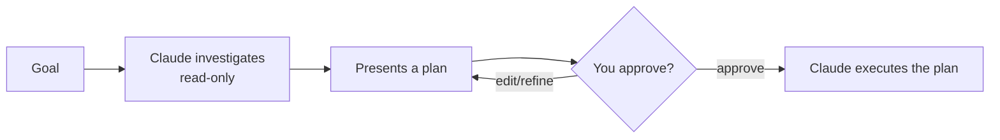

<LevelBadge level="beginner" />

<VerifyNote lastVerified="2026-06-20" source="https://code.claude.com/docs/en">
आप Plan Mode में कैसे प्रवेश करते हैं (शॉर्टकट/फ़्लैग) यह रिलीज़ के बीच बदल सकता है — आधिकारिक Claude Code डॉक्स देखें।
</VerifyNote>

**Plan Mode** Claude Code को **केवल-पठन** बना देता है: यह आपके कोडबेस का अन्वेषण कर सकता है, खोज चला सकता है, और तर्क कर सकता है — लेकिन यह **फ़ाइलों को संपादित नहीं करेगा या स्थिति-बदलने वाले कमांड नहीं चलाएगा**। इसके बजाय यह एक योजना तैयार करता है और आपकी मंज़ूरी की प्रतीक्षा करता है।

## यह शुरू करने का सबसे सुरक्षित तरीका क्यों है

किसी भी बड़ी, जोखिम भरी, या अपरिचित चीज़ के लिए, आप यह देखना चाहते हैं कि Claude *क्या* करने का इरादा रखता है, इससे पहले कि वह आपके रेपो को छुए। Plan Mode **सोचने** को **करने** से अलग करता है:

आप गलत धारणाओं को *उससे पहले* पकड़ लेते हैं जब वे गलत कोड बन जाएँ।

## इसका उपयोग कब करें

- बड़े या बहु-फ़ाइल बदलावों, माइग्रेशन, या रिफ़ैक्टर के लिए **हमेशा**।
- जब किसी ऐसे कोडबेस में काम कर रहे हों जिसे आप अभी पूरी तरह नहीं जानते।
- जब आप किसी सहकर्मी के साथ साझा करने के लिए एक समीक्षा योग्य योजना चाहते हैं।

छोटे, स्पष्ट संपादनों के लिए आप इसे छोड़ सकते हैं — लेकिन संदेह होने पर, पहले योजना बनाएँ।

## व्यवहार में यह कैसे काम करता है

1. Plan Mode में प्रवेश करें और अपना लक्ष्य बताएँ।
2. Claude संबंधित फ़ाइलें पढ़ता है और स्पष्ट करने वाले प्रश्न पूछता है।
3. यह एक चरण-दर-चरण योजना लौटाता है: बदलने योग्य फ़ाइलें, दृष्टिकोण, और कैसे सत्यापित करें।
4. आप अनुमोदित करते हैं (या परिष्कृत करते हैं)। केवल तभी यह बदलाव करने पर स्विच करता है।

:::tip इसे CLAUDE.md के साथ जोड़ें
एक अच्छा [CLAUDE.md](/docs/claude-code/claude-md) योजनाओं को तेज़ बनाता है — Claude आपकी परंपराओं और सुरक्षा कवच को पहले से ध्यान में रखकर योजना बनाता है।
:::

## Plan Mode बनाम अनुमतियाँ

ये अलग-अलग समस्याएँ हल करते हैं और साथ मिलकर काम करते हैं:

- **Plan Mode** = "जाँच करो और प्रस्ताव दो, अभी कार्य मत करो।" (यह पृष्ठ।)
- **[अनुमतियाँ](/docs/claude-code/permissions)** = एक बार कार्य करने पर, *कौन सी* क्रियाएँ बिना पूछे अनुमत हैं।

## आगे

- [अनुमतियाँ और अनुमति मोड](/docs/claude-code/permissions)
- [संदर्भ प्रबंधन](/docs/claude-code/context-management) — लंबे सत्रों को प्रभावी रखें
- [वॉकथ्रू: एक वास्तविक रेपो के लिए Claude Code को कस्टमाइज़ करें](/docs/walkthroughs/customize-claude-code)
