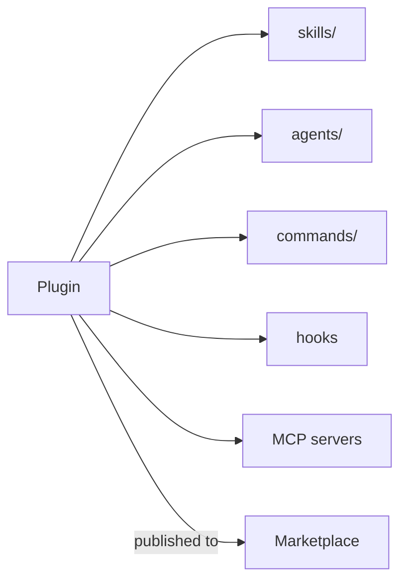

<LevelBadge level="advanced" />

<VerifyNote lastVerified="2026-06-20" source="https://docs.anthropic.com/en/docs/claude-code">
प्लगइन संरचना और मार्केटप्लेस तंत्र तेज़ी से विकसित हो रहे हैं — आधिकारिक Claude Code डॉक्स में विवरण की पुष्टि करें।
</VerifyNote>

एक **प्लगइन** कई कस्टमाइज़ेशन को बंडल करता है — [स्किल्स](/docs/claude-code/skills), [सबएजेंट्स](/docs/claude-code/subagents), [स्लैश कमांड](/docs/claude-code/slash-commands), [हुक्स](/docs/claude-code/hooks), और [MCP सर्वर](/docs/claude-code/mcp) — एक एकल, संस्करणित, इंस्टॉल करने योग्य इकाई में। एक **मार्केटप्लेस** प्लगइन्स का एक कैटलॉग है जिसे लोग खोज और इंस्टॉल कर सकते हैं।

## प्लगइन्स क्यों मायने रखते हैं

- **एक चरण में एक टीम टूलकिट भेजें।** हर किसी से पाँच फ़ाइलें कॉपी करने को कहने के बजाय, एक प्लगइन प्रकाशित करें; सहकर्मी इसे इंस्टॉल करते हैं और समान कमांड, हुक्स, एजेंट्स, और MCP कनेक्शन पाते हैं।
- **संस्करणन।** प्लगइन अपडेट करें, हर कोई नया संस्करण खींच लेता है।
- **वितरण।** एक मार्केटप्लेस आपके (या दूसरों के) टूलकिट को खोजने योग्य बनाता है।

## आमतौर पर इसके अंदर क्या होता है

एक प्लगइन एक संरचित फ़ोल्डर है (एक मैनिफ़ेस्ट और जिन हिस्सों को यह भेजता है)। न्यूनतम रूप में यह केवल स्किल्स ले जा सकता है; अधिकतम रूप में, ऊपर दिया पूरा सेट। प्रत्येक प्लगइन को **सुसंगत** रखें — एक "team conventions" प्लगइन, एक "Python toolkit" प्लगइन — बजाय एक मिश्रित-बैग के।

## इंस्टॉल करने से पहले विश्वास करें

:::warning प्लगइन्स निष्पादन योग्य कोड भेज सकते हैं
प्लगइन में हुक्स और MCP सर्वर आपके विशेषाधिकारों के साथ चलते हैं। उन स्रोतों से इंस्टॉल करें जिन पर आप भरोसा करते हैं और पहले समीक्षा करें कि कोई प्लगइन क्या करता है — देखें [तृतीय-पक्ष कोड की समीक्षा करना](/docs/security/reviewing-third-party-code)।
:::

## अपने सेटअप को स्केल करने का एक मार्ग

स्वाभाविक प्रगति: एक `CLAUDE.md` → कुछ [स्किल्स](/docs/claude-code/skills) और [कमांड](/docs/claude-code/slash-commands) → उन्हें एक प्लगइन में बंडल करें → अपनी टीम या समुदाय के लिए एक मार्केटप्लेस में प्रकाशित करें। वह अंतिम चरण उस तरीके का हिस्सा है जिससे AILmanac इकोसिस्टम को बढ़ने में मदद करना चाहता है।

## आगे

- [स्किल्स](/docs/claude-code/skills) · [सबएजेंट्स](/docs/claude-code/subagents) · [MCP](/docs/claude-code/mcp)
- [तृतीय-पक्ष कोड की समीक्षा करना](/docs/security/reviewing-third-party-code)
- AILmanac के [स्किल पैक्स](/docs/templates/skills)
