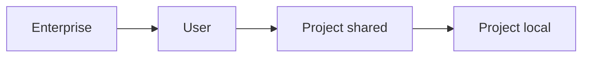

<LevelBadge level="intermediate" />

<VerifyNote lastVerified="2026-06-20" source="https://code.claude.com/docs/en/settings">
सटीक keys और फ़ाइल स्थानों की पुष्टि आधिकारिक Claude Code settings डॉक्स में सबसे अच्छी तरह की जाती है।
</VerifyNote>

`settings.json` वह जगह है जहाँ Claude Code का कॉन्फ़िगरेशन रहता है — [अनुमतियाँ](/docs/claude-code/permissions), [हुक्स](/docs/claude-code/hooks), environment वेरिएबल्स, मॉडल डिफ़ॉल्ट्स, और बहुत कुछ। **स्तरों** को समझना ही कुंजी है।

## स्तर (सबसे-वैश्विक → सबसे-विशिष्ट)

बाद के (अधिक विशिष्ट) स्तर पहले वाले को ओवरराइड करते हैं:

1. **Enterprise / managed** — किसी संगठन व्यवस्थापक द्वारा निर्धारित नीति। हर चीज़ पर भारी पड़ती है।
2. **User** — `~/.claude/settings.json`। आपके सभी प्रोजेक्ट्स में आपके डिफ़ॉल्ट्स।
3. **Project (साझा)** — `.claude/settings.json`, रेपो में कमिट की गई। टीम-व्यापी।
4. **Project (व्यक्तिगत)** — `.claude/settings.local.json`, git-ignored। इस रेपो के लिए आपके ओवरराइड्स।

:::tip साझा फ़ाइल को कमिट करें, स्थानीय को अनदेखा करें
टीम परंपराओं को `.claude/settings.json` (कमिट की गई) में रखें। व्यक्तिगत बदलाव और मशीन-विशिष्ट पथ `.claude/settings.local.json` (git-ignored) में रखें। यह आपकी प्राथमिकताओं को दूसरों पर थोपे बिना टीम को सुसंगत रखता है।
:::

## आप आमतौर पर क्या सेट करेंगे

- **`permissions`** — allow/ask/deny नियम। देखें [अनुमतियाँ](/docs/claude-code/permissions)।
- **`hooks`** — लाइफ़साइकल इवेंट्स पर चलने वाले कमांड। देखें [हुक्स](/docs/claude-code/hooks)।
- **`env`** — सत्र के लिए environment वेरिएबल्स।
- **मॉडल / व्यवहार डिफ़ॉल्ट्स** — जैसे, पसंदीदा मॉडल।

## सुरक्षित रूप से संपादन

- इसे वैध JSON रखें (एक ट्रेलिंग कॉमा इसे तोड़ देगा)।
- व्यापक नियमों के बजाय **संकीर्ण** अनुमति नियमों को प्राथमिकता दें।
- किसी कमिट की गई फ़ाइल में कभी सीक्रेट्स न डालें — `env` संदर्भों या एक सीक्रेट्स मैनेजर का उपयोग करें।

कॉपी करने के लिए तैयार शुरुआती फ़ाइलें [हुक्स और settings.json रेसिपीज़](/docs/templates/hooks-settings) में रहती हैं।

## आगे

- [अनुमतियाँ और अनुमति मोड](/docs/claude-code/permissions)
- [हुक्स: नियतात्मक स्वचालन](/docs/claude-code/hooks)
- [कस्टम स्लैश कमांड](/docs/claude-code/slash-commands)
