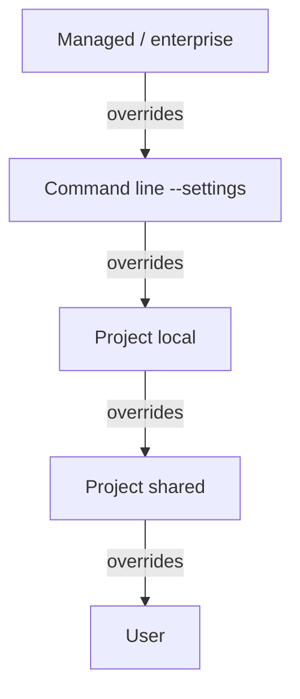

<LevelBadge level="intermediate" />

<VerifyNote lastVerified="2026-09-23" source="https://code.claude.com/docs/en/settings">
पाँच-स्तरीय प्राथमिकता स्टैक (प्रबंधित → कमांड लाइन → प्रोजेक्ट लोकल → प्रोजेक्ट साझा → उपयोगकर्ता) और "एनवायरनमेंट वेरिएबल एक स्तर नहीं हैं" नियम आधिकारिक पेज [Settings files and precedence](https://code.claude.com/docs/en/settings) से। प्रति-कुंजी ओवरराइड [सेटिंग्स संदर्भ](https://code.claude.com/docs/en/settings-reference) में सूचीबद्ध हैं।
</VerifyNote>

`settings.json` वह जगह है जहाँ Claude Code का कॉन्फ़िगरेशन रहता है — [अनुमतियाँ](/docs/claude-code/permissions), [हुक्स](/docs/claude-code/hooks), environment वेरिएबल्स, मॉडल डिफ़ॉल्ट्स, और बहुत कुछ। **स्तरों** को समझना ही कुंजी है।

## स्तर (सर्वोच्च प्राथमिकता पहले)

जब एक ही कुंजी एक से अधिक जगह सेट होती है, तो Claude Code उसे सेट करने वाले सबसे ऊँचे स्तर का मान उपयोग करता है:

1. **प्रबंधित / एंटरप्राइज़** — `managed-settings.json`, कोई MDM नीति, या claude.ai कंसोल से सर्वर-प्रबंधित सेटिंग्स। कुछ सुरक्षा-संवेदनशील अपवादों को छोड़कर, आपका सेट किया कुछ भी इन्हें ओवरराइड नहीं करता।
2. **कमांड लाइन** — `claude --settings '<json-or-path>'`, केवल एक सत्र के लिए। प्रबंधित को छोड़कर हर फ़ाइल के ऊपर रहती है, और किसी फ़ाइल में नहीं लिखती।
3. **प्रोजेक्ट (व्यक्तिगत)** — `.claude/settings.local.json`, git से बाहर। इस रिपॉज़िटरी के लिए आपके ओवरराइड।
4. **प्रोजेक्ट (साझा)** — `.claude/settings.json`, रिपॉज़िटरी में कमिट किया गया। पूरी टीम के लिए।
5. **उपयोगकर्ता** — `~/.claude/settings.json`। सभी प्रोजेक्ट्स में आपके डिफ़ॉल्ट।

```mermaid
flowchart TB
  M[Managed / enterprise] -->|overrides| C[Command line --settings]
  C -->|overrides| L[Project local]
  L -->|overrides| P[Project shared]
  P -->|overrides| U[User]
```

:::note एनवायरनमेंट वेरिएबल एक स्तर नहीं हैं
वे इस स्टैक के बाहर होते हैं और प्रति कुंजी हल किए जाते हैं। उदाहरण के लिए `ANTHROPIC_MODEL` किसी भी फ़ाइल की `model` कुंजी पर लागू होता है, जबकि `ANTHROPIC_DEFAULT_MODEL` केवल तभी लागू होता है जब कोई फ़ाइल `model` सेट न करे।
:::

:::tip साझा फ़ाइल को कमिट करें, स्थानीय को अनदेखा करें
टीम परंपराओं को `.claude/settings.json` (कमिट की गई) में रखें। व्यक्तिगत बदलाव और मशीन-विशिष्ट पथ `.claude/settings.local.json` (git-ignored) में रखें। यह आपकी प्राथमिकताओं को दूसरों पर थोपे बिना टीम को सुसंगत रखता है।
:::

## आप आमतौर पर क्या सेट करेंगे

- **`permissions`** — allow/ask/deny नियम। देखें [अनुमतियाँ](/docs/claude-code/permissions)।
- **`hooks`** — लाइफ़साइकल इवेंट्स पर चलने वाले कमांड। देखें [हुक्स](/docs/claude-code/hooks)।
- **`env`** — सत्र के लिए environment वेरिएबल्स।
- **मॉडल / व्यवहार डिफ़ॉल्ट्स** — जैसे, पसंदीदा मॉडल।

## सुरक्षित रूप से संपादन

- इसे वैध JSON रखें (एक ट्रेलिंग कॉमा इसे तोड़ देगा)।
- व्यापक नियमों के बजाय **संकीर्ण** अनुमति नियमों को प्राथमिकता दें।
- किसी कमिट की गई फ़ाइल में कभी सीक्रेट्स न डालें — `env` संदर्भों या एक सीक्रेट्स मैनेजर का उपयोग करें।

कॉपी करने के लिए तैयार शुरुआती फ़ाइलें [हुक्स और settings.json रेसिपीज़](/docs/templates/hooks-settings) में रहती हैं।

## आगे

- [अनुमतियाँ और अनुमति मोड](/docs/claude-code/permissions)
- [हुक्स: नियतात्मक स्वचालन](/docs/claude-code/hooks)
- [कस्टम स्लैश कमांड](/docs/claude-code/slash-commands)
