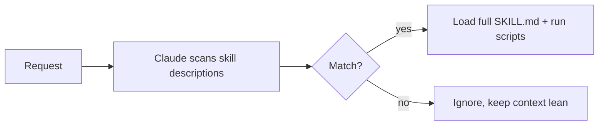

<LevelBadge level="advanced" />

<VerifyNote lastVerified="2026-06-23" source="https://code.claude.com/docs/en/skills">
Skill फ़ाइल लेआउट, प्रगतिशील प्रकटीकरण, और स्किल्स कहाँ चलती हैं (Claude Code, Claude.ai, Cowork) विकसित हो रहे हैं — आधिकारिक Skills डॉक्स में पुष्टि करें।
</VerifyNote>

एक **Skill** विशेषज्ञता को पैकेज करती है — निर्देश और वैकल्पिक स्क्रिप्ट्स तथा संसाधन — जिसे Claude **केवल तभी लोड करता है जब प्रासंगिक हो**। सब कुछ [CLAUDE.md](/docs/claude-code/claude-md) में ठूँसने के बजाय, आप Claude को क्षमताओं की एक लाइब्रेरी देते हैं जिसे यह माँग पर खींच लेता है।

## संरचना

एक स्किल एक `SKILL.md` वाला फ़ोल्डर है: YAML frontmatter + निर्देश।

```markdown
---
name: pdf-forms
description: Use when the user needs to fill, read, or generate PDF forms.
---

# PDF Forms
Steps and rules for working with PDF forms…
(optionally reference scripts/ or resources/ in this folder)
```

**`description` ही ट्रिगर है** — Claude इसे पढ़कर तय करता है कि स्किल को *कब* सक्रिय करना है। इसे "Use when…" के रूप में लिखें, इतना विशिष्ट कि यह सही समय पर लोड हो और अन्यथा नहीं।

## प्रगतिशील प्रकटीकरण (स्किल्स क्यों स्केल करती हैं)

Claude हर स्किल का पूरा हिस्सा पहले से लोड नहीं करता — यह हल्के `name` + `description` को देखता है, और केवल तभी पूरे निर्देश खींचता है (और स्क्रिप्ट्स चलाता है) जब कोई अनुरोध मेल खाता है। यह कई स्किल्स इंस्टॉल होने पर भी संदर्भ को दुबला रखता है।



## ये कहाँ रहती हैं

- व्यक्तिगत: `~/.claude/skills/<name>/SKILL.md`
- प्रोजेक्ट (साझा करने योग्य): `.claude/skills/<name>/SKILL.md`
- टीम वितरण के लिए किसी [प्लगइन](/docs/claude-code/plugins-marketplaces) में बंडल की हुई।

AILmanac [7 तैयार स्किल पैक्स](/docs/templates/skills) के साथ आता है — इसे आज़माने के लिए एक को कॉपी कर लें।

## व्यावहारिक उदाहरण: एक स्किल जो खुद को ट्रिगर करती है

`~/.claude/skills/release-notes/SKILL.md` बनाएँ:

```markdown
---
name: release-notes
description: Use when the user asks to write release notes or a changelog from git history.
---

# Release Notes
1. Run `git log <last-tag>..HEAD --oneline` to get the commits.
2. Group them into Features / Fixes / Breaking changes.
3. Write user-facing notes — what changed for *users*, not commit messages.
4. Output Markdown ready to paste into a GitHub release.
```

बाद में आप टाइप करते हैं: *"Draft release notes since v1.4."* Claude के पास ये चरण कभी संदर्भ में नहीं थे — लेकिन अनुरोध `description` से मेल खाता है, इसलिए यह पूरी `SKILL.md` खींचता है, `git log` चलाता है, और समूहीकृत नोट्स तैयार करता है। आपने किसी चीज़ को नाम से नहीं बुलाया; **description ने रूटिंग की**। उसी फ़ोल्डर में एक `scripts/` फ़ाइल जोड़ें और स्किल इसे चरण 1 के हिस्से के रूप में चला सकती है।

## Skill बनाम command बनाम subagent बनाम MCP

| टूल | यह क्या है | आप बनाम Claude ट्रिगर करता है |
|---|---|---|
| [स्लैश कमांड](/docs/claude-code/slash-commands) | एक सहेजा गया प्रॉम्प्ट | **आप** इसे आह्वान करते हैं |
| **Skill** | माँग पर विशेषज्ञता + स्क्रिप्ट्स | प्रासंगिक होने पर **Claude** इसे लोड करता है |
| [Subagent](/docs/claude-code/subagents) | अपने खुद के संदर्भ के साथ एक सौंपा गया एजेंट | Claude सौंपता है |
| [MCP](/docs/claude-code/mcp) | बाहरी टूल्स/डेटा से एक कनेक्शन | कॉल करने के लिए टूल्स प्रदान करता है |

अंगूठे का नियम: **आप** इसे माँग पर सक्रिय करना चाहते हैं → स्लैश कमांड। **Claude** को प्रक्रिया जाननी चाहिए और प्रासंगिक होने पर इसे लागू करना चाहिए → skill। काम एक अलग संदर्भ में होना चाहिए → subagent। आपको किसी बाहरी सिस्टम तक पहुँचना है → MCP।

## आम गलतियाँ

- **एक description जो ट्रिगर नहीं करता।** "Helps with PDFs" बहुत अस्पष्ट है; "Use when the user needs to fill, read, or generate PDF forms" Claude को ठीक-ठीक बताता है कि इसे कब लोड करना है। description ही पूरा सक्रियण तंत्र है — इसे मिलान के लिए लिखें, मनुष्यों के लिए नहीं।
- **इसके बजाय सब कुछ CLAUDE.md में डालना।** [CLAUDE.md](/docs/claude-code/claude-md) *हर* सत्र लोड होती है और हमेशा संदर्भ की लागत लगाती है; एक स्किल *केवल तभी* लोड होती है जब प्रासंगिक हो। परिस्थितिजन्य प्रक्रियाओं को स्किल्स में ले जाएँ और CLAUDE.md को हमेशा-सत्य प्रोजेक्ट नियमों के लिए रखें।
- **एक विशाल स्किल।** कई छोटी, तीखे ढंग से वर्णित स्किल्स एक सर्व-समावेशी की तुलना में बेहतर रूट करती हैं — प्रगतिशील प्रकटीकरण केवल तभी मदद करता है जब प्रत्येक description विशिष्ट हो।
- **यह भूलना कि यह साझा करने योग्य है।** git में कमिट की गई `.claude/skills/` में एक प्रोजेक्ट स्किल पूरी टीम को क्षमता देती है; `~/.claude/skills/` में एक व्यक्तिगत स्किल आपकी ही रहती है।

## आगे

- [अपनी पहली Skill लिखें (वॉकथ्रू)](/docs/walkthroughs/first-skill)
- [SKILL.md टेम्पलेट्स](/docs/templates/skills)
- [प्लगइन्स और मार्केटप्लेस](/docs/claude-code/plugins-marketplaces)
</content>
