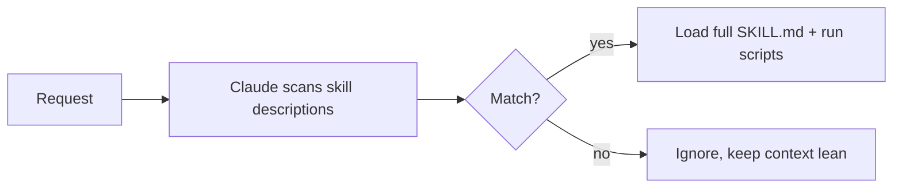

<LevelBadge level="advanced" />

<VerifyNote lastVerified="2026-06-20" source="https://docs.anthropic.com/en/docs/claude-code/skills">
स्किल फ़ाइल लेआउट और स्किल्स कहाँ चलती हैं (Claude Code, Claude.ai, Cowork) यह विकसित हो रहा है — आधिकारिक Skills डॉक्स में पुष्टि करें।
</VerifyNote>

एक **Skill** विशेषज्ञता को पैकेज करती है — निर्देश के साथ वैकल्पिक स्क्रिप्ट्स और संसाधन — जिसे Claude **केवल तभी लोड करता है जब प्रासंगिक हो**। हर चीज़ को [CLAUDE.md](/docs/claude-code/claude-md) में ठूँसने के बजाय, आप Claude को क्षमताओं की एक लाइब्रेरी देते हैं जिसे यह माँग पर खींच लेता है।

## संरचना

एक स्किल एक `SKILL.md` वाला फ़ोल्डर है: YAML frontmatter + निर्देश।

```markdown
---
name: pdf-forms
description: Use when the user needs to fill, read, or generate PDF forms.
---

# PDF Forms
Steps and rules for working with PDF forms…
(optionally reference scripts/ or resources/ in this folder)
```

**`description` ही ट्रिगर है** — Claude इसे पढ़कर तय करता है कि स्किल को *कब* सक्रिय करना है। इसे "Use when…" के रूप में लिखें, इतना विशिष्ट कि यह सही समय पर लोड हो और अन्यथा नहीं।

## प्रगतिशील प्रकटीकरण (स्किल्स क्यों स्केल करती हैं)

Claude हर स्किल का पूरा हिस्सा पहले से लोड नहीं करता — यह हल्के `name` + `description` को देखता है, और केवल तभी पूरे निर्देश खींचता है (और स्क्रिप्ट्स चलाता है) जब कोई अनुरोध मेल खाता है। यह कई स्किल्स इंस्टॉल होने पर भी संदर्भ को दुबला रखता है।



## ये कहाँ रहती हैं

- व्यक्तिगत: `~/.claude/skills/<name>/SKILL.md`
- प्रोजेक्ट (साझा करने योग्य): `.claude/skills/<name>/SKILL.md`
- टीम वितरण के लिए किसी [प्लगइन](/docs/claude-code/plugins-marketplaces) में बंडल।

AILmanac [7 तैयार स्किल पैक्स](/docs/templates/skills) भेजता है — आज़माने के लिए एक कॉपी करें।

## Skill बनाम command बनाम subagent बनाम MCP

| टूल | यह क्या है | आप बनाम Claude ट्रिगर करता है |
|---|---|---|
| [स्लैश कमांड](/docs/claude-code/slash-commands) | एक सहेजा गया प्रॉम्प्ट | **आप** इसे आह्वान करते हैं |
| **Skill** | माँग पर विशेषज्ञता + स्क्रिप्ट्स | **Claude** प्रासंगिक होने पर इसे लोड करता है |
| [Subagent](/docs/claude-code/subagents) | अपने संदर्भ के साथ एक सौंपा गया एजेंट | Claude सौंपता है |
| [MCP](/docs/claude-code/mcp) | बाहरी टूल्स/डेटा से एक कनेक्शन | कॉल करने के लिए टूल्स प्रदान करता है |

## आगे

- [अपनी पहली Skill लिखें (वॉकथ्रू)](/docs/walkthroughs/first-skill)
- [SKILL.md टेम्पलेट्स](/docs/templates/skills)
- [प्लगइन्स और मार्केटप्लेस](/docs/claude-code/plugins-marketplaces)
