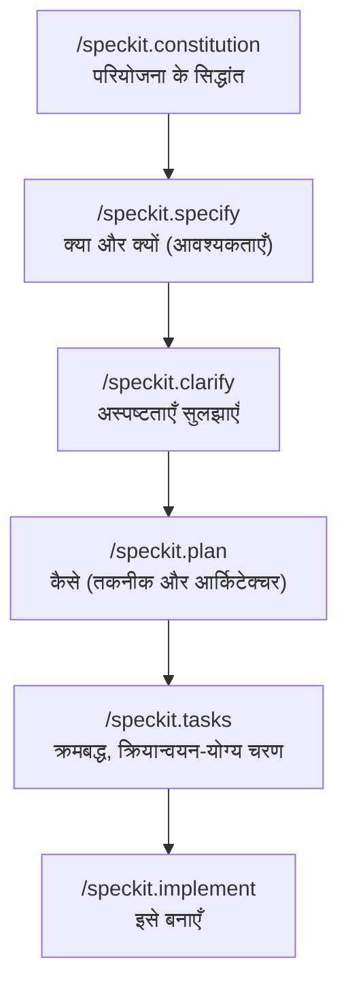

<LevelBadge level="intermediate" />

# Spec Kit के साथ स्पेक-संचालित डेवलपमेंट

वाइब कोडिंग — "मेरे लिए एक डैशबोर्ड बनाओ," जो भी वापस आए उसे स्वीकार कर लो — तब तक बढ़िया काम करती है जब तक फ़ीचर बड़ा न हो जाए। फिर एजेंट भटकने लगता है: यह किसी पुराने निर्णय को भूल जाता है, किसी फ़ंक्शन को फिर से बना देता है, या कुछ ऐसा भेज देता है जो तकनीकी रूप से चलता तो है पर वह नहीं है जो आपका मतलब था। **स्पेक-संचालित डेवलपमेंट (SDD)** वह समाधान है जो 2026 में एजेंटिक-कोडिंग समुदाय में लोकप्रिय हुआ है: प्रॉम्प्ट को फेंकने लायक चीज़ मानने के बजाय, आप एक **लिखित, समीक्षा-योग्य विनिर्देश को सत्य का स्रोत** बनाते हैं और एजेंट से उसी *से* कोड बनवाते हैं।

GitHub का ओपन-सोर्स **[Spec Kit](https://github.com/github/spec-kit)** इस विचार को एक ठोस वर्कफ़्लो में बदल देता है जिसे आप आज ही Claude Code के अंदर चला सकते हैं।

<Callout type="objectives" items={["समझें कि स्पेक-संचालित डेवलपमेंट क्या है और यह किस समस्या को हल करता है", "Spec Kit के चरणों से गुज़रें: constitution → specify → plan → tasks → implement", "Specify CLI इंस्टॉल करें और इसे Claude Code से जोड़ें", "वैकल्पिक गुणवत्ता गेट्स (clarify, analyze, checklist) को जानें", "तय करें कि SDD कब इस अतिरिक्त मेहनत के लायक है और कब इसे छोड़ देना चाहिए"]} />

<VerifyNote lastVerified="2026-06-28" source="https://github.com/github/spec-kit">
Spec Kit तेज़ी से आगे बढ़ रहा है (~116k★, MIT-लाइसेंस प्राप्त)। कमांड नाम, `specify init` एजेंट-चयन फ़्लैग, और समर्थित टूल रिलीज़ों के बीच बदलते रहते हैं — सटीक सिंटैक्स पर निर्भर रहने से पहले रिपॉज़िटरी README में मौजूदा क्विकस्टार्ट की पुष्टि कर लें। नीचे दिए गए स्लैश-कमांड नाम `/speckit.*` नेमस्पेस का उपयोग करते हैं जो हाल की रिलीज़ों में पेश किया गया था।
</VerifyNote>

## स्पेक क्यों, केवल प्रॉम्प्ट क्यों नहीं

टर्न समाप्त होते ही प्रॉम्प्ट चला जाता है। एक **स्पेक एक आर्टिफ़ैक्ट है**: इसे पढ़ा जा सकता है, PR में समीक्षा की जा सकती है, सही किया जा सकता है, और फिर से चलाया जा सकता है। यही एक बदलाव उन तीन तरीकों को ठीक कर देता है जिनसे बड़े एजेंटिक निर्माण गलत होते हैं:

- **भटकाव (Drift)** — एजेंट किसी पुराने निर्णय का खंडन करता है क्योंकि उसे कहीं लिखा नहीं गया था। स्पेक ही स्मृति है।
- **अस्पष्टता (Ambiguity)** — "इसे अच्छा बनाओ" के दस अलग-अलग मतलब होते हैं। आवश्यकताओं को गद्य में लिखने के लिए मजबूर करना उन कमियों को कोड बनने *से पहले* उजागर कर देता है, जहाँ उन्हें ठीक करना सस्ता होता है।
- **समीक्षा न होने योग्य डिफ़्स** — 2,000-लाइन का जनरेट किया गया PR आँकना कठिन होता है। एक समीक्षित स्पेक + प्लान डिफ़ को आश्चर्यजनक के बजाय *अपेक्षित* बना देता है।

मानसिक मॉडल: **इरादा (intent) उच्च-मूल्य वाली, टिकाऊ चीज़ है; कोड एक डाउनस्ट्रीम, पुनः-जनरेट करने योग्य आर्टिफ़ैक्ट है।** SDD, Claude Code के अपने [Plan Mode](/docs/claude-code/plan-mode) का अनुशासित चचेरा भाई है — पहले योजना बनाओ, फिर निर्माण करो — जिसे पूरे फ़ीचर तक बढ़ाया गया है और आपकी रिपॉज़िटरी में फ़ाइलों में सहेजा गया है।

## Spec Kit वर्कफ़्लो

Spec Kit एक फ़ीचर को स्लैश कमांड्स की एक छोटी पाइपलाइन के रूप में संरचित करता है। हर एक आपकी रिपॉज़िटरी में Markdown आर्टिफ़ैक्ट लिखता है (`.specify/` के अंतर्गत), इसलिए हर चरण निरीक्षण-योग्य और वर्शन-नियंत्रित होता है।

<Steps items={[{title: "Constitution", body: "प्रति परियोजना एक बार /speckit.constitution चलाएँ। यह शासी सिद्धांत लिखता है — कोड शैली, टेस्टिंग मानक, आर्किटेक्चरल अनिवार्यताएँ — .specify/memory/constitution.md में। हर बाद का चरण इसके विरुद्ध जाँचा जाता है, इसलिए यह आपका टिकाऊ सुरक्षा-कवच है (इसे सिद्धांतों पर केंद्रित CLAUDE.md के रूप में सोचें)।"}, {title: "Specify", body: "/speckit.specify चलाएँ और वर्णन करें कि आप क्या बना रहे हैं और क्यों — यूज़र स्टोरी, आवश्यकताएँ, सफलता मानदंड। जानबूझकर तकनीक स्टैक नहीं। एजेंट एक संरचित स्पेक तैयार करता है जिसे आप आगे बढ़ने से पहले पढ़ते और सही करते हैं।"}, {title: "Plan", body: "/speckit.plan को अपनी तकनीकी पसंदों के साथ चलाएँ — फ़्रेमवर्क, डेटा स्टोर, बाधाएँ। अब कैसे (HOW) लिखा जाता है: आर्किटेक्चर, कंपोनेंट्स, और वे स्पेक को कैसे पूरा करते हैं। तकनीकी निर्णय यहाँ रहते हैं, स्पेक में नहीं, ताकि स्पेक कार्यान्वयन-निरपेक्ष बना रहे।"}, {title: "Tasks", body: "योजना को छोटे, अलग-अलग समीक्षा-योग्य चरणों की एक क्रमांकित, क्रमबद्ध सूची में तोड़ने के लिए /speckit.tasks चलाएँ। यही चीज़ निर्माण को ऑडिट-योग्य बनाती है — कोई भी कोड लिखे जाने से पहले आप क्रम देख सकते हैं।"}, {title: "Implement", body: "/speckit.implement चलाएँ और एजेंट कार्य-सूची को निष्पादित करता है, योजना और constitution के विरुद्ध फ़ीचर बनाता है। चूँकि हर पिछले चरण की समीक्षा की गई थी, परिणामी डिफ़ अपेक्षित होता है, आश्चर्य नहीं।"}]} />

### वैकल्पिक गुणवत्ता गेट्स

जब कोई फ़ीचर उच्च-दांव वाला हो तो तीन और कमांड लूप को कसते हैं:

- **`/speckit.clarify`** — स्पेक की कम-निर्दिष्ट जगहों की पड़ताल करता है और योजना बनाने *से पहले* आपसे लक्षित प्रश्न पूछता है। `specify` के तुरंत बाद चलाना सबसे अच्छा है।
- **`/speckit.analyze`** — स्थिरता और कवरेज की कमियों के लिए स्पेक, प्लान और टास्क्स की क्रॉस-जाँच करता है।
- **`/speckit.checklist`** — एक सत्यापन चेकलिस्ट जनरेट करता है ताकि "हो गया" परिभाषित और परीक्षण-योग्य हो।

<Callout type="tip" items={["/speckit.plan से पहले /speckit.clarify चलाएँ — आर्किटेक्चर तय होने से पहले अस्पष्टता ठीक करना सबसे सस्ता है।", "हर जनरेट किए गए आर्टिफ़ैक्ट को PR की तरह मानें: इसे पढ़ें, सही करें, और तभी अगले चरण पर बढ़ें।", ".specify/ आर्टिफ़ैक्ट्स को कमिट करें — ये कोड के पीछे के इरादे का समीक्षा-योग्य रिकॉर्ड हैं।"]} />

## इसे Claude Code के साथ चलाएँ

Spec Kit एक CLI भेजता है, **Specify**, जो स्लैश कमांड्स को आपकी परियोजना में सेट कर देता है। यह 30+ कोडिंग एजेंट्स का समर्थन करता है, जिनमें Claude Code भी शामिल है।

<Steps items={[{title: "Specify CLI इंस्टॉल करें", body: "इसे रिपॉज़िटरी से इंस्टॉल करने के लिए uv का उपयोग करें। (Python + uv आवश्यक है।)"}, {title: "एक परियोजना आरंभ करें", body: ".specify/ संरचना और एजेंट कमांड्स को सेट करें। किसी नई या मौजूदा रिपॉज़िटरी में init चलाएँ; पूछे जाने पर, अपने एजेंट के रूप में Claude Code चुनें (या README से मौजूदा इंटीग्रेशन फ़्लैग पास करें)।"}, {title: "Claude Code खोलें और कमांड्स जाँचें", body: "परियोजना फ़ोल्डर में claude लॉन्च करें। आपको पता चल जाएगा कि यह जुड़ गया है जब /speckit.constitution, /speckit.specify, /speckit.plan, /speckit.tasks, और /speckit.implement स्लैश कमांड्स के रूप में दिखाई देंगे।"}]} />

<PromptCard title="Install the Specify CLI (uv)">{`uv tool install specify-cli --from git+https://github.com/github/spec-kit.git`}</PromptCard>

<PromptCard title="Scaffold spec-driven workflow into a project">{`# new project
specify init my-feature

# or in the current repo
specify init --here`}</PromptCard>

<PromptCard title="Then, inside Claude Code, run the pipeline">{`/speckit.constitution Establish principles: TypeScript strict, tests for every public function, no secrets in code.
/speckit.specify Build a CSV export for the reports page: users pick a date range and download a CSV of matching rows.
/speckit.clarify
/speckit.plan Next.js App Router, server action for the query, stream the CSV; no new dependencies.
/speckit.tasks
/speckit.implement`}</PromptCard>

<Callout type="warning" items={["specify init के लिए सटीक एजेंट-चयन फ़्लैग रिलीज़ों के बीच बदलता है — किसी फ़्लैग को आँख मूँदकर कॉपी करने के बजाय README क्विकस्टार्ट जाँचें।", "SDD सत्यापित करने की आवश्यकता को समाप्त नहीं करता: जनरेट किए गए कोड को पढ़ें और चलाएँ। स्पेक डिफ़ को समीक्षा-योग्य बनाता है, स्वतः सही नहीं।", "स्पेक, प्लान, या constitution में कभी भी सीक्रेट्स या क्रेडेंशियल न डालें — वे किसी भी अन्य फ़ाइल की तरह कमिट हो जाते हैं।"]} />

## इसका उपयोग कब करें (और कब नहीं)

SDD नियंत्रण के बदले शुरुआती औपचारिकता का सौदा करता है। यह सौदा तब सार्थक है जब काम बड़ा, अस्पष्ट हो, या दूसरों द्वारा समीक्षित होना ज़रूरी हो — और जब ऐसा न हो तो यह केवल बेकार का बोझ है।

<Callout type="info" items={["SDD अपनाएँ: ग्रीनफ़ील्ड फ़ीचर्स, मल्टी-फ़ाइल निर्माण, कुछ भी जिसकी किसी साथी को समीक्षा करनी हो, या वह काम जो आप सबएजेंट के बेड़े को सौंपेंगे।", "SDD छोड़ें: एक-बार के स्क्रिप्ट्स, छोटे फ़िक्स, खोजपूर्ण फेंकने लायक कोड — एक साधारण प्रॉम्प्ट या Plan Mode तेज़ है।", "ब्राउनफ़ील्ड भी काम करता है: /speckit.specify को केवल नई परियोजनाओं पर नहीं, बल्कि किसी मौजूदा कोडबेस के संवर्धन पर लक्षित करें।"]} />

<Flashcards title="SDD at a glance" cards={[{front: "SDD में सत्य का स्रोत क्या है?", back: "लिखित विनिर्देश। कोड उसके डाउनस्ट्रीम एक पुनः-जनरेट करने योग्य आर्टिफ़ैक्ट है।"}, {front: "/speckit.constitution क्या करता है?", back: "टिकाऊ परियोजना सिद्धांत (शैली, टेस्टिंग मानक, आर्किटेक्चर नियम) लिखता है जिनके विरुद्ध हर बाद का चरण जाँचा जाता है।"}, {front: "तकनीक-स्टैक के निर्णय कहाँ होते हैं?", back: "/speckit.plan में — स्पेक में नहीं। स्पेक कार्यान्वयन-निरपेक्ष रहता है (क्या और क्यों); प्लान ही कैसे है।"}, {front: "Spec Kit निर्माण को ऑडिट-योग्य क्या बनाता है?", back: "/speckit.tasks कोई भी कोड लिखे जाने से पहले एक क्रमबद्ध, समीक्षा-योग्य कार्य-सूची तैयार करता है, और हर चरण निरीक्षण-योग्य Markdown आर्टिफ़ैक्ट लिखता है।"}, {front: "आपको SDD का उपयोग कब नहीं करना चाहिए?", back: "एक-बार के स्क्रिप्ट्स, छोटे फ़िक्स, या फेंकने लायक खोज — औपचारिकता जितनी बचाती है उससे ज़्यादा महँगी पड़ती है।"}]} />

## खुद को जाँचें

<Quiz title="Check yourself" questions={[{q: "स्पेक-संचालित डेवलपमेंट का मूल विचार क्या है?", options: ["अधिक विस्तृत एक-बार के प्रॉम्प्ट लिखें", "एक समीक्षा-योग्य विनिर्देश को सत्य का स्रोत बनाएँ और उससे कोड जनरेट करें", "योजना छोड़ें और एजेंट को सुधार-कर-काम करने दें"], answer: 1, explain: "SDD इरादे को टिकाऊ, उच्च-मूल्य वाला आर्टिफ़ैक्ट और कोड को एक डाउनस्ट्रीम, पुनः-जनरेट करने योग्य आउटपुट मानता है — फेंकने-लायक-प्रॉम्प्ट वाली वाइब कोडिंग के विपरीत।"}, {q: "किस Spec Kit चरण में तकनीक स्टैक और आर्किटेक्चर दर्ज होना चाहिए?", options: ["/speckit.specify", "/speckit.plan", "/speckit.constitution"], answer: 1, explain: "specify क्या और क्यों का वर्णन करता है (कार्यान्वयन-निरपेक्ष); plan वह जगह है जहाँ कैसे — फ़्रेमवर्क, डेटा स्टोर, आर्किटेक्चर — तय होता है।"}, {q: "स्पेक-संचालित डेवलपमेंट कब इस अतिरिक्त बोझ के लायक नहीं है?", options: ["एक मल्टी-फ़ाइल ग्रीनफ़ील्ड फ़ीचर जिसकी किसी साथी को समीक्षा करनी हो", "एक फेंकने लायक एक-लाइन स्क्रिप्ट या छोटा फ़िक्स", "कोई भी काम जो आप सबएजेंट्स को सौंपेंगे"], answer: 1, explain: "SDD की शुरुआती औपचारिकता बड़े, अस्पष्ट, या समीक्षित काम पर फ़ायदा देती है। एक मामूली फ़िक्स के लिए, एक साधारण प्रॉम्प्ट या Plan Mode तेज़ है।"}]} />

<Callout type="takeaways" items={["स्पेक-संचालित डेवलपमेंट एक समीक्षा-योग्य स्पेक को — प्रॉम्प्ट को नहीं — सत्य का स्रोत बनाता है, जिससे भटकाव, अस्पष्टता, और समीक्षा न होने योग्य डिफ़्स खत्म होते हैं।", "GitHub का Spec Kit (Specify CLI) SDD को Claude Code में /speckit.* स्लैश कमांड्स के रूप में लाता है।", "पाइपलाइन है constitution → specify → (clarify) → plan → (analyze) → tasks → (checklist) → implement, हर एक निरीक्षण-योग्य आर्टिफ़ैक्ट लिखता है।", "क्या/क्यों को स्पेक में और कैसे को प्लान में रखें; आगे बढ़ने से पहले हर आर्टिफ़ैक्ट की PR की तरह समीक्षा करें।", "इसे बड़े, अस्पष्ट, या समीक्षित फ़ीचर्स के लिए उपयोग करें; फेंकने लायक काम के लिए छोड़ें — और हमेशा जनरेट किए गए कोड को सत्यापित करें।"]} />

## आगे

- [Plan Mode](/docs/claude-code/plan-mode) — अंतर्निहित, हल्का "निर्माण से पहले योजना" लूप
- [Slash Commands](/docs/claude-code/slash-commands) — /speckit.* कमांड Claude Code की कमांड प्रणाली में कैसे फ़िट होते हैं
- [CLAUDE.md और Memory Files](/docs/claude-code/claude-md) — constitution के पीछे का सिद्धांत-को-स्मृति विचार
- [Subagents](/docs/claude-code/subagents) — एक समीक्षित कार्य-सूची को एजेंट्स के बेड़े को सौंपें
- [कोडिंग और सॉफ़्टवेयर डेवलपमेंट](/docs/playbooks/coding) — वह सब-कुछ-सत्यापित-करो मानसिकता जिस पर SDD निर्भर करता है

## स्रोत और आगे पढ़ने के लिए

- [github/spec-kit — Toolkit for Spec-Driven Development](https://github.com/github/spec-kit) (MIT)
- [Spec Kit README & quickstart](https://github.com/github/spec-kit/blob/main/README.md)
- [Anthropic — Plan Mode in Claude Code](https://code.claude.com/docs/en/interactive-mode)
