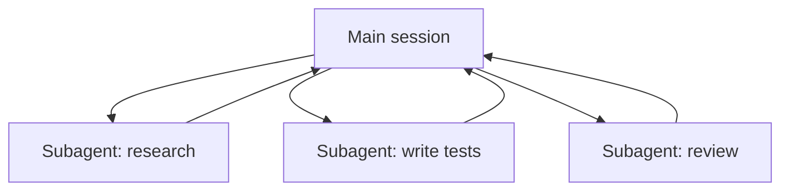

<LevelBadge level="advanced" />

<VerifyNote lastVerified="2026-06-23" source="https://code.claude.com/docs/en/sub-agents">
सबएजेंट frontmatter फ़ील्ड्स, अंतर्निहित एजेंट सूची, और `/agents` इंटरफ़ेस समय के साथ बदलते हैं — आधिकारिक डॉक्स में पुष्टि करें।
</VerifyNote>

एक **सबएजेंट** एक अलग Claude इंस्टेंस है जिसकी **अपनी संदर्भ विंडो** और टूल्स का एक **स्कोप किया गया सेट** होता है, जिसे आपका मुख्य सत्र काम का एक हिस्सा सौंपता है। यह अपना पूरा ट्रांसक्रिप्ट नहीं, बल्कि एक परिणाम वापस रिपोर्ट करता है — ताकि मुख्य सत्र केंद्रित और अव्यवस्था-रहित रहे।

## क्यों सौंपें

- **मुख्य संदर्भ की रक्षा करें।** एक शोध गोता या एक बड़ी फ़ाइल स्वीप हज़ारों टोकन जला सकती है; इसे एक सबएजेंट में करें और केवल निष्कर्ष लौटता है।
- **विशेषज्ञ बनाएँ।** एक सबएजेंट को एक अनुकूलित सिस्टम प्रॉम्प्ट और केवल वे टूल्स दें जिनकी इसे ज़रूरत है (जैसे एक केवल-पठन समीक्षक)।
- **समानांतर करें।** स्वतंत्र उप-कार्यों को एक साथ चलाएँ — जैसे, तीन मॉड्यूल का एक साथ अन्वेषण।



## अंतर्निहित एजेंट्स जो आपके पास पहले से हैं

अपने खुद के परिभाषित करने से पहले, यह जान लें कि Claude Code उन सबएजेंट्स के साथ आता है जिन्हें यह स्वचालित रूप से सौंपता है:

- **Explore** — एक तेज़, केवल-पठन एजेंट (एक सस्ते मॉडल पर चलता है) जो किसी कोडबेस को छुए बिना खोजने और समझने के लिए है।
- **Plan** — plan मोड के दौरान संदर्भ इकट्ठा करता है ताकि शोध मुख्य, केवल-पठन वार्तालाप से बाहर रहे।
- **General-purpose** — एक पूर्ण-टूल एजेंट जो जटिल, बहु-चरणीय काम के लिए है जो अन्वेषण और परिवर्तनों को मिलाता है।

आप इन्हें शायद ही कभी नाम से बुलाते हैं; जब कोई कार्य उपयुक्त होता है तो Claude इन तक पहुँचता है। कस्टम सबएजेंट्स उन कर्मियों के लिए हैं जिन्हें *आप* बार-बार समान निर्देशों के साथ पुनः बनाते रहते हैं।

## अपने खुद के परिभाषित करना

एक सबएजेंट YAML frontmatter वाली एक Markdown फ़ाइल है (बॉडी इसका सिस्टम प्रॉम्प्ट बन जाता है)। केवल `name` और `description` आवश्यक हैं; बाकी सब वैकल्पिक है। इसे प्रति-प्रोजेक्ट `.claude/agents/` में संग्रहीत करें (इसे git में चेक इन करें ताकि टीम इसे साझा करे) या प्रति-उपयोगकर्ता `~/.claude/agents/` में। इसे `/agents` कमांड से या हाथ से बनाएँ:

```markdown
---
name: code-reviewer
description: Expert code reviewer. Use proactively after code changes.
tools: Read, Glob, Grep
model: sonnet
---

You are a senior reviewer. Read the changed files, then report only
high-confidence issues: correctness bugs, security risks, and missing
tests. For each, show the file:line, the problem, and a concrete fix.
Do not restate what the code does. Never edit files.
```

दो चीज़ें एक सबएजेंट को अच्छा बनाती हैं:

- **`description` ही रूटिंग संकेत है।** Claude इसे पढ़कर तय करता है कि *कब* सौंपना है, इसलिए इसे एक ट्रिगर की तरह लिखें — "Use proactively after code changes" इसे स्वचालित रूप से खींच लेता है; एक अस्पष्ट "helps with code" ऐसा नहीं करेगा। यह फ़ाइल की सबसे अधिक प्रभाव वाली एकमात्र पंक्ति है।
- **टूल्स का दायरा कसकर रखें।** `tools` फ़ील्ड एक allowlist है (या denylist के रूप में `disallowedTools` का उपयोग करें)। एक समीक्षक जो केवल `Read, Glob, Grep` कर सकता है वह गलती से आपके कोड को संपादित *नहीं* कर सकता — यह प्रतिबंध एक गारंटी है, संकेत नहीं। `tools` को छोड़ दें और सबएजेंट को वह सब कुछ विरासत में मिलता है जो मुख्य सत्र के पास है।

## व्यावहारिक उदाहरण: एक समानांतर समीक्षा फ़ैन-आउट

आपने तीन मॉड्यूल को छूने वाली एक फ़ीचर पूरी कर ली है और प्रत्येक की एक तेज़, स्वतंत्र जाँच चाहते हैं। अपने मुख्य सत्र में:

> "Review the changes in `auth/`, `billing/`, and `api/` — use the code-reviewer subagent on each, in parallel."

Claude एक साथ तीन `code-reviewer` इंस्टेंस उत्पन्न करता है। प्रत्येक केवल अपना मॉड्यूल पढ़ता है, फ़ाइल सामग्री पर अपना खुद का संदर्भ जलाता है, और एक छोटी निष्कर्ष सूची लौटाता है। आपका मुख्य सत्र कभी कच्चे diffs नहीं देखता — केवल तीन साफ़-सुथरी रिपोर्ट्स — और पूरी चीज़ तीनों के योग के बजाय लगभग सबसे धीमी एकल समीक्षा के समय में पूरी हो जाती है। चूँकि समीक्षक केवल-पठन है, एक साथ काम करने वाले तीन एजेंट किसी write पर टकरा नहीं सकते।

## समानांतर कब न करें

:::warning समानांतर मुफ़्त नहीं है
- **निर्भर चरण** अनुक्रमिक होने चाहिए — वहाँ काम न बाँटें जहाँ चरण B को चरण A के आउटपुट की ज़रूरत है।
- **साझा फ़ाइल लेखन** टकरा सकते हैं; इन्हें पृथक करें (देखें [Git Worktrees](/docs/claude-code/worktrees)) या क्रमबद्ध करें।
- **समन्वय का अतिरिक्त भार** छोटे कार्यों के लिए लाभ से अधिक हो सकता है। तभी सौंपें जब उप-कार्य पर्याप्त बड़ा और स्वतंत्र हो।
:::

## सबएजेंट बनाम API/SDK "एजेंट्स"

यह पृष्ठ Claude Code के अंतर्निहित प्रत्यायोजन के बारे में है। प्रोग्रामेटिक रूप से अपने *स्वयं के* एजेंट बनाना [API पर एजेंट बनाना](/docs/api/building-agents) है। मानसिक मॉडल — एक लक्ष्य, एक टूल लूप, पृथक संदर्भ — समान है।

## आम गलतियाँ

- **एक अस्पष्ट `description`।** यदि यह नहीं बताता कि सबएजेंट का उपयोग *कब* करना है, तो Claude सही क्षण पर नहीं सौंपेगा (या बिल्कुल नहीं सौंपेगा)। "Use when…" / "Use proactively after…" से शुरुआत करें।
- **टूल्स को पूरी तरह खुला छोड़ना।** समीक्षा के लिए बनाया गया सबएजेंट लिखने में सक्षम नहीं होना चाहिए। एक allowlist इरादे को एक गारंटी में बदल देती है।
- **साझा मेमोरी की उम्मीद करना।** एक सबएजेंट को उसका `description`, उसका सिस्टम प्रॉम्प्ट, और जो कार्य आप सौंपते हैं वह मिलता है — आपका मुख्य वार्तालाप नहीं। प्रत्यायोजन में उसे आवश्यक संदर्भ पास करें।
- **निर्भर काम को बाँटना।** समानांतरता केवल *स्वतंत्र* उप-कार्यों के लिए मदद करती है; यदि B को A के आउटपुट की ज़रूरत है, तो उन्हें क्रम में चलाएँ।

## आगे

- [एक बहु-सबएजेंट वर्कफ़्लो डिज़ाइन करें (वॉकथ्रू)](/docs/walkthroughs/multi-subagent-workflow)
- [संदर्भ प्रबंधन](/docs/claude-code/context-management)
- [Git Worktrees](/docs/claude-code/worktrees)
