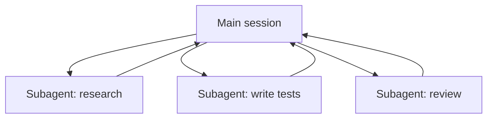

<LevelBadge level="advanced" />

<VerifyNote lastVerified="2026-06-20" source="https://docs.anthropic.com/en/docs/claude-code/sub-agents">
सबएजेंट कॉन्फ़िगरेशन और `/agents` इंटरफ़ेस समय के साथ बदलते हैं — आधिकारिक डॉक्स में पुष्टि करें।
</VerifyNote>

एक **सबएजेंट** एक अलग Claude इंस्टेंस है जिसकी **अपनी संदर्भ विंडो** और टूल्स का एक **स्कोप किया गया सेट** होता है, जिसे आपका मुख्य सत्र काम का एक हिस्सा सौंपता है। यह अपना पूरा ट्रांसक्रिप्ट नहीं, बल्कि एक परिणाम वापस रिपोर्ट करता है — ताकि मुख्य सत्र केंद्रित और अव्यवस्था-रहित रहे।

## क्यों सौंपें

- **मुख्य संदर्भ की रक्षा करें।** एक शोध गोता या एक बड़ी फ़ाइल स्वीप हज़ारों टोकन जला सकती है; इसे एक सबएजेंट में करें और केवल निष्कर्ष लौटता है।
- **विशेषज्ञ बनाएँ।** एक सबएजेंट को एक अनुकूलित सिस्टम प्रॉम्प्ट और केवल वे टूल्स दें जिनकी इसे ज़रूरत है (जैसे एक केवल-पठन समीक्षक)।
- **समानांतर करें।** स्वतंत्र उप-कार्यों को एक साथ चलाएँ — जैसे, तीन मॉड्यूल का एक साथ अन्वेषण।

## इन्हें परिभाषित करना

सबएजेंट्स को frontmatter (नाम, विवरण, अनुमत टूल्स, कभी-कभी एक मॉडल) के साथ Markdown फ़ाइलों के रूप में कॉन्फ़िगर किया जाता है, जिन्हें `/agents` इंटरफ़ेस के माध्यम से प्रबंधित किया जाता है। `description` मुख्य एजेंट को बताता है कि इसे *कब* सौंपना है। टूल्स का दायरा कसकर रखें — एक समीक्षक को शायद ही कभी write एक्सेस की ज़रूरत होती है।

## समानांतर कब न करें

:::warning समानांतर मुफ़्त नहीं है
- **निर्भर चरण** अनुक्रमिक होने चाहिए — वहाँ काम न बाँटें जहाँ चरण B को चरण A के आउटपुट की ज़रूरत है।
- **साझा फ़ाइल लेखन** टकरा सकते हैं; इन्हें पृथक करें (देखें [Git Worktrees](/docs/claude-code/worktrees)) या क्रमबद्ध करें।
- **समन्वय का अतिरिक्त भार** छोटे कार्यों के लिए लाभ से अधिक हो सकता है। तभी सौंपें जब उप-कार्य पर्याप्त बड़ा और स्वतंत्र हो।
:::

## सबएजेंट बनाम API/SDK "एजेंट्स"

यह पृष्ठ Claude Code के अंतर्निहित प्रत्यायोजन के बारे में है। प्रोग्रामेटिक रूप से अपने *स्वयं के* एजेंट बनाना [API पर एजेंट बनाना](/docs/api/building-agents) है। मानसिक मॉडल — एक लक्ष्य, एक टूल लूप, पृथक संदर्भ — समान है।

## आगे

- [एक बहु-सबएजेंट वर्कफ़्लो डिज़ाइन करें (वॉकथ्रू)](/docs/walkthroughs/multi-subagent-workflow)
- [संदर्भ प्रबंधन](/docs/claude-code/context-management)
- [Git Worktrees](/docs/claude-code/worktrees)
