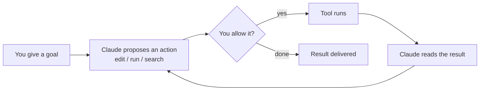

<LevelBadge level="beginner" />

<VerifyNote lastVerified="2026-06-20" source="https://code.claude.com/docs/en/overview">
इंस्टॉल कमांड और सटीक फ़ीचर सेट अक्सर बदलते हैं। सेटअप के लिए आधिकारिक Claude Code डॉक्स को सत्य का स्रोत मानें।
</VerifyNote>

**Claude Code** Anthropic का *एजेंटिक* कोडिंग टूल है। एक चैट विंडो के विपरीत, यह वास्तव में **आपके प्रोजेक्ट में काम कर सकता है**: फ़ाइलें पढ़ और संपादित कर सकता है, शेल कमांड चला सकता है, कोडबेस खोज सकता है, और बाहरी टूल्स को कॉल कर सकता है — यह सब आपकी अनुमति से।

## मानसिक मॉडल: एक एजेंटिक लूप

यह वह एक विचार है जो बाकी सब कुछ समझ में आने लायक बना देता है:

आप सादी भाषा में एक उद्देश्य देते हैं ("auth मॉड्यूल के लिए टेस्ट जोड़ें और जो विफल हो उसे ठीक करें")। Claude **योजना बनाता है, कार्य करता है, परिणाम का अवलोकन करता है, और दोहराता है** जब तक लक्ष्य पूरा न हो जाए। आप [अनुमतियों](/docs/claude-code) और [Plan Mode](/docs/claude-code) के माध्यम से नियंत्रण में रहते हैं।

## आप इसे कहाँ चला सकते हैं

- **टर्मिनल (CLI)** — मूल सतह; किसी भी शेल में काम करता है।
- **IDE एक्सटेंशन** — VS Code और JetBrains, इनलाइन डिफ़्स के साथ।
- **डेस्कटॉप और वेब** — और यह आपकी सेटिंग्स, हुक्स, और अनुमतियों को सतहों के बीच साझा करता है।

## आप क्या कॉन्फ़िगर करेंगे (प्रभाव के मोटे क्रम में)

1. **[CLAUDE.md](/docs/claude-code)** — स्थायी प्रोजेक्ट निर्देश। उच्चतम प्रभाव, न्यूनतम प्रयास।
2. **[Plan Mode](/docs/claude-code)** — किसी भी संपादन के चलने से *पहले* जाँच करें और प्रस्ताव दें।
3. **[अनुमतियाँ](/docs/claude-code)** — Claude बिना पूछे क्या कर सकता है।
4. **[settings.json](/docs/claude-code)** — पूरी कॉन्फ़िग प्रणाली।
5. **[स्लैश कमांड](/docs/claude-code)**, **[हुक्स](/docs/claude-code)**, **[स्किल्स](/docs/claude-code)**, **[सबएजेंट्स](/docs/claude-code)**, **[MCP सर्वर](/docs/claude-code)** — पावर फ़ीचर्स, ज़रूरत के अनुसार परत-दर-परत जोड़े गए।

## आपका पहला सत्र (इसका स्वरूप)

1. इंस्टॉल और प्रमाणित करें (वर्तमान कमांड के लिए [आधिकारिक डॉक्स](https://code.claude.com/docs/en/overview) देखें)।
2. एक प्रोजेक्ट में `cd` करें और Claude Code शुरू करें।
3. एक स्टार्टर **CLAUDE.md** बनाने के लिए `/init` चलाएँ।
4. कुछ छोटा और ठोस माँगें: *"समझाएँ कि इस ऐप में रूटिंग कैसे काम करती है।"*
5. फिर पहले **Plan Mode** में एक बदलाव आज़माएँ, योजना की समीक्षा करें, और इसे निष्पादित होने दें।

:::tip केवल-पठन से शुरू करें
अपने पहले वास्तविक कार्य के लिए, [Plan Mode](/docs/claude-code) का उपयोग करें — Claude जाँच करता है और आपको फ़ाइलें छुए बिना एक योजना दिखाता है। यह विश्वास बनाने का सबसे सुरक्षित तरीका है।
:::

## आगे

- सबसे अधिक प्रभाव वाला सेटअप → [CLAUDE.md और मेमोरी फ़ाइलें](/docs/claude-code)
- इसे शुरू से अंत तक करें → [वॉकथ्रू: एक वास्तविक रेपो के लिए Claude Code को कस्टमाइज़ करें](/docs/walkthroughs)
- अपने स्वयं के स्वचालन बनाएँ → [टेम्पलेट्स और रेसिपीज़](/docs/templates)
