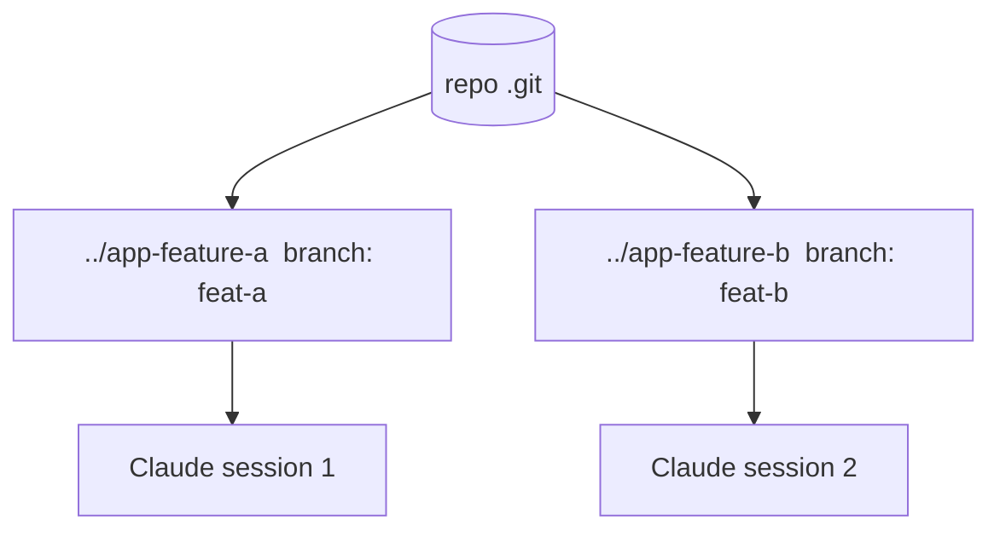

<LevelBadge level="advanced" />

एक **git worktree** एक रिपॉज़िटरी को **कई वर्किंग डायरेक्टरीज़** रखने देता है, प्रत्येक एक अलग ब्रांच पर चेक आउट की गई। इसे Claude Code के साथ जोड़ें और आप एक ही प्रोजेक्ट पर **कई सत्र समानांतर** में चला सकते हैं — प्रत्येक अपनी फ़ाइलों को संपादित करते हुए, बिना किसी टकराव के।

## यह जिस समस्या को हल करता है

अगर दो Claude सत्र एक ही वर्किंग डायरेक्टरी को एक साथ संपादित करते हैं, तो वे एक-दूसरे के बदलावों से टकरा जाते हैं। Worktrees प्रत्येक सत्र को उसकी **अपनी डायरेक्टरी और ब्रांच** देते हैं, ताकि समानांतर काम तब तक पृथक रहे जब तक आप मर्ज न करें।



## मूल बातें

```bash
# from your repo
git worktree add ../app-feature-a -b feat-a   # new dir + new branch
git worktree add ../app-fix-123 -b fix-123
git worktree list
# when done with one:
git worktree remove ../app-feature-a
```

प्रत्येक worktree डायरेक्टरी में एक Claude Code सत्र खोलें और उन्हें स्वतंत्र रूप से काम करने दें।

## यह कब सार्थक है

- **समानांतर फ़ीचर्स/फ़िक्स** जिन्हें आप एक साथ आगे बढ़ाना चाहते हैं।
- एक worktree में **एक लंबा कार्य चलते हुए** जबकि आप दूसरे में काम करते रहते हैं।
- **जोखिम भरे प्रयोग** आपके मुख्य चेकआउट से पृथक।

## नुकसान

:::warning मर्ज-बैक पर नज़र रखें
- ब्रांचें अंततः **मर्ज** होंगी — टकराव तभी सामने आते हैं, उस दौरान नहीं। Worktrees को केंद्रित और अल्पकालिक रखें।
- दो worktrees से **स्टेटफ़ुल, साझा संसाधन** (एक dev DB, एक पोर्ट) उन्हें पृथक किए बिना न चलाएँ।
- `git worktree remove` से सफ़ाई करें ताकि बासी डायरेक्टरीज़ जमा न हों।
:::

## Worktrees बनाम सबएजेंट्स

- **[सबएजेंट्स](/docs/claude-code/subagents)** = एक सत्र के *भीतर* समानांतरता (प्रत्यायोजन, पृथक संदर्भ)।
- **Worktrees** = डिस्क पर सत्रों के *बीच* समानांतरता (पृथक ब्रांचें/फ़ाइलें)। ये अच्छी तरह संयोजित होते हैं: एक worktree में एक सत्र स्वयं सबएजेंट्स उत्पन्न कर सकता है।

## आगे

- [सबएजेंट्स और समानांतर एजेंट](/docs/claude-code/subagents)
- [हेडलेस मोड और Agent SDK](/docs/claude-code/headless-and-agent-sdk)
- [संदर्भ प्रबंधन](/docs/claude-code/context-management)
