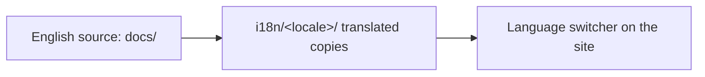

<LevelBadge level="intermediate" />

AILmanac अंग्रेज़ी-पहले है लेकिन **अनुवाद के लिए बनाया गया है** — इसी तरह यह "दुनिया के हर व्यक्ति" तक पहुँचता है। अगर आप इसे अपनी भाषा में लाना चाहते हैं, तो रास्ता यहाँ है।

## यहाँ i18n कैसे काम करता है

यह साइट Docusaurus के अंतर्निहित अंतर्राष्ट्रीयकरण का उपयोग करती है। **अंग्रेज़ी प्रामाणिक स्रोत है।** एक लोकेल अनुवादित फ़ाइलों का एक समानांतर सेट है; किसी लोकेल के सक्षम होते ही Docusaurus एक भाषा स्विचर प्रस्तुत करता है।

## सुनहरा नियम: इसे शिप करने से पहले इसका स्वामित्व लें

:::warning प्रोडक्शन में आधे-अधूरे अनुवाद नहीं
किसी लोकेल को प्रोडक्शन में **केवल तभी सक्षम किया जाता है जब कोई उसे बनाए रखने की प्रतिबद्धता लेता है।** 30%-अनुवादित, महीनों पुराना लोकेल बिना अनुवाद की तुलना में विश्वसनीयता को अधिक नुकसान पहुँचाता है। आंशिक पृष्ठों को बिखेरने की बजाय किसी *संपूर्ण अनुभाग* का अच्छा अनुवाद करना बेहतर है।
:::

## अनुवाद में योगदान कैसे करें

1. **एक मुद्दा खोलें** (*translation* टेम्पलेट का उपयोग करते हुए) यह बताते हुए कि आप कौन-सी भाषा और कौन-सा अनुभाग लेंगे।
2. पहले **एक सुसंगत हिस्से का अनुवाद करें** — जैसे, पूरा *Start Here* — न कि बेतरतीब पृष्ठ।
3. **कोड, कमांड और `VerifyNote` स्रोतों को अपरिवर्तित रखें**; गद्य, शीर्षकों और एडमोनिशन टेक्स्ट का अनुवाद करें।
4. **मॉडल ID या लिंक का अनुवाद न करें**; `/docs/...` पथों को वैसा ही रखें।
5. **एक PR खोलें।** एक मेंटेनर समीक्षा करता है और, एक बार किसी लोकेल का स्वामी + एक संपूर्ण पहला अनुभाग होने पर, हम इसे सक्षम कर देते हैं।

## सुझाव

- **मसौदा तैयार करने के लिए Claude का उपयोग करें**, फिर कोई धाराप्रवाह व्यक्ति समीक्षा करे — AI अनुवाद एक बढ़िया पहला प्रयास है, अंतिम प्राधिकार नहीं ([भ्रांतियाँ](/docs/foundations/hallucinations) अनुवाद पर भी लागू होती हैं)।
- अंग्रेज़ी पृष्ठ के **लेवल/लहजे से मेल खाएँ**।
- **अनुवाद-अयोग्य शब्दों को चिह्नित करें** ("prompt", "token" आदि को वहाँ रखें जहाँ आपकी भाषा के टेक समुदाय में यही चलन है)।

## आगे

- [10 मिनट में योगदान करें](/docs/contribute/contribute-in-10-minutes)
- [सामग्री शैली मार्गदर्शिका](/docs/contribute/style-guide)
- [आचार संहिता और शासन](/docs/contribute/governance)
