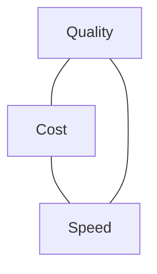

<LevelBadge level="intermediate" />

गुणवत्ता, लागत और गति एक-दूसरे के विरुद्ध खिंचती हैं। आप तीनों को एक साथ अधिकतम नहीं कर सकते — पर आप *हर एक को वहाँ खर्च कर सकते हैं* जहाँ यह मायने रखता है और बाकी हर जगह बचा सकते हैं।

## त्रिकोण

एक बड़ा मॉडल अधिक होशियार होता है पर धीमा और महँगा; एक छोटा तेज़ और सस्ता होता है पर कम सक्षम। अच्छी इंजीनियरिंग का अर्थ है **हर कार्य को इस त्रिकोण पर सही बिंदु पर रूट करना**।

## सबसे बड़े लीवर (मोटे तौर पर क्रम में)

1. **मॉडल को सही-आकार दें।** classification के लिए Opus न चलाएँ। Sonnet से शुरू करें, सरल/उच्च-मात्रा वाले चरणों के लिए Haiku पर उतरें, कठिन हिस्सों के लिए Opus आरक्षित रखें — [एक मॉडल चुनना](/docs/api/choosing-a-model)।
2. **मॉडल टियरिंग / cascades।** पहले एक सस्ता मॉडल उपयोग करें; ज़रूरत पड़ने पर ही एक मज़बूत मॉडल पर escalate करें (जैसे कम-आत्मविश्वास वाले मामले)।
3. **[Prompt caching](/docs/api/prompt-caching)।** कॉल्स के बीच एक स्थिर प्रॉम्प्ट prefix का पुनः उपयोग करें — दोहराए जाने वाले सिस्टम प्रॉम्प्ट, RAG संदर्भ, या agent टूल कैटलॉग के लिए बड़ी बचत।
4. **इनपुट टोकन छाँटें।** केवल वही भेजें जो मायने रखता है; [RAG](/docs/foundations/rag) पूरे नॉलेज बेस को ठूँसने से बेहतर है। छोटे इनपुट = सस्ते *और* अक्सर बेहतर।
5. समझदार `max_tokens` और कसे हुए प्रारूप निर्देशों के साथ **आउटपुट सीमित करें**।
6. ऑफ़लाइन काम को **बैच** करें जहाँ विलंबता मायने नहीं रखती।

## विलंबता-विशिष्ट जीतें

- प्रतिक्रियाएँ **stream** करें ताकि उपयोगकर्ता आउटपुट तुरंत देखें — *अनुभव की गई* गति के लिए विशाल, भले ही कुल समय अपरिवर्तित हो ([Streaming](/docs/api/streaming))।
- स्वतंत्र sub-calls को **समानांतर** करें।
- दोहराए जाने वाले काम को **कैश** करें; जहाँ संभव हो पहले से गणना करें।
- इंटरैक्टिव पथ के लिए एक **छोटा मॉडल** चुनें; भारी काम async करें।

## बिना देखे अनुकूलित न करें

पहले मापें: टोकन और सेकंड वास्तव में कहाँ जा रहे हैं? फिर सबसे बड़ी मद को अनुकूलित करें। और किसी भी लागत-कटौती के बाद [evals](/docs/foundations/evals) के साथ गुणवत्ता फिर से जाँचें — एक सस्ता सेटअप जो गलत है, सस्ता नहीं है।

## आगे

- [एक Claude मॉडल चुनना](/docs/api/choosing-a-model)
- [Prompt Caching और लागत अनुकूलन](/docs/api/prompt-caching)
- [टोकन, संदर्भ और मूल्य निर्धारण](/docs/api/tokens-and-pricing)
