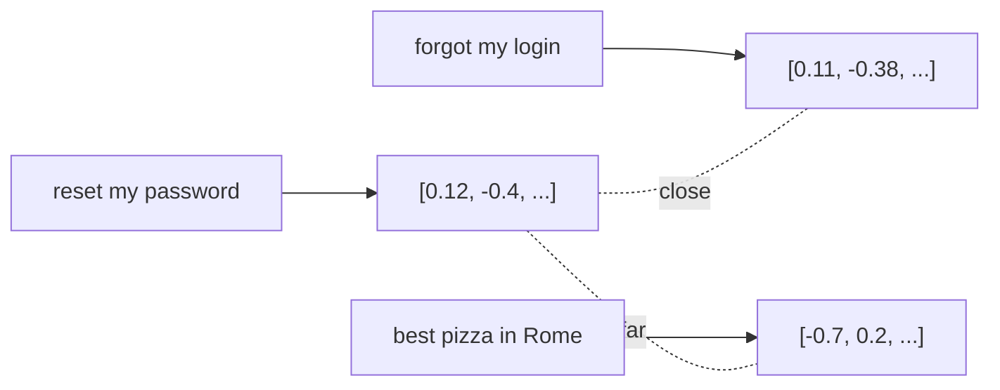

<LevelBadge level="intermediate" />

एक **embedding** किसी टेक्स्ट के टुकड़े को संख्याओं की एक सूची (एक **vector**) में बदल देता है जो उसके *अर्थ* को पकड़ती है। समान अर्थ वाले टेक्स्ट को ऐसे vectors मिलते हैं जो एक-दूसरे के करीब होते हैं — भले ही उनमें कोई शब्द साझा न हो। यही **semantic search** और [RAG](/docs/foundations/rag) के पीछे की चाल है।

## अंतर्ज्ञान

कल्पना करें कि हर वाक्य एक विशाल बहु-आयामी अंतरिक्ष में एक बिंदु के रूप में रखा गया है, इस तरह व्यवस्थित कि **समान अर्थ एक-दूसरे के पास बैठते हैं**। "How do I reset my password?" "I forgot my login" के पास उतरता है, और "best pizza in Rome" से दूर।

## Semantic बनाम keyword search

- **Keyword search** शाब्दिक शब्दों से मेल खाता है ("password" "password" को ढूँढ़ता है)।
- **Semantic search** *अर्थ* से मेल खाता है — "I can't sign in" बिना "password" शब्द के भी password-reset वाले दस्तावेज़ को ढूँढ़ लेता है।

सर्वोत्तम परिणाम अक्सर दोनों को **जोड़ने** से मिलते हैं (hybrid search)।

## एक vector search कैसे काम करता है

1. अपने दस्तावेज़ों को **embed** करें (आमतौर पर **chunks** में बाँटकर) और vectors को एक **vector database** में स्टोर करें।
2. query के समय, **query को embed करें**।
3. **निकटतम** vectors खोजें (cosine similarity / distance के अनुसार)।
4. उन टुकड़ों को लौटाएँ — आमतौर पर [RAG](/docs/foundations/rag) में फ़ीड करने के लिए।

## व्यावहारिक नोट्स

- **चंकिंग मायने रखती है।** बहुत बड़ा = शोरगुल वाले मेल; बहुत छोटा = संदर्भ खो जाता है। इसे ट्यून करें।
- **एक ही embedding मॉडल लगातार उपयोग करें** — अलग-अलग मॉडल के vectors तुलनीय नहीं होते।
- **Metadata + filters** (तारीख, स्रोत, प्रकार) retrieval को कहीं अधिक सटीक बनाते हैं।
- एक vector DB हमेशा ज़रूरी नहीं होता — छोटे corpora के लिए, एक साधारण इन-मेमोरी search ठीक रहता है।

## आगे

- [Retrieval-Augmented Generation (RAG)](/docs/foundations/rag)
- [फ़ाइन-ट्यूनिंग बनाम प्रॉम्प्टिंग बनाम RAG](/docs/foundations/finetune-vs-prompt-vs-rag)
- [Hallucinations और उन्हें कैसे कम करें](/docs/foundations/hallucinations)
