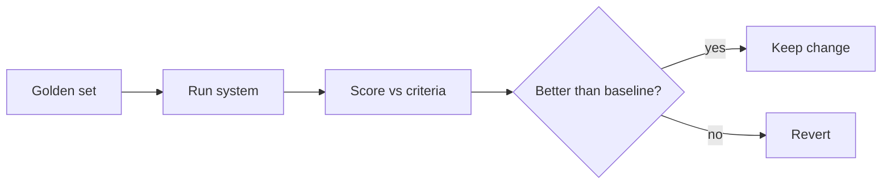

<LevelBadge level="advanced" />

अगर आप AI पर बनी कोई भी चीज़ ship करते हैं, तो **evals** ही वह तरीका है जिससे आप जानते हैं कि यह काम करता है — और जिससे आप जानते हैं कि किसी बदलाव ने इसे बेहतर बनाया, बुरा नहीं। उनके बिना आप अंधे उड़ रहे हैं: एक प्रॉम्प्ट सुधार जो एक मामले में मदद करता है, चुपचाप दस अन्य को तोड़ सकता है।

## न्यूनतम व्यवहार्य eval

शुरू करने के लिए आपको किसी फ़्रेमवर्क की ज़रूरत नहीं है:

1. **एक golden set इकट्ठा करें।** 20–100 वास्तविक इनपुट *सही* या *स्वीकार्य* आउटपुट (या स्पष्ट मानदंड) के साथ। आसान मामलों, मुश्किल वालों, और उन edge cases को कवर करें जिन्होंने आपको परेशान किया।
2. प्रति कार्य **"अच्छा" का क्या अर्थ है यह परिभाषित करें** — exact match, मुख्य तथ्य शामिल हों, मान्य JSON schema, कोई hallucinated संख्या नहीं, स्वर, आदि।
3. set के विरुद्ध अपने वर्तमान सेटअप को **चलाएँ और स्कोर करें**।
4. **एक चीज़ बदलें** (प्रॉम्प्ट, मॉडल, retrieval), फिर से चलाएँ, **तुलना करें**। बदलाव को केवल तभी रखें अगर स्कोर सुधरता है।

## Metrics चुनना

- जहाँ संभव हो **नियतात्मक (deterministic) जाँचें**: schema मान्य है? सही मान शामिल है? code टेस्ट पास करता है? ये सस्ती और भरोसेमंद हैं।
- अस्पष्ट गुणवत्ता (सहायकता, स्वर) के लिए **LLM-as-judge**: किसी मॉडल से एक rubric के विरुद्ध आउटपुट को ग्रेड कराएँ। उपयोगी पर **इसे कैलिब्रेट करें** — judges के पूर्वाग्रह होते हैं (लंबाई, स्थिति)। एक नमूने पर मानवीय रेटिंग के विरुद्ध judge को मान्य करें।
- सबसे अधिक दाँव वाले हिस्से के लिए **मानवीय समीक्षा**।

## इन्हें कब चलाएँ

- **किसी भी प्रॉम्प्ट या मॉडल बदलाव से पहले/बाद में।**
- **मॉडल migration पर** — एक नया मॉडल व्यवहार को बदल सकता है ([त्रुटियाँ और Migration](/docs/api/errors-and-rate-limits))।
- production सिस्टम के लिए **CI में**, एक gate के रूप में।

:::tip चरणों को अलग करें
[RAG](/docs/foundations/rag) और [agents](/docs/api/building-agents) के लिए, हर चरण का मूल्यांकन करें (क्या retrieval ने सही दस्तावेज़ पाया? क्या टूल सही ढंग से कॉल हुआ?) — केवल अंतिम उत्तर का नहीं। यह विफलताओं को स्थानीयकृत करता है।
:::

## आगे

- [Hallucinations और उन्हें कैसे कम करें](/docs/foundations/hallucinations)
- [API पर Agents बनाना](/docs/api/building-agents)
- [एक मॉडल और प्रदाता चुनना](/docs/foundations/choosing-a-model-provider)
