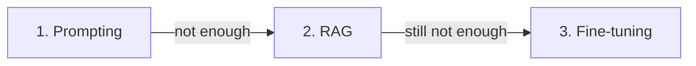

<LevelBadge level="intermediate" />

जब मॉडल वह नहीं करता जो आप चाहते हैं, तो तीन लीवर होते हैं — और लोग सबसे पहले महँगे वाले की ओर हाथ बढ़ाते हैं। यहाँ वह क्रम है जो वास्तव में काम करता है।

## इस क्रम में आज़माएँ

### 1. प्रॉम्प्टिंग — यहीं से शुरू करें, हमेशा
स्पष्ट निर्देश, उदाहरण, एक भूमिका, आउटपुट की बाधाएँ ([प्रॉम्प्टिंग की मूल बातें](/docs/prompting/basics))। यह **अधिकांश** समस्याओं को ठीक करता है, कुछ अतिरिक्त खर्च नहीं करता, और iterate करने में तत्काल है। अधिकांश "मॉडल X में खराब है" असल में "प्रॉम्प्ट अस्पष्ट था" निकलता है।

### 2. RAG — जब इसे *आपके* ज्ञान की ज़रूरत हो
अगर कमी **गायब या ताज़ा जानकारी** की है (आपके दस्तावेज़, आपका डेटा, वर्तमान तथ्य), तो [RAG](/docs/foundations/rag) जोड़ें। मॉडल को छुए बिना ज्ञान को अपडेट-योग्य और उद्धरण-योग्य रखता है।

### 3. फ़ाइन-ट्यूनिंग — अंतिम उपाय, पैमाने पर *व्यवहार/प्रारूप* के लिए
फ़ाइन-ट्यूनिंग एक मॉडल को आपके उदाहरणों पर आगे प्रशिक्षित करती है। इसकी ओर केवल तभी हाथ बढ़ाएँ जब प्रॉम्प्टिंग + RAG सुसंगत **शैली, प्रारूप, या कार्य व्यवहार** हासिल न कर सकें और आपके पास **कई उच्च-गुणवत्ता वाले उदाहरण** हों तथा इसे उचित ठहराने जितनी मात्रा हो।

## निर्णय तालिका

| आपकी समस्या | इसकी ओर बढ़ें |
|---|---|
| अस्पष्ट/गलत आउटपुट, गलत प्रारूप | **प्रॉम्प्टिंग** |
| आपके डेटा को नहीं जानता / वर्तमान जानकारी चाहिए | **RAG** |
| एक बहुत विशिष्ट शैली/व्यवहार चाहिए, लगातार, पैमाने पर | **फ़ाइन-ट्यूनिंग** |
| कार्रवाइयाँ करने की ज़रूरत है | (ये नहीं — वह है [टूल उपयोग/agents](/docs/api/tool-use)) |

## लोग इसे गलत क्यों समझते हैं

फ़ाइन-ट्यूनिंग *सुनने में* "मॉडल को सिखाने" जैसी लगती है, इसलिए यह असली समाधान महसूस होती है। पर यह सबसे धीमा, सबसे महँगा, सबसे कम लचीला विकल्प है, यह **ताज़ा ज्ञान अच्छी तरह नहीं जोड़ती** (RAG वह करता है), और इसे खराब तरीके से करना आसान है। पहले प्रॉम्प्टिंग और RAG को थका दें — आपको आमतौर पर चरण 3 की ज़रूरत नहीं पड़ेगी।

:::tip ये जुड़ते हैं
एक मज़बूत सिस्टम अक्सर एक अच्छा **प्रॉम्प्ट** + ज्ञान के लिए **RAG** होता है, जिसमें फ़ाइन-ट्यूनिंग किसी संकीर्ण व्यवहारगत ज़रूरत के लिए आरक्षित होती है। ये परस्पर अनन्य नहीं हैं।
:::

## आगे

- [Retrieval-Augmented Generation (RAG)](/docs/foundations/rag)
- [प्रॉम्प्टिंग की मूल बातें](/docs/prompting/basics)
- [AI गुणवत्ता का मूल्यांकन (Evals)](/docs/foundations/evals)
