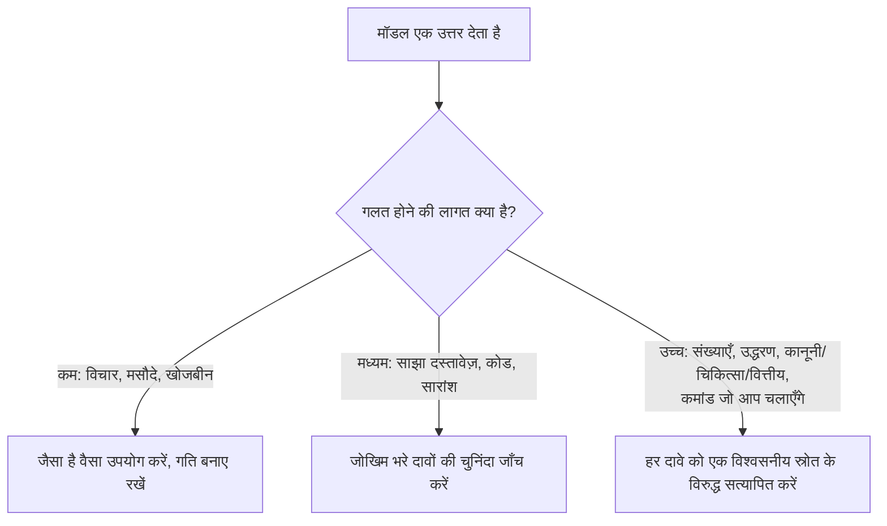

<LevelBadge level="intermediate" />

एक **hallucination** तब होता है जब कोई मॉडल पूरे आत्मविश्वास के साथ कुछ गलत कहता है। यह न तो झूठ बोल रहा है और न ही खराब है — यह LLMs के काम करने के तरीके का दूसरा पहलू है: वे *प्रशंसनीय* टेक्स्ट उत्पन्न करते हैं, और प्रशंसनीय हमेशा सच नहीं होता (देखें [LLM क्या है?](/docs/foundations/what-is-an-llm))। आप इसे प्रॉम्प्ट से पूरी तरह हटा नहीं सकते, पर आप इसे नाटकीय रूप से कम कर सकते हैं और बाकी को पकड़ सकते हैं।

## यह क्यों होता है

मॉडल एक संभावित continuation की भविष्यवाणी करता है। जब वह कुछ "नहीं जानता", तो *सबसे संभावित दिखने वाला* continuation अक्सर एक आत्मविश्वासपूर्ण, सुगठित — और गलत — उत्तर होता है। कोई अंतर्निहित "मुझे यकीन नहीं है" संकेत नहीं होता जब तक कि आप उसके लिए जगह न बनाएँ।

## उच्च-जोखिम वाले क्षेत्र

सबसे अधिक संदेहशील रहें जब आउटपुट में शामिल हो:

- **उद्धरण, कोट्स और संदर्भ** — गढ़े गए पेपर, नकली URLs, गलत तरीके से जिम्मेदार ठहराए गए कोट्स।
- **विशिष्ट संख्याएँ, तारीखें और आँकड़े** — प्रशंसनीय पर मनगढ़ंत आँकड़े।
- **विशिष्ट या बहुत हाल के तथ्य** — उससे परे जो मॉडल ने विश्वसनीय रूप से सीखा।
- **APIs और लाइब्रेरी विवरण** — ऐसी methods या parameters जो मौजूद ही नहीं हैं।
- **लोग और कानूनी/चिकित्सा विशिष्टताएँ** — दाँव ऊँचा, सूक्ष्म रूप से गलत होना आसान।

## कमी करने वाली टूलकिट

इन्हें एक के ऊपर एक लगाएँ — हर एक मदद करता है:

1. **इसे स्रोतों में आधारित करें।** स्रोत टेक्स्ट पेस्ट करें और कहें *"केवल ऊपर दिए गए टेक्स्ट से उत्तर दो; अगर वह वहाँ नहीं है, तो ऐसा कहो।"* यही [RAG](/docs/foundations/rag) के पीछे का मूल विचार है।
2. **इसे एक रास्ता दें।** स्पष्ट रूप से अनुमति दें *"अगर आपको यकीन नहीं है, तो कहो 'मुझे नहीं पता'"* — यह आत्मविश्वासपूर्ण अनुमान लगाने को नाटकीय रूप से कम करता है।
3. **तर्क और उद्धरण माँगें।** *"हर दावे का समर्थन करने वाले सटीक वाक्य को उद्धृत करो।"* असमर्थित दावे स्पष्ट हो जाते हैं।
4. **रचनात्मकता कम करें** उन तथ्यात्मक कार्यों के लिए जहाँ मॉडल एक temperature नियंत्रण देता है (देखें [सैंपलिंग नियंत्रण](/docs/foundations/sampling-controls))।
5. **टूल का उपयोग करें।** गणित, वर्तमान डेटा, या लुकअप के लिए, recall पर भरोसा करने के बजाय मॉडल को एक कैलकुलेटर/सर्च/[टूल](/docs/api/tool-use) दें।
6. **क्रॉस-चेक करें।** वही प्रश्न दो तरीकों से पूछें, या किसी दूसरे पास से पहले की आलोचना कराएँ।

## एक कॉपी-पेस्ट एंटी-हैलुसिनेशन प्रॉम्प्ट

ऊपर दी गई टूलकिट का अधिकांश हिस्सा एक पुन: प्रयोज्य रैपर में सिमट जाता है। दिखाई गई जगह पर अपना स्रोत पेस्ट करें और अपना प्रश्न पूछें — यह उत्तर को आधारित करता है, मॉडल को एक रास्ता देता है, और एक ही बार में उद्धरणों के लिए मजबूर करता है:

```text
तुम नीचे दिए गए SOURCE से ही उत्तर दोगे।
नियम:
- अगर उत्तर SOURCE में नहीं है, तो ठीक यही जवाब दो: "स्रोत में नहीं बताया गया है।"
- हर दावे के बाद, SOURCE से उस सटीक वाक्य को उद्धृत करो जो उसका समर्थन करता है।
- कोई बाहरी जानकारी, अनुमान, या धारणा मत जोड़ो।

SOURCE:
"""
[यहाँ दस्तावेज़, ट्रांसक्रिप्ट, या डेटा पेस्ट करें]
"""

QUESTION: [आपका प्रश्न]
```

यह क्यों काम करता है: "स्रोत में नहीं बताया गया है" वाला बचाव-रास्ता अनुमान लगाने का दबाव हटा देता है, और वाक्य-उद्धृत-करने वाला नियम किसी भी असमर्थित दावे को छिपाना असंभव बना देता है। जब आप वाकई मॉडल का अपना ज्ञान चाहते हों तब SOURCE ब्लॉक हटा दें — पर तब सत्यापन की जिम्मेदारी वापस आप पर आ जाती है।

## वह मानसिकता जो वास्तव में आपकी रक्षा करती है

:::warning जो मायने रखता है उसे सत्यापित करें — हमेशा
कोई भी प्रॉम्प्ट आउटपुट को 100% विश्वसनीय नहीं बनाता। किसी भी परिणामी चीज़ के लिए — किसी रिपोर्ट में एक संख्या, एक उद्धरण, एक कमांड जो आप चलाएँगे, एक चिकित्सा/कानूनी/वित्तीय विवरण — **इसे किसी विश्वसनीय स्रोत के विरुद्ध जाँचें**। AI को एक तेज़ पहले मसौदे के रूप में लें, अंतिम प्राधिकरण के रूप में नहीं। यही [जिम्मेदार उपयोग](/docs/security/responsible-use) का मर्म है।
:::

एक सरल नियम: **गलत होने की लागत सत्यापन की मात्रा तय करती है।** विचार-मंथन? स्वतंत्र रूप से भरोसा करें। कोई आँकड़ा प्रकाशित कर रहे हैं? हर बार सत्यापित करें।



## आगे

- [Retrieval-Augmented Generation (RAG)](/docs/foundations/rag)
- [AI गुणवत्ता का मूल्यांकन (Evals)](/docs/foundations/evals)
- [जिम्मेदार उपयोग, नैतिकता और सत्यापन](/docs/security/responsible-use)
