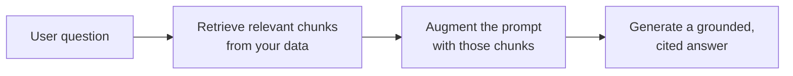

<LevelBadge level="intermediate" />

**RAG** किसी मॉडल से **आपके** डेटा — दस्तावेज़, एक नॉलेज बेस, एक कोडबेस — के बारे में प्रश्नों के उत्तर दिलवाता है जिन पर उसे कभी प्रशिक्षित नहीं किया गया था। विचार सरल है: प्रासंगिक टुकड़ों को **retrieve (पुनः प्राप्त)** करें, प्रॉम्प्ट को उनके साथ **augment (संवर्धित)** करें, फिर उन टुकड़ों में आधारित एक उत्तर **generate (उत्पन्न)** करें।

## लूप

1. अपने डेटा को **इंडेक्स** करें: टुकड़ों में बाँटें, उन्हें [embed](/docs/foundations/embeddings) करें, एक vector (और/या keyword) इंडेक्स में स्टोर करें।
2. प्रश्न से सबसे प्रासंगिक शीर्ष टुकड़ों को **retrieve** करें।
3. **Augment**: उन टुकड़ों को प्रॉम्प्ट में एक निर्देश के साथ रखें जैसे *"केवल नीचे दिए गए संदर्भ से उत्तर दो; अगर वह वहाँ नहीं है, तो ऐसा कहो।"*
4. **Generate** करें — और आदर्श रूप से **उद्धृत करें** कि हर दावा किस टुकड़े से आया।

## फ़ाइन-ट्यूनिंग के बजाय RAG क्यों?

RAG ज्ञान को **ताज़ा** रखता है (डेटा अपडेट करें, मॉडल नहीं), **उद्धरण** प्रदान करता है, और पुनः-प्रशिक्षण से कहीं सस्ता है। अधिकांश "मेरे दस्तावेज़ों के बारे में उत्तर दो" वाली ज़रूरतों के लिए, यह सही पहला टूल है — देखें [फ़ाइन-ट्यूनिंग बनाम प्रॉम्प्टिंग बनाम RAG](/docs/foundations/finetune-vs-prompt-vs-rag)।

## विफलता-तरीके (जहाँ RAG की गुणवत्ता मर जाती है)

- **खराब retrieval = खराब उत्तर।** अगर सही टुकड़ा retrieve नहीं होता, तो मॉडल उसका उपयोग नहीं कर सकता। अधिकांश "RAG गलत है" वाली समस्याएँ *retrieval* की समस्याएँ हैं।
- **बहुत मोटा/बारीक चंकिंग** — प्रासंगिकता को बर्बाद कर देता है ([embeddings](/docs/foundations/embeddings))।
- **कोई आधार देने वाला निर्देश नहीं** — मॉडल retrieve किए गए तथ्यों को अपने अनुमानों के साथ मिला देता है। इसे *केवल* संदर्भ से उत्तर देने और कमियों को स्वीकार करने को कहें।
- **बहुत अधिक ठूँसना** — अप्रासंगिक टुकड़े संकेत को पतला कर देते हैं और [टोकन](/docs/foundations/tokens-and-context) की लागत लगाते हैं। कम, उच्च-गुणवत्ता वाले टुकड़े retrieve करें।
- **कोई उद्धरण नहीं** — आप सत्यापित नहीं कर सकते, इसलिए आप भरोसा नहीं कर सकते।

:::tip retrieval का अलग से मूल्यांकन करें
"क्या हमने सही टुकड़ा retrieve किया?" को "क्या मॉडल ने अच्छा उत्तर दिया?" से अलग मापें। यह समस्या को तेज़ी से स्थानीयकृत करता है। देखें [Evals](/docs/foundations/evals)।
:::

## आगे

- [Embeddings और Vector Search](/docs/foundations/embeddings)
- [फ़ाइन-ट्यूनिंग बनाम प्रॉम्प्टिंग बनाम RAG](/docs/foundations/finetune-vs-prompt-vs-rag)
- [शोध और संश्लेषण playbook](/docs/playbooks/research)
