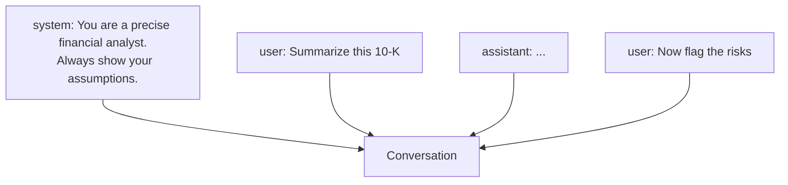

<LevelBadge level="beginner" />

हर AI बातचीत **संदेशों** से बनी होती है, और हर संदेश की एक **भूमिका (role)** होती है। तीनों भूमिकाओं को समझना बताता है कि मॉडल को कैसे चलाया जाए — और कुछ निर्देश क्यों टिक जाते हैं जबकि अन्य नहीं।

## तीन भूमिकाएँ

- **System** — पूरी बातचीत के लिए शीर्ष-स्तरीय सेटअप: मॉडल को कौन होना चाहिए, नियम, प्रारूप। एक बार सेट करें, हर जगह लागू होता है।
- **User** — यह आप हैं: आपके प्रश्न और इनपुट, बारी दर बारी।
- **Assistant** — मॉडल के उत्तर। (आप उदाहरणों के रूप में *assistant के मुँह में शब्द भी डाल सकते हैं* — देखें [few-shot](/docs/prompting/few-shot)।)

## सिस्टम प्रॉम्प्ट आपका सबसे शक्तिशाली लीवर क्यों है

सिस्टम संदेश **उसके बाद आने वाली हर चीज़** को फ़्रेम करता है। यहीं पर आप मॉडल की भूमिका, मानक, स्वर और कठोर नियम सेट करते हैं — और मॉडल इसे भारी रूप से तौलता है। अगर आप पूरी बातचीत (या ऐप) भर में सुसंगत व्यवहार चाहते हैं, तो इसे यहाँ रखें, किसी user बारी में दबाकर नहीं।

व्यवहार में:
- **चैट ऐप्स:** आपके अकाउंट के [कस्टम निर्देश](/docs/claude-app/custom-instructions) एक व्यक्तिगत सिस्टम प्रॉम्प्ट के रूप में काम करते हैं।
- **Claude Code:** [CLAUDE.md](/docs/claude-code/claude-md) आपके प्रोजेक्ट के लिए यह भूमिका निभाता है।
- **API:** [`system` पैरामीटर](/docs/api/first-call)।

वही विचार, तीन सतहें।

## व्यावहारिक सुझाव

- भूमिका, नियमों और आउटपुट प्रारूप के बारे में **सिस्टम प्रॉम्प्ट में विशिष्ट रहें** — ऐसा करने के लिए यह सबसे अधिक लीवरेज वाली जगह है।
- **user बारियों को** वास्तविक कार्य पर केंद्रित रखें; हर बारी नियमों को दोबारा न चिपकाएँ।
- **परस्पर विरोधी निर्देश?** बाद का, स्पष्ट user निर्देश किसी अस्पष्ट सिस्टम निर्देश को रद्द कर सकता है — आश्चर्य से बचने के लिए सुसंगत रहें ([समस्या निवारण](/docs/contribute/troubleshooting))।

## आगे

- [प्रॉम्प्टिंग की मूल बातें](/docs/prompting/basics)
- [कस्टम निर्देश और शैलियाँ](/docs/claude-app/custom-instructions)
- [टोकन, संदर्भ और याददाश्त](/docs/foundations/tokens-and-context)
