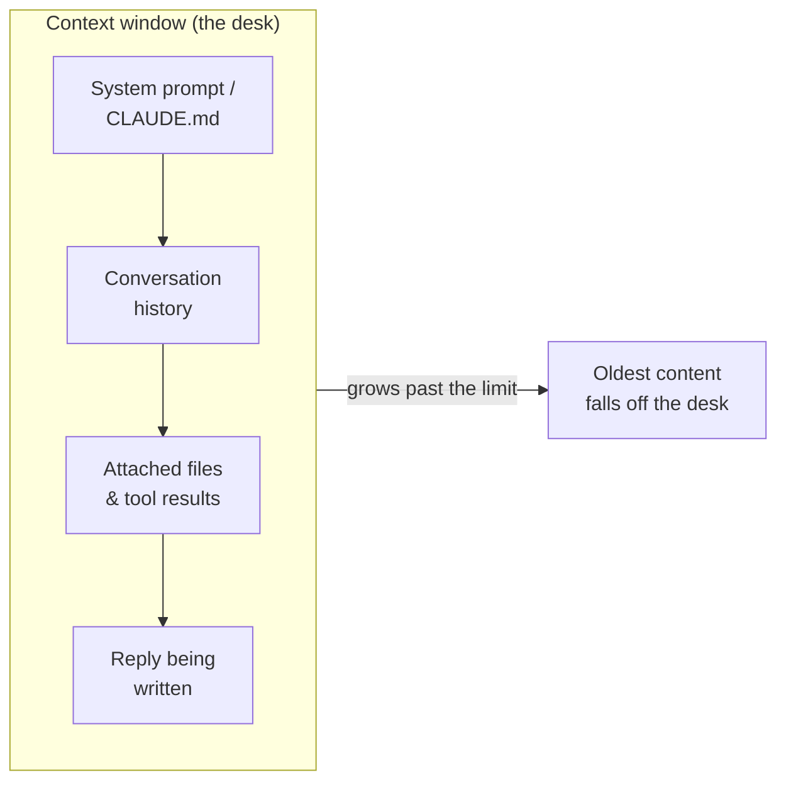

<LevelBadge level="beginner" />

तीन विचार बहुत सारे "इसने ऐसा क्यों किया?" वाले पलों को सुलझा देते हैं: **टोकन**, **कॉन्टेक्स्ट विंडो**, और **मेमोरी**। इन्हें समझ लें और आप ड्रिफ्ट, भूलने, और चौंकाने वाले बिलों से हैरान होना बंद कर देंगे।

<Callout
  type="objectives"
  items={[
    "टेक्स्ट को वैसे पढ़ें जैसे एक मॉडल पढ़ता है — टोकन में, शब्दों या अक्षरों में नहीं",
    "कॉन्टेक्स्ट विंडो को एक सीमित डेस्क की तरह सोचें, और अनुमान लगाएं कि चीज़ें कब उससे गिर जाएंगी",
    "'कॉन्टेक्स्ट रॉट' को पहचानें — मॉडल लंबे इनपुट का बीच का हिस्सा क्यों खो सकते हैं",
    "'मेमोरी' के चार असली स्रोतों को जानें और इसे जानबूझकर कैसे प्रदान करें"
  ]}
/>

## टोकन: वह इकाई जिसमें मॉडल सोचते हैं

मॉडल अक्षर या शब्द नहीं पढ़ते — वे **टोकन** पढ़ते हैं, टेक्स्ट के टुकड़े जो अंग्रेज़ी में लगभग ¾ शब्द के बराबर होते हैं। "Unbelievable" 3–4 टोकन हो सकता है; आम शब्द एक-एक होते हैं; एक स्पेस, एक कॉमा, या कोड का एक टुकड़ा भी टोकन खर्च करता है। आपका इनपुट *और* मॉडल का आउटपुट दोनों गिने जाते हैं, और टोकन ठीक वही हैं जिनमें [प्राइसिंग और लिमिट](/docs/api/tokens-and-pricing) मापी जाती है।

आपको हाथ से गिनने की ज़रूरत नहीं है, लेकिन एक मोटा अंदाज़ा मदद करता है: **~750 शब्द ≈ ~1,000 टोकन**। कुछ टाइप करें और देखें:

<TokenEstimator />

:::tip अनुपात क्यों बदलता है
सादी अंग्रेज़ी प्रति टोकन ¾ शब्द के करीब आती है। कोड, JSON, गैर-लैटिन लिपियाँ, लंबे URL, और दुर्लभ शब्द *अधिक* टोकन में बँटते हैं — इसलिए एक 500-लाइन फ़ाइल या एक चीनी पैराग्राफ अपने शब्द-गणना से ज़्यादा खर्च करता है। जब कोई बिल या लिमिट आपको चौंकाता है, तो आमतौर पर यही वजह होती है।
:::

## कॉन्टेक्स्ट विंडो: वर्किंग मेमोरी

**कॉन्टेक्स्ट विंडो** टोकन की वह अधिकतम संख्या है जिसे मॉडल एक साथ ध्यान में रख सकता है — *आपका सिस्टम प्रॉम्प्ट, अब तक की पूरी बातचीत, कोई भी अटैच की गई फ़ाइलें, और जो जवाब वह लिख रहा है,* सब एक साथ। इसे मॉडल की डेस्क की तरह सोचें: बड़ी, लेकिन सीमित। विंडो के आकार मॉडल के अनुसार अलग होते हैं और बढ़ते रहते हैं — एक संख्या याद करने के बजाय मौजूदा आंकड़ों के लिए [Models & Pricing](/docs/whats-new/models-and-pricing) देखें।

जो कुछ भी मॉडल उस पल में "जानता" है वह उसी डेस्क पर रहता है:

जब कोई बातचीत विंडो से आगे बढ़ जाती है, तो **सबसे पुराना कॉन्टेंट गिर जाता है**। यही वजह है कि एक बहुत लंबी चैट यह "भूल" गई लग सकती है कि उसने कैसे शुरुआत की थी, या आपके मूल निर्देश से भटक सकती है।

## कॉन्टेक्स्ट रॉट: यह सिर्फ़ *भरा* बनाम *खाली* नहीं है

एक सूक्ष्म समस्या: तब भी जब सब कुछ अभी भी फिट हो जाता है, मॉडल किसी लंबे इनपुट के **शुरुआत और अंत** का उपयोग **बीच** की तुलना में ज़्यादा भरोसेमंद ढंग से करते हैं। 50-पन्नों के पेस्ट के केंद्र में उस एक वाक्य को दबा दें जो मायने रखता है और उसे कम वज़न मिल सकता है — एक विफलता का तरीका जिसे अक्सर *"lost in the middle"* कहा जाता है।

<VerifyNote lastVerified="2026-06-29" source="https://arxiv.org/abs/2307.03172">"lost in the middle" प्रभाव — कॉन्टेक्स्ट के बीच में रखी गई जानकारी का घटिया उपयोग — को Liu et al. (2023) ने प्रलेखित किया था। नए लॉन्ग-कॉन्टेक्स्ट मॉडल इसे बेहतर ढंग से संभालते हैं, लेकिन नीचे दी गई व्यावहारिक आदत अब भी फ़ायदेमंद है।</VerifyNote>

<Steps
  items={[
    {title: "मांग से शुरुआत करें", body: "असली निर्देश या सवाल पहले रखें, किसी लंबे दस्तावेज़ को पेस्ट करने से पहले — उसके बाद दबा हुआ नहीं।"},
    {title: "अंत में दोहराएं", body: "लंबे कॉन्टेंट के बाद मुख्य निर्देश को एक लाइन में दोहराएं। पहली + आख़िरी स्थितियाँ सबसे मज़बूत होती हैं।"},
    {title: "पेस्ट करने से पहले छाँटें", body: "अप्रासंगिक हिस्सों को हटा दें। बीच में कम शोर का मतलब है कि जो सिग्नल बचता है उसे ज़्यादा ध्यान मिलता है।"},
    {title: "बहुत बड़े होने पर बाँटें", body: "बहुत बड़े इनपुट के लिए, सब कुछ डालने के बजाय सारांश बनाएं या टुकड़ों में बाँटें — या किसी नए सब-टास्क के लिए एक नई चैट शुरू करें।"}
  ]}
/>

यहाँ वही अनुरोध है, इस तरह संरचित कि निर्देश मज़बूत स्थितियों में बैठे:

<PromptCard title="निर्देश-पहले, अंत-में-दोहराया गया">{`Task: Find every place this contract caps our liability, and quote the exact clause.

[... paste the full 40-page contract here ...]

Reminder of the task: list only the liability-cap clauses, with exact quotes and section numbers. Ignore everything else.`}</PromptCard>

:::tip Claude Code में
लंबे एजेंट सेशन भी उसी सीमा से टकराते हैं। Claude Code इसे जानबूझकर संभालता है — इतिहास को संकुचित करते हुए और आपको यह तय करने देते हुए कि क्या नज़र में रहे। देखें [Context Management](/docs/claude-code/context-management) और [Context Engineering](/docs/frontiers/context-engineering)।
:::

## मेमोरी: कोई नहीं है, जब तक आप इसे प्रदान न करें

डिफ़ॉल्ट रूप से, हर बातचीत एक **खाली स्लेट** होती है। मॉडल आपकी पिछली चैट याद नहीं रखता। जो कुछ भी मेमोरी जैसा दिखता है वह चार चीज़ों में से एक है:

| स्रोत | यह क्या है | आप इसे कैसे नियंत्रित करते हैं |
| --- | --- | --- |
| **फिर से भेजा गया इतिहास** | चैट ऐप हर बार बातचीत को फिर से भेजते हैं, जब तक विंडो भर न जाए | नई चैट शुरू करना; थ्रेड को केंद्रित रखना |
| **मेमोरी फ़ीचर** | कुछ Claude सतहें तथ्यों को चैट के बीच ले जाती हैं | [Memory Across Chats](/docs/claude-app/memory) सेटिंग्स |
| **आपकी प्रदान की गई फ़ाइलें** | स्थायी कॉन्टेक्स्ट जिसे आप जानबूझकर अटैच करते हैं | [Projects](/docs/claude-app/projects), [CLAUDE.md](/docs/claude-code/claude-md) |
| **आपका अपना कोड** | API **स्टेटलेस** है — आप पिछले मैसेज फिर से भेजते हैं | [First API Call](/docs/api/first-call) |

मूल बात: *अगर आप चाहते हैं कि मॉडल कुछ याद रखे, तो आपको उसे डेस्क पर रखते रहना होगा।*

## यह क्यों मायने रखता है

लगभग हर "इसने मेरे पिछले निर्देश को नज़रअंदाज़ कर दिया" या "इसने ट्रैक खो दिया" समस्या तीन चीज़ों में से एक तक पहुँचती है: विंडो भर गई, एक नया सेशन ठंडा शुरू हुआ, या मुख्य विवरण किसी लंबे पेस्ट के निर्जीव बीच में बैठा था। यह जानकर, आप प्रॉम्प्ट और सेशन को इस तरह संरचित करेंगे कि महत्वपूर्ण चीज़ें *नज़र में* रहें।

## ख़ुद को परखें

<Quiz
  questions={[
    {
      q: "सादी अंग्रेज़ी के 750 शब्द मोटे तौर पर कितने टोकन हैं?",
      options: ["लगभग 250", "लगभग 1,000", "लगभग 3,000", "ठीक 750"],
      answer: 1,
      explain: "एक काम का नियम है ~750 शब्द ≈ ~1,000 टोकन सामान्य अंग्रेज़ी के लिए। कोड और गैर-लैटिन लिपियाँ इससे ज़्यादा होती हैं।"
    },
    {
      q: "एक लंबी चैट यह 'भूलने' लगती है कि उसने कैसे शुरुआत की थी। सबसे संभावित कारण है:",
      options: [
        "मॉडल ख़राब है",
        "बातचीत बढ़ने के साथ सबसे पुराना कॉन्टेंट कॉन्टेक्स्ट विंडो से गिर गया",
        "मॉडल ने आपके पिछले मैसेज स्थायी रूप से सीख लिए",
        "टोकन वापस कर दिए गए"
      ],
      answer: 1,
      explain: "कॉन्टेक्स्ट विंडो सीमित होती है। जैसे ही कोई बातचीत इससे आगे बढ़ती है, सबसे पुराने टोकन 'डेस्क' से गिर जाते हैं — इसलिए शुरुआती निर्देश नज़र से ओझल हो सकते हैं।"
    },
    {
      q: "आपको एक विशाल दस्तावेज़ और एक मुख्य निर्देश पेस्ट करना है। सबसे अच्छी जगह कौन सी है?",
      options: [
        "निर्देश सिर्फ़ दस्तावेज़ के ठीक बीच में",
        "निर्देश बिल्कुल शुरुआत में और अंत में फिर से दोहराया गया",
        "कोई निर्देश नहीं — मॉडल को अंदाज़ा लगाने दें",
        "निर्देश एक अलग चैट में जिसे मॉडल देख नहीं सकता"
      ],
      answer: 1,
      explain: "मॉडल किसी लंबे इनपुट के शुरुआत और अंत का उपयोग सबसे भरोसेमंद ढंग से करते हैं ('lost in the middle')। मांग से शुरुआत करें और अंत में उसे दोहराएं।"
    }
  ]}
/>

## मुख्य शब्द

<Flashcards
  title="शब्दावली को पक्का करें"
  cards={[
    {front: "टोकन", back: "टेक्स्ट का वह टुकड़ा जिसे मॉडल असल में प्रोसेस करता है — मोटे तौर पर एक अंग्रेज़ी शब्द का ¾। इनपुट और आउटपुट दोनों गिने जाते हैं, और प्राइसिंग प्रति टोकन होती है।"},
    {front: "कॉन्टेक्स्ट विंडो", back: "अधिकतम टोकन जिन्हें मॉडल एक साथ ध्यान में रख सकता है: सिस्टम प्रॉम्प्ट + इतिहास + फ़ाइलें + जवाब, सब एक साथ। सीमित — लिमिट के बाद का कॉन्टेंट गिर जाता है।"},
    {front: "Lost in the middle", back: "किसी लंबे इनपुट के शुरुआत और अंत का उपयोग बीच की तुलना में ज़्यादा भरोसेमंद ढंग से करने की प्रवृत्ति। महत्वपूर्ण निर्देशों को मज़बूत स्थितियों में रखें।"},
    {front: "स्टेटलेसनेस", back: "API कॉल के बीच कुछ भी याद नहीं रखता। किसी बातचीत को जारी रखने के लिए आप पिछले मैसेज ख़ुद फिर से भेजते हैं।"}
  ]}
/>

:::note मुख्य बातें
- **टोकन** सोचने और बिलिंग दोनों की इकाई हैं — 750 अंग्रेज़ी शब्दों पर ~1,000, कोड और अन्य लिपियों के लिए ज़्यादा।
- **कॉन्टेक्स्ट विंडो** एक सीमित डेस्क है; लंबी चैट इसलिए भूल जाती हैं क्योंकि पुराना कॉन्टेंट उससे गिर जाता है।
- विंडो के भीतर भी, **अपने निर्देश से शुरुआत करें और उसे अंत में दोहराएं** — बीच का हिस्सा कम इस्तेमाल होता है।
- डिफ़ॉल्ट रूप से **कोई मेमोरी नहीं है**। इसे फ़ाइलों, Projects, CLAUDE.md, या इतिहास फिर से भेजकर जानबूझकर प्रदान करें।
:::

## आगे

- [What Is an LLM?](/docs/foundations/what-is-an-llm)
- [System, User & Assistant Roles](/docs/foundations/roles)
- [Context Engineering](/docs/frontiers/context-engineering)
- [Tokens, Context & Pricing (API)](/docs/api/tokens-and-pricing)
