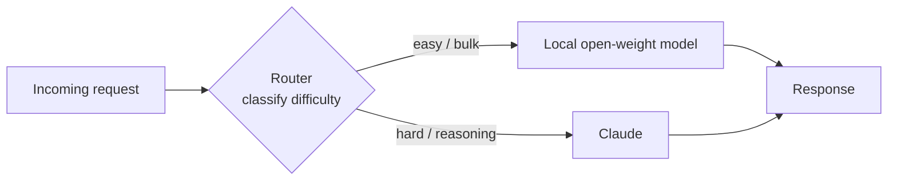

<LevelBadge level="advanced" />

"फ्रंटियर मॉडल **या** लोकल मॉडल" का ढाँचा एक झूठा विकल्प है। प्रोडक्शन में सबसे किफ़ायती, प्राइवेसी का सम्मान करने वाले, और लचीले सिस्टम **दोनों** का उपयोग करते हैं — आसान, ज़्यादा-वॉल्यूम, या संवेदनशील काम के लिए लोकल रूप से चलने वाला एक छोटा ओपन-वेट मॉडल, और कठिन रीज़निंग को संभालने वाली **स्मार्ट परत** के रूप में Claude जैसा एक फ्रंटियर मॉडल। यह पेज उन टिकाऊ *पैटर्न* के बारे में है जो दोनों को इस तरह जोड़ते हैं कि हर एक वह करे जिसमें वह सबसे अच्छा है। ये पैटर्न प्रोवाइडर-निरपेक्ष हैं — Claude बस "रीज़निंग" की भूमिका के लिए एक बढ़िया फ़िट है — और ये किसी भी विशेष मॉडल के नाम से आगे टिके रहते हैं।

<Callout type="objectives" items={[
  "समझें कि क्यों एक हाइब्रिड (फ्रंटियर + लोकल) लागत, प्राइवेसी, और लचीलेपन पर अकेले किसी भी मॉडल से बेहतर है",
  "पाँच टिकाऊ हाइब्रिड पैटर्न सीखें: राउटर/बिग-लिटल, ड्राफ्ट-फिर-रिफाइन, प्राइवेसी रिडैक्शन, बल्क प्री/पोस्ट-प्रोसेसिंग, और ऑफ़लाइन फ़ॉलबैक",
  "हर पैटर्न के लिए: जानें कि इसे कब चुनना है, आप जो ट्रेड-ऑफ़ स्वीकार कर रहे हैं, और एक ठोस खाका",
  "एक दोहराने योग्य, चार-चरणीय विधि से अपना खुद का Claude+लोकल हाइब्रिड डिज़ाइन करें",
  "जानें कि ये पैटर्न प्रोवाइडर-निरपेक्ष हैं — Claude 'स्मार्ट परत' के रूप में फ़िट होता है, न कि लॉक-इन के रूप में",
]} />

## हाइब्रिड क्यों, न कि या-तो-यह-या-वह

एक लोकल ओपन-वेट मॉडल (देखें [Ollama के साथ मॉडल लोकल रूप से चलाएँ](/docs/models/run-models-locally-ollama)) और एक फ्रंटियर मॉडल *अलग-अलग* चीज़ों में अच्छे हैं:

- **लोकल** प्राइवेट है (डेटा कभी आपकी मशीन से बाहर नहीं जाता), स्केल पर सस्ता है (कोई प्रति-टोकन बिल नहीं), छोटे मॉडलों के लिए कम-लेटेंसी वाला है, और ऑफ़लाइन काम करता है। लेकिन सबसे कठिन रीज़निंग, लॉन्ग-कॉन्टेक्स्ट, और एजेंटिक कार्यों पर इसमें एक वास्तविक **क्षमता अंतर** है।
- **Claude (फ्रंटियर)** ठीक उन्हीं कठिन कार्यों में आगे है, लेकिन हर कॉल में टोकन खर्च होते हैं और डेटा एक क्लाउड API को भेजा जाता है।

नीचे दिए हर पैटर्न के पीछे की अंतर्दृष्टि: **अधिकांश अनुरोध आसान होते हैं, और कठिन वाले अल्पसंख्यक होते हैं।** यदि एक सस्ता लोकल मॉडल थोक को संभाल सकता है और आप वास्तव में कठिन हिस्से के लिए फ्रंटियर मॉडल को आरक्षित रखते हैं, तो आपको फ्रंटियर की अधिकांश गुणवत्ता एक अंश की लागत पर मिलती है — और आप संवेदनशील डेटा को लोकल रख सकते हैं। Microsoft के *Hybrid LLM* पेपर ने इसे औपचारिक रूप दिया: एक सीखा हुआ राउटर जो आसान क्वेरीज़ को एक छोटे मॉडल को भेजता है, उसने बड़े मॉडल को **40% तक कम कॉल** किए, बिना प्रतिक्रिया गुणवत्ता में किसी गिरावट के ([arXiv 2404.14618](https://arxiv.org/abs/2404.14618))। ओपन-सोर्स [RouteLLM](https://github.com/lm-sys/RouteLLM) फ्रेमवर्क समान परिणामों की रिपोर्ट करता है — सामान्य बेंचमार्क पर लगभग आधी क्वेरीज़ को सस्ते मॉडल पर रूट करके लगभग **आधी लागत** पर फ्रंटियर-के-निकट गुणवत्ता।

> अपना हाइब्रिड **बाधा** के आधार पर चुनें, हाइप के आधार पर नहीं। यदि आप अभी तक नहीं जानते कि कौन-सा मॉडल किस कार्य में फ़िट होता है, तो [एक मॉडल चुनना](/docs/models/choosing-a-model) से शुरू करें — फिर वापस आएँ और तय करें कि लोकल और फ्रंटियर के बीच *सीमा कहाँ है*।

---

## पैटर्न 1 — राउटर / बिग-लिटल

**विचार।** हर अनुरोध के सामने एक पतली **क्लासिफ़ायर** रखें। यह कार्य को देखती है और तय करती है: आसान/थोक → लोकल मॉडल; कठिन रीज़निंग → Claude। यह "big.LITTLE" CPU डिज़ाइन से उधार लिया गया है, जहाँ एक फ़ोन बैकग्राउंड काम को छोटे कुशल कोर पर चलाता है और भारी लोड के लिए ही बड़े कोर को जगाता है।

**कब उपयोग करें।** आपके पास अनुरोधों की एक मिश्रित धारा है — कई मामूली, कुछ वास्तव में कठिन — और आप केवल कठिन वालों के लिए फ्रंटियर कीमतें चुकाना चाहते हैं। यह वर्कहॉर्स हाइब्रिड है।

**ट्रेड-ऑफ़।** राउटर *ग़लत* हो सकता है। एक कठिन कार्य को लोकल मॉडल पर ग़लत-रूट करें तो गुणवत्ता गिरती है; एक आसान कार्य को Claude पर ग़लत-रूट करें तो आप ज़्यादा चुकाते हैं। आप लागत को गुणवत्ता के विरुद्ध तौलने के लिए एक थ्रेशोल्ड ट्यून करते हैं, और आपको उस थ्रेशोल्ड को अपने खुद के डेटा पर एक छोटे eval के साथ **मापना** चाहिए (देखें [Evals](/docs/power-user/evals))।

**खाका।** राउटर एक नियम-परत जितना सरल हो सकता है (लंबाई, कीवर्ड, कोड की मौजूदगी) या एक छोटे क्लासिफ़ायर मॉडल जितना समृद्ध। एक सस्ता, पारदर्शी विकल्प यह है कि **लोकल** मॉडल से ही कठिनाई वर्गीकृत करने को कहा जाए, फिर भेजा जाए:

<PromptCard title="राउटर वर्गीकरण प्रॉम्प्ट (लोकल मॉडल पर चलता है)">{`You are a request router. Classify the user request into exactly one tier.

Return ONLY a JSON object: {"tier": "...", "reason": "..."}

Tiers:
- "local"  → simple, mechanical, or high-volume: short rewrites, formatting,
             single-fact lookup, basic classification/extraction, boilerplate.
- "frontier" → hard reasoning, multi-step planning, long-context synthesis,
             ambiguous instructions, code that must be correct, anything where
             a wrong answer is costly.

Bias toward "local" when in doubt about a CHEAP, low-risk task,
and toward "frontier" when a mistake would be EXPENSIVE.

Request:
"""
{{REQUEST}}
"""`}</PromptCard>

राउटर का आउटपुट एक रूटिंग निर्णय है, अंतिम उत्तर नहीं — इसे छोटा और तेज़ रखें। कई टूल या मॉडल के पार समृद्ध रूटिंग के लिए, वही वर्गीकृत-फिर-भेजो तर्क सामान्यीकृत होता है (और यह उससे मिलता-जुलता है कि मॉडल [टूल](/docs/api/tool-use) के बीच कैसे चुनते हैं)।

---

## पैटर्न 2 — ड्राफ्ट-फिर-रिफाइन

**विचार।** लोकल मॉडल एक **सस्ता पहला ड्राफ्ट** बनाता है; Claude उसे **निखारता, सुधारता, या सत्यापित करता** है। आप रिफाइनमेंट के लिए फ्रंटियर टोकन चुकाते हैं, शुरू से जनरेशन के लिए नहीं — और एक अच्छा ड्राफ्ट Claude के काम को छोटा और अधिक भरोसेमंद बनाता है।

**कब उपयोग करें।** ओपन-एंडेड जनरेशन जहाँ एक कच्चा ड्राफ्ट एक परफेक्ट ड्राफ्ट से बहुत सस्ता है लेकिन अंतिम आउटपुट उच्च गुणवत्ता का होना चाहिए: लॉन्ग-फ़ॉर्म लेखन, कोड, संरचित दस्तावेज़, ऐसे सारांश जो बिल्कुल सही होने चाहिए।

**ट्रेड-ऑफ़।** एक के बजाय दो मॉडल कॉल लेटेंसी जोड़ते हैं, और एक *ख़राब* ड्राफ्ट रिफाइनर को उसकी ग़लतियों की ओर लंगर डाल सकता है। जीत तब दिखती है जब ड्राफ्टिंग महँगा हिस्सा है और रिफाइनमेंट तुलनात्मक रूप से सस्ता — अपने डेटा पर सत्यापित करें कि "लोकल ड्राफ्ट + फ्रंटियर रिफाइन" वास्तव में प्रति-स्वीकार्य-आउटपुट-लागत पर "फ्रंटियर सब कुछ करे" से बेहतर है।

**खाका।** लोकल मॉडल ड्राफ्ट करता है → ड्राफ्ट को एक केंद्रित निर्देश के साथ Claude को पास करें: *"यह एक ड्राफ्ट है। त्रुटियाँ ठीक करें, कसें, और दावों को सत्यापित करें; सुधारा हुआ संस्करण लौटाएँ।"* यह वही अंतर्ज्ञान है जो टोकन स्तर पर **स्पेकुलेटिव डिकोडिंग** को शक्ति देता है — एक छोटा ड्राफ्टर प्रस्तावित करता है, बड़ा मॉडल सत्यापित करता है और केवल वही रखता है जो टिकता है ([NVIDIA: speculative decoding](https://developer.nvidia.com/blog/an-introduction-to-speculative-decoding-for-reducing-latency-in-ai-inference/))। कार्य स्तर पर आप वही चीज़ हाथ से कर रहे हैं: सस्ता प्रस्ताव, महँगा सत्यापन।

---

## पैटर्न 3 — प्राइवेसी रिडैक्शन

**विचार।** एक लोकल मॉडल (या लोकल NLP टूलिंग) किसी भी चीज़ को क्लाउड API को भेजे जाने *से पहले* टेक्स्ट से **PII हटा देता है**। Claude रिडैक्ट किए गए संस्करण पर रीज़निंग करता है; ज़रूरत पड़ने पर आप वापसी के रास्ते में असली मान लोकल रूप से फिर से डाल देते हैं।

**कब उपयोग करें।** आप फ्रंटियर रीज़निंग चाहते हैं लेकिन आप विनियमित या संवेदनशील डेटा (स्वास्थ्य, वित्त, ग्राहक रिकॉर्ड) संभाल रहे हैं और कच्चा PII आपके वातावरण से **बाहर नहीं जाना चाहिए**। रिडैक्शन आपको क्लाउड मॉडल का उपयोग समस्या के *आकार* पर करने देता है, बिना उसमें मौजूद लोगों को उजागर किए।

**ट्रेड-ऑफ़।** रिडैक्शन कभी भी परफेक्ट नहीं होता — एक छूटी हुई इकाई एक लीक है, और अत्यधिक-रिडैक्शन उस कॉन्टेक्स्ट को नष्ट कर देता है जिसकी मॉडल को अच्छी तरह उत्तर देने के लिए ज़रूरत होती है। रिडैक्टर को एक सुरक्षा नियंत्रण की तरह मानें: इसकी रिकॉल का परीक्षण करें, और अन-रिडैक्शन मैपिंग को सख़्ती से लोकल रखें।

**खाका।** इनपुट पर एक लोकल डिटेक्टर/एनोनिमाइज़र चलाएँ, इकाइयों को प्लेसहोल्डर (`[PERSON_1]`, `[EMAIL_1]`) से बदलें, रिडैक्ट किए गए टेक्स्ट को Claude को भेजें, फिर प्लेसहोल्डर को लोकल रूप से री-हाइड्रेट करें। Microsoft का ओपन-सोर्स [Presidio](https://github.com/microsoft/presidio) यहाँ आम बिल्डिंग ब्लॉक है — यह PII का पता लगाता है और उसे एनोनिमाइज़ करता है और एक प्लगेबल NLP बैकएंड का उपयोग कर सकता है, जिसमें कठिन मामलों पर दूसरे पास के लिए एक लोकल मॉडल भी शामिल है। एक अहम, अक्सर छूटने वाला विवरण: मॉडल तक पहुँचने वाली **हर चीज़** को रिडैक्ट करें, जिसमें पुनर्प्राप्त दस्तावेज़ और टूल परिणाम शामिल हैं — केवल उपयोगकर्ता का ताज़ा संदेश ही नहीं।

---

## पैटर्न 4 — बल्क प्री/पोस्ट-प्रोसेसिंग

**विचार।** लोकल मॉडल **ज़्यादा-वॉल्यूम, दोहराव वाला** काम संभालता है — हज़ारों आइटम्स के पार एक्सट्रैक्शन, वर्गीकरण, टैगिंग, नॉर्मलाइज़ेशन — और Claude केवल उन **कुछ कठिन मामलों** को संभालता है जिन्हें लोकल मॉडल कम-भरोसे वाले के रूप में चिह्नित करता है।

**कब उपयोग करें।** पाइपलाइन वर्कलोड: 1 लाख सपोर्ट टिकट वर्गीकृत करें, दस्तावेज़ों के पहाड़ से फ़ील्ड निकालें, एक कॉन्टेंट फ़ायरहोज़ को टैग करें। हर आइटम को एक फ्रंटियर API के माध्यम से चलाना धीमा और महँगा होगा; अधिकांश आइटम आसान हैं।

**ट्रेड-ऑफ़।** आपको एक भरोसेमंद **कॉन्फ़िडेंस / एस्केलेशन सिग्नल** की ज़रूरत है ताकि सही आइटम्स एस्केलेट हों। बहुत उत्सुक हुए तो आप ज़्यादा चुकाते हैं; बहुत संकोची हुए तो कठिन पूँछ पर गुणवत्ता गिरती है। लोकल मॉडल का स्व-रिपोर्ट किया गया कॉन्फ़िडेंस एक शुरुआती बिंदु है, लेकिन इसे सत्यापित करें।

**खाका।** लोकल मॉडल पूरा बैच प्रोसेस करता है और एक कॉन्फ़िडेंस स्कोर जोड़ता है; एक थ्रेशोल्ड से नीचे के आइटम (या जो किसी स्कीमा/वैलिडेशन जाँच में विफल होते हैं) कठिन निर्णय के लिए Claude को एस्केलेट किए जाते हैं। यह पैटर्न 1 है जो एक लाइव अनुरोध के बजाय एक बैच पर लागू होता है — वही "सस्ता थोक संभालता है, फ्रंटियर पूँछ संभालता है" अर्थशास्त्र जिसका कैस्केड फ़ायदा उठाते हैं, अक्सर आसान बहुसंख्यक पर न्यूनतम गुणवत्ता हानि के साथ **40–70% लागत बचत**।

---

## पैटर्न 5 — ऑफ़लाइन फ़ॉलबैक

**विचार।** लोकल मॉडल **सुरक्षा जाल** है। जब क्लाउड API डाउन, रेट-लिमिटेड, या अगम्य होता है, तो अनुरोध पूरी तरह विफल होने के बजाय लोकल मॉडल पर *फ़ेल ओवर* करते हैं। घटिया उत्तर एरर पेजों से बेहतर हैं।

**कब उपयोग करें।** कुछ भी जहाँ उपलब्धता हमेशा-सर्वोत्तम गुणवत्ता से ज़्यादा मायने रखती है: आंतरिक टूल जिन्हें काम करते रहना चाहिए, ऑन-डिवाइस फ़ीचर, ऐसे उत्पाद जो किसी प्रोवाइडर आउटेज के दौरान उपयोगकर्ताओं को एक कठोर एरर नहीं दिखा सकते।

**ट्रेड-ऑफ़।** फ़ॉलबैक प्रतिक्रियाएँ परिभाषा के अनुसार **कम गुणवत्ता** की होती हैं — आप फ्रंटियर की छत को "फिर भी काम करता है" के बदले दे रहे हैं। कमज़ोर उत्तरों को चुपचाप असली की तरह परोसने के बजाय गिरावट को स्पष्ट करें (इसे लेबल करें, फ़ीचर सेट को संकुचित करें)।

**खाका।** कॉल को एक क्रमबद्ध श्रृंखला में लपेटें: Claude आज़माएँ → उपलब्धता एरर पर (टाइमआउट, 429/5xx), बैकऑफ़ के साथ फिर से आज़माएँ → अगर फिर भी विफल हो, तो लोकल मॉडल पर रूट करें। LiteLLM और OpenRouter जैसे LLM गेटवे ठीक इसी फ़ॉलबैक-चेन पैटर्न को लागू करते हैं, जिसमें आम प्रॉम्प्ट की कैशिंग भी शामिल है ताकि एक ऑफ़लाइन पथ भी कुछ उपयोगी परोस सके। टिकाऊ सिद्धांत: **एक लोकल मॉडल को अपनी अंतिम पंक्ति के रूप में गर्म रखें**, ताकि एक आउटेज अनुभव को तोड़ने के बजाय घटिया कर दे।

---

## अपना खुद का Claude+लोकल हाइब्रिड डिज़ाइन करें

<Steps items={[
  {title: "अपने अनुरोध वितरण का नक्शा बनाएँ", body: "वास्तविक ट्रैफ़िक का नमूना लें और लेबल करें कि कितना हिस्सा वास्तव में कठिन बनाम आसान/थोक बनाम संवेदनशील है। इस वितरण का आकार आपको बताता है कि कौन-सा पैटर्न फ़ायदा देता है — एक लंबी आसान पूँछ राउटर या बल्क प्री-प्रोसेसिंग के पक्ष में है; एक छोटा संवेदनशील हिस्सा रिडैक्शन के पक्ष में है।"},
  {title: "वह पैटर्न चुनें जो बाधा से मेल खाता है", body: "मिश्रित लाइव ट्रैफ़िक → पैटर्न 1 (राउटर)। बजट पर उच्च-गुणवत्ता जनरेशन → पैटर्न 2 (ड्राफ्ट-फिर-रिफाइन)। विनियमित/संवेदनशील डेटा → पैटर्न 3 (रिडैक्शन)। पाइपलाइन / बैच वॉल्यूम → पैटर्न 4 (बल्क)। उपलब्धता अहम है → पैटर्न 5 (फ़ॉलबैक)। कई सिस्टम दो या तीन को जोड़ते हैं।"},
  {title: "सीमा तय करें, फिर उसे मापें", body: "तय करें कि लोकल कहाँ रुकता है और Claude कहाँ शुरू होता है (एक राउटर थ्रेशोल्ड, एक कॉन्फ़िडेंस कटऑफ़, एक रिडैक्शन नीति)। लागत-बनाम-गुणवत्ता ट्रेड पर संख्याएँ रखने के लिए अपने डेटा पर एक छोटा eval चलाएँ। किसी लीडरबोर्ड या विक्रेता की हेडलाइन पर भरोसा न करें — अपने कार्य पर मापें। Evals पेज देखें।"},
  {title: "ऑब्ज़र्वेबिलिटी और एक सुरक्षा वाल्व जोड़ें", body: "हर रूटिंग/एस्केलेशन निर्णय और उसके परिणाम को लॉग करें ताकि मॉडल और ट्रैफ़िक बदलने पर आप सीमा को फिर से ट्यून कर सकें। एक स्पष्ट फ़ॉलबैक (पैटर्न 5) रखें ताकि एक प्रोवाइडर आउटेज टूटने के बजाय शालीनता से घटिया हो।"},
]} />

<VerifyNote lastVerified="2026-06-28" source="https://platform.claude.com/docs/en/about-claude/models/overview">
विशिष्ट मॉडल नाम, कॉन्टेक्स्ट विंडो, प्रति-टोकन कीमतें, और रेट लिमिट अक्सर बदलती हैं और यहाँ जानबूझकर **दोबारा नहीं** बताई गई हैं — वे अस्थिर हिस्सा हैं। किसी राउटर या कैस्केड के लिए कोई लागत या गुणवत्ता थ्रेशोल्ड तय करने से पहले, ऊपर दिए स्रोत पर मौजूदा Claude मॉडल लाइनअप और कीमत जाँचें, और <a href="https://ollama.com/library">Ollama library</a> में मौजूदा लोकल-मॉडल नाम जाँचें। इस पेज के पैटर्न टिकाऊ हैं; सीमा के पीछे की सटीक संख्याएँ नहीं।
</VerifyNote>

<Quiz title="खुद को परखें" questions={[
  {q: "वह मूल आर्थिक अंतर्दृष्टि क्या है जो हर हाइब्रिड पैटर्न को काम करवाती है?", options: ["लोकल मॉडल हमेशा फ्रंटियर मॉडलों से बेहतर होते हैं", "अधिकांश अनुरोध आसान होते हैं; केवल एक अल्पसंख्यक को ही वास्तव में फ्रंटियर रीज़निंग की ज़रूरत होती है", "फ्रंटियर मॉडल लोकल मॉडलों की तुलना में प्रति टोकन सस्ते होते हैं"], answer: 1, explain: "वास्तविक ट्रैफ़िक का थोक आसान होता है। यदि एक सस्ता लोकल मॉडल आसान बहुसंख्यक को संभालता है और आप फ्रंटियर मॉडल को कठिन अल्पसंख्यक के लिए आरक्षित रखते हैं, तो आपको अधिकांश गुणवत्ता एक अंश की लागत पर मिलती है। यही असमानता है जिसका यहाँ हर पैटर्न फ़ायदा उठाता है।"},
  {q: "आपको ग्राहक रिकॉर्ड पर रीज़निंग करने के लिए एक फ्रंटियर मॉडल का उपयोग करना ही है, लेकिन कच्चा PII आपके वातावरण से बाहर नहीं जा सकता। कौन-सा पैटर्न फ़िट होता है?", options: ["राउटर / बिग-लिटल", "प्राइवेसी रिडैक्शन", "ऑफ़लाइन फ़ॉलबैक"], answer: 1, explain: "प्राइवेसी रिडैक्शन किसी भी चीज़ के क्लाउड API तक पहुँचने से पहले PII को लोकल रूप से हटा देता है, इसलिए Claude एक रिडैक्ट किए गए संस्करण पर रीज़निंग करता है और असली मान आपके वातावरण में रहते हैं। राउटर तय करता है कि काम कहाँ भेजना है; यह संवेदनशील डेटा नहीं हटाता।"},
  {q: "राउटर / बिग-लिटल पैटर्न के लिए विशिष्ट मुख्य जोखिम क्या है?", options: ["यह हमेशा केवल एक ही मॉडल का उपयोग कर सकता है", "एक ग़लत-रूट किया गया कार्य गुणवत्ता (कठिन लोकल को भेजा गया) या पैसा (आसान फ्रंटियर को भेजा गया) खर्च करता है", "इसके लिए क्लाउड API का हर समय ऑनलाइन रहना ज़रूरी है"], answer: 1, explain: "राउटर एक क्लासिफ़ायर है और यह ग़लत हो सकता है। एक कठिन कार्य को कमज़ोर मॉडल पर ग़लत-रूट करना गुणवत्ता को नुकसान पहुँचाता है; एक आसान कार्य को फ्रंटियर पर ग़लत-रूट करना पैसा बर्बाद करता है। इसीलिए आप रूटिंग थ्रेशोल्ड को अपने खुद के डेटा पर ट्यून और मापते हैं।"},
  {q: "ड्राफ्ट-फिर-रिफाइन कभी-कभी क्यों इसके लायक नहीं होता?", options: ["यह हमेशा एक अकेली फ्रंटियर कॉल की तुलना में कम गुणवत्ता पैदा करता है", "दो कॉल लेटेंसी जोड़ते हैं, और एक ख़राब लोकल ड्राफ्ट रिफाइनर को उसकी ग़लतियों की ओर लंगर डाल सकता है", "फ्रंटियर मॉडल ऐसे टेक्स्ट को एडिट नहीं कर सकते जो उन्होंने नहीं लिखा"], answer: 1, explain: "ड्राफ्ट-फिर-रिफाइन केवल तभी जीतता है जब ड्राफ्टिंग महँगा हिस्सा है और रिफाइनमेंट सस्ता। दो मॉडल कॉल लेटेंसी जोड़ते हैं, और एक कमज़ोर ड्राफ्ट रिफाइनर को भटका सकता है — इसलिए अपने डेटा पर सत्यापित करें कि लोकल-ड्राफ्ट + फ्रंटियर-रिफाइन वास्तव में फ्रंटियर-सब-कुछ-करे से बेहतर है।"},
]} />

<Flashcards title="एक नज़र में पाँच हाइब्रिड पैटर्न" cards={[
  {front: "राउटर / बिग-लिटल", back: "हर अनुरोध को वर्गीकृत करें, फिर भेजें: आसान/थोक → लोकल, कठिन रीज़निंग → Claude। वर्कहॉर्स हाइब्रिड। ट्रेड-ऑफ़: राउटर ग़लत-रूट कर सकता है — थ्रेशोल्ड को अपने खुद के डेटा पर ट्यून करें।"},
  {front: "ड्राफ्ट-फिर-रिफाइन", back: "लोकल मॉडल सस्ते में ड्राफ्ट करता है; Claude निखारता/सत्यापित करता है। रिफाइनमेंट के लिए फ्रंटियर टोकन चुकाएँ, जनरेशन के लिए नहीं। ट्रेड-ऑफ़: अतिरिक्त लेटेंसी, और एक ख़राब ड्राफ्ट रिफाइनर को लंगर डाल सकता है।"},
  {front: "प्राइवेसी रिडैक्शन", back: "एक लोकल मॉडल/NLP टूल किसी भी चीज़ के क्लाउड API तक पहुँचने से पहले PII हटा देता है; लोकल रूप से री-हाइड्रेट करें। संवेदनशील डेटा पर फ्रंटियर रीज़निंग का उपयोग करने देता है। ट्रेड-ऑफ़: एक छूटी हुई इकाई एक लीक है; केवल उपयोगकर्ता संदेश ही नहीं, टूल परिणाम और पुनर्प्राप्त दस्तावेज़ भी रिडैक्ट करें।"},
  {front: "बल्क प्री/पोस्ट-प्रोसेसिंग", back: "लोकल पूरे बैच में ज़्यादा-वॉल्यूम एक्सट्रैक्शन/वर्गीकरण संभालता है; Claude केवल कम-भरोसे वाले एस्केलेशन संभालता है। पैटर्न 1 एक बैच पर लागू। एक भरोसेमंद कॉन्फ़िडेंस/एस्केलेशन सिग्नल की ज़रूरत है।"},
  {front: "ऑफ़लाइन फ़ॉलबैक", back: "लोकल मॉडल सुरक्षा जाल है: जब क्लाउड API डाउन या रेट-लिमिटेड होता है, तो पूरी तरह विफल होने के बजाय लोकल पर फ़ेल ओवर करें। घटिया उत्तर एरर से बेहतर हैं। गिरावट को स्पष्ट करें।"},
]} />

<Callout type="takeaways" items={[
  "फ्रंटियर बनाम लोकल एक झूठा विकल्प है — सबसे अच्छे सिस्टम दोनों का उपयोग करते हैं, काम के कठिन अल्पसंख्यक के लिए प्रोवाइडर-निरपेक्ष 'स्मार्ट परत' के रूप में Claude के साथ",
  "सभी पाँच पैटर्न एक अंतर्दृष्टि पर सवार हैं: अधिकांश अनुरोध आसान और सस्ते हैं; फ्रंटियर खर्च को वास्तव में कठिन हिस्से के लिए आरक्षित रखें",
  "राउटर/बिग-लिटल वर्कहॉर्स है; ड्राफ्ट-फिर-रिफाइन बजट पर गुणवत्ता खरीदता है; रिडैक्शन संवेदनशील डेटा को अनलॉक करता है; बल्क प्री-प्रोसेसिंग पाइपलाइनों को स्केल करता है; ऑफ़लाइन फ़ॉलबैक लचीलापन खरीदता है — और ये संयोजित होते हैं",
  "हर पैटर्न की एक सीमा होती है (एक थ्रेशोल्ड, एक कॉन्फ़िडेंस कटऑफ़, एक रिडैक्शन नीति) — इसे अपने डेटा पर एक छोटे eval के साथ मापें, कभी किसी लीडरबोर्ड पर नहीं",
  "अस्थिर संख्याओं (मॉडल नाम, कीमतें, लिमिट) को एक verify चरण के पीछे रखें; पैटर्न टिकाऊ हैं, विशिष्टताएँ नहीं",
]} />

## स्रोत और आगे पढ़ें

- [Hybrid LLM: Cost-Efficient and Quality-Aware Query Routing (arXiv 2404.14618, ICLR 2024)](https://arxiv.org/abs/2404.14618)
- [RouteLLM — LLM राउटर परोसने और मूल्यांकन के लिए ओपन-सोर्स फ्रेमवर्क (GitHub, LMSYS)](https://github.com/lm-sys/RouteLLM)
- [RouteLLM: An Open-Source Framework for Cost-Effective LLM Routing (LMSYS blog)](https://www.lmsys.org/blog/2024-07-01-routellm/)
- [Microsoft Presidio — PII का पता लगाएँ, रिडैक्ट करें, और एनोनिमाइज़ करें (GitHub)](https://github.com/microsoft/presidio)
- [Presidio PII masking with LiteLLM — ट्यूटोरियल](https://docs.litellm.ai/docs/tutorials/presidio_pii_masking)
- [An Introduction to Speculative Decoding (NVIDIA Technical Blog)](https://developer.nvidia.com/blog/an-introduction-to-speculative-decoding-for-reducing-latency-in-ai-inference/)
- [Model fallbacks — स्वचालित फ़ेलओवर के साथ भरोसेमंद AI (OpenRouter docs)](https://openrouter.ai/docs/guides/routing/model-fallbacks)
- [Anthropic — Claude मॉडल अवलोकन](https://platform.claude.com/docs/en/about-claude/models/overview)
