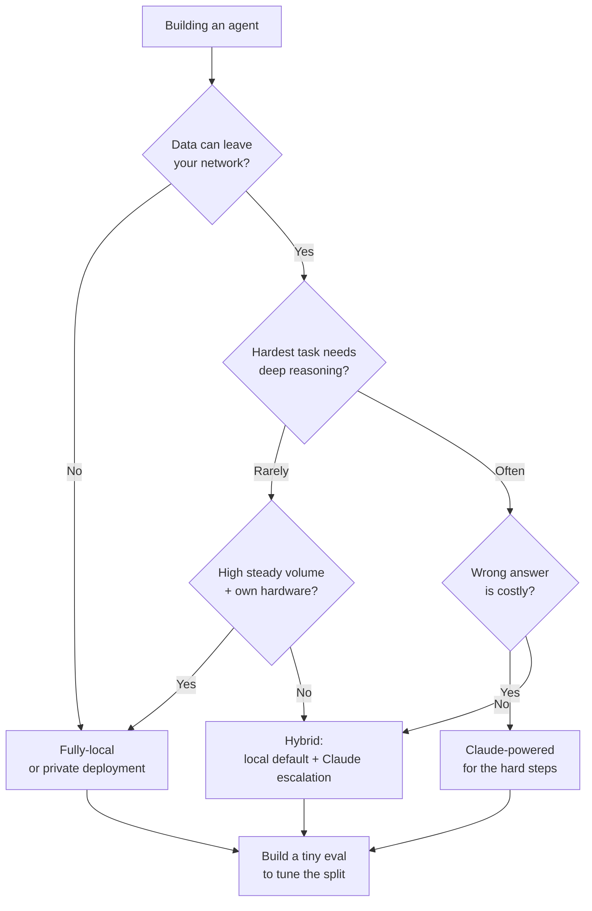

<LevelBadge level="intermediate" />

आप एक एजेंट बना रहे हैं। रास्ते में पहला असली मोड़: क्या यह एक **पूरी तरह लोकल** ओपन-वेट मॉडल (प्राइवेट, चलाने में मुफ्त, आपका अपना) पर चले, **Claude** (फ्रंटियर गुणवत्ता, होस्टेड) पर, या दोनों के **हाइब्रिड** पर? यह पेज एक निर्णय फ्रेमवर्क है — वे कारक जो वास्तव में इसे तय करते हैं, एक स्पष्ट "अगर X → Y की ओर झुकें" फ्लो, और यह ईमानदार सच्चाई कि **हाइब्रिड आमतौर पर जीतता है**: आसान/संवेदनशील 90% के लिए लोकल, कठिन 10% के लिए Claude।

<Callout type="objectives" items={[
  "उन कारकों को नाम दें जो वास्तव में लोकल बनाम Claude बनाम हाइब्रिड तय करते हैं",
  "अपने एजेंट के लिए एक स्पष्ट 'अगर X → Y की ओर झुकें' निर्णय फ्लो पर चलें",
  "समझें कि क्यों एक हाइब्रिड (लोकल डिफ़ॉल्ट + Claude एस्केलेशन) अक्सर दोनों में से किसी भी चरम को हरा देता है",
  "एक छोटे eval के साथ निकलें जो आपका टाई-ब्रेकर हो — लीडरबोर्ड नहीं",
]} />

<VerifyNote lastVerified="2026-06-28" source="https://artificialanalysis.ai/">
यहाँ के टिकाऊ दावे — *शीर्ष ओपन-वेट और फ्रंटियर मॉडल के बीच एक क्षमता अंतर मौजूद है लेकिन लगातार सिकुड़ता जा रहा है*, और *रूटिंग/कैस्केड (सस्ता-मॉडल-पहले, कठिन-पर-एस्केलेट) गुणवत्ता बनाए रखते हुए लागत बचाता है* — स्थिर हैं। लेकिन **विशिष्ट संख्याएँ** (इस महीने अंतर कितना बड़ा है, कौन सा ओपन मॉडल आगे है, प्रति-टोकन Claude कीमतें, दिए गए हार्डवेयर पर सटीक टोकन/सेकंड) लगातार बदलती रहती हैं। किसी भी विशिष्ट आँकड़े को नाशवान मानें और उस पर दांव लगाने से पहले [Artificial Analysis](https://artificialanalysis.ai/) जैसे किसी लाइव ट्रैकर की जाँच करें।
</VerifyNote>

## तीन विकल्प, एक साँस में

- **पूरी तरह लोकल एजेंट** — एक ओपन-वेट मॉडल (Llama, Qwen, Mistral, DeepSeek, आदि) जो आपके अपने हार्डवेयर पर Ollama/LM Studio/vLLM के जरिए चलता है। डेटा कभी आपकी मशीन से बाहर नहीं जाता; कोई प्रति-कॉल लागत नहीं; ऑफलाइन काम करता है; आपके हार्डवेयर और मॉडल की सीमा से बंधा हुआ। → [लोकल AI एजेंट](/docs/models/local-ai-agents)
- **Claude-संचालित एजेंट** — Claude API को कॉल करता है। फ्रंटियर रीज़निंग और टूल-उपयोग, कोई इन्फ्रा संभालने की जरूरत नहीं, तुरंत स्केल; लेकिन डेटा आपके नेटवर्क से बाहर जाता है, आप प्रति कॉल भुगतान करते हैं, और आपको कनेक्टिविटी चाहिए।
- **हाइब्रिड** — एक लोकल मॉडल नियमित/संवेदनशील बड़े हिस्से को संभालता है; कठिन या उच्च-दांव वाले चरण Claude पर एस्केलेट होते हैं। वह पैटर्न जिस पर अधिकांश प्रोडक्शन एजेंट अभिसरित होते हैं। → [Claude + लोकल मॉडल](/docs/models/claude-plus-local-models)

## वे कारक जो वास्तव में इसे तय करते हैं

अपने एजेंट को इनके माध्यम से चलाएँ। अधिकांश निर्णय केवल पहले दो या तीन से ही तय हो जाते हैं।

| कारक | **लोकल** की ओर झुकता है जब… | **Claude** की ओर झुकता है जब… |
|---|---|---|
| **डेटा संवेदनशीलता / प्राइवेसी** | डेटा विनियमित है या आपके नेटवर्क से बाहर नहीं जा सकता | डेटा गैर-संवेदनशील है या आपके पास एक अनुपालक डेटा समझौता है |
| **कार्य की कठिनाई और रीज़निंग की गहराई** | कार्य संकीर्ण, अच्छी तरह परिभाषित, दोहरावदार हैं | कार्यों को गहरी बहु-चरणीय रीज़निंग, लंबा-संदर्भ, जटिल टूल उपयोग चाहिए |
| **विश्वसनीयता की जरूरतें** | किसी चूक पर एक रीट्राई या एक इंसान ठीक है | हर चरण सही होना चाहिए; विफलताएँ महँगी हैं |
| **लेटेंसी** | लोकल हार्डवेयर पर्याप्त तेज़ी से जवाब देता है | आप GPU प्रावधान करने के बजाय गति के लिए भुगतान करना पसंद करेंगे |
| **आपके वॉल्यूम पर लागत** | उच्च, स्थिर वॉल्यूम — फिक्स्ड हार्डवेयर परिशोधित हो जाता है | कम/झटकेदार वॉल्यूम — प्रति-कॉल भुगतान निष्क्रिय GPU को हरा देता है |
| **ऑफलाइन आवश्यकता** | एयर-गैप्ड / कोई कनेक्टिविटी नहीं में चलना चाहिए | हमेशा-ऑनलाइन ठीक है |
| **आपके पास जो हार्डवेयर है** | आपके पास सक्षम GPU / यूनिफाइड मेमोरी है | आपके पास नहीं है, और आप उन्हें खरीदना/किराए पर लेना नहीं चाहते |
| **देखभाल का बजट** | आप इसे ट्यून, क्वांटाइज़, मूल्यांकन, बनाए रख सकते हैं | आप चाहते हैं कि यह बिना किसी ops के "बस काम करे" |

**वे दो जो आमतौर पर इसे तय करते हैं:** अगर डेटा आपके नेटवर्क से बाहर *नहीं जा सकता*, तो अकेले वही आपको बाकी सब कुछ के बावजूद लोकल (या एक प्राइवेट डिप्लॉयमेंट) की ओर धकेलता है। अगर जा सकता है, तो **कार्य की कठिनाई** अगला निर्णायक कारक है — आसान काम लोकल रूप से करना सस्ता है; कठिन रीज़निंग वहाँ है जहाँ [फ्रंटियर अंतर](/docs/models/choosing-a-model) अब भी काटता है।

<Callout type="info" items={[
  "ओपन-वेट बनाम फ्रंटियर क्षमता अंतर वास्तविक है लेकिन तेज़ी से सिकुड़ रहा है — शीर्ष ओपन मॉडल नियमित और कई कोडिंग कार्यों में उत्कृष्ट हैं, और अब भी सबसे कठिन एजेंटिक, लंबे-क्षितिज, और गहरी-रीज़निंग वाले काम में अधिकांश से पीछे हैं।",
  "वही असममितता हाइब्रिड को शक्तिशाली बनाती है: आसान/संवेदनशील बहुसंख्या को लोकल भेजें, Claude को उस टुकड़े के लिए आरक्षित रखें जिसे वास्तव में फ्रंटियर रीज़निंग की जरूरत है।",
]} />

## निर्णय फ्लो

<Steps items={[
  {title: "क्या डेटा आपके नेटवर्क से बाहर जा सकता है?", body: "अगर नहीं → लोकल (या एक प्राइवेट/VPC डिप्लॉयमेंट) आपका आधार है। प्राइवेसी एक कठोर बाधा है, प्राथमिकता नहीं — यह अन्य कारकों पर हावी होती है। अगर हाँ → फ्लो में आगे बढ़ें।"},
  {title: "आपके एजेंट को जो सबसे कठिन काम करना है वह कितना कठिन है?", body: "अगर हर कार्य संकीर्ण और दोहरावदार है → एक अच्छा लोकल मॉडल संभवतः मानक पार कर लेगा; लोकल की ओर झुकें। अगर कुछ चरणों को गहरी रीज़निंग, लंबा संदर्भ, या नाजुक बहु-टूल ऑर्केस्ट्रेशन चाहिए → कम से कम उन चरणों के लिए Claude की ओर झुकें।"},
  {title: "गलत उत्तर कितना महँगा है?", body: "अगर एक चूक का मतलब बस एक रीट्राई या एक इंसान की नज़र है → लोकल सहनशीलता ठीक है। अगर एक भी बुरा चरण महँगा या असुरक्षित है → जहाँ मायने रखता है वहाँ Claude की विश्वसनीयता को प्राथमिकता दें।"},
  {title: "आपका वॉल्यूम और हार्डवेयर क्या है?", body: "उस हार्डवेयर पर उच्च, स्थिर वॉल्यूम जो आपके पास पहले से है → लोकल शानदार ढंग से परिशोधित होता है। कम या झटकेदार वॉल्यूम, कोई GPU नहीं → Claude का प्रति-कॉल भुगतान निष्क्रिय लोहे से बचाता है।"},
  {title: "क्या आप वास्तव में इन्फ्रास्ट्रक्चर चलाना चाहते हैं?", body: "क्वांटाइज़, सर्व, मॉनिटर, और मॉडल को फिर से मूल्यांकन करने को तैयार → लोकल/हाइब्रिड व्यवहार्य है। शून्य ops चाहते हैं → Claude, या एक हाइब्रिड जहाँ लोकल हिस्सा बेहद सरल हो।"},
  {title: "हाइब्रिड को डिफ़ॉल्ट रखें, फिर साबित करें कि आपको इसकी जरूरत नहीं", body: "लोकल मॉडल डिफ़ॉल्ट वर्कर के रूप में; Claude कठिन/उच्च-दांव वाले टुकड़े के लिए एस्केलेशन पथ के रूप में। यहीं से शुरू करें जब तक कि चरण 1 शुद्ध-लोकल को बाध्य न करे या कार्य समान रूप से कठिन न हो (तब शुद्ध-Claude)।"},
]} />

## क्यों हाइब्रिड अक्सर जीतता है

अधिकांश वास्तविक वर्कलोड **असंतुलित** होते हैं: अनुरोधों का एक बड़ा बहुमत आसान और/या संवेदनशील होता है, और एक छोटा अल्पसंख्यक वास्तव में कठिन होता है। एक हाइब्रिड उस आकार का सीधे लाभ उठाता है।

- **लोकल आसान/संवेदनशील 90% को संभालता है** — तेज़, हाशिए पर मुफ्त, प्राइवेट, ऑफलाइन-सक्षम। आपके ट्रैफ़िक का बड़ा हिस्सा कभी किसी API को नहीं छूता।
- **Claude कठिन 10% को संभालता है** — बहु-चरणीय रीज़निंग, अस्पष्ट किनारे के मामले, वे चरण जहाँ सही होना मायने रखता है। आप फ्रंटियर कीमतें केवल उस टुकड़े पर चुकाते हैं जिसे फ्रंटियर गुणवत्ता की जरूरत है।

यह **कैस्केड / रूटिंग** पैटर्न है: पहले सस्ते (लोकल) मॉडल को आज़माएँ; Claude पर एस्केलेट करें जब कोई गुणवत्ता संकेत कहे कि लोकल उत्तर पर्याप्त अच्छा नहीं है, या किसी कठिनाई/संवेदनशीलता क्लासिफायर द्वारा पहले से ही ऊपर की ओर रूट करें। यह अधिकांश गुणवत्ता को बनाए रखते हुए पूरी-फ्रंटियर लागत के एक अंश का भुगतान करने का एक सुस्थापित तरीका है — और यह एक प्राइवेसी सीमा के रूप में भी दोहरा काम करता है, क्योंकि संवेदनशील मामलों को "केवल लोकल" पर पिन किया जा सकता है।

<PromptCard title="किसी एक चरम को अपनाने से पहले आत्म-जाँच">{`Answer for YOUR agent:
1. Must any data stay on my machine?            (yes -> local baseline)
2. What % of tasks are genuinely HARD?          (high -> Claude leans heavier)
3. What's a wrong answer cost me?               (high -> Claude on those steps)
4. My volume + hardware?                        (high+own GPU -> local amortizes)
5. Can I babysit infra?                         (no -> Claude or simple hybrid)

If answers conflict -> you've just described a HYBRID.
Now build the tiny eval below and let DATA pick the split.`}</PromptCard>

ईमानदार चेतावनी: हाइब्रिड में **अधिक चलने वाले हिस्से** होते हैं — दो मॉडल पथ, एक राउटर, और बनाए रखने के लिए एक गुणवत्ता संकेत। अगर आपका एजेंट समान रूप से सरल *या* समान रूप से कठिन है, तो एकल-मॉडल सेटअप सरल है और शायद सही है। हाइब्रिड की ओर तब बढ़ें जब आपका वर्कलोड वास्तव में असंतुलित हो।

<Flashcards title="निर्णय-गाइड शब्दावली" cards={[
  {front: "पूरी तरह लोकल एजेंट", back: "आपके अपने हार्डवेयर पर एक ओपन-वेट मॉडल द्वारा संचालित एजेंट। प्राइवेट, कोई प्रति-कॉल लागत नहीं, ऑफलाइन-सक्षम; आपके हार्डवेयर और मॉडल की सीमा से बंधा हुआ।"},
  {front: "Claude-संचालित एजेंट", back: "एक एजेंट जो Claude API को कॉल करता है। फ्रंटियर रीज़निंग और टूल-उपयोग, कोई इन्फ्रा नहीं, तुरंत स्केल; डेटा आपके नेटवर्क से बाहर जाता है और आप प्रति कॉल भुगतान करते हैं।"},
  {front: "हाइब्रिड (कैस्केड / रूटिंग)", back: "लोकल मॉडल आसान/संवेदनशील बहुमत को संभालता है; Claude कठिन/उच्च-दांव वाले अल्पसंख्यक को संभालता है। पहले-सस्ता-फिर-एस्केलेट, या पहले से ही कठिनाई/संवेदनशीलता के अनुसार रूट करें।"},
  {front: "निर्णायक कारक, आमतौर पर", back: "पहले डेटा संवेदनशीलता (क्या यह नेटवर्क से बाहर जा सकता है?), फिर कार्य की कठिनाई (सबसे कठिन चरण कितना कठिन है?)। बाकी टाई-ब्रेकर हैं।"},
  {front: "क्षमता अंतर", back: "शीर्ष ओपन-वेट मॉडल मुख्य रूप से सबसे कठिन रीज़निंग/एजेंटिक कार्यों पर फ्रंटियर मॉडल से पीछे हैं। वास्तविक लेकिन सिकुड़ता हुआ — जो ठीक यही है कि क्यों हाइब्रिड इतना प्रभावी है।"},
]} />

<Quiz title="खुद को परखें" questions={[
  {q: "आपका एजेंट ऐसे डेटा को प्रोसेस करता है जो कानूनी रूप से आपके नेटवर्क से बाहर नहीं जा सकता। यह सबसे पहले क्या संकेत देता है?", options: ["Claude का उपयोग करें — यह उच्च गुणवत्ता वाला है", "अन्य कारकों की परवाह किए बिना एक पूरी तरह लोकल या प्राइवेट डिप्लॉयमेंट आधार है", "जो भी प्रति टोकन सबसे सस्ता हो उसे चुनें"], answer: 1, explain: "प्राइवेसी एक कठोर बाधा है। अगर डेटा नेटवर्क से बाहर नहीं जा सकता, तो यह निर्णय पर हावी होता है — किसी और चीज़ को तौलने से पहले लोकल (या एक प्राइवेट/VPC डिप्लॉयमेंट) आपका आधार है।"},
  {q: "एक विशिष्ट, असंतुलित वर्कलोड के लिए एक हाइब्रिड एजेंट अक्सर क्यों जीतता है?", options: ["फ्रंटियर मॉडल स्केल पर हमेशा सस्ते होते हैं", "लोकल आसान/संवेदनशील बहुमत को सस्ते में और प्राइवेट रूप से संभालता है; Claude को उस कठिन अल्पसंख्यक के लिए आरक्षित रखा जाता है जिसे फ्रंटियर रीज़निंग की जरूरत है", "यह किसी भी मूल्यांकन की जरूरत को खत्म करता है"], answer: 1, explain: "अधिकांश वर्कलोड असंतुलित होते हैं। आसान/संवेदनशील 90% को एक लोकल मॉडल पर और कठिन 10% को Claude पर रूट करना पूरी-फ्रंटियर लागत के एक अंश पर अधिकांश गुणवत्ता बनाए रखता है — और संवेदनशील मामलों को लोकल पर पिन करता है।"},
  {q: "हाइब्रिड की तुलना में एकल-मॉडल सेटअप (शुद्ध-लोकल या शुद्ध-Claude) कब बेहतर विकल्प है?", options: ["हमेशा — हाइब्रिड कभी सार्थक नहीं होता", "जब वर्कलोड समान रूप से सरल या समान रूप से कठिन हो, ताकि अतिरिक्त राउटर और गुणवत्ता-संकेत तंत्र अपना खर्च न वसूल रहा हो", "केवल जब आपके पास कोई GPU न हो"], answer: 1, explain: "हाइब्रिड चलने वाले हिस्से जोड़ता है (दो पथ, एक राउटर, एक गुणवत्ता संकेत)। अगर आपके कार्य सभी आसान या सभी कठिन हैं, तो एक मॉडल सरल है और आमतौर पर सही है। हाइब्रिड तब फायदेमंद होता है जब वर्कलोड वास्तव में असंतुलित हो।"},
]} />

## फिर वह एकमात्र काम करें जो इसे तय करता है: इसे परखें

ऊपर का हर कारक क्षेत्र को संकीर्ण करता है; **एक छोटा eval विजेता चुनता है।** vibes या किसी सार्वजनिक लीडरबोर्ड पर मत चुनें।

- अपने वास्तविक वर्कलोड से **10–50 वास्तविक मामले** एकत्र करें, ज्ञात-सही उत्तरों के साथ (अपने सबसे कठिन और सबसे संवेदनशील मामले शामिल करें)।
- अपनी शॉर्टलिस्ट चलाएँ — एक उम्मीदवार लोकल मॉडल, Claude, और (यदि प्रासंगिक हो) एक हाइब्रिड राउटर — समान मामलों पर।
- गुणवत्ता को स्कोर करें, फिर अपने वास्तविक वॉल्यूम पर **लागत और लेटेंसी** को तौलें। 2% गुणवत्ता लाभ जिसकी लागत 10× है वह इसके लायक नहीं हो सकता; उस चरण पर 2% लाभ जो सही होना चाहिए वह गैर-परक्राम्य हो सकता है।
- एक हाइब्रिड के लिए, eval आपको यह भी बताता है कि **रेखा कहाँ खींचनी है** — क्या Claude पर एस्केलेट होता है और क्या लोकल रहता है।

eval को रखें। जब कोई नया ओपन-वेट मॉडल आता है या कीमतें बदलती हैं, तो इसे फिर से चलाना एक नर्व-रैकिंग माइग्रेशन को पाँच-मिनट की जाँच में बदल देता है। → [Evals](/docs/power-user/evals)

<Callout type="takeaways" items={[
  "क्रम में तय करें: पहले डेटा संवेदनशीलता (क्या यह नेटवर्क से बाहर जा सकता है?), फिर कार्य की कठिनाई (सबसे कठिन चरण कितना कठिन है?)। बाकी — लेटेंसी, वॉल्यूम, हार्डवेयर, देखभाल का बजट — टाई-ब्रेकर हैं।",
  "शुद्ध-लोकल प्राइवेसी, ऑफलाइन, और स्थिर उच्च वॉल्यूम पर लागत में जीतता है; Claude सबसे कठिन रीज़निंग, विश्वसनीयता, और शून्य-ops स्केल में जीतता है।",
  "हाइब्रिड आमतौर पर असंतुलित वर्कलोड के लिए जीतता है: आसान/संवेदनशील 90% के लिए लोकल, कठिन 10% के लिए Claude — कैस्केड/रूट करें और फ्रंटियर कीमतें केवल वहाँ चुकाएँ जहाँ वे अपना मूल्य कमाती हैं।",
  "ओपन-वेट अंतर वास्तविक है लेकिन सिकुड़ रहा है — जो ठीक यही है कि क्यों हाइब्रिड आज इतना प्रभावी है।",
  "vibes पर मत तय करें: अपने डेटा पर एक छोटा eval बनाएँ, अपने वॉल्यूम पर लागत और लेटेंसी तौलें, और अगले मॉडल रिलीज़ के लिए इसे रखें।",
]} />

## स्रोत और आगे पढ़ना

- [Artificial Analysis](https://artificialanalysis.ai/) — ओपन और फ्रंटियर मॉडल में स्वतंत्र, बार-बार अपडेट होने वाली क्षमता/कीमत/गति तुलनाएँ (नाशवान विशिष्टताओं को फिर से जाँचने की जगह)।
- [Anthropic — Models overview](https://docs.anthropic.com/en/docs/about-claude/models) — Claude की मौजूदा लाइनअप, संदर्भ, और क्षमताएँ।
- [Anthropic — API pricing](https://www.anthropic.com/pricing) — आपके at-volume गणित के आकार निर्धारण के लिए मौजूदा प्रति-टोकन लागतें।
- [Ollama](https://ollama.com/) · [LM Studio](https://lmstudio.ai/) — लोकल/हाइब्रिड पथ के लिए ओपन-वेट मॉडल को लोकल रूप से चलाएँ।
- [Meta — Llama](https://www.llama.com/) · [Mistral — Models](https://docs.mistral.ai/getting-started/models/) — लोकल एजेंट में आमतौर पर उपयोग किए जाने वाले ओपन-वेट परिवार।

## आगे

- लोकल पक्ष बनाएँ → [लोकल AI एजेंट](/docs/models/local-ai-agents)
- हाइब्रिड को जोड़ें → [Claude + लोकल मॉडल](/docs/models/claude-plus-local-models)
- विकल्प को व्यापक रूप से तैयार करें → [एक मॉडल चुनना](/docs/models/choosing-a-model)
- निर्णय को मापने योग्य बनाएँ → [Evals](/docs/power-user/evals)
