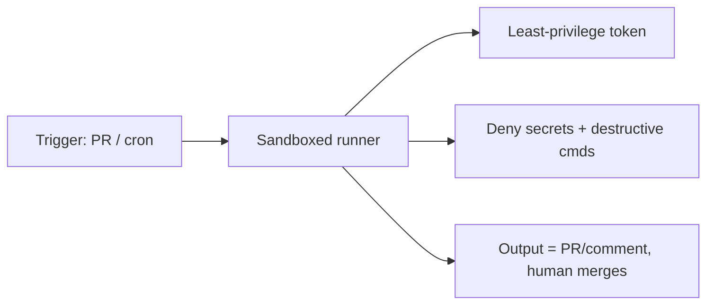

<LevelBadge level="advanced" />

Claude को [हेडलेस](/docs/claude-code/headless-and-agent-sdk) या किसी [शेड्यूल](/docs/claude-code/background-tasks) पर चलाना — CI में, एक cron जॉब में, एक प्री-कमिट हुक में — उस मनुष्य को हटा देता है जो सामान्यतः किसी गलत क्रिया को पकड़ता। यह सुविधा ही ठीक वह कारण है कि इन रन को सबसे कड़े सुरक्षा-उपायों की आवश्यकता होती है।

## अनअटेंडेड रन के लिए विशिष्ट जोखिम

- **उस क्षण में "नहीं" कहने वाला कोई नहीं** जब कोई जोखिम भरा टूल कॉल हो।
- **एम्बिएंट क्रेडेंशियल्स।** CI के पास अक्सर शक्तिशाली टोकन होते हैं (डिप्लॉय, पैकेज रजिस्ट्री, क्लाउड)। वहां मौजूद एक एजेंट उन्हें विरासत में पा लेता है।
- **अविश्वसनीय इनपुट।** किसी PR या इश्यू द्वारा ट्रिगर किया गया रन हमलावर-रचित सामग्री को प्रोसेस कर सकता है ([इंजेक्शन](/docs/security/prompt-injection))।

## एक सुदृढ़ीकरण चेकलिस्ट

- **रहस्यों को स्पष्ट रूप से अस्वीकार करें।** [permission deny नियमों](/docs/claude-code/permissions) के माध्यम से `.env`, की फ़ाइलें और क्रेडेंशियल पथ पढ़ने को ब्लॉक करें। इनसे बचने के लिए मॉडल पर भरोसा न करें।
- **वास्तविक एक्सेस वाली मशीन पर कभी bypass/yolo मोड का उपयोग न करें।** "सभी प्रॉम्प्ट छोड़ें" को डिस्पोज़ेबल सैंडबॉक्स के लिए आरक्षित रखें।
- **टोकन को सीमित करें।** रन को एक न्यूनतम-विशेषाधिकार टोकन दें (जहां संभव हो, केवल पढ़ने योग्य), न कि आपके पूर्ण-एक्सेस क्रेडेंशियल्स।
- **सैंडबॉक्स और अल्पकालिक।** ऐसे कंटेनर में चलाएं जो बाद में नष्ट हो जाए; प्रोडक्शन तक कोई स्थायी एक्सेस न हो।
- **कमांड और डोमेन्स को allowlist करें।** अपने test/lint/build कमांड की अनुमति दें; नेटवर्क वाले या विनाशकारी कमांड को अस्वीकार करें।
- **सीमा लगाएं।** अधिकतम इटरेशन, समय बजट, टोकन/लागत बजट — ताकि कोई लूप या हेरफेर किया गया एजेंट बेकाबू न हो जाए।
- **आउटपुट को समीक्षा योग्य बनाएं, स्वतः-लागू नहीं।** "main में पुश करें" के बजाय "एक PR खोलें / एक टिप्पणी पोस्ट करें" को प्राथमिकता दें। एक मनुष्य मर्ज करता है।

## उदाहरण: एक सुरक्षित CI रिव्यूअर

एक PR-समीक्षा बॉट को चाहिए: कोड को केवल पढ़ने योग्य (read-only) रूप में चेक आउट करना, **कोई** डिप्लॉय/रहस्य एक्सेस न होना, एक कंटेनर में चलना, और अपने निष्कर्षों पर **टिप्पणी** करना — कभी भी संरक्षित ब्रांचों को संशोधित न करना। देखें [PR-समीक्षा वॉकथ्रू](/docs/walkthroughs/pr-review-action)।

## आगे

- [अनुमतियां और अनुमति मोड](/docs/claude-code/permissions)
- [एजेंट्स और टूल्स को सुरक्षित करना](/docs/security/securing-agents)
- [हेडलेस मोड और Agent SDK](/docs/claude-code/headless-and-agent-sdk)
