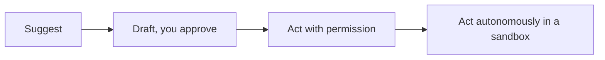

<LevelBadge level="all" />

AI का अधिकतम लाभ उठाने में इसका *जिम्मेदारी से* उपयोग करना भी शामिल है। यह पेज छोटा, व्यावहारिक है और सभी पर लागू होता है — शुरुआती से लेकर निर्माता तक।

## सत्यापन की मानसिकता

सबसे महत्वपूर्ण आदत: **अपने सत्यापन को दांव के अनुरूप ढालें।**

| दांव | उदाहरण | कितना सत्यापन करें |
|---|---|---|
| कम | विचार-मंथन, कच्चे ड्राफ्ट | स्वतंत्र रूप से भरोसा करें, सरसरी तौर पर देखें |
| मध्यम | एक कार्य संबंधी ईमेल, एक सारांश | इसे पढ़ें, तथ्यों की समझदारी से जांच करें |
| उच्च | प्रकाशित आंकड़े, वह कोड जो आप चलाएंगे, कानूनी/चिकित्सीय/वित्तीय | प्रत्येक दावे को एक विश्वसनीय स्रोत के विरुद्ध सत्यापित करें |

AI एक तेज़ पहला ड्राफ्ट है, कभी अंतिम प्राधिकार नहीं — देखें [हैल्यूसिनेशन](/docs/foundations/hallucinations)।

## स्वायत्तता की सीढ़ी

AI को अधिक स्वतंत्रता केवल तभी दें जब भरोसा अर्जित हो जाए:

"प्रस्ताव दें, मैं अनुमोदित करता हूं" ([Plan Mode](/docs/claude-code/plan-mode)) से शुरू करें; पूर्ण स्वायत्तता को कम-जोखिम वाले, सैंडबॉक्स्ड, प्रतिवर्ती (reversible) कार्य के लिए आरक्षित रखें ([स्वायत्त रन को सुदृढ़ करना](/docs/security/hardening-autonomous-runs))।

## गोपनीयता और डेटा

- ऐसे टूल में रहस्य, क्रेडेंशियल्स या दूसरों का व्यक्तिगत डेटा न पेस्ट करें जिसकी आपने जांच नहीं की है।
- संवेदनशील सामग्री साझा करने से पहले अपने प्रोवाइडर की डेटा-हैंडलिंग और ट्रेनिंग नीति को जान लें — देखें [गोपनीयता और डेटा हैंडलिंग](/docs/foundations/privacy)।
- विनियमित या गोपनीय डेटा के लिए, उपयुक्त एंटरप्राइज़/नियंत्रित सेटिंग्स का उपयोग करें।

## पूर्वाग्रह, निष्पक्षता और सीमाएं

मॉडल अपने ट्रेनिंग डेटा के पैटर्न को प्रतिबिंबित करते हैं, जो **पूर्वाग्रह** ले जा सकते हैं। विशेष रूप से सावधान रहें जब AI आउटपुट लोगों के बारे में निर्णयों को प्रभावित करता है (भर्ती, ऋण देना, मॉडरेशन)। परिणामी निर्णयों के लिए एक मनुष्य को जवाबदेह रखें, और AI को निर्णय का सहायक मानें, उसका विकल्प नहीं।

## अपनी सोच को आउटसोर्स न करें

:::tip AI का उपयोग बेहतर सोचने के लिए करें, कम सोचने के लिए नहीं
सबसे अच्छे उपयोगकर्ता जुड़े रहते हैं — वे आउटपुट पर सवाल उठाते हैं, उनसे सीखते हैं, और परिणाम के स्वामी बनते हैं। अध्ययन के लिए, इसका मतलब है [टीच-बैक लूप](/docs/playbooks/learning), न कि कॉपी-पेस्ट। AI की मदद से आप जो भी शिप करते हैं उसके लिए आप जवाबदेह हैं।
:::

## सुरक्षा, संक्षेप में

यदि AI कभी अविश्वसनीय सामग्री (वेब पेज, ईमेल, दस्तावेज़) पढ़ता है या कार्य करता है, तो आप एक सुरक्षा मॉडल विरासत में पाते हैं। [प्रॉम्प्ट इंजेक्शन](/docs/security/prompt-injection) और [एजेंट्स को सुरक्षित करना](/docs/security/securing-agents) पढ़ें।

## आगे

- [प्रॉम्प्ट इंजेक्शन की व्याख्या](/docs/security/prompt-injection)
- [हैल्यूसिनेशन और उन्हें कैसे कम करें](/docs/foundations/hallucinations)
- [गोपनीयता और डेटा हैंडलिंग](/docs/foundations/privacy)
