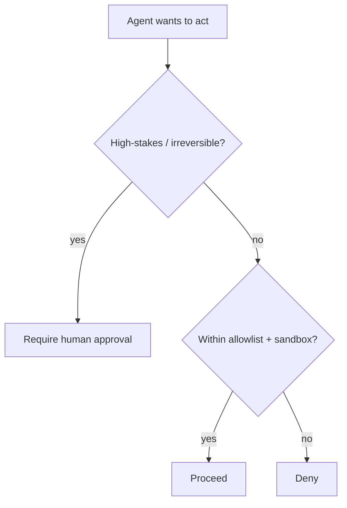

<LevelBadge level="advanced" />

<Callout type="objectives" items={["न्यूनतम विशेषाधिकार लागू करें — किसी एजेंट को केवल वह एक्सेस दें जिसकी उसके काम को ज़रूरत है", "confused-deputy समस्या को पहचानें: एक एजेंट आपके अधिकार को उधार ले लेता है", "जब किसी एजेंट को धोखा दिया जाए तब blast radius को घटाने वाली पाँच बचाव परतें लगाएँ", "तय करें कि किन क्रियाओं के लिए human in the loop ज़रूरी है", "टूल इनपुट को वैलिडेट करें ताकि कोई खराब या हेरफेर किया गया आर्ग्युमेंट निष्पादित न हो सके"]} />

जिस क्षण कोई AI **कार्य कर सकता है** (टूल कॉल करना, कोड चलाना, API पर पहुंचना), वह एक सुरक्षा मॉडल विरासत में पा लेता है। लक्ष्य मॉडल को धोखा न दे पाने योग्य बनाना नहीं है — लक्ष्य यह सुनिश्चित करना है कि **भले ही उसे धोखा दे दिया जाए, वह ज्यादा नुकसान न कर सके**।

## मूल सिद्धांत: न्यूनतम विशेषाधिकार

किसी एजेंट को उसके काम के लिए आवश्यक **न्यूनतम** एक्सेस दें, उससे अधिक कुछ नहीं।

- एक डॉक-समराइज़र को **पढ़ने** की आवश्यकता है, लिखने या नेटवर्क की नहीं।
- एक रिव्यूअर को कोड पढ़ने और एक टिप्पणी पोस्ट करने की आवश्यकता है — पुश या डिप्लॉय करने की नहीं।
- टूल्स, API कीज़ और फ़ाइल एक्सेस को प्रति-कार्य सीमित करें। एक संकीर्ण रूप से सीमित एजेंट जिसमें [इंजेक्शन](/docs/security/prompt-injection) हो जाता है, केवल संकीर्ण नुकसान ही कर सकता है।

## confused-deputy समस्या

एक एजेंट अक्सर **आपके अधिकार के साथ** कार्य करता है (आपके टोकन, आपके सेशन)। यदि हमलावर-नियंत्रित इनपुट उसे चलाता है, तो हमलावर आपके विशेषाधिकार उधार ले लेता है — एक "confused deputy"। बचाव: एजेंट को ऐसा ambient अधिकार न दें जिसकी उसे आवश्यकता नहीं है, और संवेदनशील टूल्स के लिए स्पष्ट, सीमित क्रेडेंशियल्स की मांग करें।

## बचाव की परतें

इन्हें एक-दूसरे के ऊपर लगाएँ — कोई अकेली परत पर्याप्त नहीं है। हर परत यह मानकर चलती है कि उसके ऊपर की परतें विफल हो सकती हैं।

<Steps items={[
  {title: "निष्पादन और फ़ाइल एक्सेस को सैंडबॉक्स करें", body: "कोड और फ़ाइल ऑपरेशन को कंटेनर या अल्पकालिक डायरेक्टरीज़ में चलाएँ, जिनकी व्यापक सिस्टम या रहस्यों तक कोई एक्सेस न हो। यदि एजेंट को धोखा दिया जाता है, तो वह एक बॉक्स के भीतर ही खेलता है।"},
  {title: "खतरनाक सतह को allowlist करें", body: "तय करें कि कौन से कमांड, कौन से डोमेन और कौन से पथ की अनुमति है — बाकी सब को अस्वीकार करें। Claude Code में, यह permissions है (/docs/claude-code/permissions)।"},
  {title: "उच्च-दांव के लिए human-in-the-loop", body: "अपरिवर्तनीय या संवेदनशील क्रियाओं के लिए स्पष्ट अनुमोदन की मांग करें: पैसा भेजना, ईमेल भेजना, हटाना, डिप्लॉय करना, या प्रोडक्शन कॉन्फ़िगरेशन बदलना।"},
  {title: "विश्वास के क्षेत्रों को अलग करें", body: "किसी एक एजेंट को एक साथ रहस्य रखने, अविश्वसनीय सामग्री पढ़ने और मनमाने आउटबाउंड कॉल करने न दें — यह संयोजन ही exfiltration का रास्ता है।"},
  {title: "टूल कॉल को लॉग और समीक्षा करें", body: "रिकॉर्ड करें कि एजेंट ने वास्तव में कौन से टूल किन आर्ग्युमेंट्स के साथ आमंत्रित किए, ताकि आप व्यवहार का ऑडिट कर सकें और drift को पकड़ सकें।"}
]} />

## allowlist को लिखित रूप में रखें

"खतरनाक सतह को allowlist करें" — इस पर सिर हिलाना आसान है और इसे छोड़ देना भी आसान है। Claude Code में यह ठोस है: एक `settings.json` जो कार्य को आवश्यक कमांड और डोमेन के संकीर्ण सेट की अनुमति देता है और बाकी सब को अस्वीकार करता है। प्रतिबंधात्मक शुरुआत करें और केवल तभी विस्तार करें जब कोई वास्तविक कार्य अटक जाए।

<PromptCard title="एक न्यूनतम-विशेषाधिकार वाला Claude Code permissions ब्लॉक">{`{
  "permissions": {
    "allow": [
      "Read",
      "Edit",
      "Bash(npm test:*)",
      "Bash(npm run build:*)",
      "Bash(git status)",
      "Bash(git diff:*)"
    ],
    "deny": [
      "Bash(git push:*)",
      "Bash(rm:*)",
      "Bash(curl:*)",
      "Read(./.env)",
      "Read(./secrets/**)"
    ]
  }
}`}</PromptCard>

`deny` सूची `allow` पर हावी रहती है, इसलिए `.env` और `secrets/**` को ब्लॉक करना तब भी टिका रहता है जब कोई व्यापक `Read` दिया गया हो। पूर्ण नियम सिंटैक्स और प्राथमिकता के लिए [permissions](/docs/claude-code/permissions) देखें।

## टूल्स के स्कीमा होते हैं — उन्हें वैलिडेट करें

मॉडल द्वारा उत्पन्न टूल इनपुट गलत या हेरफेर किए गए हो सकते हैं। निष्पादन से पहले आर्ग्युमेंट्स को **वैलिडेट** करें, और **त्रुटियों को परिणाम के रूप में लौटाएं** ताकि एजेंट आँख मूंदकर पुनः प्रयास करने के बजाय रिकवर हो जाए।

<Flashcards title="मुख्य शब्दों का अभ्यास करें" cards={[{front: "न्यूनतम विशेषाधिकार", back: "किसी एजेंट को केवल वह एक्सेस दें जिसकी उसके विशिष्ट काम को ज़रूरत है — उससे अधिक कुछ नहीं। एक संकीर्ण रूप से सीमित एजेंट जो धोखा खा जाता है, केवल संकीर्ण नुकसान ही कर सकता है।"}, {front: "confused deputy", back: "एक एजेंट आपके अधिकार के साथ कार्य करता है (आपके टोकन, आपके सेशन)। यदि हमलावर-नियंत्रित इनपुट उसे चलाता है, तो हमलावर आपके विशेषाधिकार उधार ले लेता है।"}, {front: "सैंडबॉक्स", back: "कोड और फ़ाइल एक्सेस को एक अलग-थलग कंटेनर या अल्पकालिक डायरेक्टरी में चलाएँ, जिसका व्यापक सिस्टम या रहस्यों तक कोई रास्ता न हो, ताकि धोखा खाया एजेंट बॉक्स के भीतर ही रहे।"}, {front: "विश्वास के क्षेत्र", back: "रहस्यों, अविश्वसनीय सामग्री और आउटबाउंड नेटवर्क को अलग-अलग एजेंट्स में रखें। एक ही एजेंट तीनों को धारण करना exfiltration का रास्ता है।"}, {front: "human-in-the-loop", back: "अपरिवर्तनीय या संवेदनशील क्रियाओं से पहले एक आवश्यक मानव अनुमोदन द्वार — पैसा भेजना, हटाना, डिप्लॉय करना, प्रोडक्शन कॉन्फ़िगरेशन बदलना।"}]} />

<Quiz title="स्वयं को जाँचें" questions={[
  {
    q: "किसी एजेंट को कॉन्फ़िगर करते समय न्यूनतम विशेषाधिकार का सिद्धांत आपसे क्या करने को कहता है?",
    options: ["इसे व्यापक एक्सेस दें ताकि यह कभी भी कार्य के बीच में न अटके", "इसे केवल वह एक्सेस दें जिसकी इसके विशिष्ट काम को ज़रूरत है", "इसे उतनी ही अनुमतियाँ दें जितनी इसे चलाने वाले मानव के पास हैं"],
    answer: 1,
    explain: "न्यूनतम विशेषाधिकार का अर्थ है काम को आवश्यक न्यूनतम एक्सेस। एक संकीर्ण रूप से सीमित एजेंट जिसमें इंजेक्शन हो जाता है, केवल संकीर्ण नुकसान ही कर सकता है।"
  },
  {
    q: "आपके टोकन के साथ कार्य करने वाला एजेंट 'confused deputy' जोखिम क्यों है?",
    options: ["यह भ्रमित हो जाता है कि किस मॉडल को कॉल करना है", "हमलावर-नियंत्रित इनपुट इसे आपके विशेषाधिकारों का उपयोग करने की दिशा दे सकता है", "यह बिना पूछे अन्य एजेंट्स को deputize कर देता है"],
    answer: 1,
    explain: "एजेंट आपका अधिकार धारण करता है। यदि हमलावर-नियंत्रित इनपुट उसे चलाता है, तो हमलावर प्रभावी रूप से आपके विशेषाधिकार उधार ले लेता है — confused-deputy समस्या।"
  },
  {
    q: "Claude Code permissions ब्लॉक में, कौन सी प्रविष्टि एजेंट को किसी secrets फ़ाइल को पढ़ने से भरोसेमंद ढंग से रोकती है?",
    options: ["Read के लिए एक allow प्रविष्टि", "secrets पथ के लिए एक deny प्रविष्टि, क्योंकि deny, allow पर हावी होता है", "Bash टूल को हटाना"],
    answer: 1,
    explain: "deny, allow पर प्राथमिकता रखता है, इसलिए secrets/** पर एक deny तब भी टिका रहता है जब कोई व्यापक Read दिया गया हो।"
  }
]} />

<Callout type="takeaways" items={["न्यूनतम विशेषाधिकार पहले: टूल्स, कीज़ और फ़ाइल एक्सेस को प्रति कार्य सीमित करें ताकि धोखा खाया एजेंट केवल संकीर्ण नुकसान कर सके", "एक एजेंट आपके अधिकार के साथ कार्य करता है — इसे वह ambient विशेषाधिकार न दें जिसकी इसे आवश्यकता नहीं है (confused-deputy समस्या)", "पाँच परतें एक-दूसरे के ऊपर लगाएँ: सैंडबॉक्स, allowlist, human-in-the-loop, विश्वास के क्षेत्रों को अलग करें, लॉग और समीक्षा", "Claude Code में, deny नियम allow नियमों को मात देते हैं — .env और secrets पथ को स्पष्ट रूप से ब्लॉक करें", "निष्पादन से पहले टूल आर्ग्युमेंट्स को वैलिडेट करें, और त्रुटियों को परिणाम के रूप में लौटाएं ताकि एजेंट आँख मूंदकर पुनः प्रयास करने के बजाय रिकवर हो जाए"]} />

## आगे

- [प्रॉम्प्ट इंजेक्शन की व्याख्या](/docs/security/prompt-injection)
- [स्वायत्त रन को सुदृढ़ करना](/docs/security/hardening-autonomous-runs)
- [थर्ड-पार्टी कोड की समीक्षा करना](/docs/security/reviewing-third-party-code)
