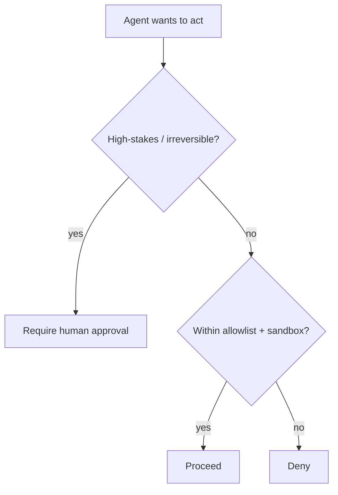

<LevelBadge level="advanced" />

जिस क्षण कोई AI **कार्य कर सकता है** (टूल कॉल करना, कोड चलाना, API पर पहुंचना), वह एक सुरक्षा मॉडल विरासत में पा लेता है। लक्ष्य मॉडल को धोखा न दे पाने योग्य बनाना नहीं है — लक्ष्य यह सुनिश्चित करना है कि **भले ही उसे धोखा दे दिया जाए, वह ज्यादा नुकसान न कर सके**।

## मूल सिद्धांत: न्यूनतम विशेषाधिकार

किसी एजेंट को उसके काम के लिए आवश्यक **न्यूनतम** एक्सेस दें, उससे अधिक कुछ नहीं।

- एक डॉक-समराइज़र को **पढ़ने** की आवश्यकता है, लिखने या नेटवर्क की नहीं।
- एक रिव्यूअर को कोड पढ़ने और एक टिप्पणी पोस्ट करने की आवश्यकता है — पुश या डिप्लॉय करने की नहीं।
- टूल्स, API कीज़ और फ़ाइल एक्सेस को प्रति-कार्य सीमित करें। एक संकीर्ण रूप से सीमित एजेंट जिसमें [इंजेक्शन](/docs/security/prompt-injection) हो जाता है, केवल संकीर्ण नुकसान ही कर सकता है।

## कन्फ्यूज़्ड-डिप्टी समस्या

एक एजेंट अक्सर **आपके अधिकार के साथ** कार्य करता है (आपके टोकन, आपके सेशन)। यदि हमलावर-नियंत्रित इनपुट उसे चलाता है, तो हमलावर आपके विशेषाधिकार उधार ले लेता है — एक "कन्फ्यूज़्ड डिप्टी"। बचाव: एजेंट को ऐसा एम्बिएंट अधिकार न दें जिसकी उसे आवश्यकता नहीं है, और संवेदनशील टूल्स के लिए स्पष्ट, सीमित क्रेडेंशियल्स की मांग करें।

## बचाव की परतें

1. **सैंडबॉक्स** करें कोड निष्पादन और फ़ाइल एक्सेस को — कंटेनर, अल्पकालिक डायरेक्टरीज़, व्यापक सिस्टम या रहस्यों तक कोई एक्सेस न हो।
2. **Allowlist** करें खतरनाक सतह को: कौन से कमांड, कौन से डोमेन, कौन से पथ। बाकी सब अस्वीकार करें। (Claude Code में, यह [अनुमतियां](/docs/claude-code/permissions) हैं।)
3. **ह्यूमन-इन-द-लूप** अपरिवर्तनीय या उच्च-दांव वाली क्रियाओं के लिए: पैसा भेजना, ईमेल, हटाना, डिप्लॉय करना, प्रोडक्शन कॉन्फ़िगरेशन बदलना।
4. **विश्वास के क्षेत्रों को अलग करें।** किसी एक एजेंट को एक साथ रहस्य रखने, अविश्वसनीय सामग्री पढ़ने और मनमाने आउटबाउंड कॉल करने न दें।
5. **लॉग और समीक्षा करें** कि एजेंट ने वास्तव में कौन से टूल कॉल किए।

## टूल्स के स्कीमा होते हैं — उन्हें वैलिडेट करें

मॉडल द्वारा उत्पन्न टूल इनपुट गलत या हेरफेर किए गए हो सकते हैं। निष्पादन से पहले आर्ग्युमेंट्स को **वैलिडेट** करें, और **त्रुटियों को परिणाम के रूप में लौटाएं** ताकि एजेंट आँख मूंदकर पुनः प्रयास करने के बजाय रिकवर हो जाए।

## आगे

- [प्रॉम्प्ट इंजेक्शन की व्याख्या](/docs/security/prompt-injection)
- [स्वायत्त रन को सुदृढ़ करना](/docs/security/hardening-autonomous-runs)
- [थर्ड-पार्टी कोड की समीक्षा करना](/docs/security/reviewing-third-party-code)
