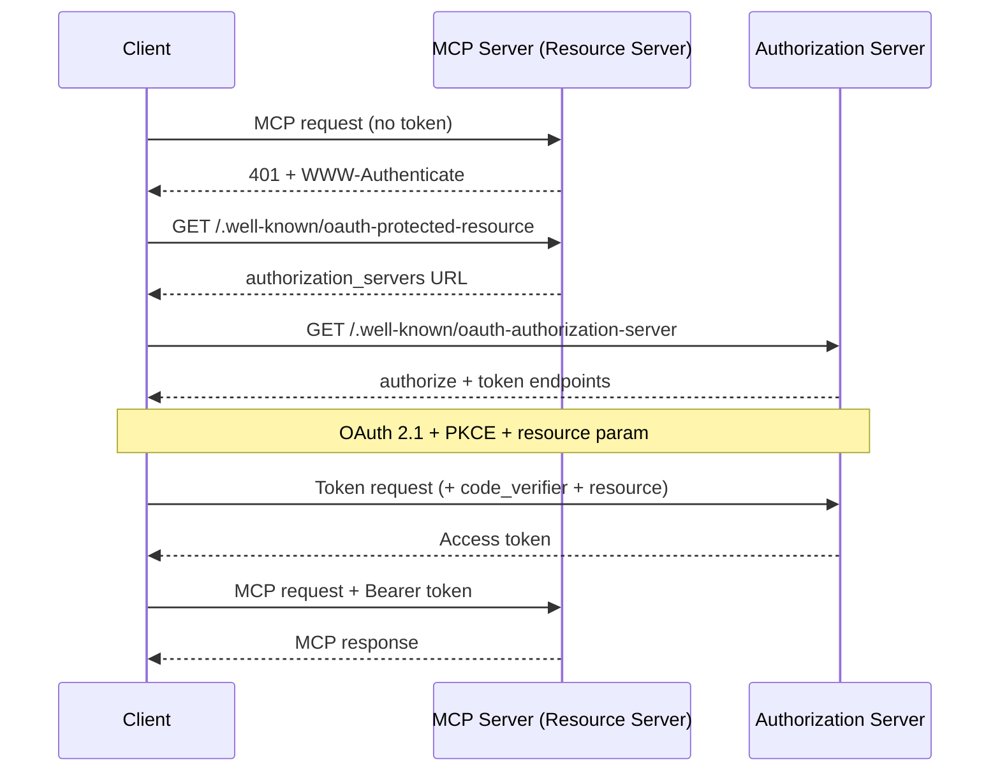
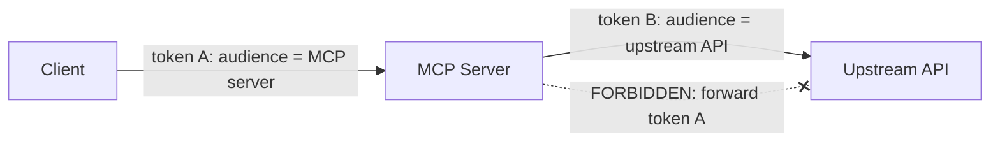

<LevelBadge level="advanced" />

<Callout type="objectives" items={["समझें कि एक रिमोट (HTTP) MCP सर्वर एक OAuth 2.1 रिसोर्स सर्वर क्यों है, न कि केवल एक API-की एंडपॉइंट", "डिस्कवरी हैंडशेक का पता लगाएं: 401 → Protected Resource Metadata → Authorization Server Metadata → टोकन", "टोकन ऑडियंस बाइंडिंग (RFC 8707) की व्याख्या करें और यह क्यों एक सेवा के टोकन को दूसरी सेवा पर काम करने से रोकती है", "कन्फ्यूज्ड-डेप्युटी जाल और इसे बंद करने वाले एकमात्र नियम का नाम बताएं: किसी क्लाइंट के टोकन को कभी भी अपस्ट्रीम API तक पास न करें", "इंटरनेट पर MCP सर्वर एक्सपोज़ करने से पहले एक छोटी हार्डनिंग चेकलिस्ट लागू करें"]} />

[MCP](/docs/claude-code/mcp) एक नवीनता से बढ़कर एजेंटों के टूल तक पहुंचने का डिफ़ॉल्ट तरीका बन गया — जिसका अर्थ है कि MCP सर्वर अब वास्तविक डेटा और वास्तविक क्रियाओं के सामने बैठते हैं। एक लोकल सर्वर जिसे आप **STDIO** पर लॉन्च करते हैं, अपने वातावरण पर भरोसा करता है: यह env वेरिएबल्स से क्रेडेंशियल पढ़ता है और बचाव करने के लिए कोई नेटवर्क सीमा नहीं होती। जिस पल आप उसी सर्वर को **रिमोट** (HTTP) बनाते हैं, कोई भी जो URL तक पहुंच सकता है, उसे कॉल करने की कोशिश कर सकता है। यह इसे एक ऑथराइज़ेशन समस्या में बदल देता है, और MCP स्पेक इसका उत्तर **OAuth 2.1** से देती है — न कि किसी कस्टम API-की योजना से।

यह पेज रिमोट मामले के बारे में है। यदि आपका सर्वर केवल STDIO है, तो स्पेक स्पष्ट रूप से कहती है कि OAuth फ्लो का *पालन न करें* — वातावरण से क्रेडेंशियल खींचें और आगे बढ़ें।

<VerifyNote lastVerified="2026-07-07" source="https://modelcontextprotocol.io/specification/2025-06-18/basic/authorization" />

## तीन भूमिकाएं

OAuth समस्या को तीन पक्षों में बांटती है। MCP उन पर साफ-सुथरे तरीके से मैप होती है:

<Flashcards title="एक MCP OAuth फ्लो में कौन कौन है" cards={[{front: "MCP सर्वर = Resource Server", back: "संरक्षित वस्तु। यह एक एक्सेस टोकन ले जाने वाले अनुरोधों को स्वीकार करता है, टोकन को वैलिडेट करता है, और डेटा लौटाता है — या यदि टोकन गायब या गलत है तो 401। यह उपयोगकर्ता को लॉग इन नहीं करता।"}, {front: "MCP क्लाइंट = OAuth client", back: "आपका एजेंट होस्ट (Claude Code, डेस्कटॉप ऐप, आपका अपना कोड)। यह उपयोगकर्ता की ओर से एक टोकन प्राप्त करता है और इसे हर अनुरोध के साथ एक Bearer हेडर के रूप में जोड़ता है।"}, {front: "Authorization Server (AS)", back: "वह पक्ष जो वास्तव में उपयोगकर्ता से बात करता है, सहमति प्राप्त करता है, और टोकन जारी करता है। यह सर्वर के साथ होस्ट किया जा सकता है या एक अलग आइडेंटिटी प्रोवाइडर हो सकता है। इसकी आंतरिक कार्यप्रणाली MCP के दायरे से बाहर है।"}]} />

मुख्य मानसिक बदलाव: **MCP सर्वर कभी भी लॉगिन को स्वयं नहीं संभालता।** यह केवल किसी और द्वारा जारी किए गए टोकन को वैलिडेट करता है। यही अलगाव आपको एक ऐसे सर्वर के सामने एक तैयार आइडेंटिटी प्रोवाइडर रखने देता है जिसे आपने लिखा है।

## डिस्कवरी हैंडशेक

एक क्लाइंट को यह पहले से कॉन्फ़िगर किए जाने की आवश्यकता नहीं होनी चाहिए कि कहां प्रमाणित करना है। MCP डिस्कवरी को स्वचालित बनाती है, जो एक `401` द्वारा संचालित होती है:

<Steps items={[
  {title: "क्लाइंट बिना टोकन के सर्वर को कॉल करता है", body: "सबसे पहला अनुरोध खाली जाता है। सर्वर इसे HTTP 401 Unauthorized और अपने रिसोर्स-मेटाडेटा URL की ओर इशारा करते हुए एक WWW-Authenticate हेडर के साथ अस्वीकार कर देता है।"},
  {title: "क्लाइंट Protected Resource Metadata (RFC 9728) प्राप्त करता है", body: "यह सर्वर पर /.well-known/oauth-protected-resource को GET करता है। दस्तावेज़ का authorization_servers फ़ील्ड कम से कम एक Authorization Server का नाम बताता है जिसका क्लाइंट उपयोग कर सकता है।"},
  {title: "क्लाइंट Authorization Server Metadata (RFC 8414) प्राप्त करता है", body: "यह authorize और token एंडपॉइंट्स तथा समर्थित क्षमताओं को जानने के लिए AS के /.well-known/oauth-authorization-server को GET करता है।"},
  {title: "वैकल्पिक: Dynamic Client Registration (RFC 7591)", body: "यदि क्लाइंट के पास इस AS के लिए कोई क्लाइंट ID नहीं है, तो यह किसी मानवीय हस्तक्षेप के बिना एक प्राप्त करने के लिए /register को POST कर सकता है — जो महत्वपूर्ण है क्योंकि एक क्लाइंट हर MCP सर्वर को पहले से नहीं जान सकता।"},
  {title: "PKCE + resource के साथ OAuth 2.1 ऑथराइज़ेशन", body: "क्लाइंट एक PKCE वेरिफायर/चैलेंज उत्पन्न करता है, resource पैरामीटर सहित authorize URL पर ब्राउज़र खोलता है, उपयोगकर्ता सहमति देता है, और क्लाइंट लौटाए गए कोड को (वेरिफायर के साथ) एक एक्सेस टोकन के लिए एक्सचेंज करता है।"},
  {title: "क्लाइंट टोकन के साथ पुनः प्रयास करता है", body: "अब हर अनुरोध Authorization: Bearer <token> ले जाता है। सर्वर इसे वैलिडेट करता है और प्रतिक्रिया देता है।"}
]} />

ध्यान दें कि क्लाइंट की ओर **कोई हार्डकोडेड ऑथ कॉन्फ़िग नहीं** है — `401` सब कुछ बूटस्ट्रैप करता है। यही पूरी बात है: एक एजेंट ऐसे सर्वर से जुड़ सकता है जिसे उसने कभी नहीं देखा और यह पता लगा सकता है कि कैसे प्रमाणित करना है।

## ऑडियंस बाइंडिंग: भार-वहन करने वाला नियम

यहां वह विफलता मोड है जिसे रोकने के लिए ऑडियंस बाइंडिंग मौजूद है। मान लीजिए किसी उपयोगकर्ता के पास `calendar.example.com` के लिए जारी किया गया एक टोकन है। `evil.example.com` पर एक दुर्भावनापूर्ण (या केवल लापरवाह) MCP सर्वर क्लाइंट को *उस* टोकन को अपने पास भेजने के लिए धोखा देता है। यदि `evil` इसे स्वीकार करता है, तो अब यह पलटकर उपयोगकर्ता के रूप में कैलेंडर API को कॉल कर सकता है। एक सेवा का टोकन दूसरी पर काम कर गया। OAuth की सुरक्षा सीमा अभी ढह गई।

समाधान है **Resource Indicators (RFC 8707)**:

<Steps items={[
  {title: "क्लाइंट लक्ष्य घोषित करता है", body: "ऑथराइज़ेशन अनुरोध और टोकन अनुरोध दोनों पर, क्लाइंट को उस MCP सर्वर के कैनोनिकल URI पर सेट एक resource पैरामीटर शामिल करना MUST जिसे वह कॉल करना चाहता है — जैसे resource=https://mcp.example.com. यह इसे तब भी भेजता है जब वह अनिश्चित हो कि AS इसका समर्थन करता है।"},
  {title: "AS टोकन को उस ऑडियंस से बांधता है", body: "जब समर्थित हो, तो AS टोकन पर मुहर लगाता है ताकि यह केवल उस विशिष्ट रिसोर्स सर्वर के लिए वैध हो।"},
  {title: "सर्वर ऑडियंस को वैलिडेट करता है", body: "कोई भी काम करने से पहले, MCP सर्वर को यह सत्यापित करना MUST कि टोकन इसके लिए जारी किया गया था — ऑडियंस क्लेम (RFC 9068) की जांच करके। किसी और के लिए बनाया गया टोकन 401 पाता है, बस इतना ही।"}
]} />

<PromptCard title="ऑथराइज़ेशन अनुरोध पर resource पैरामीटर (URL-encoded)">{`&resource=https%3A%2F%2Fmcp.example.com`}</PromptCard>

कैनोनिकल URI सख्त हैं: `https://mcp.example.com` और `https://mcp.example.com:8443/mcp` वैध हैं; `mcp.example.com` (कोई स्कीम नहीं) और `https://mcp.example.com#frag` (फ्रैगमेंट) नहीं हैं। इंटरऑपरेबिलिटी के लिए बिना ट्रेलिंग स्लैश वाले रूप को प्राथमिकता दें।

## कन्फ्यूज्ड डेप्युटी: टोकन को कभी पास न करें

यह वह गलती है जो एक नेक इरादे वाले MCP सर्वर को एक हमलावर के प्रॉक्सी में बदल देती है। यह एजेंट सुरक्षा से वही [कन्फ्यूज्ड-डेप्युटी समस्या](/docs/security/securing-agents) है, जिसे एक ठोस नियम तक तीक्ष्ण किया गया है।

एक MCP सर्वर को अक्सर एक **अपस्ट्रीम API** (GitHub, एक डेटाबेस सेवा, एक अन्य SaaS) को कॉल करने की आवश्यकता होती है। प्रलोभन यह है कि क्लाइंट द्वारा आपको दिए गए टोकन को लें और उसे अपस्ट्रीम फॉरवर्ड कर दें। **ऐसा न करें।** स्पेक स्पष्ट है: MCP सर्वर को क्लाइंट से प्राप्त टोकन को पास थ्रू नहीं करना MUST NOT।

यह खतरनाक क्यों है: क्लाइंट का टोकन *आपके* सर्वर को अपने ऑडियंस के रूप में लेकर जारी किया गया था। यदि आप इसे फॉरवर्ड करते हैं, तो अपस्ट्रीम API इस पर ऐसे भरोसा कर सकता है मानो यह आपसे आया हो, या मान सकता है कि आपने इसे पहले ही वैलिडेट कर दिया है — और अब एक हॉप के लिए स्कोप किया गया टोकन दो हॉप दूर काम कर रहा है, किसी की भी सहमति मॉडल के बाहर।

<Callout type="warning" items={["यदि आपका MCP सर्वर किसी अपस्ट्रीम API को कॉल करता है, तो यह उस API के लिए एक अलग OAuth क्लाइंट के रूप में कार्य करता है और अपस्ट्रीम ऑथराइज़ेशन सर्वर से अपना खुद का टोकन प्राप्त करता है। दो स्वतंत्र टोकन, दो स्वतंत्र ऑडियंस। क्लाइंट का टोकन आपके दरवाजे पर रुक जाता है।"]} />

## एक प्री-फ्लाइट हार्डनिंग चेकलिस्ट

इससे पहले कि एक रिमोट MCP सर्वर सार्वजनिक इंटरनेट को छुए:

<Steps items={[
  {title: "सब कुछ HTTPS पर परोसें", body: "सभी AS एंडपॉइंट्स HTTPS होने MUST। Redirect URI HTTPS या localhost होने MUST — और कुछ नहीं।"},
  {title: "हर अनुरोध पर ऑडियंस वैलिडेट करें", body: "किसी भी ऐसे टोकन को अस्वीकार करें जो विशेष रूप से इस सर्वर के लिए जारी नहीं किया गया था। यह वह एकल जांच है जो क्रॉस-सर्विस टोकन पुन: उपयोग को रोकती है।"},
  {title: "PKCE की आवश्यकता रखें", body: "क्लाइंट को PKCE का उपयोग करना MUST ताकि एक इंटरसेप्ट किया गया ऑथराइज़ेशन कोड मिलान करने वाले वेरिफायर के बिना बेकार हो।"},
  {title: "सटीक redirect URI पिन करें", body: "AS को पहले से पंजीकृत मानों के विरुद्ध redirect URI का बिल्कुल सटीक मिलान करना MUST, और क्लाइंट को state पैरामीटर का उपयोग और सत्यापन करना SHOULD — दोनों ओपन-रीडायरेक्ट फ़िशिंग के विरुद्ध बचाव करते हैं।"},
  {title: "अल्पकालिक टोकन + रिफ्रेश रोटेशन", body: "किसी लीक के नुकसान को सीमित करने के लिए अल्पकालिक एक्सेस टोकन जारी करें; सार्वजनिक क्लाइंट के लिए, रिफ्रेश टोकन को रोटेट करें। टोकन को सुरक्षित रूप से स्टोर करें और उन्हें कभी लॉग न करें।"},
  {title: "टोकन को कभी URL में न रखें", body: "टोकन Authorization हेडर में जाते हैं, कभी क्वेरी स्ट्रिंग में नहीं, जहां वे लॉग्स और रेफरर्स में पहुंच जाएंगे।"},
  {title: "एजेंट-सुरक्षा की मूल बातों को परत करके जोड़ें", body: "ऑडियंस बाइंडिंग ट्रांसपोर्ट गेट है; फिर भी /docs/security/securing-agents से least privilege, sandboxing, और human-in-the-loop लागू करें। ऑथ बताता है कि कौन — यह नहीं बताता कि अनुरोध सुरक्षित है।"}
]} />

## खुद को परखें

<Quiz title="खुद को परखें" questions={[
  {
    q: "एक रिमोट MCP सर्वर को बिना किसी एक्सेस टोकन के एक अनुरोध मिलता है। स्पेक इसे सबसे पहले क्या करने की आवश्यकता बताती है?",
    options: [
      "उपयोगकर्ता से यूज़रनेम और पासवर्ड मांगे",
      "अपने रिसोर्स-मेटाडेटा URL की ओर इशारा करते हुए एक WWW-Authenticate हेडर के साथ HTTP 401 लौटाए",
      "अनुरोध को चुपचाप अपने अपस्ट्रीम API पर प्रॉक्सी करे",
      "क्लाइंट को स्वयं एक टोकन जारी करे"
    ],
    answer: 1,
    explain: "सर्वर एक रिसोर्स सर्वर है, लॉगिन पेज नहीं। यह एक टोकन-रहित अनुरोध का उत्तर 401 + WWW-Authenticate से देता है, जो क्लाइंट की ऑथराइज़ेशन सर्वर की डिस्कवरी को बूटस्ट्रैप करता है।"
  },
  {
    q: "टोकन ऑडियंस बाइंडिंग (RFC 8707) किससे रक्षा कर रही है?",
    options: [
      "धीमी टोकन वैलिडेशन",
      "एक सेवा के लिए जारी किया गया टोकन एक अलग सेवा पर स्वीकार और पुन: उपयोग किया जाना",
      "उपयोगकर्ताओं का अपने पासवर्ड भूल जाना",
      "बड़ी कॉन्टेक्स्ट विंडोज़"
    ],
    answer: 1,
    explain: "resource पैरामीटर एक टोकन को उस विशिष्ट सर्वर से बांधता है जिसके लिए इसे बनाया गया था। सर्वर फिर ऑडियंस क्लेम को वैलिडेट करता है और किसी और के लिए जारी किए गए किसी भी टोकन को अस्वीकार कर देता है — क्रॉस-सर्विस पुन: उपयोग के छेद को बंद करता है।"
  },
  {
    q: "आपके MCP सर्वर को एक अपस्ट्रीम GitHub API को कॉल करने की आवश्यकता है। क्लाइंट द्वारा भेजे गए एक्सेस टोकन के साथ इसे क्या करना चाहिए?",
    options: [
      "एक राउंड ट्रिप बचाने के लिए वही टोकन GitHub को फॉरवर्ड करे",
      "GitHub के साथ कुछ नहीं — GitHub के लिए एक OAuth क्लाइंट के रूप में अपना खुद का अलग टोकन प्राप्त करे, और क्लाइंट के टोकन को कभी पास थ्रू न करे",
      "टोकन को लॉग करे ताकि इसे बाद में रीप्ले किया जा सके",
      "टोकन को GitHub अनुरोध URL में रखे"
    ],
    answer: 1,
    explain: "क्लाइंट के टोकन को अपस्ट्रीम पास करना कन्फ्यूज्ड-डेप्युटी जाल है और यह स्पष्ट रूप से वर्जित है। सर्वर उस API के ऑडियंस से बंधे एक अलग टोकन के साथ अपस्ट्रीम API के लिए अपने खुद के OAuth क्लाइंट के रूप में कार्य करता है।"
  },
  {
    q: "एक STDIO (लोकल) MCP सर्वर के लिए, स्पेक कहती है कि क्रेडेंशियल को कैसे संभाला जाना चाहिए?",
    options: [
      "हर लॉन्च पर पूरा OAuth 2.1 ब्राउज़र फ्लो चलाएं",
      "उन्हें वातावरण से प्राप्त करें — OAuth ऑथराइज़ेशन फ्लो HTTP ट्रांसपोर्ट्स के लिए है, STDIO के लिए नहीं",
      "उन्हें क्लाइंट में हार्डकोड करें",
      "सभी ट्रांसपोर्ट्स के लिए प्रमाणीकरण को पूरी तरह छोड़ दें"
    ],
    answer: 1,
    explain: "स्पेक कहती है कि STDIO ट्रांसपोर्ट्स को HTTP ऑथराइज़ेशन फ्लो का पालन नहीं करना SHOULD NOT और इसके बजाय वातावरण से क्रेडेंशियल पढ़ने चाहिए। यहां OAuth विशेष रूप से रिमोट, HTTP-आधारित सर्वरों के लिए है।"
  }
]} />

## स्रोत और आगे पढ़ने के लिए

- [MCP Authorization specification (2025-06-18)](https://modelcontextprotocol.io/specification/2025-06-18/basic/authorization) — नॉर्मेटिव फ्लो, भूमिकाएं, और MUST/SHOULD आवश्यकताएं जिन्हें यह पेज संक्षेपित करता है।
- [MCP Security Best Practices](https://modelcontextprotocol.io/specification/2025-06-18/basic/security_best_practices) — टोकन पासथ्रू, कन्फ्यूज्ड डेप्युटी, और वे क्यों वर्जित हैं।
- [RFC 8707 — Resource Indicators for OAuth 2.0](https://www.rfc-editor.org/rfc/rfc8707.html) — `resource` पैरामीटर और ऑडियंस बाइंडिंग।
- [RFC 9728 — OAuth 2.0 Protected Resource Metadata](https://datatracker.ietf.org/doc/html/rfc9728) — एक रिसोर्स सर्वर अपने ऑथराइज़ेशन सर्वरों का विज्ञापन कैसे करता है।
- [RFC 8414 — OAuth 2.0 Authorization Server Metadata](https://datatracker.ietf.org/doc/html/rfc8414) और [RFC 7591 — Dynamic Client Registration](https://datatracker.ietf.org/doc/html/rfc7591)।
- [OAuth 2.1 draft](https://datatracker.ietf.org/doc/html/draft-ietf-oauth-v2-1-13) — PKCE, संचार सुरक्षा, और टोकन-हैंडलिंग आवश्यकताएं।
- AILmanac पर संबंधित: [Securing Agents & Tools](/docs/security/securing-agents) · [Prompt Injection](/docs/security/prompt-injection) · [MCP in Claude Code](/docs/claude-code/mcp)।
