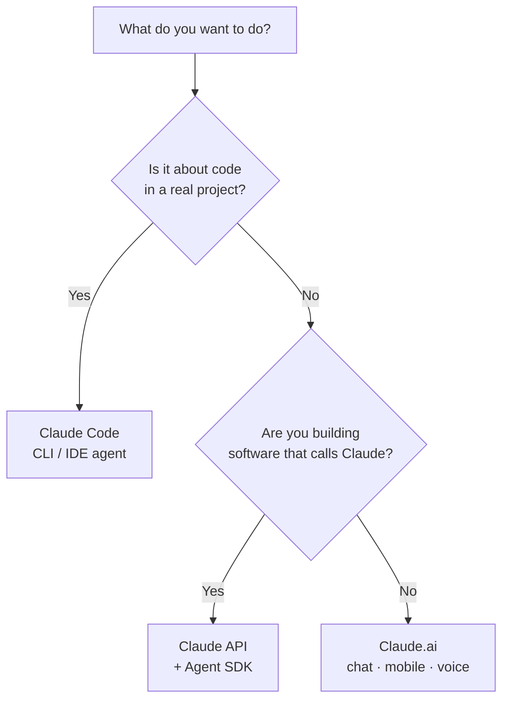

<LevelBadge level="beginner" />

"Claude" कुछ रूपों में आता है। यह इस आधार पर चुनें कि **आप क्या करने की कोशिश कर रहे हैं**, न कि इस आधार पर कि आपने किसके बारे में सुना है।

## 30-सेकंड का निर्णय

## Claude.ai — चैट ऐप्स

**किसके लिए:** लेखन, शोध, विश्लेषण, सीखना, योजना बनाना, रोज़मर्रा के सवाल। **कौन:** हर कोई, कोई सेटअप नहीं।

आपको यह **मोबाइल** ([iOS/Android](/docs/claude-app/mobile)) पर और **[आवाज़](/docs/claude-app/voice-mode)** द्वारा भी मिलता है — चलते-फिरते विचार दर्ज करने के लिए बढ़िया। इसे [प्रोजेक्ट्स](/docs/claude-app/projects), [कस्टम निर्देशों](/docs/claude-app/custom-instructions), और [Artifacts](/docs/claude-app/artifacts) से और सशक्त बनाएँ। → [Claude.ai के साथ शुरुआत करना](/docs/claude-app/getting-started) से आरंभ करें।

## Claude Code — एजेंटिक कोडिंग उपकरण

**किसके लिए:** एक *कोडबेस के भीतर* काम करना — पढ़ना, संपादित करना, कमांड चलाना, टेस्ट ठीक करना। **कौन:** डेवलपर (और तकनीकी रूप से जिज्ञासु लोग)। यह आपकी अनुमति से आपकी फ़ाइलों पर कार्य करता है। → [Claude Code क्या है](/docs/claude-code/what-is-claude-code)।

## API और Agent SDK — Claude को अपने सॉफ़्टवेयर में बनाएँ

**किसके लिए:** ऐप्स, स्वचालन, और एजेंट जो प्रोग्रामेटिक रूप से Claude को कॉल करते हैं। **कौन:** ऐसे डेवलपर जो कोई उत्पाद या पाइपलाइन शिप कर रहे हैं। → [आपका पहला API कॉल](/docs/api/first-call)।

## ये साथ मिलकर काम करते हैं

ये प्रतिद्वंद्वी उत्पाद नहीं हैं — अधिकांश लोग इनके बीच आगे बढ़ते हैं:

| आप चाहते हैं… | उपयोग करें |
|---|---|
| एक ईमेल का मसौदा बनाना, एक PDF सारांशित करना, विचार-मंथन करना | Claude.ai (या आवाज़/मोबाइल) |
| एक मॉड्यूल रिफैक्टर करना, टेस्ट जोड़ना, एक बग ठीक करना | Claude Code |
| *आपके* ऐप में एक AI सुविधा जोड़ना | API / Agent SDK |

:::tip तय नहीं कर पा रहे? चैट से शुरू करें
[Claude.ai](/docs/claude-app/getting-started) को किसी सेटअप की ज़रूरत नहीं है और यह आपको सिखाता है कि Claude कैसे "सोचता" है। ये कौशल बाक़ी हर जगह काम आते हैं।
:::

## आगे

- [आपके पहले 5 मिनट](/docs/start-here/your-first-5-minutes)
- [लर्निंग पाथ](/docs/start-here/learning-paths)
- [एक Claude मॉडल चुनना](/docs/api/choosing-a-model) (जब आप निर्माण करने लगें)
