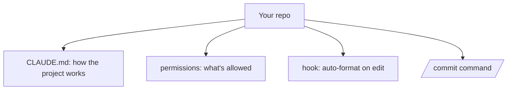

<LevelBadge level="intermediate" />

आइए एक ताज़ा चेकआउट को एक ऐसे Claude Code सेटअप में बदलें जो *आपके प्रोजेक्ट को जानता है और आपके नियमों का सम्मान करता है* — लगभग 20 मिनट में। हम मुख्य फ़ीचर्स को आपस में जोड़ेंगे, प्रत्येक के पीछे के तर्क के साथ।

## अंतिम स्थिति



## चरण 1 — CLAUDE.md बनाएँ और छाँटें

[CLAUDE.md](/docs/claude-code/claude-md) का मसौदा तैयार करने के लिए `/init` चलाएँ, फिर **इसे काट-छाँटकर** उतना ही रखें जो सच हो: स्टैक, इसे चलाने/टेस्ट/लिंट करने का तरीक़ा, वास्तविक कन्वेंशन्स, और गार्डरेल्स ("समाप्त होने से पहले टेस्ट चलाएँ", "`/generated` को न छुएँ")। *क्यों:* यह सबसे अधिक लीवरेज वाला कस्टमाइज़ेशन है — Claude इसे हर सेशन में पढ़ता है।

[CLAUDE.md टेम्पलेट्स](/docs/templates/claude-md) से एक स्टार्टर लें।

## चरण 2 — Permissions सेट करें

एक `.claude/settings.json` ([संदर्भ](/docs/claude-code/settings)) जोड़ें जो सुरक्षित, दोहराई जाने वाली कमांड्स को पहले से अनुमति देता है और ख़तरनाक को अस्वीकार करता है:

```json
{
  "permissions": {
    "allow": ["Read", "Bash(npm run test:*)", "Bash(npm run lint)", "Bash(git diff:*)"],
    "ask": ["Write", "Bash(npm install:*)"],
    "deny": ["Read(./.env)", "Bash(git push --force:*)"]
  }
}
```

*क्यों:* सुरक्षित क्रियाओं पर कम व्यवधान, जोखिमपूर्ण क्रियाओं पर कड़े रोक। देखें [Permissions](/docs/claude-code/permissions)।

## चरण 3 — एक फ़ॉर्मेटिंग hook जोड़ें

हर संपादन के बाद ऑटो-फ़ॉर्मेट करें ([hooks](/docs/claude-code/hooks)):

```json
{ "hooks": { "PostToolUse": [ { "matcher": "Edit|Write",
  "hooks": [ { "type": "command", "command": "npx prettier --write \"$CLAUDE_FILE_PATH\" 2>/dev/null || true" } ] } ] } }
```

*क्यों:* सुसंगत फ़ॉर्मेटिंग, गारंटीड — "कृपया याद रखें" नहीं।

## चरण 4 — एक `/commit` command जोड़ें

[स्लैश कमांड लाइब्रेरी](/docs/templates/slash-commands) से `/commit` रेसिपी को `.claude/commands/` में डालें। *क्यों:* एक दोहराने योग्य वर्कफ़्लो के लिए एक शब्द।

## चरण 5 — पहले वास्तविक कार्य के लिए Plan Mode का उपयोग करें

[Plan Mode](/docs/claude-code/plan-mode) में एक वास्तविक लक्ष्य दें, योजना की समीक्षा करें, फिर इसे निष्पादित होने दें। *क्यों:* सोचने को करने से अलग करके विश्वास बनाएँ।

## सत्यापित करें कि यह काम कर गया

- नया सेशन → Claude बिना पूछे आपके कन्वेंशन्स का संदर्भ देता है (CLAUDE.md काम करता है)।
- किसी फ़ाइल का संपादन → यह फ़ॉर्मेट हो जाती है (hook काम करता है)।
- एक जोखिमपूर्ण कमांड → यह पूछता है या अस्वीकार करता है (permissions काम करती हैं)।
- `/commit` → एक साफ़ Conventional Commit संदेश (command काम करती है)।

## आगे

- [अपनी पहली Skill लिखें](/docs/walkthroughs/first-skill)
- [Hooks और settings.json रेसिपी](/docs/templates/hooks-settings)
- [कोडिंग और सॉफ़्टवेयर डेवलपमेंट](/docs/playbooks/coding)
