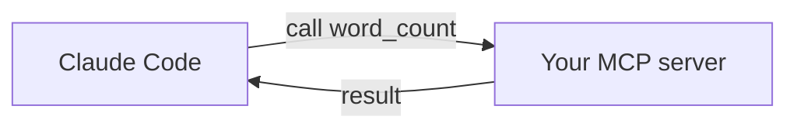

<LevelBadge level="advanced" />

<VerifyNote lastVerified="2026-06-20" source="https://modelcontextprotocol.io">
MCP SDK API और कॉन्फ़िग विकसित होते रहते हैं — आधिकारिक MCP डॉक्स और Claude Code MCP डॉक्स के विरुद्ध पुष्टि करें।
</VerifyNote>

आइए एक छोटा [MCP](/docs/claude-code/mcp) सर्वर बनाकर और उसे जोड़कर Claude को एक कस्टम टूल उजागर करें। हम इसे न्यूनतम रखेंगे ताकि *वायरिंग* स्पष्ट हो — फिर आप उसमें अपना वास्तविक लॉजिक डाल दें।

## हम क्या बना रहे हैं

एक stdio सर्वर जिसमें एक टूल, `word_count`, है जिसे Claude कॉल कर सकता है। वही पैटर्न "मेरे DB को क्वेरी करें", "एक टिकट खोलें", आदि तक स्केल करता है।



## चरण 1 — सर्वर

`server.py` (Python; एक TypeScript संस्करण [MCP स्कैफ़ोल्ड्स](/docs/templates/mcp-config) में है):

```python
from mcp.server.fastmcp import FastMCP

mcp = FastMCP("text-tools")

@mcp.tool()
def word_count(text: str) -> int:
    """Count the words in a piece of text."""
    return len(text.split())

if __name__ == "__main__":
    mcp.run()  # stdio transport
```

## चरण 2 — इसे घोषित करें

अपनी रिपॉज़िटरी रूट पर `.mcp.json` में जोड़ें:

```json
{ "mcpServers": {
  "text-tools": { "command": "python", "args": ["server.py"] }
} }
```

## चरण 3 — जोड़ें और टेस्ट करें

रिपॉज़िटरी में Claude Code शुरू करें। पूछें: *"text-tools सर्वर का उपयोग करके इसमें शब्दों की गिनती करें: 'the quick brown fox'।"* Claude को `word_count` कॉल करना चाहिए और `4` रिपोर्ट करना चाहिए। यदि यह टूल को नहीं देख पाता, तो जाँचें कि सर्वर अपने आप साफ़-सुथरे ढंग से शुरू होता है और `.mcp.json` का पथ सही है।

## चरण 4 — इसे वास्तविक बनाएँ

`word_count` को अपनी वास्तविक क्षमता से बदलें — एक DB क्वेरी, एक आंतरिक API कॉल, एक फ़ाइल ऑपरेशन। इनपुट वैलिडेशन जोड़ें और त्रुटियों को परिणामों के रूप में लौटाएँ।

## सुरक्षा चेकलिस्ट

:::warning एक सर्वर कोड + एक्सेस है
- **न्यूनतम विशेषाधिकार** — केवल वह डेटा/क्रियाएँ जिनकी इसे ज़रूरत है ([एजेंट्स को सुरक्षित करना](/docs/security/securing-agents))।
- मॉडल द्वारा भेजे गए **इनपुट को वैलिडेट करें**।
- यह जो अविश्वसनीय डेटा लौटाता है वह [प्रॉम्प्ट इंजेक्शन](/docs/security/prompt-injection) ले जा सकता है।
- किसी भी थर्ड-पार्टी सर्वर को जोड़ने से पहले उसकी **समीक्षा करें**।
:::

## आगे

- [Claude Code में MCP सर्वर](/docs/claude-code/mcp)
- [MCP कॉन्फ़िग और सर्वर स्कैफ़ोल्ड्स](/docs/templates/mcp-config)
- [टूल यूज़ / फ़ंक्शन कॉलिंग](/docs/api/tool-use)
