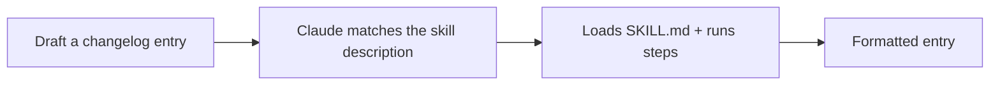

<LevelBadge level="intermediate" />

<VerifyNote lastVerified="2026-06-20" source="https://code.claude.com/docs/en/skills">
Skill लेआउट और डिस्कवरी बदल सकते हैं — आधिकारिक Skills डॉक्स के विरुद्ध पुष्टि करें।
</VerifyNote>

आइए शुरू से एक काम करने वाली [Skill](/docs/claude-code/skills) बनाएँ और साबित करें कि यह सक्रिय होती है। हम एक छोटी "changelog entry" स्किल बनाएँगे — सामान्य और पुन: उपयोग योग्य।

## चरण 1 — फ़ोल्डर बनाएँ

```bash
mkdir -p .claude/skills/changelog-entry
```

(सभी प्रोजेक्ट्स में एक व्यक्तिगत स्किल के लिए `~/.claude/skills/…` का उपयोग करें।)

## चरण 2 — SKILL.md लिखें

`.claude/skills/changelog-entry/SKILL.md`:

```markdown
---
name: changelog-entry
description: Use when the user wants to turn recent git commits into a Keep a Changelog entry.
---

# Changelog Entry

When asked for a changelog entry:
1. Run `git log --oneline -20` to see recent commits.
2. Group them into Added / Changed / Fixed / Removed (Keep a Changelog style).
3. Write concise, user-facing bullets (not raw commit messages).
4. Output only the formatted entry.
```

**`description` ही ट्रिगर है** — इसे "Use when…" के रूप में लिखें ताकि Claude इसे सही समय पर लोड करे।

## चरण 3 — (वैकल्पिक) एक हेल्पर स्क्रिप्ट जोड़ें

Skills स्क्रिप्ट्स के साथ आ सकती हैं। यदि आप नियतात्मक डेटा संग्रहण चाहते हैं तो `scripts/recent.sh` जोड़ें और इसे SKILL.md से संदर्भित करें:

```bash
#!/usr/bin/env bash
git log --oneline -20
```

## चरण 4 — साबित करें कि यह ट्रिगर होती है

एक सेशन शुरू करें और कहें: *"हाल के काम के लिए एक changelog entry का मसौदा तैयार करें।"* Claude को इरादे को पहचानना चाहिए, स्किल लोड करनी चाहिए, और इसके चरणों का पालन करना चाहिए। यदि यह सक्रिय नहीं होती, तो आपका `description` शायद इस बारे में पर्याप्त रूप से विशिष्ट नहीं है कि इसे *कब* उपयोग करना है — इसे और तेज़ करें।



## चरण 5 — इसे साझा करें

इसे (दूसरों के साथ) एक [plugin](/docs/claude-code/plugins-marketplaces) में बंडल करें ताकि आपकी टीम इसे एक ही चरण में इंस्टॉल कर सके — या इसे AILmanac के [skill packs](/docs/templates/skills) में योगदान दें।

## नुक़सान

- **अस्पष्ट description** → कभी ट्रिगर नहीं होती (या हमेशा ट्रिगर होती है)। विशिष्ट रहें।
- **एक स्किल में बहुत अधिक** → इसे एक स्पष्ट काम तक सीमित रखें।
- **साझा स्किल में सीक्रेट्स** → कभी नहीं; देखें [थर्ड-पार्टी कोड की समीक्षा](/docs/security/reviewing-third-party-code)।

## आगे

- [Skills: माँग पर विशेषज्ञता](/docs/claude-code/skills)
- [SKILL.md टेम्पलेट्स](/docs/templates/skills)
- [अपना पहला MCP सर्वर बनाएँ और जोड़ें](/docs/walkthroughs/first-mcp-server)
