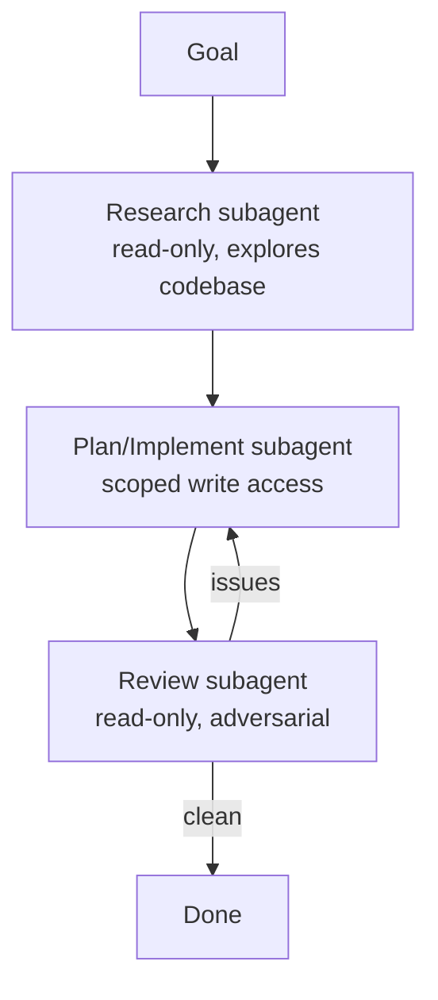

<LevelBadge level="advanced" />

बड़े कार्य तब बेहतर चलते हैं जब आप उन्हें सब कुछ एक ही कॉन्टेक्स्ट में ठूँसने के बजाय केंद्रित [सबएजेंट्स](/docs/claude-code/subagents) में बाँट देते हैं। आइए एक रिसर्च → इम्प्लीमेंट → रिव्यू पाइपलाइन डिज़ाइन करें।

## स्वरूप

प्रत्येक सबएजेंट के पास अपना **स्वयं का कॉन्टेक्स्ट** और एक **अनुकूलित टूलसेट** होता है — और केवल *परिणाम* ही मुख्य सेशन में वापस प्रवाहित होता है, जिससे वह साफ़ रहता है।

## चरण 1 — एजेंट्स को परिभाषित करें

`/agents` इंटरफ़ेस के माध्यम से, तीन परिभाषित करें, प्रत्येक के पास एक सटीक `description` (ताकि मुख्य एजेंट सही ढंग से डेलिगेट करे) और स्कोप किए गए टूल हों:

- **researcher** — केवल पढ़ना/खोजना। प्रासंगिक कोड को मैप करता है और निष्कर्ष लौटाता है।
- **implementer** — फ़ाइलें संपादित कर सकता है और टेस्ट चला सकता है; इनपुट के रूप में रिसर्चर के निष्कर्ष प्राप्त करता है।
- **reviewer** — केवल पढ़ना, प्रतिकूल: बग, छूटे हुए मामलों, और कन्वेंशन उल्लंघनों की तलाश करता है।

## चरण 2 — हैंडऑफ़ के साथ ऑर्केस्ट्रेट करें

मुख्य सेशन प्रत्येक चरण के आउटपुट को अगले में पास करता है: रिसर्च → इम्प्लीमेंट (रिसर्च का उपयोग करते हुए) → रिव्यू (इम्प्लीमेंटेशन का)। एक **रिव्यू गेट** जोड़ें: यदि रिव्यूअर समस्याएँ पाता है, तो समाप्त करने से पहले इम्प्लीमेंटर पर वापस लूप करें।

## चरण 3 — जानें कि यह कब नहीं करना है

:::warning समानांतर/मल्टी-एजेंट मुफ़्त नहीं है
- **अनुक्रमिक निर्भरताएँ** (इम्प्लीमेंट को रिसर्च की ज़रूरत है) अनुक्रमिक ही रहती हैं — जहाँ क्रम मायने रखता है वहाँ फैन-आउट न करें।
- **साझा फ़ाइल राइट्स** टकरा सकती हैं — [git worktrees](/docs/claude-code/worktrees) से अलग करें या क्रमबद्ध करें।
- छोटे कार्यों के लिए, समन्वय का ओवरहेड लाभ से अधिक होता है। इसका उपयोग **बड़े, विघटनीय** काम के लिए करें।
:::

## चरण 4 — सत्यापित करें

एक अच्छा मल्टी-एजेंट रन दिखाता है: एक केंद्रित मुख्य कॉन्टेक्स्ट (भारी पठन रिसर्चर में हुआ), एक इम्प्लीमेंटेशन जो रिसर्च को दर्शाता है, और एक रिव्यू जिसने वास्तव में कुछ पकड़ा (या विश्वसनीय रूप से अनुमोदन किया)। यदि रिव्यूअर सिर्फ़ रबर स्टाम्प है, तो इसके प्रॉम्प्ट को **प्रतिकूल** बनाएँ ("जो ग़लत है उसे खोजने का प्रयास करें")।

## और आगे

वही पैटर्न, प्रोग्रामेटिक रूप से, [API पर एजेंट बनाना](/docs/api/building-agents) है और प्रोडक्ट सरफेस जैसे [Cowork और एजेंट टीम्स](/docs/api/cowork-and-agent-teams)।

## आगे

- [सबएजेंट्स और समानांतर एजेंट्स](/docs/claude-code/subagents)
- [Git Worktrees](/docs/claude-code/worktrees)
- [API पर एजेंट बनाना](/docs/api/building-agents)
