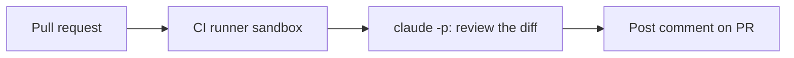

<LevelBadge level="advanced" />

<VerifyNote lastVerified="2026-06-20" source="https://docs.anthropic.com/en/docs/claude-code/sdk">
Headless फ़्लैग और CI इंटीग्रेशन विवरण विकसित होते रहते हैं — आधिकारिक Claude Code / Agent SDK डॉक्स के विरुद्ध पुष्टि करें।
</VerifyNote>

एक क्लासिक उच्च-मूल्य ऑटोमेशन: Claude से **हर पुल रिक्वेस्ट की समीक्षा** करवाएँ और उसके निष्कर्षों को एक टिप्पणी के रूप में पोस्ट करें — CI में [headless](/docs/claude-code/headless-and-agent-sdk) चलाते हुए। यहाँ इसका स्वरूप है, उन गार्डरेल्स के साथ जो इसे सुरक्षित रखते हैं।

## यह क्या करता है

प्रत्येक PR पर: diff को चेक आउट करें, Claude से इसे बग/एज-केस/कन्वेंशन समस्याओं के लिए समीक्षा करने को कहें, और एक टिप्पणी पोस्ट करें। निर्णय अभी भी मनुष्य ही लेते हैं; Claude बस एक तेज़ पहला पास देता है।



## वर्कफ़्लो (रेखाचित्र)

```yaml
name: Claude PR review
on: pull_request
permissions:
  contents: read
  pull-requests: write   # to comment — NOT write to code
jobs:
  review:
    runs-on: ubuntu-latest
    steps:
      - uses: actions/checkout@v4
        with: { fetch-depth: 0 }
      - name: Review the diff
        env:
          ANTHROPIC_API_KEY: ${{ secrets.ANTHROPIC_API_KEY }}
        run: |
          git diff origin/${{ github.base_ref }}...HEAD > /tmp/diff.patch
          claude -p "Review this diff for correctness bugs, missing edge cases, and
          security issues. Report ONLY high-confidence findings as a Markdown
          checklist with file:line. Diff:" < /tmp/diff.patch > /tmp/review.md
      # then post /tmp/review.md as a PR comment (e.g. with the gh CLI or an action)
```

(सटीक headless इनवोकेशन भिन्न हो सकता है — डॉक्स देखें। सिद्धांत है: diff फ़ीड करें, Markdown कैप्चर करें, उसे पोस्ट करें।)

## गार्डरेल्स ([स्वायत्त रन को सख़्त बनाना](/docs/security/hardening-autonomous-runs) पढ़ें)

:::warning CI में न्यूनतम विशेषाधिकार
- **केवल टिप्पणी।** `pull-requests: write` दें, `contents: write` **नहीं** — बॉट को कोड पुश नहीं करना चाहिए।
- **टोकन को स्कोप करें**; अविश्वसनीय PR कॉन्टेंट पढ़ने वाले जॉब को कभी भी डिप्लॉय/सीक्रेट एक्सेस उजागर न करें।
- **PR कॉन्टेंट को अविश्वसनीय मानें** — यह [प्रॉम्प्ट इंजेक्शन](/docs/security/prompt-injection) ले जा सकता है; जॉब को परिणामी क्रियाएँ करने न दें।
- **लागत सीमित करें** — बड़े diff में [टोकन](/docs/api/tokens-and-pricing) लगते हैं; केवल बदली गई फ़ाइलों की समीक्षा करने पर विचार करें।
:::

## इसे उपयोगी बनाएँ, शोरगुल वाला नहीं

- **केवल उच्च-विश्वास निष्कर्ष** माँगें — छोटी-छोटी कमियों की दीवार को अनदेखा कर दिया जाता है।
- इसे एक **पहला पास** ही रखें, जिसमें मर्ज का निर्णय मनुष्य लें।

## आगे

- [Headless मोड और Agent SDK](/docs/claude-code/headless-and-agent-sdk)
- [स्वायत्त रन को सख़्त बनाना](/docs/security/hardening-autonomous-runs)
- [कोडिंग और सॉफ़्टवेयर डेवलपमेंट](/docs/playbooks/coding)
