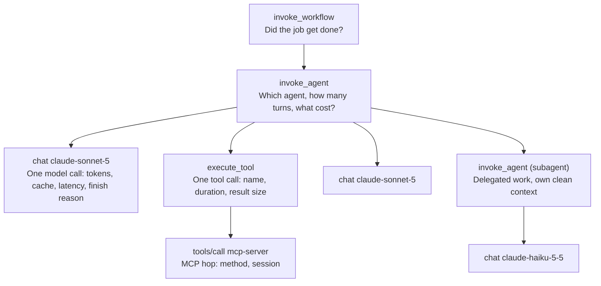

<LevelBadge level="advanced" />

La prima volta che un agente fa qualcosa di inspiegabile in produzione, proverai a riprodurlo. Rieseguirai lo stesso prompt con gli stessi strumenti e otterrai una risposta diversa e perfettamente ragionevole — e il bug sarà sparito, non risolto, in attesa.

Quel momento è tutto l'argomento di questa pagina. Un servizio tradizionale è abbastanza deterministico da rendere i log una comodità: dati gli input, puoi ricavare di nuovo il comportamento. Un'esecuzione di agente è una **traccia distribuita non deterministica** — campionata token dopo token, con ramificazioni su risultati di strumenti che nel frattempo sono cambiati, distribuita tra il tuo processo, il fornitore del modello e tutti i server MCP coinvolti. Non puoi ricavarla di nuovo. O l'hai registrata, o è perduta.

Quindi l'osservabilità degli agenti non è "aggiungiamo una dashboard più tardi". È ciò che decide se i tuoi incidenti sono analizzabili o no. La buona notizia è che nel 2026 esiste finalmente un vocabolario condiviso. La cattiva — e il motivo per cui il primo tentativo di molti team va rifatto — è che il vocabolario **non è ancora stabile**, e quasi nessuno te lo dice prima che tu colleghi 40 pannelli a nomi di attributi che possono esplicitamente cambiare.

<Callout type="objectives" items={[
  "Conoscere i quattro tipi di span che un'esecuzione di agente dovrebbe produrre e cosa va su ciascuno",
  "Capire perché ogni attributo gen_ai.* porta ancora il badge 'Development' di OpenTelemetry — e come costruire dashboard che lo sopravvivano",
  "Attivare l'esportazione OpenTelemetry di Claude Code con i nomi esatti delle variabili e leggere le metriche e gli eventi che emette",
  "Catturare il request-id, l'unico identificatore che il supporto Anthropic può cercare",
  "Evitare le tre trappole di privacy: l'identità non è oscurata, il controllo dei contenuti è per segnale e il tuo endpoint del collector è una via di esfiltrazione",
  "Scegliere un budget di cardinalità prima che arrivi la fattura delle metriche"
]} />

## Perché rieseguire non è fare debug

Quattro proprietà di un'esecuzione di agente rompono ciascuna un normale riflesso di debug:

| Proprietà | Il riflesso che rompe |
| --- | --- |
| **Il campionamento è stocastico** | "Eseguilo di nuovo con lo stesso input." Lo stesso input non è la stessa esecuzione. |
| **I risultati degli strumenti sono dal vivo** | Anche a temperatura 0, uno strumento che legge un database, un orologio o il web restituisce qualcosa di nuovo. La traiettoria diverge al passo 2. |
| **La decisione sta nel contesto, non nel codice** | Il tuo stack trace mostra `callModel()`. Non mostra i 180 KB di cronologia accumulata che hanno fatto scegliere al modello lo strumento sbagliato. |
| **Il fallimento è spesso silenzioso** | Un agente rotto raramente solleva un'eccezione. Restituisce una risposta sbagliata e sicura di sé con HTTP 200. Non c'è nessuna eccezione da intercettare. |

L'ultima merita enfasi perché inverte le normali priorità di strumentazione. In un servizio tipico si strumentano prima gli errori. In un agente, **i fallimenti interessanti sono i successi** — turni che si sono conclusi, sono costati denaro e hanno fatto la cosa sbagliata. Se registri solo gli span terminati con `error.type`, hai registrato la metà facile dei tuoi problemi.

## I quattro span di un'esecuzione di agente

Le convenzioni semantiche GenAI di OpenTelemetry definiscono le forme. Il modello mentale utile è quello di quattro livelli annidati, ciascuno con una domanda diversa a cui rispondere.

Le regole di naming sono specificate, e seguirle è ciò che rende le tue tracce leggibili in uno strumento che non hai scritto tu:

- **Span di inferenza** — `gen_ai.operation.name` è `chat` (oppure `embeddings`, `text_completion`, `generate_content`); il nome dello span è `{gen_ai.operation.name} {gen_ai.request.model}`, quindi `chat claude-sonnet-5`. Span kind `CLIENT`.
- **Span dell'agente** — `create_agent {gen_ai.agent.name}` e `invoke_agent {gen_ai.agent.name}`, con ripiego su `invoke_agent` semplice quando il nome non è disponibile. Esistono sia una variante client sia una interna, ed è così che un agente ospitato e il tuo loop restano distinguibili.
- **Span del workflow** — `invoke_workflow {gen_ai.workflow.name}`, per l'orchestrazione multi-agente sopra gli agenti.
- **Span dello strumento** — `execute_tool`, per l'esecuzione effettiva dello strumento.
- **Span MCP** — una convenzione separata: nome dello span `{mcp.method.name} {target}` (o solo `{mcp.method.name}` quando non c'è un target a bassa cardinalità), con `mcp.method.name` obbligatorio e `mcp.session.id` raccomandato. Impostare anche `gen_ai.operation.name` su uno span di chiamata a strumento MCP è esplicitamente raccomandato, così i consumatori possono trattare le chiamate a strumenti MCP come qualsiasi altra chiamata a strumento.

Gli attributi per chiamata che valgono i byte: `gen_ai.provider.name`, `gen_ai.request.model`, `gen_ai.response.model` (questi due differiscono quando il fornitore fissa uno snapshot), `gen_ai.usage.input_tokens`, `gen_ai.usage.output_tokens`, `gen_ai.usage.cache_read.input_tokens`, `gen_ai.usage.cache_write.input_tokens`, `gen_ai.usage.reasoning.output_tokens`, `gen_ai.response.finish_reasons` e, per lo streaming, `gen_ai.response.time_to_first_chunk`.

Per Anthropic in particolare esiste una convenzione del fornitore che prevale su quella generica: `gen_ai.provider.name` DEVE essere `"anthropic"` e DOVREBBE essere impostato **al momento della creazione dello span** anziché aggiunto alla fine. Questo dettaglio conta più di quanto sembri — il tail-based sampling e le regole di routing per fornitore possono agire solo su attributi che esistono quando lo span inizia.

<VerifyNote lastVerified="2026-10-09" source="https://github.com/open-telemetry/semantic-conventions-genai">
I nomi di span, di operazioni e di attributi qui sopra provengono dal repository delle convenzioni semantiche GenAI di OpenTelemetry (`docs/gen-ai/gen-ai-spans.md`, `gen-ai-agent-spans.md`, `anthropic.md`, `mcp.md`). Ogni documento al suo interno è contrassegnato **Status: Development**. Ricontrolla prima di fare affidamento su un nome specifico.
</VerifyNote>

## La parte di cui nessuno ti avverte: le convenzioni non sono stabili

Ecco il fatto che dovrebbe plasmare il tuo design, e che non troverai nella pagina commerciale di un vendor di osservabilità.

**Ogni singolo attributo, span, metrica ed evento `gen_ai.*` è contrassegnato "Development"** — il termine di OpenTelemetry per ciò che una volta si chiamava sperimentale. Nessuno è Stable. E nel 2026 le convenzioni si sono fisicamente spostate: il materiale GenAI ha lasciato il repository principale `open-telemetry/semantic-conventions` per un repository dedicato `open-telemetry/semantic-conventions-genai`, che **non ha alcuna release taggata** — zero tag, zero release, con commit che arrivano ogni giorno.

Leggi le tabelle degli attributi in quel repository e l'asimmetria è quasi comica. Su uno span di inferenza GenAI, gli attributi con il badge verde **Stable** sono `error.type`, `server.address` e `server.port` — i tre che non hanno nulla a che fare con GenAI. Tutto ciò che rende lo span *riguardante un LLM* è Development.

Quindi: non leggerlo come "non usare le convenzioni". Usale — un vocabolario condiviso che potrebbe cambiare vale comunque più di uno artigianale che di sicuro non viaggerà. Leggilo come **non agganciare nulla di costoso direttamente a quei nomi.** Tre abitudini lo rendono economico:

<Steps items={[
  {
    "title": "Emetti tramite un livello di mappatura, non con stringhe letterali sparse",
    "body": "Un modulo che possiede ogni chiave di attributo che la tua app scrive. Quando `gen_ai.usage.reasoning.output_tokens` viene rinominato, cambi una costante, non 60 punti di chiamata. È un file di venti righe ed è la cosa con il miglior ritorno di tutta questa pagina."
  },
  {
    "title": "Registra la versione della convenzione come attributo di risorsa",
    "body": "Marca ogni span con la revisione di semconv su cui hai emesso — va bene lo SHA di un commit, dato che non ci sono tag da citare. Fra sei mesi, l'unico modo per interpretare correttamente una vecchia traccia è sapere quale grafia usava. Senza questo, una ridenominazione divide in silenzio una metrica in due e fai la media su entrambe."
  },
  {
    "title": "Imposta gli alert su valori derivati, non su nomi di attributi grezzi",
    "body": "Definisci `cost_per_completed_task`, `cache_hit_ratio`, `tool_error_rate` una volta sola, nel livello di query o in una recording rule, e punta tutte le dashboard e gli alert su quelli. Una ridenominazione rompe allora una definizione in modo evidente invece di quaranta pannelli in modo silenzioso."
  },
  {
    "title": "Tieni l'identificatore del fornitore accanto a quelli standard",
    "body": "Le convenzioni potrebbero cambiare; `request-id` no. Vedi la sezione successiva — è la tua via di fuga quando una traccia va riconciliata con il fornitore."
  }
]} />

## L'identificatore che risolve davvero gli incidenti: `request-id`

Ogni risposta dell'API di Claude porta un header di risposta `request-id`, con un valore come `req_018EeWyXxfu5pfWkrYcMdjWG`. Lo stesso valore compare come campo `request_id` nei corpi delle risposte di errore. È l'identificatore che il supporto Anthropic ti chiede, e l'unico che permette a qualcuno dall'altra parte di guardare la tua chiamata specifica.

Mettilo sullo span. Costa 30 byte ed è la differenza tra "l'agente ha fallito alle 03:12 UTC, ecco 900 richieste candidate" e una sola ricerca.

<PromptCard title="Cattura l'ID di richiesta Anthropic sullo span corrente (Python)">
{`import anthropic
from opentelemetry import trace

client = anthropic.Anthropic()
span = trace.get_current_span()

message = client.messages.create(
    model="claude-sonnet-5",
    max_tokens=1024,
    messages=[{"role": "user", "content": "Hello, Claude"}],
)

# The Python and TypeScript SDKs expose it directly on the response object.
span.set_attribute("anthropic.request_id", message._request_id)
span.set_attribute("gen_ai.usage.input_tokens", message.usage.input_tokens)
span.set_attribute("gen_ai.usage.output_tokens", message.usage.output_tokens)`}
</PromptCard>

Tre dettagli da conoscere prima di averne bisogno:

- **Python e TypeScript** lo espongono come `_request_id` sugli oggetti di risposta di primo livello. **C#, Go, Java e PHP** lo espongono tramite i loro accessor di risposta grezza (`with_raw_response` / `.withResponse()` / `.withRawResponse()` / `WithRawResponse` / `option.WithResponseInto` / `->raw`). **Ruby** richiede un middleware per richiesta, perché l'SDK non lo mostra sull'oggetto.
- **Gli errori lo portano comunque.** Quando una chiamata fallisce, `request_id` è nel corpo JSON dell'errore — quindi la correlazione sopravvive proprio al caso in cui ti serve di più.
- **Su Claude Platform on AWS ci sono due ID, e quello primario non è di Anthropic.** `x-amzn-requestid` è l'ID primario e quello indicizzato in CloudTrail; `request-id` è secondario. Usa quello AWS per le ricerche in CloudTrail e quello Anthropic per i ticket al supporto Anthropic. Registra entrambi, con etichetta, o passerai un pomeriggio a cercare nel sistema sbagliato.

<VerifyNote lastVerified="2026-10-09" source="https://platform.claude.com/docs/en/api/errors">
L'header `request-id`, il campo `request_id` nel corpo dell'errore, gli accessor per ogni SDK e il comportamento a doppio ID su Claude Platform on AWS sono tutti documentati nella pagina degli errori dell'API di Claude. I nomi dell'header e del campo sono superficie API stabile; l'ergonomia per ogni SDK cambia con le versioni dell'SDK.
</VerifyNote>

## Claude Code: l'unico agente che esporta già tutto

Se il tuo agente *è* Claude Code — in CI, in una flotta o in un intero team — non devi strumentare nulla. Include un exporter OpenTelemetry. La maggior parte dei team che lo usa su larga scala non l'ha mai attivato, ed è un peccato, perché risponde direttamente a "quanto ci costa e funziona?".

<PromptCard title="Abilita la telemetria di Claude Code verso un collector OTLP locale">
{`export CLAUDE_CODE_ENABLE_TELEMETRY=1
export OTEL_METRICS_EXPORTER=otlp
export OTEL_LOGS_EXPORTER=otlp
export OTEL_EXPORTER_OTLP_PROTOCOL=grpc
export OTEL_EXPORTER_OTLP_ENDPOINT=http://localhost:4317
export OTEL_EXPORTER_OTLP_HEADERS="Authorization=Bearer your-token"
claude`}
</PromptCard>

`CLAUDE_CODE_ENABLE_TELEMETRY=1` è l'interruttore generale — senza di esso non viene esportato nulla, qualunque cosa tu imposti d'altro. Poi scegli gli exporter per segnale: `OTEL_METRICS_EXPORTER` accetta `otlp`, `prometheus`, `console` o `none`; `OTEL_LOGS_EXPORTER` accetta `otlp`, `console`, `none`. **Le tracce sono separate e in beta**: imposta anche `CLAUDE_CODE_ENHANCED_TELEMETRY_BETA=1`, poi `OTEL_TRACES_EXPORTER`. Gli intervalli di esportazione predefiniti sono 60.000 ms per le metriche e 5.000 ms per i log.

Le metriche sono la parte su cui vale la pena costruire una dashboard, perché quelle di costo sono attribuite con una finezza sufficiente a rispondere a domande reali:

| Metrica | A cosa risponde |
| --- | --- |
| `claude_code.cost.usage` (USD) | Spesa, attribuibile per modello e per origine della query — agente principale vs subagente vs ausiliario |
| `claude_code.token.usage` (token) | La stessa forma in token, che è ciò che ottimizzi davvero |
| `claude_code.session.count` | Adozione. Sessioni stabili con costo in crescita è una storia diversa da entrambi in crescita. |
| `claude_code.active_time.total` (s) | Tempo di lavoro effettivo, in contrapposizione a un terminale lasciato aperto |
| `claude_code.lines_of_code.count` | Volume di modifiche — un denominatore, mai un obiettivo |
| `claude_code.code_edit_tool.decision` | **Il segnale di qualità.** Accettazione/rifiuto sugli strumenti di modifica. Rifiuti in aumento significano che l'agente propone lavoro peggiore. |
| `claude_code.commit.count`, `claude_code.pull_request.count` | Output che ha davvero lasciato la macchina |

Gli eventi (esportati come log) sono il registro per azione: `claude_code.user_prompt`, `claude_code.assistant_response`, `claude_code.tool_result`, `claude_code.tool_decision`, `claude_code.api_request`, `claude_code.api_error`, `claude_code.api_refusal`, `claude_code.api_retries_exhausted`, `claude_code.permission_mode_changed`, `claude_code.mcp_server_connection`, `claude_code.skill_activated`, `claude_code.plugin_installed`, `claude_code.plugin_loaded`, `claude_code.at_mention`, `claude_code.auth`, `claude_code.hook_registered`, `claude_code.managed_settings_resolved`, `claude_code.internal_error`, più `claude_code.api_request_body` / `claude_code.api_response_body` per i payload grezzi.

Due di questi meritano una query salvata dal primo giorno. `claude_code.api_retries_exhausted` è la forma di un'interruzione che raggiunge i tuoi sviluppatori — scatta dopo che il backoff dell'SDK si è arreso. E `claude_code.permission_mode_changed` è una traccia di audit: è il modo per scoprire che la flotta ha girato in una modalità più permissiva di quella prevista dalla tua policy, senza leggere la trascrizione di nessuno.

<VerifyNote lastVerified="2026-10-09" source="https://code.claude.com/docs/en/monitoring-usage">
I nomi delle variabili, le opzioni degli exporter, i nomi di metriche ed eventi e il vincolo beta sulle tracce provengono dalla documentazione di monitoraggio di Claude Code. Claude Code viene rilasciato di frequente e questa superficie cresce — conferma i nomi nella pagina ufficiale prima di costruirci sopra degli alert.
</VerifyNote>

### Attribuzione multi-team, a basso costo

Una sola variabile fa il lavoro di un'intera strategia di tagging. `OTEL_RESOURCE_ATTRIBUTES` viene esportata come etichette delle metriche (controllata da `OTEL_METRICS_INCLUDE_RESOURCE_ATTRIBUTES`, attiva per impostazione predefinita), quindi l'attribuzione per centro di costo è una riga in qualunque cosa fornisca i tuoi ambienti di sviluppo:

<PromptCard title="Attribuisci la spesa dell'agente a un team e a un centro di costo">
{`export OTEL_RESOURCE_ATTRIBUTES="department=engineering,team.id=platform,cost_center=eng-123"`}
</PromptCard>

## Le tre trappole di privacy

È qui che i rollout di telemetria ben intenzionati vanno storti, e tutte e tre sono evitabili se le conosci prima che il collector sia attivo.

**1. Il contenuto è oscurato per impostazione predefinita. L'identità no.** Le impostazioni predefinite di Claude Code sono davvero prudenti sul *contenuto*: prompt, risposte dell'assistente, parametri degli strumenti e output degli strumenti sono tutti oscurati a meno che tu non scelga di attivarli per segnale (`OTEL_LOG_USER_PROMPTS`, `OTEL_LOG_ASSISTANT_RESPONSES`, `OTEL_LOG_TOOL_DETAILS`, `OTEL_LOG_TOOL_CONTENT`, `OTEL_LOG_RAW_API_BODIES`), e i nomi dei plugin di terze parti compaiono come segnaposto `"third-party"` finché non imposti `OTEL_LOG_TOOL_DETAILS=1`. Ma `user.email` — l'indirizzo reale dell'accesso, o delle credenziali di una sessione cloud — è incluso quando disponibile, e `organization.id` è sempre presente quando si è autenticati. Quindi la postura predefinita è *"non sappiamo cosa hanno digitato, sappiamo esattamente chi sono"*.

È la scelta giusta per la maggior parte delle aziende e quella sbagliata per alcune. Vale la pena distinguerla dalla sua vicina: `user.id` è un identificatore anonimo casuale generato alla prima esecuzione e conservato in `~/.claude.json` — è documentato come privo di informazioni personali e non derivato dal tuo account Claude. `user.account_uuid` e `user.account_id` sono quelli legati all'account, e si disattivano con `OTEL_METRICS_INCLUDE_ACCOUNT_UUID`. Decidi con cognizione quale di questi tre il tuo collector deve conservare, e dì ai tuoi sviluppatori quale è.

**2. Attivare la cattura dei contenuti sposta i tuoi segreti in un secondo sistema.** `OTEL_LOG_TOOL_CONTENT=1` è una cosa ragionevole da volere — l'output degli strumenti è dove si vede la maggior parte dei bug degli agenti. Ma significa anche che ogni file letto dal tuo agente, ogni output di comando e qualunque cosa un `.env` contenesse ora sta nel tuo backend di osservabilità, sotto la sua policy di retention e i suoi controlli d'accesso anziché quelli del tuo repo. Considera l'attivazione come concedere al tuo vendor di osservabilità lo stesso nulla osta del tuo controllo di versione, perché è esattamente questo. Se ti serve solo durante un incidente, attivala per l'incidente.

**3. L'endpoint del tuo collector è un canale di esfiltrazione.** È la trappola con i denti. La telemetria si configura con variabili d'ambiente, e negli ambienti cloud queste sono leggibili da tutti gli utenti — quindi un `OTEL_EXPORTER_OTLP_ENDPOINT` impostato da uno sviluppatore può puntare la telemetria di un'intera sessione verso un host che non hai mai sentito nominare. L'indicazione stessa della documentazione è la soluzione: metti credenziali ed endpoint nelle impostazioni gestite dal server anziché nelle variabili d'ambiente ambientali, dove le credenziali gestite possono rimuovere le variabili impostate dagli sviluppatori proprio per impedire l'esportazione verso collector non autorizzati. Se hai attivato una qualsiasi cattura dei contenuti, questo smette di essere igiene e diventa il controllo che conta.

Per le credenziali ruotanti esiste un hook per header dinamici anziché un token statico: punta `otelHeadersHelper` a uno script che stampa JSON, e viene eseguito all'avvio e circa ogni 29 minuti dopo (regolabile con `CLAUDE_CODE_OTEL_HEADERS_HELPER_DEBOUNCE_MS`). Funziona su `http/protobuf` e `http/json`, non su `grpc` — un dettaglio che altrimenti ti costerà un'ora, dato che la guida rapida usa grpc.

## Cardinalità: scegli un budget prima della fattura

La telemetria degli agenti è insolitamente brava a generare etichette ad alta cardinalità, perché gli identificatori naturali sono per esecuzione. Un ID di sessione è unico per sessione per definizione; attaccalo a una metrica e hai fabbricato una serie temporale per sessione.

Claude Code espone esplicitamente il compromesso anziché nasconderlo, e i valori predefiniti ti dicono come i progettisti lo pesano:

| Variabile | Predefinito | Aggiunge |
| --- | --- | --- |
| `OTEL_METRICS_INCLUDE_SESSION_ID` | `true` | `session.id`, `ccr.session.id` — **la cardinalità più alta dell'insieme** |
| `OTEL_METRICS_INCLUDE_ACCOUNT_UUID` | `true` | `user.account_uuid`, `user.account_id` |
| `OTEL_METRICS_INCLUDE_RESOURCE_ATTRIBUTES` | `true` | qualunque cosa tu metta in `OTEL_RESOURCE_ATTRIBUTES` |
| `OTEL_METRICS_INCLUDE_VERSION` | `false` | `app.version` |
| `OTEL_METRICS_INCLUDE_ENTRYPOINT` | `false` | `app.entrypoint` |
| `OTEL_METRICS_INCLUDE_REPOSITORY` | `false` | attributi `vcs.*` del repository |

La regola portabile, oltre Claude Code: **gli identificatori per esecuzione vanno su span ed eventi, non sulle etichette delle metriche.** Gli span sono già uno per esecuzione, quindi un ID di sessione lì è gratis e rende la traccia collegabile. Su un contatore o un istogramma moltiplica il numero di serie per il tuo traffico. Se un numero ha senso solo per una singola esecuzione, non è una metrica.

L'ID di sessione è attivo per impostazione predefinita perché collegare metriche e tracce è davvero utile. Se il tuo backend fattura per serie, è il primo interruttore da spegnere — e la prima cosa da controllare quando la fattura ti sorprende.

## Un piano di strumentazione di partenza

Non un modello di maturità. L'ordine seguente è scelto perché ogni passo sia utile da solo, e perché tu ti possa fermare al punto che corrisponde a quanto i tuoi agenti possono costarti.

<Steps items={[
  {
    "title": "Registra per ogni turno i conteggi di token, la ripartizione della cache, il modello e il request-id",
    "body": "Prima di qualsiasi dashboard. Input, output, lettura cache, scrittura cache, token di ragionamento, modello richiesto, modello rispondente e l'ID di richiesta del fornitore. Questo singolo record risponde alla maggior parte delle domande sui costi e rende ogni incidente riconciliabile con il fornitore. Se non fai altro di questa pagina, fai questo."
  },
  {
    "title": "Crea span per il loop, non solo per la chiamata",
    "body": "Uno span per ogni invocazione dell'agente che racchiude uno span per chiamata al modello e uno per chiamata a strumento. Il costoso bug dell'agente quasi mai sta dentro una singola chiamata — è un loop che ha impiegato undici turni per un lavoro da due, e non lo vedi senza lo span padre."
  },
  {
    "title": "Aggiungi un segnale di qualità per ogni superficie",
    "body": "Il costo senza un denominatore di qualità ottimizza verso il fare meno. Su Claude Code, claude_code.code_edit_tool.decision ti viene dato. Sul tuo agente, scegli ciò che i tuoi utenti già accettano o rifiutano implicitamente e registralo come attributo dello span dal primo giorno."
  },
  {
    "title": "Imposta alert su rapporti derivati, e metti per primo l'alert di budget",
    "body": "cost_per_completed_task, cache_hit_ratio, tool_error_rate, turns_per_task. Un agente passato in silenzio da 3 a 30 turni è invisibile sul costo assoluto in una settimana tranquilla ed evidente su un rapporto. Abbinalo a un vero tetto di spesa — la telemetria ti dice che è successo, non lo ferma mai."
  },
  {
    "title": "Decidi la cattura dei contenuti con cognizione, e metti la decisione per iscritto",
    "body": "Disattivata di default, attiva per gli incidenti, documentata in entrambi i casi — incluso quali attributi di identità conserva il tuo collector. Il team merita di saperlo; fra un anno lo meriterai anche tu."
  }
]} />

## Errori comuni

- **Strumentare la chiamata al modello e non il loop.** I dati a livello di chiamata sembrano a posto fino a quando non ti accorgi che stai pagando 30 turni. Senza uno span padre non c'è nessun `turns_per_task` con cui accorgertene.
- **Conservare solo gli span falliti.** Gli agenti falliscono con HTTP 200. Campiona anche i successi, o il tuo archivio di tracce contiene solo i bug che erano già facili.
- **Cablare i nomi `gen_ai.*` nelle dashboard.** Sono tutti Development, in un repo senza release taggate, con commit quotidiani. Un modulo di mappatura, un attributo di risorsa con la versione di semconv.
- **Mettere ID di sessione o di esecuzione sulle etichette delle metriche.** Una serie per esecuzione. Mettili sugli span, dove sono gratis e più utili.
- **Misurare il costo senza un segnale di qualità.** Ogni leva che riduce il costo riduce anche il lavoro svolto. Un rapporto è un obiettivo; un numero grezzo di costo è una trappola.
- **Scartare il `request-id`.** Sono 30 byte ed è l'unico identificatore che attraversa il confine verso i sistemi del fornitore.
- **Registrare il contenuto degli strumenti "per ora".** La retention è immediata e reale, e "per ora" non ha una data di fine. Decidi, attiva per l'incidente, disattiva dopo.
- **Dare per scontato che il trasporto della guida rapida supporti tutto.** Gli header di autenticazione dinamici funzionano su `http/protobuf` e `http/json` — non sul `grpc` che ti dà la guida rapida.
- **Trattare la telemetria dei costi come un controllo.** `claude_code.cost.usage` si incrementa *dopo* il completamento di ogni richiesta. È un'osservazione eccellente e non ha mai bloccato nulla.

## Verifica di realtà tra fornitori

Le convenzioni sono neutre rispetto al fornitore per progetto — `semantic-conventions-genai` contiene documenti dedicati per Anthropic, OpenAI, AWS Bedrock e Azure AI Inference accanto a quelli generici, ed è ciò che rende gestibile una flotta mista. Due cose restano da normalizzare a tuo carico:

**Il conteggio dei token non significa la stessa cosa ovunque.** Input in cache, token di ragionamento e token multimodali sono prezzati e a volte contati in modo diverso da fornitore a fornitore, quindi `gen_ai.usage.input_tokens` sommato tra fornitori è un numero privo di significato. Converti in denaro al margine, usando la tariffa di ciascun fornitore, e aggrega il denaro. Il costo è l'unica unità davvero confrontabile.

**L'identificatore di richiesta del fornitore non ha un attributo standard.** Ogni fornitore ne ha uno, ciascuno lo chiama in modo diverso e le convenzioni non impongono dove finisca. Scegli una chiave — `provider.request_id` va bene quanto un'altra — e scrivici dentro quella di ogni fornitore, con `gen_ai.provider.name` già sullo span per disambiguare.

<Quiz questions={[
  {
    "q": "Perché 'riproducilo in locale' non è una strategia di debug praticabile per un'esecuzione di agente?",
    "options": [
      "Le macchine locali sono troppo lente per eseguire i modelli di frontiera",
      "Il campionamento è stocastico e i risultati degli strumenti sono dal vivo, quindi la traiettoria diverge entro un paio di passi anche a temperatura 0",
      "I framework per agenti cifrano le loro tracce",
      "Il fornitore rifiuta richieste identiche ripetute"
    ],
    "answer": 1,
    "explain": "Un'esecuzione di agente è una traccia distribuita non deterministica. Il campionamento varia, e gli strumenti che leggono un database, un orologio o il web restituiscono qualcosa di nuovo, quindi la traiettoria diverge presto. L'esecuzione non può essere ricavata di nuovo dai suoi input — o è stata registrata o è perduta."
  },
  {
    "q": "Su uno span di inferenza GenAI, quali attributi portano il badge 'Stable' di OpenTelemetry?",
    "options": [
      "gen_ai.request.model e gen_ai.usage.input_tokens",
      "Solo gen_ai.provider.name",
      "error.type, server.address e server.port — quelli generici che non sono specifici di GenAI",
      "Tutti, a partire da semconv v1.42.0"
    ],
    "answer": 2,
    "explain": "Ogni attributo, span, metrica ed evento gen_ai.* è contrassegnato Development. I badge Stable su uno span GenAI appartengono agli attributi generici — error.type, server.address, server.port. È l'asimmetria attorno a cui progettare: instrada le dashboard costose attraverso un livello di mappatura e metriche derivate anziché sui nomi gen_ai.* grezzi."
  },
  {
    "q": "Abiliti la telemetria di Claude Code con le impostazioni predefinite documentate. Cosa conserva il tuo collector?",
    "options": [
      "Prompt completi e output degli strumenti, ma nessuna identità",
      "Niente finché non imposti anche CLAUDE_CODE_ENHANCED_TELEMETRY_BETA=1",
      "Metriche ed eventi con user.email e organization.id, ma prompt, risposte e contenuto degli strumenti oscurati",
      "Solo conteggi aggregati senza alcun attributo"
    ],
    "answer": 2,
    "explain": "Il contenuto è oscurato per impostazione predefinita — prompt, risposte, dettagli degli strumenti e contenuto degli strumenti richiedono ciascuno la propria variabile di opt-in. L'identità no: user.email è incluso quando disponibile e organization.id è sempre presente quando si è autenticati. Il vincolo beta si applica alle tracce in particolare, non a metriche ed eventi."
  },
  {
    "q": "Dove va un identificatore per sessione?",
    "options": [
      "Sulle etichette delle metriche, per poter raggruppare la spesa per sessione",
      "Su span ed eventi, mai sulle etichette delle metriche",
      "Da nessuna parte — è sempre un dato personale",
      "Solo nei log dei corpi grezzi delle richieste API"
    ],
    "answer": 1,
    "explain": "Uno span rappresenta già una singola esecuzione, quindi un ID di sessione lì non costa nulla e rende la traccia collegabile. Su un contatore o un istogramma crea una serie temporale per sessione e moltiplica il numero di serie per il tuo traffico. Claude Code imposta OTEL_METRICS_INCLUDE_SESSION_ID a true per default perché il collegamento è utile — è il primo interruttore da spegnere se il tuo backend fattura per serie."
  }
]} />

<Flashcards cards={[
  { "front": "Perché le esecuzioni di agenti vanno registrate, non riprodotte", "back": "Campionamento stocastico + risultati degli strumenti dal vivo + decisione che vive nel contesto accumulato + fallimenti silenziosi con HTTP 200. La traiettoria diverge entro pochi passi, quindi l'esecuzione non può essere ricavata di nuovo dai suoi input." },
  { "front": "Nome dello span di inferenza GenAI", "back": "{gen_ai.operation.name} {gen_ai.request.model} — ad es. 'chat claude-sonnet-5'. Span kind CLIENT. I nomi di operazione includono chat, embeddings, text_completion, generate_content." },
  { "front": "Nomi degli span di agente e workflow", "back": "create_agent {gen_ai.agent.name} · invoke_agent {gen_ai.agent.name} ('invoke_agent' semplice se non c'è un nome; esistono varianti client e interna) · invoke_workflow {gen_ai.workflow.name} · execute_tool per l'esecuzione dello strumento." },
  { "front": "Convenzione degli span MCP", "back": "Nome dello span {mcp.method.name} {target}, oppure solo {mcp.method.name} senza un target a bassa cardinalità. mcp.method.name Required, mcp.session.id Recommended. Impostare anche gen_ai.operation.name è raccomandato, così le chiamate a strumenti MCP si raggruppano con le altre chiamate a strumenti." },
  { "front": "Convenzione del fornitore Anthropic", "back": "gen_ai.provider.name DEVE essere \"anthropic\" e DOVREBBE essere impostato al momento della creazione dello span — non aggiunto alla fine, così campionamento e regole di routing possono agire su di esso." },
  { "front": "Stato di stabilità di gen_ai.* (ott 2026)", "back": "Tutti Development, nessuno Stable. Le convenzioni si sono spostate in open-telemetry/semantic-conventions-genai, che ha zero tag e zero release pur ricevendo commit ogni giorno. Solo error.type, server.address e server.port sono Stable su uno span GenAI." },
  { "front": "Sopravvivere a convenzioni instabili", "back": "1) Un modulo di mappatura possiede ogni chiave di attributo. 2) Marca ogni span con il commit di semconv su cui hai emesso. 3) Imposta alert su rapporti derivati, non su nomi grezzi. 4) Tieni l'ID di richiesta del fornitore accanto." },
  { "front": "request-id di Anthropic", "back": "Header di risposta request-id (ad es. req_018EeWyXxfu5pfWkrYcMdjWG); stesso valore di request_id nei corpi di errore. _request_id sugli oggetti di risposta Python/TS; accessor di risposta grezza altrove; middleware in Ruby. L'unico ID che il supporto Anthropic può cercare." },
  { "front": "Claude Platform on AWS — due ID di richiesta", "back": "x-amzn-requestid è primario e indicizzato in CloudTrail; il request-id di Anthropic è secondario. ID AWS per le ricerche in CloudTrail, ID Anthropic per il supporto Anthropic. Registra entrambi, con etichetta." },
  { "front": "Interruttore generale della telemetria di Claude Code", "back": "CLAUDE_CODE_ENABLE_TELEMETRY=1, poi OTEL_METRICS_EXPORTER (otlp/prometheus/console/none) e OTEL_LOGS_EXPORTER (otlp/console/none). Le tracce richiedono anche CLAUDE_CODE_ENHANCED_TELEMETRY_BETA=1, poi OTEL_TRACES_EXPORTER." },
  { "front": "La metrica di qualità di Claude Code", "back": "claude_code.code_edit_tool.decision — accettazione/rifiuto sugli strumenti di modifica. L'unica metrica che dà un denominatore al costo: rifiuti in aumento significano che l'agente propone lavoro peggiore anche se la spesa è stabile." },
  { "front": "Due eventi di Claude Code da interrogare dal primo giorno", "back": "claude_code.api_retries_exhausted (un'interruzione che raggiunge i tuoi sviluppatori, dopo che il backoff si è arreso) e claude_code.permission_mode_changed (traccia di audit di una flotta più permissiva della policy, senza leggere le trascrizioni)." },
  { "front": "Impostazioni predefinite di contenuto vs identità", "back": "Contenuto oscurato per default (OTEL_LOG_USER_PROMPTS / _ASSISTANT_RESPONSES / _TOOL_DETAILS / _TOOL_CONTENT / _RAW_API_BODIES richiedono ciascuno l'opt-in). L'identità no: user.email quando disponibile, organization.id sempre quando autenticati." },
  { "front": "user.id vs user.account_uuid in Claude Code", "back": "user.id è un identificatore anonimo casuale generato alla prima esecuzione in ~/.claude.json — documentato come privo di informazioni personali e non derivato dall'account. user.account_uuid / user.account_id sono legati all'account e si disattivano con OTEL_METRICS_INCLUDE_ACCOUNT_UUID." },
  { "front": "La configurazione della telemetria come canale di esfiltrazione", "back": "Le variabili d'ambiente negli ambienti cloud sono leggibili da tutti gli utenti, quindi un OTEL_EXPORTER_OTLP_ENDPOINT impostato da uno sviluppatore può reindirizzare la telemetria di una sessione. Metti endpoint e credenziali nelle impostazioni gestite dal server, dove le credenziali gestite rimuovono le variabili impostate dagli sviluppatori." },
  { "front": "Header di autenticazione OTel dinamici", "back": "otelHeadersHelper punta a uno script che stampa JSON; viene eseguito all'avvio e ~ogni 29 minuti (CLAUDE_CODE_OTEL_HEADERS_HELPER_DEBOUNCE_MS). Funziona su http/protobuf e http/json — NON su grpc, che è quello usato dalla guida rapida." },
  { "front": "Regola di cardinalità per gli agenti", "back": "Gli identificatori per esecuzione vanno su span ed eventi, mai sulle etichette delle metriche — un ID di sessione su un contatore significa una serie temporale per sessione. Se un numero ha senso solo per una singola esecuzione, non è una metrica." },
  { "front": "Perché le somme di token tra fornitori sono prive di significato", "back": "Input in cache, token di ragionamento e token multimodali sono contati e prezzati in modo diverso da fornitore a fornitore. Converti in denaro al margine con la tariffa di ciascun fornitore, poi aggrega il denaro — il costo è l'unica unità confrontabile." }
]} />

<Callout type="takeaways" items={[
  "Non puoi riprodurre un'esecuzione di agente, quindi l'osservabilità non è uno strumento facoltativo — è l'unica registrazione che esisterà.",
  "Registra i successi interessanti, non solo gli errori. Gli agenti falliscono con HTTP 200 e una risposta sbagliata e sicura di sé.",
  "Ogni nome gen_ai.* è 'Development', in un repo senza release taggate. Usa le convenzioni; instrada le dashboard attraverso un livello di mappatura e metriche derivate.",
  "Crea span per il loop, non solo per la chiamata. Il bug costoso sono undici turni per un lavoro da due, ed è invisibile a livello di chiamata.",
  "Metti il request-id su ogni span. Sono 30 byte e l'unico identificatore che entra nei sistemi del fornitore.",
  "Claude Code esporta già tutto questo — con una sola variabile d'ambiente. claude_code.code_edit_tool.decision è il denominatore di qualità che manca alla maggior parte dei team.",
  "Il contenuto è oscurato per impostazione predefinita; l'identità no. Sappi quale fra user.id, user.email e user.account_uuid conserva il tuo collector, e dillo al tuo team.",
  "Il tuo endpoint OTLP è una via di esfiltrazione. Gestiscilo lato server, soprattutto una volta attiva una qualsiasi cattura dei contenuti.",
  "ID per esecuzione sugli span, mai sulle etichette delle metriche. La telemetria dei costi osserva; non ha mai bloccato una singola richiesta."
]} />

## Prossimi passi

- [Cache diagnostics](/docs/api/cache-diagnostics) — i campi per richiesta che spiegano *perché* una lettura dalla cache su cui contavi non è avvenuta
- [Hard spend caps](/docs/models/hard-spend-caps) — il livello di enforcement che questa pagina si limita a osservare: quali fornitori bloccano davvero la richiesta
- [Evaluating agents](/docs/playbooks/evaluating-agents) — trasformare i segnali di qualità che hai appena iniziato a registrare in un giudizio ripetibile

## Fonti e approfondimenti

- [OpenTelemetry GenAI semantic conventions](https://github.com/open-telemetry/semantic-conventions-genai) — il repository dedicato in cui sono state spostate le convenzioni GenAI: documenti su span e span di agente, documenti per fornitore per Anthropic / OpenAI / Bedrock / Azure, le convenzioni MCP e i badge di stato Development su tutti
- [Generative AI semantic conventions — OpenTelemetry](https://opentelemetry.io/docs/specs/semconv/gen-ai/) — l'avviso di trasferimento ("This page has moved and is no longer maintained in this repository")
- [Monitoring usage — Claude Code](https://code.claude.com/docs/en/monitoring-usage) — le variabili di telemetria, gli exporter, i nomi di metriche ed eventi, gli interruttori per il controllo dei contenuti e la cardinalità, gli header dinamici e le indicazioni sulle impostazioni gestite dal server per le credenziali
- [Claude API errors — Anthropic](https://platform.claude.com/docs/en/api/errors) — l'header `request-id` e il campo di errore `request_id`, gli accessor per ogni SDK e i doppi ID di richiesta su Claude Platform on AWS
- [Model Context Protocol specification](https://modelcontextprotocol.io/specification/2025-06-18/basic/transports) — la gestione delle sessioni, che `mcp.session.id` identifica
- Correlati: [Errors and rate limits](/docs/api/errors-and-rate-limits) · [Building agents](/docs/api/building-agents) · [MCP token cost](/docs/claude-code/mcp-token-cost) · [Long-running agent harnesses](/docs/frontiers/long-running-agent-harnesses) · [What your agent uploads](/docs/security/what-your-agent-uploads) · [AI gateways](/docs/models/ai-gateways-litellm-openrouter-portkey)
