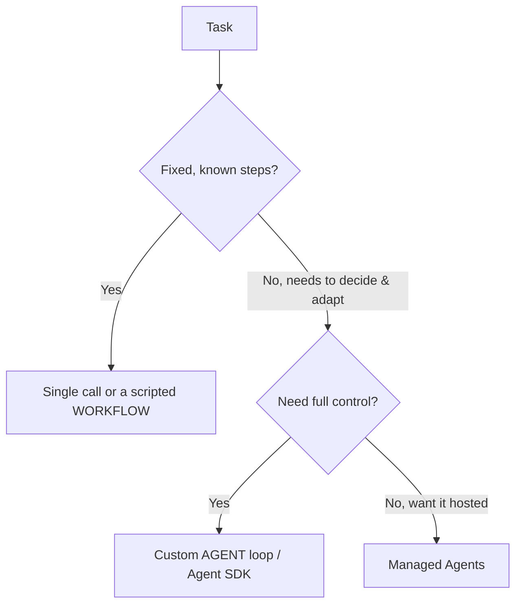

<LevelBadge level="advanced" />

<VerifyNote lastVerified="2026-06-20" source="https://docs.anthropic.com/en/docs/agents-and-tools">
Gli strumenti per gli agent (l'Agent SDK, le opzioni gestite) evolvono rapidamente — conferma le opzioni attuali nella documentazione ufficiale.
</VerifyNote>

Un **agent** è un modello che gira in un loop: persegue un obiettivo chiamando [strumenti](/docs/api/tool-use), osservando i risultati e decidendo il passo successivo fino al completamento. Prima di costruirne uno, scegli *la cosa più semplice che funziona*.

## Il test decisionale (non costruire troppo)

- **Chiamata singola** — un prompt risolve tutto. La maggior parte dei task. La più economica e affidabile.
- **Workflow** — orchestri nel codice una sequenza fissa di chiamate (flusso di controllo deterministico). Usalo quando i passi sono noti.
- **Agent** — è il modello a decidere i passi dinamicamente. Usalo solo quando il percorso non può davvero essere codificato a priori.

> Ricorri a un agent quando l'adattività è il punto centrale — non perché suona impressionante. Un workflow che controlli tu è più facile da testare e correggere.

## Progettare il loop

Un agent personalizzato minimale:

1. **System prompt**: l'obiettivo, i vincoli e gli strumenti disponibili.
2. **Loop**: invia i messaggi → se c'è `tool_use`, esegui lo strumento, aggiungi `tool_result`, ripeti → fino a una risposta finale o a una condizione di stop.
3. **Guardrail**: un limite massimo di iterazioni, un budget di token/costo e la validazione degli input degli strumenti.
4. **Gestione del contesto**: riassumi/sfoltisci man mano che la cronologia cresce (stessa idea di [Gestione del contesto](/docs/claude-code/context-management)).

Il **[Claude Agent SDK](/docs/claude-code/headless-and-agent-sdk)** ti fornisce questo loop — strumenti, permessi, gestione del contesto — già pronto, così non devi costruirtelo a mano.

## Rendilo robusto

- **Poni limiti a tutto**: iterazioni, tempo, costo. Gli agent possono entrare in loop.
- **Gestisci i fallimenti degli strumenti** con eleganza (restituisci l'errore come risultato).
- **Privilegio minimo + human-in-the-loop** per le azioni rischiose — vedi [Mettere in sicurezza gli agent](/docs/security/securing-agents).
- **Valutalo** su casi reali prima di fidartene — vedi [Valutazioni](/docs/foundations/evals).

## Avanti

- [Uso degli strumenti](/docs/api/tool-use) · [Modalità headless e Agent SDK](/docs/claude-code/headless-and-agent-sdk)
- [Agent gestiti](/docs/api/managed-agents) · [Cowork e team di agent](/docs/api/cowork-and-agent-teams)
- [Mettere in sicurezza agent e strumenti](/docs/security/securing-agents)
