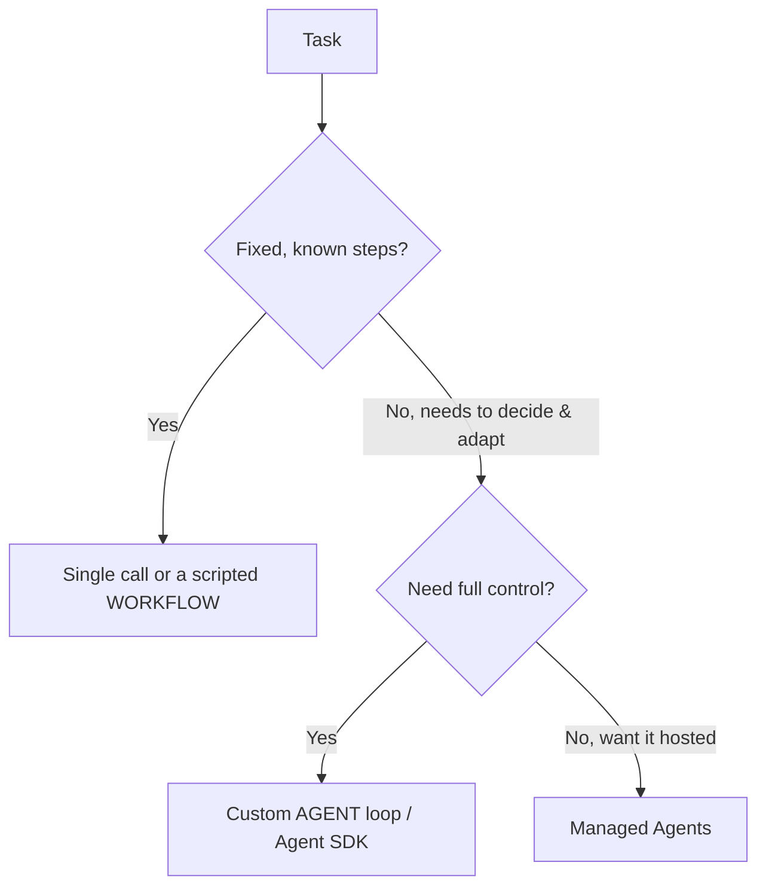

<LevelBadge level="advanced" />

<VerifyNote lastVerified="2026-07-21" source="https://platform.claude.com/docs/en/agents-and-tools/tool-use/overview">
Gli strumenti per gli agenti (l'Agent SDK, le opzioni gestite) evolvono rapidamente — verifica le opzioni attuali nella documentazione ufficiale.
</VerifyNote>

<Callout type="objectives" items={["Definire cos'è davvero un agente: un modello che gira in un loop", "Applicare il test decisionale per scegliere tra chiamata singola, workflow e agente", "Progettare un loop di agente minimale con le giuste protezioni", "Sapere quando ricorrere al Claude Agent SDK invece di costruirlo a mano", "Rendere un agente robusto: limitarlo, gestire i fallimenti, restringere i privilegi, valutarlo"]} />

Un **agente** è un modello che gira in un loop: persegue un obiettivo chiamando [strumenti](/docs/api/tool-use), osservando i risultati e decidendo il passo successivo fino al completamento. Prima di costruirne uno, scegli *la cosa più semplice che funziona*.

## Il test decisionale (non costruire troppo)

Non ogni task richiede un agente. Percorri prima questo albero — la maggior parte dei task si ferma in cima.

Tre opzioni, dalla più semplice:

- **Chiamata singola** — un prompt risolve tutto. La maggior parte dei task. La più economica e affidabile.
- **Workflow** — orchestri nel codice una sequenza fissa di chiamate (flusso di controllo deterministico). Usalo quando i passi sono noti.
- **Agente** — è il modello a decidere i passi dinamicamente. Usalo solo quando il percorso non può davvero essere codificato a priori.

<Callout type="warning">
Ricorri a un agente quando l'adattività è il punto centrale — non perché suona impressionante. Un workflow che controlli tu è più facile da testare e correggere.
</Callout>

## Progettare il loop

Un agente personalizzato minimale è fatto solo di quattro componenti. Costruiscili in quest'ordine:

<Steps items={[
  {title: "System prompt", body: "Dichiara l'obiettivo, i vincoli e gli strumenti disponibili. È ciò su cui il modello ragiona a ogni turno."},
  {title: "Il loop", body: "Invia i messaggi → se la risposta è un tool_use, esegui lo strumento, aggiungi un tool_result e ripeti → fino a una risposta finale o a una condizione di stop."},
  {title: "Guardrail", body: "Aggiungi un limite massimo di iterazioni, un budget di token/costo e la validazione degli input degli strumenti prima che qualsiasi cosa venga eseguita."},
  {title: "Gestione del contesto", body: "Riassumi o sfoltisci man mano che la cronologia cresce — la stessa idea trattata in Gestione del contesto (/docs/claude-code/context-management)."}
]} />

Il **[Claude Agent SDK](/docs/claude-code/headless-and-agent-sdk)** ti fornisce questo loop — strumenti, permessi, gestione del contesto — già pronto, così non devi costruirtelo a mano.

<Callout type="tip">
Prima di scrivere il tuo loop, chiediti se l'Agent SDK lo copre già. Include il loop, i permessi e la gestione del contesto, così puoi concentrarti sugli strumenti e sull'obiettivo.
</Callout>

## Rendilo robusto

Un loop che può chiamare strumenti può anche comportarsi male. Quattro abitudini mantengono un agente affidabile:

- **Poni limiti a tutto**: iterazioni, tempo, costo. Gli agenti possono entrare in loop.
- **Gestisci i fallimenti degli strumenti** con eleganza (restituisci l'errore come risultato).
- **Privilegio minimo + human-in-the-loop** per le azioni rischiose — vedi [Mettere in sicurezza gli agenti](/docs/security/securing-agents).
- **Valutalo** su casi reali prima di fidartene — vedi [Valutazioni](/docs/foundations/evals).

<Callout type="takeaways" items={["Un agente è un modello in un loop che chiama strumenti verso un obiettivo — usane uno solo quando il percorso non può essere codificato a priori", "Ordine decisionale: chiamata singola → workflow → agente → agenti gestiti; preferisci la cosa più semplice che funziona", "Un loop minimale = system prompt + loop tool_use/tool_result + guardrail + gestione del contesto", "Il Claude Agent SDK include per te il loop, gli strumenti, i permessi e la gestione del contesto", "Robustezza = porre limiti a iterazioni/tempo/costo, gestire i fallimenti degli strumenti, privilegio minimo + human-in-the-loop, e valutare prima di fidarsi"]} />

## Mettiti alla prova

<Quiz title="Mettiti alla prova" questions={[
  {
    q: "Qual è la migliore descrizione di un agente in questo contesto?",
    options: [
      "Un singolo prompt che restituisce una risposta completa",
      "Un modello che gira in un loop, chiama strumenti e decide il passo successivo fino al completamento",
      "Una sequenza fissa di chiamate API che orchestri nel codice",
      "Un servizio gestito che non richiede alcuna configurazione"
    ],
    answer: 1,
    explain: "Un agente è un modello che gira in un loop: persegue un obiettivo chiamando strumenti, osservando i risultati e decidendo il passo successivo fino al completamento."
  },
  {
    q: "Il task ha passi fissi e noti. A cosa dovresti ricorrere?",
    options: [
      "Un loop di agente personalizzato, per il massimo controllo",
      "Agenti gestiti, così è ospitato",
      "Una chiamata singola o un workflow scriptato",
      "Un team multi-agente"
    ],
    answer: 2,
    explain: "Quando i passi sono fissi e noti, una chiamata singola o un workflow scriptato (flusso di controllo deterministico) è la scelta giusta e più semplice."
  },
  {
    q: "Quando è davvero giustificato un agente personalizzato?",
    options: [
      "Ogni volta che suona più impressionante di un workflow",
      "Quando l'adattività è il punto centrale e il percorso non può davvero essere codificato a priori",
      "Per ogni task che chiama più di uno strumento",
      "Solo quando non puoi usare l'Agent SDK"
    ],
    answer: 1,
    explain: "Ricorri a un agente quando l'adattività è il punto centrale — non perché suona impressionante. Un workflow che controlli tu è più facile da testare e correggere."
  },
  {
    q: "Nel loop, cosa succede quando il modello risponde con un tool_use?",
    options: [
      "Fermi il loop e restituisci la risposta parziale",
      "Esegui lo strumento, aggiungi un tool_result e ripeti",
      "Scarti il messaggio e reinvii il system prompt",
      "Riassumi immediatamente la cronologia"
    ],
    answer: 1,
    explain: "Il loop: invia i messaggi → se tool_use, esegui lo strumento, aggiungi tool_result, ripeti → fino a una risposta finale o a una condizione di stop."
  },
  {
    q: "Quale NON è uno dei guardrail per rendere robusto un agente?",
    options: [
      "Un limite massimo di iterazioni e un budget di token/costo",
      "Gestire i fallimenti degli strumenti restituendo l'errore come risultato",
      "Concedere all'agente privilegi completi così non viene mai bloccato",
      "Privilegio minimo più human-in-the-loop per le azioni rischiose"
    ],
    answer: 2,
    explain: "Gli agenti robusti usano il privilegio minimo più l'human-in-the-loop per le azioni rischiose — l'opposto di concedere privilegi completi. Inoltre poni limiti a iterazioni/tempo/costo, gestisci con eleganza i fallimenti degli strumenti e valuti prima di fidarti."
  }
]} />

## Avanti

- [Uso degli strumenti](/docs/api/tool-use) · [Modalità headless e Agent SDK](/docs/claude-code/headless-and-agent-sdk)
- [Agenti gestiti](/docs/api/managed-agents) · [Cowork e team di agenti](/docs/api/cowork-and-agent-teams)
- [Mettere in sicurezza agenti e strumenti](/docs/security/securing-agents)
