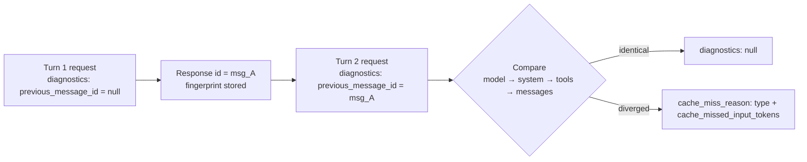

<LevelBadge level="advanced" />

<Callout type="objectives" items={[
  "Diagnosticare un cache miss del prompt dalla risposta dell'API invece di confrontare a mano i byte del prompt",
  "Collegare l'oggetto diagnostics a una richiesta e far scorrere previous_message_id lungo un loop di conversazione",
  "Leggere tutti e sei i tipi di cache_miss_reason e applicare la correzione specifica che ciascuno implica",
  "Distinguere un bug vero da una voce di cache scaduta abbinando la diagnostica a usage",
  "Evitare i tre modi in cui questo strumento ti inganna silenziosamente: solo la divergenza più a monte, i confronti ancora in corso e un conteggio di token che non è un dato di fatturazione"
]} />

Hai configurato il [prompt caching](/docs/api/prompt-caching), sei andato in produzione, e `cache_read_input_tokens` è **zero**. Qualcosa nel prefisso è cambiato — ma la risposta non ti dà nessun indizio su cosa. La correzione tradizionale è deprimente: serializzi su disco due richieste consecutive, le confronti byte per byte e vai a caccia di un timestamp che qualcuno ha interpolato in un prompt di sistema sei mesi fa.

**La diagnostica della cache sostituisce tutto questo.** Passi l'`id` della risposta precedente e l'API confronta le due richieste, indicando il primo punto in cui divergono — il modello, il prompt di sistema, gli strumenti o la cronologia dei messaggi — più una stima di quanto prefisso memorizzabile hai perso.

<VerifyNote lastVerified="2026-09-28" source="https://platform.claude.com/docs/en/build-with-claude/cache-diagnostics">
La diagnostica della cache è arrivata in **disponibilità generale sulla Claude API il 23 settembre 2026**; l'header beta `cache-diagnosis-2026-04-07` non è più necessario, e le richieste che lo inviano ancora funzionano come prima. Disponibilità, nomi dei campi e l'unione `cache_miss_reason` sono tutti soggetti a cambiamento — conferma nella documentazione ufficiale sulla diagnostica della cache.
</VerifyNote>

## Il modello mentale

L'API conserva una piccola **impronta** (fingerprint) di ogni richiesta per cui hai attivato l'opzione, indicizzata dall'`id` della risposta di quella richiesta. Alla richiesta successiva le restituisci quell'`id`, l'API ricostruisce un'impronta per la nuova richiesta, confronta le due e riporta il **primo punto di divergenza**.



Tre cose di quel diagramma contano più dei nomi dei campi:

1. **L'oggetto è l'opt-in.** L'API memorizza un'impronta *solo* per le richieste che includono `diagnostics`. Se lo ometti in un turno, la ricerca del turno successivo fallisce.
2. **L'ordine di confronto è l'ordine del prefisso.** Modello, poi system, poi tools, poi messages — lo stesso ordine da sinistra a destra con cui la cache stessa viene costruita.
3. **Riporta la struttura, non l'esito della cache.** La diagnostica risponde a *"la mia richiesta è cambiata?"* — una domanda diversa da *"la cache ha fatto hit?"*. Per agire ti servono entrambe le letture. Vedi [Abbinala a usage](#abbinala-a-usage).

<Flashcards title="Vocabolario della diagnostica della cache" cards={[
  {front:"Impronta (fingerprint)", back:"Un record leggero che l'API memorizza per qualsiasi richiesta che includa l'oggetto diagnostics. Solo hash crittografici e stime di conteggio token — mai il testo grezzo del prompt. Indicizzato dall'id della risposta, limitato alla tua organizzazione e al tuo workspace, scade dopo un breve periodo."},
  {front:"previous_message_id", back:"L'id della risposta con cui vuoi che la richiesta corrente venga confrontata. Passa null al primo turno per fare opt-in quando non c'è ancora nulla da confrontare."},
  {front:"cache_miss_reason", back:"Un'unione discriminata su type. Indica il primo punto in cui le due richieste sono divergenti — oppure spiega perché non è stato prodotto alcun confronto."},
  {front:"cache_missed_input_tokens", back:"Presente nei quattro tipi *_changed. Una stima di quanti token di input cadono dopo il punto di divergenza — cioè quanto prefisso memorizzabile hai perso."},
  {front:"Solo la divergenza più a monte", back:"La risposta indica la prima differenza e si ferma. Una divergenza successiva può restare nascosta dietro di essa, quindi il debug è un ciclo di correggi-e-rimisura, non una lettura unica."}
]} />

## Strumenta una conversazione

<Steps items={[
  {title: "Aggiungi l'oggetto diagnostics a ogni turno", body: "Includi diagnostics in ogni richiesta, non solo in quella che stai debuggando. L'API memorizza un'impronta solo per le richieste che portano l'oggetto, quindi un singolo turno senza di esso spezza la catena e il turno successivo riporta previous_message_not_found."},
  {title: "Passa null al primo turno", body: "Al primo turno non c'è nulla con cui confrontare. Invia previous_message_id come null — questo attiva l'opt-in e registra l'impronta. Il campo diagnostics della risposta sarà null, il che è atteso, non un fallimento."},
  {title: "Porta avanti l'id della risposta", body: "In ogni turno successivo imposta previous_message_id all'id della risposta precedente. In un loop è una sola variabile che riassegni dopo ogni chiamata."},
  {title: "Leggi diagnostics dalla risposta", body: "Nelle chiamate non in streaming è un campo diagnostics di primo livello sul Message. Nelle chiamate in streaming arriva sull'evento message_start e viene riportato nel messaggio finale accumulato."},
  {title: "Correggi la causa riportata, poi rimisura", body: "Viene riportata solo la divergenza più a monte. Dopo averla corretta, riesegui — una seconda causa poteva essere lì dietro fin dall'inizio."}
]} />

La forma della richiesta è minima. Tutto il resto della chiamata resta invariato:

<PromptCard title="Turno 2 — confronta con la risposta precedente">{`curl https://api.anthropic.com/v1/messages \\
  -H "x-api-key: $ANTHROPIC_API_KEY" \\
  -H "anthropic-version: 2023-06-01" \\
  -H "content-type: application/json" \\
  -d '{
    "model": "claude-opus-5-5",
    "max_tokens": 1024,
    "cache_control": {"type": "ephemeral"},
    "system": "You are an AI assistant analyzing a large document. <document>...</document>",
    "messages": [
      {"role": "user", "content": "Summarize section 1."},
      {"role": "assistant", "content": "Section 1 covers..."},
      {"role": "user", "content": "Now summarize section 2."}
    ],
    "diagnostics": {"previous_message_id": "msg_01Xyz..."}
  }' | jq '{id, usage, diagnostics}'`}</PromptCard>

In un loop multi-turno si riduce a una sola variabile riassegnata — `prev_id` parte da `None` e diventa `r.id` dopo ogni chiamata:

```python
messages = []
prev_id = None

for turn, user_message in enumerate(prompts, start=1):
    messages.append({"role": "user", "content": user_message})

    r = client.beta.messages.create(
        model="claude-opus-5-5",
        max_tokens=1024,
        cache_control={"type": "ephemeral"},
        system=SYSTEM,
        messages=messages,
        diagnostics={"previous_message_id": prev_id},
    )

    if r.diagnostics is not None and r.diagnostics.cache_miss_reason is not None:
        print(f"Turn {turn} cache_miss_reason: {r.diagnostics.cache_miss_reason.type}")

    messages.append({"role": "assistant", "content": r.content})
    prev_id = r.id
```

## Leggi la risposta

Il campo `diagnostics` ha **tre** forme possibili, e confondere le prime due è l'errore di lettura più comune:

| Valore | Significato |
|---|---|
| `null` | O non hai inviato l'oggetto `diagnostics`, oppure `previous_message_id` era `null` (primo turno), **oppure** un confronto è stato eseguito e non ha trovato divergenze. |
| `cache_miss_reason` è `null` | Il confronto era ancora in corso quando la risposta è stata serializzata — può succedere quando una risposta parte molto rapidamente. Non conclusivo; controlla il turno successivo. |
| `cache_miss_reason` è un oggetto | Un punto di divergenza, o una spiegazione del perché non è stato prodotto alcun confronto. |

:::caution `null` è ambiguo per scelta
Un campo `diagnostics` a `null` significa "niente da riportare" — il che copre sia *"il tuo prefisso è identico"* sia *"non hai mai fatto opt-in"*. Se vedi `null` ovunque e ti aspettavi una diagnosi, verifica di star davvero inviando l'oggetto `diagnostics` in **entrambi** i turni prima di concludere che il tuo prompt è stabile.
:::

Un miss popolato appare così:

```json
{
  "id": "msg_01Xyz...",
  "type": "message",
  "role": "assistant",
  "usage": {
    "input_tokens": 42,
    "cache_read_input_tokens": 0,
    "cache_creation_input_tokens": 41850,
    "output_tokens": 210
  },
  "diagnostics": {
    "cache_miss_reason": {
      "type": "system_changed",
      "cache_missed_input_tokens": 41850
    }
  }
}
```

## Le sei ragioni, e cosa cambiare davvero

Quattro tipi indicano un punto di divergenza. Due significano che nessun confronto è avvenuto — e leggerli come "il mio prompt è cambiato" ti manda a caccia di un bug che non esiste.

| `type` | Cosa è divergente | La correzione |
|---|---|---|
| `model_changed` | Il `model` è diverso da quello della richiesta precedente. La cache è per modello, quindi un router, un A/B test o un fallback che scambia modello a metà conversazione butta via l'intero prefisso. | Mantieni il modello costante per tutta la vita di una conversazione in cache. Se ti serve il fallback, tratta ogni modello come una linea di cache a sé. |
| `system_changed` | Il parametro `system` è diverso — quasi sempre un timestamp, un request ID, un session ID o un nome utente interpolato in un prompt altrimenti stabile. | Rendi il prompt di sistema una costante stabile byte per byte. Sposta ogni valore dinamico nel primo messaggio `user` **dopo** il tuo cache breakpoint. |
| `tools_changed` | L'array `tools` è diverso: uno strumento è stato aggiunto, rimosso o riordinato — oppure il JSON di `input_schema` è stato serializzato in modo non deterministico tra un turno e l'altro. | Invia la stessa lista di strumenti nello stesso ordine fisso a ogni turno, e serializza gli schemi in modo deterministico (ordina le chiavi degli oggetti). |
| `messages_changed` | Modello, system e tools coincidono, ma una voce precedente in `messages` è stata modificata, riordinata o rimossa invece che semplicemente aggiunta in coda. Di solito è troncamento della cronologia, oppure turni assistant e blocchi `tool_result` riserializzati in modo diverso al reinvio. | Tratta la cronologia come **append-only**. Rimanda indietro il `content` dell'assistant e i risultati degli strumenti verbatim, invece di ricostruirli. |
| `previous_message_not_found` | Nessuna impronta memorizzata per quel `previous_message_id`. **Non è una prova che la tua richiesta sia cambiata.** La richiesta precedente ha omesso l'oggetto `diagnostics`, è stata eseguita in un workspace diverso, oppure è troppo vecchia. | Invia `diagnostics` a ogni turno, e mantieni i turni consecutivi ravvicinati nel tempo. |
| `unavailable` | Non è stata prodotta alcuna diagnosi. Copre due casi distinti: un parametro che influenza il prompt *diverso da* model/system/tools era differente, oppure la conversazione è abbastanza lunga da far cadere la divergenza oltre l'orizzonte di confronto. | Mantieni costanti anche `tool_choice`, `thinking`, `context_management`, `output_config`, `output_format` e l'insieme di header `anthropic-beta` attivi — influenzano tutti il prompt. |

:::tip `unavailable` è quello che si fraintende di più
**Non** significa "la funzionalità è rotta". Il più delle volte significa che le quattro superfici confrontate coincidevano tutte e si è mosso qualcos'altro — l'insieme degli header beta è il sospettato preferito, perché di solito è impostato in una configurazione condivisa del client lontana dal punto di chiamata e nessuno lo considera parte del prompt.
:::

<a id="pair-it-with-usage"></a>
## Abbinala a usage

La diagnostica da sola è metà lettura. `usage.cache_read_input_tokens` è l'altra metà, e insieme ti dicono se stai guardando un bug o della fisica.

| Diagnostica | Token letti da cache | Cosa significa davvero |
|---|---|---|
| `null` | Alto | Funziona come previsto. Prefisso stabile, cache hit. Niente da fare. |
| `null` | Basso o zero | **Non è un tuo bug.** Le richieste coincidevano; la voce di cache era semplicemente scaduta. Riduci l'intervallo tra i turni, oppure passa alla [durata di cache di 1 ora](https://platform.claude.com/docs/en/build-with-claude/prompt-caching#1-hour-cache-duration). |
| Un tipo `*_changed` | Basso o zero | **È un tuo bug.** La richiesta è cambiata. Correggi la causa indicata dal `type`. |
| Un tipo `*_changed` | Alto | Raro. Qualcosa è cambiato in fondo al prompt ma un `cache_control` breakpoint precedente ha comunque fatto hit. Vale la pena correggerlo, impatto basso. |

È la seconda riga a giustificare l'esistenza di questa funzionalità. "Le letture da cache sono zero" era indistinguibile da "abbiamo un bug nel prefisso", e i team bruciavano giorni sul secondo quando la risposta era il primo. Lette insieme, la diagnostica separa *il tuo* errore dalla durata *della cache*.

Questa matrice vale per i turni in cui hai passato un `previous_message_id` reale. **Non** vale al primo turno (`diagnostics` è sempre `null` e le letture da cache sono normalmente zero perché la cache si sta scrivendo), né quando `cache_miss_reason` è `null`, `previous_message_not_found` o `unavailable` — in tutti questi casi nessun confronto è stato prodotto.

## Errori comuni

- **Strumentare solo il turno che fallisce.** L'impronta vive sulla richiesta *precedente*. Aggiungere `diagnostics` solo al turno che stai debuggando garantisce `previous_message_not_found`. Strumenta l'intero loop.
- **Trattare `cache_missed_input_tokens` come un dato di fatturazione.** Deriva dalle **lunghezze in byte prima della tokenizzazione**, quindi è un indicatore di ordine di grandezza — "hai perso circa 40k di prefisso", non "ti sono stati addebitati 41.850 token". Può differire da `usage.input_tokens`, e occasionalmente superarlo.
- **Fermarsi dopo una sola correzione.** Viene riportata solo la divergenza più a monte. Correggere `system_changed` può far emergere immediatamente un `tools_changed` che c'era da sempre. Rimisura dopo ogni correzione finché la diagnostica non tace.
- **Debuggare tra workspace diversi.** La richiesta precedente deve essere stata eseguita nella stessa organizzazione *e* nello stesso workspace. Confronta l'header di risposta `anthropic-workspace-id` su entrambe le risposte prima di fidarti di un `previous_message_not_found`.
- **Aspettarsela su Bedrock o Google Cloud.** La diagnostica della cache è **solo Claude API**. Se sei multi-cloud, strumenta il percorso Claude API, correggi lì il prefisso e distribuisci la correzione ovunque — le regole di stabilità del prefisso sono identiche anche dove la diagnosi non è disponibile.
- **Leggere un confronto ancora in corso come un via libera.** `cache_miss_reason: null` significa che il confronto non era terminato quando la risposta è stata serializzata. È non conclusivo, non una promozione.

## È sicuro lasciarla attiva?

In larga misura sì — e questo cambia il modo in cui la usi. È **best-effort by design**: la diagnostica non blocca mai né fa fallire la tua richiesta; quando un'informazione non è disponibile ricevi `unavailable` o una ragione `null` invece di un errore. L'impronta memorizzata contiene solo hash crittografici e stime di conteggio token, mai il testo grezzo del prompt, e la funzionalità è **idonea ZDR (qualificata)**.

Questo rende ragionevole tenere `diagnostics` collegato in modo permanente in un ambiente di staging, invece di attaccarlo al volo durante un incidente — che è l'unico modo per intercettare la regressione lenta in cui qualcuno aggiunge un timestamp a un prompt di sistema e il tuo hit rate della cache decade nell'arco di una settimana.

<Quiz title="Verifica" questions={[
  {q:"La risposta del turno 2 torna con diagnostics a null e cache_read_input_tokens a zero. Qual è la spiegazione più probabile?",options:["Un invalidatore silenzioso ha cambiato il tuo prompt di sistema","Le richieste coincidevano, ma la voce di cache era già scaduta","La funzionalità di diagnostica non è disponibile sul tuo account"],answer:1,explain:"Una diagnostica null con letture da cache basse significa che le due richieste erano identiche ma la voce di cache non era più disponibile. È un problema di TTL, non un bug del prefisso — riduci l'intervallo tra i turni o passa alla durata di cache di 1 ora."},
  {q:"Ricevi previous_message_not_found. Cosa ti dice sul tuo prompt?",options:["Nulla — significa che non è stata memorizzata alcuna impronta per quell'id","Che la cronologia dei messaggi è stata troncata","Che il modello è cambiato tra un turno e l'altro"],answer:0,explain:"previous_message_not_found non è una prova che la tua richiesta sia cambiata. Significa che non esiste alcuna impronta memorizzata per quel previous_message_id — di solito perché la richiesta precedente ha omesso l'oggetto diagnostics, è stata eseguita in un workspace diverso, o è stata inviata troppo tempo fa."},
  {q:"Correggi il system_changed riportato e l'esecuzione successiva riporta tools_changed. Cos'è successo?",options:["La tua correzione ha introdotto un nuovo bug nell'array tools","Viene riportata solo la divergenza più a monte, quindi quella sui tools era nascosta dietro quella sul system","L'orizzonte di confronto è stato superato"],answer:1,explain:"La risposta riporta solo la divergenza più a monte. Correggere la prima causa espone ciò che stava lì dietro, ed è per questo che il debug della cache è un ciclo di correggi-e-rimisura e non una lettura unica."},
  {q:"Come dovresti trattare il valore di cache_missed_input_tokens?",options:["Come il numero esatto di token che ti sono stati addebitati","Come un indicatore di ordine di grandezza di quanto prefisso è andato perso","Come la dimensione del tuo cache breakpoint"],answer:1,explain:"Deriva dalle lunghezze in byte prima della tokenizzazione, quindi stima quanto prefisso memorizzabile è caduto dopo il punto di divergenza. Trattalo come un indicatore di grandezza, non come un dato di fatturazione — può differire da usage.input_tokens e occasionalmente superarlo."}
]} />

<Callout type="takeaways" items={[
  "Invia l'oggetto diagnostics a ogni turno e porta avanti l'id della risposta precedente — l'impronta viene memorizzata solo per le richieste che fanno opt-in.",
  "diagnostics risponde a 'la mia richiesta è cambiata?'; usage.cache_read_input_tokens risponde a 'la cache ha fatto hit?'. Servono entrambe per distinguere un bug del prefisso da una voce scaduta.",
  "Quattro tipi *_changed indicano un punto di divergenza; previous_message_not_found e unavailable significano che nessun confronto è stato eseguito e non provano alcun cambiamento.",
  "Viene riportata solo la divergenza più a monte, quindi correggi, rimisura e ripeti finché la diagnostica non tace.",
  "cache_missed_input_tokens è una stima di grandezza derivata dai byte, non una cifra di fatturazione.",
  "Solo Claude API — non su Amazon Bedrock né Google Cloud — ma le regole di stabilità del prefisso che insegna valgono ovunque."
]} />

## Prossimi passi

- [Prompt Caching e Ottimizzazione dei Costi](/docs/api/prompt-caching) — imposta correttamente il breakpoint fin dall'inizio, così ci sarà meno da diagnosticare.
- [Prompt caching tra provider diversi](/docs/models/prompt-caching-across-providers) — le stesse regole di prefisso su OpenAI, Gemini e DeepSeek, e la matematica del punto di pareggio su quando il caching è una perdita.
- [Token, Contesto e Prezzi](/docs/api/tokens-and-pricing) — quanto costano davvero i token che hai appena smesso di sprecare.
