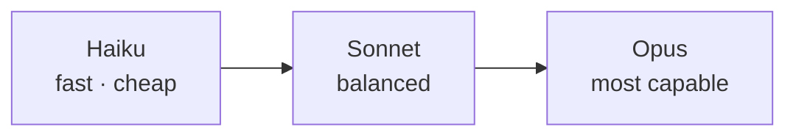

<LevelBadge level="beginner" />

Anthropic offre una famiglia di modelli con diversi punti di equilibrio tra capacità/costo/velocità. Scegliere bene significa soprattutto adattare il modello al compito — e non pagare troppo per capacità di cui non hai bisogno.

## I modelli attuali

<ModelTable />

## Provalo: quale modello fa al caso tuo?

Rispondi a tre domande e ottieni un consiglio di partenza:

<ModelPicker />

## Il modello mentale: una scala di capacità

- **Parti da Sonnet.** È il cavallo di battaglia predefinito — ragionamento e coding solidi a un costo ragionevole. La maggior parte dei task dovrebbe iniziare qui.
- **Sali a Opus** solo quando Sonnet fatica e la qualità conta più del costo (ragionamento difficile, agent complessi, codice ostico).
- **Scendi a Haiku** per lavoro ad alto volume, sensibile alla latenza o semplice (classificazione, estrazione, routing, sub-agent economici).

## Come scegliere davvero

1. **Imposta Sonnet come predefinito** e rilascia.
2. **Raggiungi un tetto di qualità?** Prova Opus solo sul sottoinsieme difficile.
3. **Costo o latenza ti penalizzano?** Verifica se Haiku è abbastanza buono per quel passo.
4. **Combina i modelli.** Usa Haiku per pre/post-elaborazione economica e Sonnet/Opus per il nucleo difficile. Questa "stratificazione dei modelli" è una delle leve di costo più importanti — vedi [Costo e latenza](/docs/foundations/cost-and-latency).

:::tip Non scegliere solo dai benchmark
I benchmark pubblici sono un indizio di partenza, non un verdetto per il *tuo* task. Esegui una piccola [valutazione](/docs/foundations/evals) su una manciata dei tuoi input reali confrontando due modelli — richiede pochi minuti e batte il tirare a indovinare.
:::

## Trovare l'ID esatto del modello

Passa sempre l'ID del modello API attuale (ad esempio nella tua chiamata `messages.create`). Recuperalo dalla [tabella dei modelli qui sopra](/docs/whats-new/models-and-pricing) o dalla pagina ufficiale dei modelli — e preferisci leggerlo dalla configurazione invece di codificarlo in molti punti, così gli aggiornamenti del modello diventano una modifica di una riga.

## Avanti

- [Token, contesto e prezzi](/docs/api/tokens-and-pricing)
- [La tua prima chiamata API](/docs/api/first-call)
- [Modelli e prezzi attuali](/docs/whats-new/models-and-pricing)
