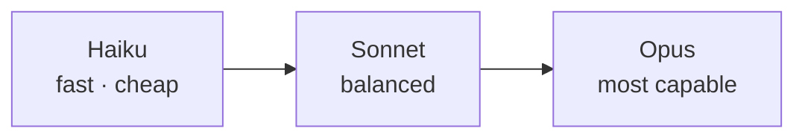

<LevelBadge level="beginner" />

Anthropic offre una famiglia di modelli con diversi punti di equilibrio tra capacità/costo/velocità. Scegliere bene significa soprattutto adattare il modello al compito — e non pagare troppo per capacità di cui non hai bisogno.

<Callout type="objectives" items={[
  "Leggere la scala Haiku → Sonnet → Opus come un compromesso tra capacità, costo e velocità",
  "Partire dal default giusto invece di tirare a indovinare, per poi salire o scendere in modo deliberato",
  "Combinare più livelli in un unico sistema — la leva di costo più grande che quasi nessuno usa",
  "Cercare l'ID esatto del modello nel modo giusto, così gli aggiornamenti restano una modifica di una riga",
]} />

## I modelli attuali

<ModelTable />

## Provalo: quale modello fa al caso tuo?

Rispondi a tre domande e ottieni un consiglio di partenza:

<ModelPicker />

## Il modello mentale: una scala di capacità

- **Parti da Sonnet.** È il cavallo di battaglia predefinito — ragionamento e coding solidi a un costo ragionevole. La maggior parte dei task dovrebbe iniziare qui.
- **Sali a Opus** solo quando Sonnet fatica e la qualità conta più del costo (ragionamento difficile, agent complessi, codice ostico).
- **Scendi a Haiku** per lavoro ad alto volume, sensibile alla latenza o semplice (classificazione, estrazione, routing, sub-agent economici).

## Come scegliere davvero

<Steps items={[
  {title: "Imposta Sonnet come predefinito e rilascia", body: "È il cavallo di battaglia bilanciato. Partire da qualsiasi altro punto significa ottimizzare prima di avere prove sul tuo task reale."},
  {title: "Raggiungi un tetto di qualità? Prova Opus solo sul sottoinsieme difficile", body: "Non aggiornare l'intero carico di lavoro. Individua i casi in cui Sonnet fallisce e instrada solo quelli su Opus — compri la qualità senza pagarla ovunque."},
  {title: "Costo o latenza ti penalizzano? Verifica se Haiku è abbastanza buono per quel passo", body: "Classificazione, estrazione, routing e sub-agent economici raramente hanno bisogno di un modello più grande. Testalo invece di darlo per scontato."},
  {title: "Combina i modelli", body: "Usa Haiku per pre/post-elaborazione economica e Sonnet/Opus per il nucleo difficile. Questa stratificazione dei modelli è una delle leve di costo più importanti — vedi Costo e latenza."},
]} />

La stratificazione dei modelli merita una lettura a parte: [Costo e latenza](/docs/foundations/cost-and-latency).

:::tip Non scegliere solo dai benchmark
I benchmark pubblici sono un indizio di partenza, non un verdetto per il *tuo* task. Esegui una piccola [valutazione](/docs/foundations/evals) su una manciata dei tuoi input reali confrontando due modelli — richiede pochi minuti e batte il tirare a indovinare.
:::

## Trovare l'ID esatto del modello

Passa sempre l'ID del modello API attuale (ad esempio nella tua chiamata `messages.create`). Recuperalo dalla [tabella dei modelli qui sopra](/docs/whats-new/models-and-pricing) o dalla pagina ufficiale dei modelli — e preferisci leggerlo dalla configurazione invece di codificarlo in molti punti, così gli aggiornamenti del modello diventano una modifica di una riga.

<Quiz title="Mettiti alla prova" questions={[
  {q: "Stai costruendo qualcosa di nuovo e non hai dati su quale modello sia adatto. Da dove parti?", options: ["Opus, poi si scende se costa troppo", "Sonnet — il default bilanciato — e poi si sale o si scende con le prove alla mano", "Haiku, poi si sale ogni volta che l'output sembra debole"], answer: 1, explain: "Sonnet è il cavallo di battaglia: ragionamento e coding solidi a un costo ragionevole. Parti da lì e rilascia, poi lascia che siano i fallimenti reali a dirti se serve Opus o se basta Haiku."},
  {q: "Sonnet gestisce bene il 90% del traffico ma fallisce su un 10% difficile. Mossa migliore?", options: ["Spostare tutto su Opus", "Instradare su Opus solo il sottoinsieme difficile e lasciare il resto su Sonnet", "Aggiungere altri esempi e accettare i fallimenti"], answer: 1, explain: "Aggiornare l'intero carico di lavoro significa pagare prezzi Opus per casi che Sonnet già gestisce. Instradare solo il sottoinsieme difficile compra la qualità dove serve — l'essenza della stratificazione dei modelli."},
  {q: "Un benchmark mostra il modello A davanti al modello B. Cosa dovresti concluderne per la tua app?", options: ["Usa il modello A — i benchmark chiudono la questione", "Poco o nulla — esegui una piccola valutazione sui tuoi input reali con entrambi", "Usa il modello B, dato che i benchmark sono sempre truccati"], answer: 1, explain: "I benchmark pubblici sono un indizio, non un verdetto per il tuo task. Una piccola valutazione su una manciata dei tuoi input reali richiede pochi minuti e batte il tirare a indovinare."},
  {q: "Perché leggere l'ID del modello dalla configurazione invece di codificarlo in tutto il codice?", options: ["Le stringhe fisse sono più lente a runtime", "Perché un aggiornamento del modello sia una modifica di una riga invece di una caccia in ogni punto di chiamata", "L'API rifiuta gli ID modello letterali"], answer: 1, explain: "Gli ID dei modelli cambiano man mano che la gamma evolve. Tenere l'ID attuale nella configurazione fa sì che un aggiornamento tocchi una sola riga, e il valore lo cerchi sempre nella tabella dei modelli aggiornata."},
]} />

<Callout type="takeaways" items={[
  "Haiku → Sonnet → Opus è una scala capacità/costo/velocità — scegli un gradino, non tirare a indovinare un modello.",
  "Imposta Sonnet come predefinito e rilascia; sali o scendi solo con prove dal tuo task reale.",
  "Aggiorna il sottoinsieme difficile, non l'intero carico di lavoro — il routing batte gli aggiornamenti a tappeto.",
  "Combinare i livelli in un unico sistema è una delle leve di costo più importanti a tua disposizione.",
  "I benchmark sono un indizio; una piccola valutazione sui tuoi input reali è il verdetto.",
  "Leggi l'ID del modello dalla configurazione e cercalo nella tabella dei modelli aggiornata — non codificare mai fatti sui modelli.",
]} />

## Avanti

- [Token, contesto e prezzi](/docs/api/tokens-and-pricing)
- [La tua prima chiamata API](/docs/api/first-call)
- [Modelli e prezzi attuali](/docs/whats-new/models-and-pricing)
