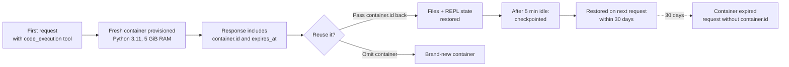

<LevelBadge level="intermediate" />

<Callout type="objectives" items={[
  "Accendere la sandbox con un singolo blocco tool e sapere cosa Claude ci fa — comandi Bash, edit di file, e (con le versioni più nuove) un REPL Python persistente",
  "Scegliere la versione tool giusta — code_execution_20250825 vs 20260120 vs 20260521 — e capire esattamente cosa sblocca ognuna",
  "Portare file dentro e fuori — upload con container_upload, cattura file generati via il pattern OUTPUT_DIR",
  "Riusare un container attraverso richieste per tenere vivo lo stato fino a 30 giorni, e sapere quando un container fresco è più sicuro",
  "Leggere il pricing correttamente — 1.550 ore gratis al mese, poi $0,05 per container-ora — e sapere l'unica combo che lo rende interamente gratuito",
  "Evitare la confusione multi-environment quando fornisci code execution insieme al tuo tool Bash"
]} />

<VerifyNote lastVerified="2026-08-25" source="https://platform.claude.com/docs/en/agents-and-tools/tool-use/code-execution-tool">
Le stringhe di versione tool, la compatibilità modelli, i limiti di risorse e i tier di pricing si muovono — ri-verifica nomi di campo e cap di ore gratis contro il riferimento ufficiale prima di architettare attorno a un numero specifico.
</VerifyNote>

Il **code execution tool** è la sandbox server-side di Anthropic: aggiungi un blocco JSON al tuo array `tools` e Claude guadagna una shell Bash, un editor di file, e un interprete Python 3.11, tutti girando dentro un container Linux che l'API provisiona per te. Non esegui mai comandi né rispedisci blocchi `tool_result` — l'API esegue ogni chiamata e stream l'output indietro nella stessa risposta.

Questa è la primitiva sotto molte cose che Anthropic ships in seguito: la [programmatic tool calling](/docs/api/programmatic-tool-calling) esegue Python dentro questo stesso container; i nuovi tool [web search](https://platform.claude.com/docs/en/agents-and-tools/tool-use/web-search-tool) e [web fetch](https://platform.claude.com/docs/en/agents-and-tools/tool-use/web-fetch-tool) lo usano invisibilmente per il filtering dinamico dei risultati. Capire la sandbox paga attraverso l'intera superficie della piattaforma.

## Quando raggiungerlo

<Callout type="info" items={[
  "Matematica non-triviale — numeri grandi, molti passi, risultati precision-sensitive che Claude tirerebbe a indovinare senza eseguire",
  "Analisi dati su file che carichi — CSV, Excel, JSON, XML, immagini, PDF",
  "Generare visualizzazioni, PDF o spreadsheet che poi un umano scarica",
  "Script multi-step che devono salvare stato intermedio e iterare — un REPL Python persistente attraverso richieste",
  "Qualsiasi workload che altrimenti roundtripperebbe un enorme tool result al modello — la sandbox lo filtra localmente"
]} />

Claude *non* eseguirà codice per aritmetica semplice, fatti ben noti, richieste fattuali/conversazionali, o conversioni di unità basilari. Se la richiesta è borderline, chiedi esplicitamente: **"esegui codice per verificare questo"**.

## Tre versioni del tool — cosa aggiunge ognuna

Ci sono attualmente tre versioni correnti del tool. Tutte e tre ritornano le stesse forme di blocco, e nessuna richiede un header `anthropic-beta`.

| Versione                    | Cosa aggiunge                                                                                                                                                                                                                                              |
| --------------------------- | ------------------------------------------------------------------------------------------------------------------------------------------------------------------------------------------------------------------------------------------------------- |
| `code_execution_20250825`   | Comandi Bash e operazioni di file (`view`, `create`, `str_replace`). Questo è ciò che la maggior parte degli esempi usa.                                                                                                                                                     |
| `code_execution_20260120`   | Aggiunge **persistenza dello stato REPL** e supporto per [programmatic tool calling](/docs/api/programmatic-tool-calling) dall'interno della sandbox. Lo stato dell'interprete Python (variabili, import) sopravvive attraverso richieste che riusano il container.               |
| `code_execution_20260521`   | Stesso runtime di `20260120`. La descrizione del tool ora dichiara il **limite wall-clock di 90 secondi per cella Python** nella programmatic tool calling, così che Claude possa budgetare celle long-running invece di essere tagliato a metà computazione.                       |

**Due regole del pollice:**

- Se usi i tool web search o web fetch correnti (`web_search_20260209` / `web_fetch_20260209` o successivi), **devi** essere su `code_execution_20260120` o successivi — quella è la versione code-execution richiesta per il loro filtering dinamico.
- Claude Haiku 4.5 accetta le stringhe di tipo più nuove ma non supporta effettivamente la programmatic tool calling o la persistenza REPL; su Haiku, le versioni più nuove si comportano come `code_execution_20250825`.

## Attiva la sandbox in una richiesta

<Steps items={[
  {title: "Aggiungi il blocco tool", body: "Includi un'entry in tools con type impostato alla versione che vuoi e name impostato a code_execution. Non ci sono altri parametri — entrambi i campi sono fissi."},
  {title: "Manda un messaggio che benefici dalla computazione", body: "Chiedi a Claude di calcolare, parsare un file, generare un grafico, o eseguire un comando shell. Claude decide se la richiesta merita esecuzione."},
  {title: "Leggi la risposta interleaved", body: "La risposta mescola blocchi server_tool_use (il comando che Claude ha eseguito) con blocchi tool_result corrispondenti (stdout, stderr, return_code, e qualsiasi file catturato), seguiti dalla risposta text di Claude."},
  {title: "Opzionalmente riusa il container", body: "La risposta include un oggetto container top-level con un id. Passa quell'id indietro sulla prossima richiesta per tenere vivi file e (con le versioni tool più nuove) stato Python."}
]} />

<PromptCard title="Richiesta cURL minima — media e deviazione standard">{`curl https://api.anthropic.com/v1/messages \\
  -H "x-api-key: $ANTHROPIC_API_KEY" \\
  -H "anthropic-version: 2023-06-01" \\
  -H "content-type: application/json" \\
  -d '{
    "model": "claude-opus-5",
    "max_tokens": 4096,
    "messages": [{
      "role": "user",
      "content": "Use the code execution tool to calculate the mean and standard deviation of [1, 2, 3, 4, 5, 6, 7, 8, 9, 10]"
    }],
    "tools": [{
      "type": "code_execution_20250825",
      "name": "code_execution"
    }]
  }'`}</PromptCard>

La risposta interleava blocchi `server_tool_use` con blocchi `bash_code_execution_tool_result` (o `text_editor_code_execution_tool_result`), poi il testo di sommario di Claude.

## Sub-tool che ottieni gratis

Aggiungere il code execution tool silenziosamente sblocca due sub-tool tra cui Claude può scegliere in qualsiasi turn:

- **`bash_code_execution`** — esegui qualsiasi comando shell. Il risultato include `stdout`, `stderr`, `return_code`, e una lista `content` di qualsiasi file che il comando ha lasciato in `$OUTPUT_DIR`.
- **`text_editor_code_execution`** — visualizza, crea ed edita file (incluso source code). Comandi supportati: `view`, `create`, `str_replace`. I diff tornano in forma unified-diff (`old_start`, `new_start`, `lines`).

L'interprete Python non è un sub-tool a sé stante — Claude scrive Python con il file editor e lo esegue con un comando Bash. Con `code_execution_20260120` o successivi più programmatic tool calling, lo *stato dell'interprete* persiste attraverso celle che riusano il container.

## Porta file dentro il container

Carica il file con la [Files API](https://platform.claude.com/docs/en/build-with-claude/files), poi referenzialo nel messaggio con un blocco di contenuto `container_upload`. L'environment Python può gestire CSV, Excel (`.xlsx`, `.xls`), JSON, XML, immagini (JPEG/PNG/GIF/WebP) e formati text-based.

<PromptCard title="Carica un CSV e chiedi a Claude di analizzarlo">{`# 1. Upload the file
FILE_ID=$(curl -sS https://api.anthropic.com/v1/files \\
  -H "x-api-key: $ANTHROPIC_API_KEY" \\
  -H "anthropic-version: 2023-06-01" \\
  -F "file=@data.csv" | jq -r '.id')

# 2. Reference it with a container_upload block
curl https://api.anthropic.com/v1/messages \\
  -H "x-api-key: $ANTHROPIC_API_KEY" \\
  -H "anthropic-version: 2023-06-01" \\
  -H "content-type: application/json" \\
  -d '{
    "model": "claude-opus-5",
    "max_tokens": 4096,
    "messages": [{
      "role": "user",
      "content": [
        {"type": "text", "text": "Analyze this CSV data"},
        {"type": "container_upload", "file_id": "'"$FILE_ID"'"}
      ]
    }],
    "tools": [{"type": "code_execution_20250825", "name": "code_execution"}]
  }'`}</PromptCard>

## Ottieni file di ritorno — il pattern `$OUTPUT_DIR`

Questa è la gotcha che nessuno documenta finché non morde: **solo i file al livello top di `$OUTPUT_DIR` sono catturati e ritornati come entry `file_id`.** Ogni chiamata `bash_code_execution` ottiene una directory vuota fresca disponibile come `$OUTPUT_DIR`; qualsiasi cosa Claude scriva altrove nel container resta lì e non è ritornata al tuo client.

Se la tua applicazione dipende dal ricevere un file specifico, sii esplicito nel prompt e pattern il comando così che `ls` confermi la cattura nello stesso tool result:

```bash
python /tmp/make_report.py && cp /tmp/report.pdf "$OUTPUT_DIR/" && ls "$OUTPUT_DIR"
```

Claude non vede la lista `content` della risposta — solo il tuo prompt e il proprio stdout — quindi la riga `ls` è ciò che gli dice che la copia è riuscita.

Una volta catturati, i file sono scaricabili via Files API (`client.files.download(file_id)`). File che il code execution *crea* attraverso la Files API persistono finché non li cancelli, indipendentemente dalla scadenza 30-day del container.

## Il ciclo di vita del container



- **I container vivono 30 giorni dalla creazione.** Il timestamp `expires_at` in ogni risposta è un valore *rolling* più corto e non riflette il limite hard di 30 giorni.
- **Dopo ~5 minuti di inattività** il container è checkpointato. Mandare una richiesta con il suo ID entro la finestra 30-day lo ripristina.
- **Un container scaduto non può essere riusato.** Le richieste che lo referenziano ritornano un errore — manda la richiesta di nuovo senza il parametro `container` per averne uno fresco.

## Spec runtime — cos'è davvero la sandbox

| Proprietà          | Valore                                                                                                       |
| ------------------ | ----------------------------------------------------------------------------------------------------------- |
| Versione Python    | 3.11                                                                                                        |
| OS                 | Linux (x86_64 / AMD64)                                                                                      |
| Memoria            | 5 GiB RAM                                                                                                   |
| Disco              | 5 GiB workspace                                                                                             |
| CPU                | 1                                                                                                            |
| Tempo di esecuzione| Cap sull'intera tool-invocation applicato dall'API; con programmatic tool calling, ogni cella REPL aggiunge un cap wall-clock di 90 secondi |
| Internet           | **Completamente disabilitato** — nessuna richiesta di rete outbound                                                        |
| Isolamento sandbox | Isolamento completo dall'host e da altri container                                                            |
| Scope workspace    | I container sono scopati al workspace della tua API key                                                            |

Le librerie pre-installate includono il solito stack data-science (pandas, numpy, scipy, scikit-learn, statsmodels), visualizzazione (matplotlib, seaborn), file processing (pyarrow, openpyxl, xlsxwriter, xlrd, pillow, python-pptx, python-docx, pypdf, pdfplumber, pypdfium2, pdf2image, pdfkit, tabula-py, reportlab, Img2pdf), matematica (sympy, mpmath), utility (tqdm, python-dateutil, pytz, joblib), più tool da command-line (`unzip`, `unrar`, `7zip`, `bc`, `rg`, `fd`, `sqlite`).

**Non c'è `pip install`.** Con internet spento, Claude non può fetchare pacchetti aggiuntivi a runtime. Progetta intorno a ciò che c'è già.

## Pricing — e l'unica combinazione che lo rende gratis

<VerifyNote lastVerified="2026-08-25" source="https://platform.claude.com/docs/en/agents-and-tools/tool-use/code-execution-tool#usage-and-pricing">
I cap di ore gratis e i rate per-ora possono cambiare — ri-controlla sempre la sezione pricing corrente dei docs ufficiali prima di scrivere un budget alert intorno a questi numeri.
</VerifyNote>

**Il code execution è gratis quando la tua richiesta include anche web search o web fetch** (`web_search_20260209` o successivi, `web_fetch_20260209` o successivi). Non ci sono charge aggiuntivi per le tool call di code execution in quelle richieste oltre ai costi token standard — questo copre sia il filtering dinamico che Anthropic esegue invisibilmente sia qualsiasi codice che Claude scrive direttamente.

Senza quei tool, il code execution è fatturato per tempo di esecuzione:

- Il tempo di esecuzione minimo fatturato è **5 minuti** per container.
- Ogni organizzazione ottiene **1.550 ore gratis al mese**.
- Sopra il free tier, l'utilizzo addizionale è **$0,05 per ora, per container**.
- Se file sono attaccati alla richiesta, il container è preloaded — il tempo di esecuzione è fatturato anche se Claude non chiama mai il tool.

Traccia l'utilizzo nel conteggio `usage.server_tool_use.code_execution_requests` della risposta.

## La trappola multi-environment

Se esponi anche il tuo [Bash tool](https://platform.claude.com/docs/en/agents-and-tools/tool-use/bash-tool) o REPL custom, Claude sta ora guardando *due* environment di esecuzione: il container sandboxato di Anthropic e il tuo locale. Lo stato non è condiviso tra loro — Claude occasionalmente dimentica questo e raggiunge quello sbagliato.

Aggiungi guidance esplicita al tuo system prompt quando i due coesistono:

<PromptCard title="Chiarificatore system-prompt per setup multi-environment">{`When multiple code execution environments are available, be aware that:
- Variables, files, and state do NOT persist between different execution environments.
- Use the code_execution tool for general-purpose computation in Anthropic's sandboxed environment.
- Use client-provided execution tools (e.g., bash) when you need access to the user's local system, files, or data.
- If you need to pass results between environments, explicitly include outputs in subsequent tool calls rather than assuming shared state.`}</PromptCard>

La stessa trappola scatta silenziosamente quando abiliti web search o web fetch insieme al tuo shell tool: il code execution automatico provisionato per il filtering dinamico conta come *secondo* environment, anche se non l'hai mai aggiunto a `tools`.

## Errori che effettivamente vedrai

| Tool        | Codice di errore          | Significato                                                                    |
| ----------- | ------------------------- | -------------------------------------------------------------------------- |
| Tutti       | `unavailable`             | Tool temporaneamente non disponibile — riprova con backoff                         |
| Tutti       | `execution_time_exceeded` | L'intera tool invocation ha superato il suo tempo max — delimita i tuoi comandi    |
| Tutti       | `invalid_tool_input`      | Parametri malformati                                                       |
| Tutti       | `too_many_requests`       | Rate limit — fai backoff prima di riprovare                                     |
| bash        | `output_file_too_large`   | L'output del comando ha superato il cap — chunkalo, redirigi a un file            |
| text_editor | `file_not_found`          | Il target view o edit non esiste                                        |

Un riferimento a container scaduto ritorna un errore, non un container fresco — ometti il parametro `container` e riprova.

Risposte long-running possono includere uno stop reason `pause_turn`. Rimanda la risposta così com'è per lasciare che Claude riprenda, o modificala per interrompere.

## Migrazione dal legacy tool Python-only

Se sei ancora sul legacy `code_execution_20250522` (Python-only, richiedeva l'header beta `code-execution-2025-05-22`), l'upgrade è un diff di una riga:

```diff
- "type": "code_execution_20250522"
+ "type": "code_execution_20250825"
```

Le nuove versioni aggiungono Bash e operazioni file sopra ciò che il legacy tool faceva — nessun header beta necessario. Se parsi le risposte programmaticamente, il block type cambia da `code_execution_result` a forme `bash_code_execution_result` e `text_editor_code_execution_*_result`.

## Verifica te stesso

<Quiz questions={[
  {
    q: "Fornisci code_execution_20250825 e web_search_20260209 nella stessa richiesta. Come si presenta il pricing?",
    options: [
      "Paga per web search + paga per ora di container code-execution",
      "Code execution gratis (web search è presente); paghi comunque i token input/output standard",
      "Web search gratis quando accoppiato con code execution",
      "Entrambi i tool gratis — Anthropic bundle la coppia"
    ],
    answer: 1,
    explain: "Quando web_search_20260209 (o successivo) o web_fetch_20260209 (o successivo) è nella tua richiesta, le tool call di code execution non hanno charge aggiuntivi oltre ai costi token standard — questo copre sia il filtering dinamico sia qualsiasi codice che Claude esegue direttamente."
  },
  {
    q: "Claude scrive /tmp/report.pdf durante una chiamata bash_code_execution. Il tuo client estrae file ID dalla risposta — nessun PDF appare. Perché?",
    options: [
      "L'API cattura solo file sotto $OUTPUT_DIR al livello top — /tmp è dentro il container ma non ritornato",
      "I PDF richiedono che la Files API sia abilitata separatamente",
      "Devi pollare l'endpoint container per file generati",
      "Bash non può produrre PDF — usa il sub-tool text editor"
    ],
    answer: 0,
    explain: "Ogni chiamata bash_code_execution ottiene una directory vuota accessibile come $OUTPUT_DIR. Solo i file al livello top di quella directory sono catturati e ritornati. Un file scritto in /tmp è ancora nel container — puoi riusare il container e chiedere a Claude di cp-arlo in $OUTPUT_DIR."
  },
  {
    q: "Ti serve che lo stato REPL (binding variabili) persista tra richieste. Quale versione tool imposti?",
    options: [
      "code_execution_20250522 (legacy)",
      "code_execution_20250825 — REPL è sempre persistente",
      "code_execution_20260120 o successivo, e passa il container.id indietro su ogni richiesta successiva",
      "Qualsiasi versione, purché tu imposti l'header anthropic-beta: code-execution-repl"
    ],
    answer: 2,
    explain: "La persistenza dello stato REPL e la programmatic tool calling sono arrivate in code_execution_20260120 e continuano in _20260521. La persistenza richiede anche di riusare il container passando container.id indietro sulla prossima richiesta. Nessun header beta è necessario."
  }
]} />

## Vocabolario

<Flashcards title="Glossario code execution" cards={[
  {front: "$OUTPUT_DIR", back: "Directory vuota per-comando i cui file al livello top sono automaticamente catturati e ritornati come entry file_id nel tool result. File scritti altrove nel container restano nel container."},
  {front: "container_upload", back: "Blocco di contenuto che referenzia un file ID Files-API, rendendo il file disponibile dentro la sandbox per quel turn."},
  {front: "container.id", back: "Identificatore top-level ritornato con qualsiasi risposta che ha usato code execution. Passalo indietro sulla prossima richiesta per tenere vivi file (e, sulle versioni tool più nuove, stato REPL Python) fino a 30 giorni."},
  {front: "server_tool_use", back: "Block type nella risposta che mostra il comando che Claude ha chiesto all'API di eseguire — appaiato con un blocco bash_code_execution_tool_result o text_editor_code_execution_tool_result matchante."},
  {front: "pause_turn", back: "Stop reason che indica che l'API ha messo in pausa un turn long-running. Rimanda la risposta così com'è per lasciare che Claude continui, o editala per interrompere."},
  {front: "Filtering dinamico", back: "Uso automatico del code execution dietro web search / web fetch per rimpicciolire o trasformare i risultati prima che colpiscano il contesto. Provisionato dall'API — non aggiungi il tool per questo."}
]} />

## Takeaway

<Callout type="takeaways" items={[
  "Un blocco tool, un nome — code_execution_20250825 per la maggior parte dei casi, 20260120 o 20260521 quando ti serve persistenza REPL o programmatic tool calling",
  "Il riuso del container è il moltiplicatore — passa container.id indietro per tenere vivi file e stato fino a 30 giorni",
  "File in: container_upload con un id Files-API. File out: solo i file al livello top di $OUTPUT_DIR sono catturati",
  "Accoppia con web search o web fetch per rendere il code execution gratis oltre i costi token",
  "No internet, no pip install — progetta intorno al set di librerie preloaded",
  "Aggiungi guidance multi-environment al tuo system prompt ogni volta che esponi anche il tuo Bash tool"
]} />

## Prossimi passi

- [Programmatic tool calling](/docs/api/programmatic-tool-calling) — chiama i tuoi tool da Python dentro lo stesso container
- [Task budgets](/docs/api/task-budgets) — capa la spesa totale di token attraverso un loop agentico così che il codice long-running non scappi
- [Prompt caching](/docs/api/prompt-caching) — riusa un prefix stabile per tenere le chiamate ripetute economiche
- [Advisor tool](/docs/api/advisor-tool) — accoppia un esecutore veloce con un advisor a più alta intelligenza
