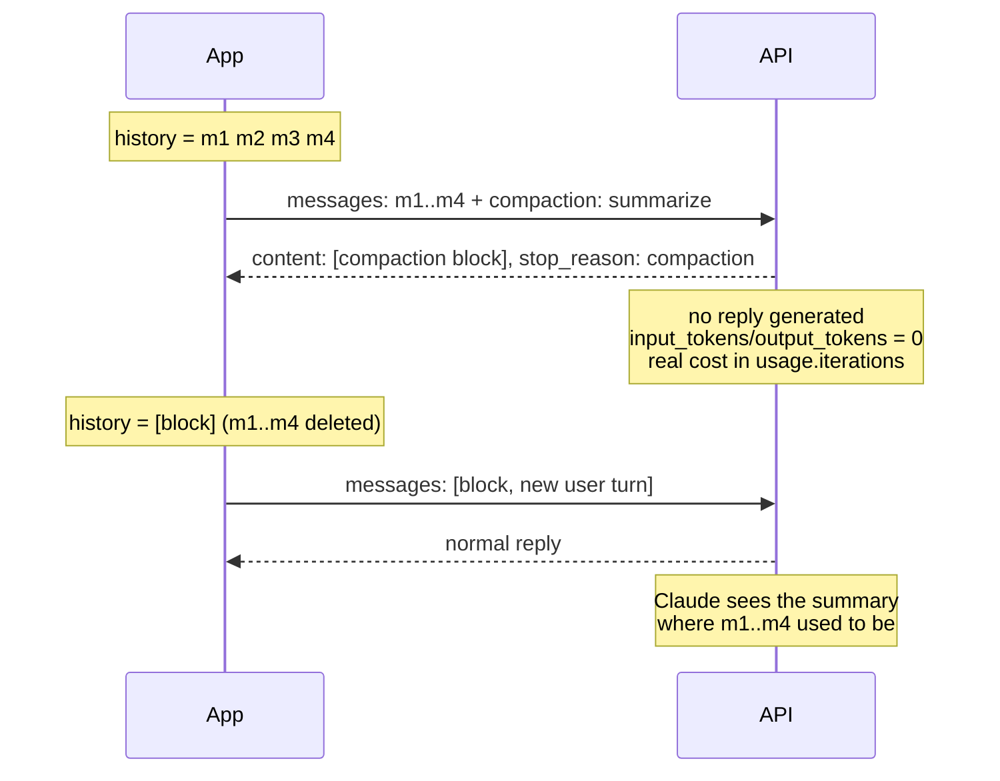

<LevelBadge level="advanced" />

<Callout type="objectives" items={[
  "Distinguere i quattro modi di ridurre il contesto — context editing, compaction on-demand, keep-tail, in background e a soglia — e scegliere quello giusto",
  "Inviare una richiesta di compaction e leggere il blocco di compaction firmato che torna al posto di una risposta",
  "Fare lo scambio correttamente: blocco per primo, messaggi riassunti rimossi, header beta su ogni richiesta successiva",
  "Riconoscere i due errori di scambio che restituiscono HTTP 200 e corrompono la conversazione in silenzio",
  "Gestire il caso in cui non torna nessun riassunto — cinque stop reason, ognuna con una correzione diversa",
  "Contare quanto costa davvero la compaction (usage.iterations, non i campi token di primo livello)",
  "Sapere cosa un riassunto non può mai portarsi dietro: immagini, documenti, upload, URL recuperati e istruzioni di sistema precedenti"
]} />

<VerifyNote lastVerified="2026-10-02" source="https://platform.claude.com/docs/en/build-with-claude/compaction-on-demand">
La compaction on-demand è in **beta pubblica** dietro l'header `compact-2026-09-04`, lanciata il 14 settembre 2026. La compaction a soglia è una beta separata (`compact-2026-01-12`). Header beta, nomi dei campi, codici di errore e disponibilità sulle piattaforme sono citati dalla documentazione ufficiale e possono cambiare mentre la funzionalità è in beta — verificali di nuovo prima di andare in produzione. Disponibilità al momento della scrittura: Claude API, Claude Platform su AWS, Google Cloud e Microsoft Foundry (tutte in beta); **non disponibile su Amazon Bedrock**. Il supporto dei modelli è una capability per modello, non una lista fissa — vedi [Verifica il supporto a runtime](#verifica-il-supporto-a-runtime) e [Modelli e prezzi](/docs/whats-new/models-and-pricing).
</VerifyNote>

Ogni agente a lunga esecuzione prima o poi sbatte contro lo stesso muro: la conversazione cresce fino al punto in cui la richiesta successiva non ci sta più. Hai due opzioni oneste — buttare via il contesto vecchio, oppure *comprimerlo*. La compaction è l'opzione della compressione, fatta dal modello, lato server: invii la conversazione con un parametro in più e, invece di una risposta, ottieni un **blocco di riassunto firmato** che rimandi indietro al posto dei messaggi che sostituisce.

La firma è la parte interessante. Il blocco non è una stringa che hai scritto e iniettato tu — è contenuto prodotto dall'API, che l'API verificherà. Modifica un solo carattere del testo del riassunto e la richiesta successiva fallisce con `compaction_signature_invalid`.

## Quale strumento di riduzione è quale

Qui si sovrappongono quattro funzionalità, e i team le confondono continuamente. Fanno lavori diversi:

| Funzionalità | Chi decide | Cosa fa | Dove finisce il blocco |
| --- | --- | --- | --- |
| **Context editing** (`clear_tool_uses_20250919`) | Tu, in modo dichiarativo | **Cancella** del tutto i vecchi risultati degli strumenti — nessun riassunto | Nessun blocco; vedi [Memoria e context editing](/docs/api/memory-and-context-editing) |
| **Compaction on-demand** (`compaction`) | Tu, per singola richiesta | Riassume i messaggi che invii, in una chiamata separata che non restituisce nessuna risposta | Metti il blocco **per primo** e cancelli ciò che ha sostituito |
| **Compaction keep-tail** | Tu, scegliendo un punto di taglio | Come l'on-demand, ma gli ultimi turni restano parola per parola | Blocco per primo, i turni conservati dopo di esso |
| **Compaction in background** | Tu, in modo asincrono | Come l'on-demand, ma la conversazione continua mentre il riassunto viene scritto | Il blocco sostituisce esattamente i messaggi che hai inviato; i turni successivi restano |
| **Compaction a soglia** (`compact_20260112`) | L'API, a un trigger di token | Riassume il contesto più vecchio *a metà di una richiesta ordinaria* | Il blocco **segue** i messaggi riassunti e l'API li elimina per te |

Due regole che vale la pena memorizzare prima di scrivere qualsiasi riga di codice:

- **Il context editing cancella, la compaction riassume.** Per esecuzioni molto lunghe puoi usarli a strati — ma non nella stessa richiesta che contiene `compaction` (vedi [Limiti](#limiti-e-interazioni)).
- **La compaction on-demand e quella a soglia rimandano indietro il loro blocco in direzioni opposte.** On-demand: il blocco va per primo, i vecchi messaggi li rimuovi tu. A soglia: il blocco arriva per ultimo, li rimuove l'API. Invertire queste due cose è l'errore più comune in assoluto.

## Come funziona lo scambio



La richiesta di compaction è **fuori dal percorso della conversazione**: trasporta la tua cronologia, restituisce un riassunto e non genera nessun turno dell'assistente. La tua richiesta reale successiva è quella che fa continuare la conversazione.

## Verifica il supporto a runtime

Il supporto dei modelli alla compaction è un flag di capability, non qualcosa da scrivere a mano nel codice. Chiama la Models API con l'header beta e leggi `capabilities.compaction` su ciascun modello. Questo sopravvive ai lanci e alle deprecazioni dei modelli come una lista copiata non farà mai.

## Lancia la tua prima richiesta di compaction

<Steps items={[
  {title: "Aggiungi l'header beta", body: "Invia anthropic-beta: compact-2026-09-04 sulla richiesta di compaction E su ogni richiesta successiva che trasporta il blocco restituito. Dimenticalo su una richiesta successiva e ottieni un errore di validazione confuso che dice che compaction non è un tipo di content block previsto — il messaggio non menziona mai l'header."},
  {title: "Invia la conversazione così com'è, più il parametro compaction", body: "Al primo livello: compaction con type 'summarize'. L'API riassume ogni messaggio presente nella richiesta, esattamente una volta, e restituisce il solo blocco."},
  {title: "Invia lo stesso system prompt e gli stessi strumenti che usi per il resto della conversazione", body: "Il riassuntore li legge. Non esegue mai uno strumento. Sui modelli con thinking preservato, il thinking nei turni che conservi dopo il blocco resta valido solo se system e tools coincidono."},
  {title: "Dai a max_tokens spazio reale", body: "max_tokens limita l'intera chiamata di riassunto, incluso l'eventuale thinking che il modello fa prima di scrivere il riassunto. Qualche migliaio di token è l'ordine di grandezza corretto — 4096 negli esempi ufficiali di Anthropic."},
  {title: "Fai la compaction PRIMA di superare la finestra", body: "La richiesta di compaction stessa deve stare nella finestra di contesto del modello. Una conversazione che è già troppo grande per essere inviata è troppo grande per essere compattata."},
  {title: "Controlla stop_reason prima di cercare il blocco", body: "Una compaction riuscita termina con stop_reason 'compaction'. Qualsiasi altra stop reason significa che nessun riassunto è stato prodotto — e la risposta è comunque un 200 con content vuoto."}
]} />

<PromptCard title="curl — chiedi un riassunto della conversazione finora">{`curl https://api.anthropic.com/v1/messages \\
  -H "x-api-key: $ANTHROPIC_API_KEY" \\
  -H "anthropic-version: 2023-06-01" \\
  -H "anthropic-beta: compact-2026-09-04" \\
  -H "content-type: application/json" \\
  -d '{
    "model": "claude-opus-5-5",
    "max_tokens": 4096,
    "messages": [
      {"role": "user", "content": "I am building a recipe app. Name the main entities."},
      {"role": "assistant", "content": "Recipe, Ingredient, Step, and a RecipeIngredient entry holding quantity and unit."},
      {"role": "user", "content": "Good. Now suggest field names for Recipe."}
    ],
    "compaction": {"type": "summarize"}
  }'`}</PromptCard>

Ciò che torna è un unico content block e una stop reason inconfondibile:

```json
{
  "content": [
    {
      "type": "compaction",
      "content": "Summary of the conversation: the user is designing the data model for a recipe app...",
      "signature": "EuYBCkQY..."
    }
  ],
  "stop_reason": "compaction",
  "usage": {
    "input_tokens": 0,
    "output_tokens": 0,
    "iterations": [{"type": "compaction", "input_tokens": 144, "output_tokens": 276}]
  }
}
```

Nota gli zeri. I campi token di primo livello sono a zero *perché non è stata generata nessuna risposta* — il costo reale sta in `usage.iterations`. Se la tua dashboard dei costi somma solo i campi di primo livello, la compaction sembrerà gratis e la tua fattura non sarà d'accordo.

Lo streaming funziona, ma non c'è nulla da trasmettere: ricevi un solo `content_block_start` che trasporta il blocco completo, poi `content_block_stop`, senza eventi delta in mezzo (eventi `ping` possono arrivare intorno a essi).

## Continua dal riassunto

Sostituisci i messaggi che hai inviato con il messaggio dell'assistente restituito, mantenendo il blocco **byte per byte** come l'API l'ha restituito — `content`, `signature`, e niente di aggiunto.

<PromptCard title="La richiesta successiva — blocco per primo, vecchi messaggi spariti">{`{
  "model": "claude-opus-5-5",
  "max_tokens": 2048,
  "messages": [
    {
      "role": "assistant",
      "content": [
        {
          "type": "compaction",
          "content": "Summary of the conversation: the user is designing the data model...",
          "signature": "EuYBCkQY..."
        }
      ]
    },
    {"role": "user", "content": "Now do the same for Ingredient."}
  ]
}`}</PromptCard>

Lo scambio è governato da tre regole:

1. **Il blocco va per primo in `messages`** — sia come messaggio `assistant` a sé stante, sia come primo content block del primo messaggio (`user` o `assistant`, va bene in entrambi i casi).
2. **I messaggi riassunti vengono rimossi.** Se qualcuno di essi resta *davanti* al blocco, ottieni un 400 con `compaction_block_misplaced`.
3. **Esattamente un blocco `compaction` per richiesta**, su ogni richiesta successiva, con l'header beta.

Due messaggi `assistant` di fila qui sono legittimi — se una risposta è arrivata mentre il riassunto veniva scritto, semplicemente segue il blocco.

### I due errori che non sollevano nessun errore

<Callout type="warning" items={[
  "Messaggi riassunti lasciati DOPO il blocco: nessun errore. L'API li rimanda tranquillamente a Claude, quindi paghi il riassunto E la cronologia che avrebbe dovuto sostituire.",
  "Blocco omesso da una richiesta successiva: nessun errore. Claude semplicemente non riceve nessun riassunto, e la conversazione perde in silenzio tutto ciò che precedeva lo scambio.",
  "Entrambi i fallimenti restituiscono HTTP 200. Niente nella risposta dice che hai sbagliato — fai asserzioni sulla forma della tua cronologia nei test, non sui codici di stato."
]} />

### Compattare di nuovo

Per compattare una conversazione che già inizia con un blocco, invia di nuovo `compaction`. Il nuovo blocco riassume il vecchio riassunto *e* tutto ciò che viene dopo. Da quel momento in poi, invia solo il blocco più recente.

## Compaction in un loop

La decisione su *quando* è tua. La stima economica di «quanto sarà grande la mia prossima richiesta» è `input_tokens + output_tokens` dall'ultima risposta — la richiesta successiva rimanda quella risposta, quindi conta. Con il [prompt caching](/docs/api/prompt-caching) attivo, `input_tokens` copre solo i token dopo l'ultimo cache breakpoint, quindi aggiungi anche `cache_read_input_tokens` e `cache_creation_input_tokens`. Oppure invia gli stessi messaggi all'endpoint di conteggio dei token.

<PromptCard title="Python — compatta quando la richiesta successiva diventerebbe troppo grande">{`from anthropic.types.beta import BetaMessageParam

client = anthropic.Anthropic()
COMPACT_AT_TOKENS = 120_000   # set this near your real input budget
SYSTEM = "You help design a recipe app's data model. Keep answers short."
QUESTIONS = [...]             # your stream of user turns

history: list[BetaMessageParam] = []
for turn, question in enumerate(QUESTIONS, start=1):
    history.append({"role": "user", "content": question})
    response = client.beta.messages.create(
        model="claude-opus-5-5",
        max_tokens=8192,
        system=SYSTEM,
        betas=["compact-2026-09-04"],
        messages=history,
    )
    history.append({"role": "assistant", "content": response.content})

    # The next request resends this reply too, so count it.
    conversation_tokens = response.usage.input_tokens + response.usage.output_tokens
    if conversation_tokens > COMPACT_AT_TOKENS and turn < len(QUESTIONS):
        summary = client.beta.messages.create(
            model="claude-opus-5-5",
            max_tokens=4096,
            system=SYSTEM,                      # same system prompt and tools
            betas=["compact-2026-09-04"],
            messages=history,
            compaction={"type": "summarize"},
        )
        if summary.stop_reason == "compaction":  # check BEFORE reading content
            history = [{"role": "assistant", "content": summary.content}]`}</PromptCard>

Nota la forma dello scambio: la cronologia viene **sostituita**, non ampliata. E il controllo di `stop_reason` viene per primo — quando non torna nessun riassunto, questo loop conserva la cronologia completa e riprova dopo il turno successivo, che è esattamente il fallback giusto.

In Python, usa `client.beta.messages`. Se chiami `client.messages` e serializzi i blocchi da solo, usa `to_dict()` o `model_dump(exclude_none=True)` — un `model_dump()` semplice aggiunge `citations: null` e `text: null` al blocco, e l'API rifiuta i campi che non ha restituito.

Il tool runner dell'SDK può farlo per te: chiama `compact_before_next_turn()` (`compactBeforeNextTurn()` in TypeScript, Java e PHP; `CompactBeforeNextTurn()` in C# e Go) e invierà la richiesta di compaction appena il turno corrente e le sue chiamate agli strumenti sono finiti. Crea il runner con la beta `compact-2026-09-04` — il runner non la aggiunge.

## Conserva gli ultimi turni parola per parola

**Non esiste un parametro** per questo, cosa che sorprende molti. La compaction keep-tail è una decisione su cosa metti nella richiesta: scegli un punto di taglio, invii per il riassunto solo i messaggi più vecchi e metti il blocco restituito davanti ai turni che hai conservato.

<Steps items={[
  {title: "Scegli il taglio", body: "I messaggi precedenti al taglio entrano nella richiesta di compaction; quelli dal taglio in avanti vengono conservati per intero. Più ne conservi, meno spazio liberi."},
  {title: "Non separare mai una chiamata a uno strumento dal suo risultato", body: "Ogni chiamata a uno strumento e il suo risultato devono finire dalla stessa parte. Se i messaggi che invii terminano con un turno dell'assistente la cui chiamata a uno strumento non ha ancora un risultato, l'API rifiuta la richiesta di compaction."},
  {title: "Taglia tra una risposta e il messaggio utente successivo", body: "Quel confine soddisfa anche la condizione che mantiene valido il thinking preservato nei turni conservati. Funziona anche un taglio alla fine di una richiesta che hai già fatto: compatta esattamente i messaggi di quella richiesta e conserva tutto quello che è venuto dopo."},
  {title: "Ricostruisci la cronologia come blocco + turni conservati", body: "Valgono ancora tutte le regole dello scambio viste sopra — blocco per primo, messaggi riassunti spariti, header beta su ogni richiesta."}
]} />

## Compaction in background

La compaction in background (o asincrona) cambia due cose nel loop: la richiesta di compaction gira mentre la conversazione continua sulla sua cronologia **completa**, e lo scambio attende l'arrivo del blocco.

<Steps items={[
  {title: "Registra quanti messaggi hai inviato", body: "Invia la richiesta di compaction su una copia della cronologia e ricorda il conteggio — è esattamente ciò che il blocco sostituirà."},
  {title: "Continua a conversare sulla cronologia completa", body: "Aggiungi nuovi turni, non modificare nulla di ciò che è già nella cronologia, e non avviare una seconda richiesta di compaction mentre una è pendente."},
  {title: "All'arrivo, sostituisci dall'inizio", body: "Quando la risposta torna con stop_reason 'compaction', elimina esattamente quegli N messaggi dall'inizio e metti il messaggio restituito al loro posto. Tutto quello che hai aggiunto nel frattempo resta dopo di esso."},
  {title: "Invia la cronologia scambiata già nella richiesta immediatamente successiva", body: "È ciò che mantiene valido il thinking prodotto mentre il riassunto veniva scritto."},
  {title: "Svuota la richiesta pendente prima di fermarti", body: "Se una richiesta di compaction è ancora in volo quando il tuo loop termina, aspettala e fai lo scambio — altrimenti un riassunto che hai già pagato va perso."}
]} />

Mentre quella richiesta gira hai due richieste aperte contemporaneamente, e la richiesta di compaction conta sui tuoi rate limit come qualsiasi altra. Quindi avviala mentre la finestra ha ancora spazio per i turni che arriveranno nel frattempo.

## Compaction a soglia: lascia decidere all'API

La compaction a soglia è la variante automatica. La configuri una volta come edit di `context_management` sulle tue richieste ordinarie, e l'API riassume il contesto più vecchio a metà di una richiesta quando i token di input superano il tuo trigger.

| Campo | Significato |
| --- | --- |
| `type` | `"compact_20260112"` |
| `trigger` | `{"type": "input_tokens", "value": N}` — `input_tokens` è l'unico tipo di trigger; `value` deve essere almeno 50.000 (default 150.000) |
| `pause_after_compaction` | `false` per default — impostalo per mettere in pausa dopo la generazione del riassunto invece di continuare la risposta |
| `instructions` | Prompt di riassunto personalizzato, opzionale; quando è presente sostituisce integralmente il prompt predefinito |

Rimandare indietro il blocco è la parte facile, ed è l'opposto dell'on-demand: aggiungi in coda tutto il content della risposta, blocco incluso, e l'API elimina i blocchi che lo *precedono* nelle richieste successive. L'header beta è `compact-2026-01-12`.

Scegli la compaction a soglia quando vuoi il comportamento «non ci penso più». Scegli l'on-demand quando vuoi che la compaction avvenga a un confine *semantico* — fine di un sotto-task, dopo che un piano è stato concordato, prima di aprire un nuovo file — invece che a un conteggio di token. E scegline una per richiesta: `compaction` e `context_management` non possono essere inviati insieme, la compaction a soglia non può girare su una richiesta che trasporta un blocco on-demand firmato, e il tool runner rifiuta di compattare mentre il suo `context_management` contiene un edit di compaction.

## Scrivi il tuo prompt di riassunto

Senza `instructions`, l'API usa il proprio prompt di riassunto. Una stringa `instructions` non vuota (fino a 16.384 caratteri) **sostituisce integralmente quel prompt** — non viene aggiunta in coda.

<PromptCard title="instructions — di' cosa deve sopravvivere, e vieta le chiamate agli strumenti">{`{
  "compaction": {
    "type": "summarize",
    "instructions": "Summarize this design conversation. Preserve every entity and field name agreed so far, every decision marked FINAL, and the user's latest open request. Do not call tools; respond with the summary text only."
  }
}`}</PromptCard>

Due cose si meritano un posto in ogni `instructions` personalizzata: una lista esplicita di ciò che va conservato, e «non chiamare strumenti». Un riassuntore che chiama uno strumento non produce nessun riassunto (vedi la sezione successiva).

## Quando non torna nessun riassunto

Un riassunto viene prodotto solo quando la chiamata di riassunto termina normalmente, con testo e senza chiamate agli strumenti. Altrimenti ottieni un **200 con `content` vuoto** — ed è per questo che `stop_reason` è la cosa su cui ramificare. La chiamata viene fatturata in entrambi i casi e riportata in `usage.iterations` (consumo a zero se nessuna chiamata è stata possibile). In ogni caso puoi continuare senza riassunto e compattare più tardi.

| `stop_reason` | Causa | Correzione |
| --- | --- | --- |
| `"max_tokens"` | Il riassunto è stato troncato | Rimanda con un `max_tokens` più grande |
| `"model_context_window_exceeded"` | Nessuno spazio per il prompt di riassunto | Rimanda con `instructions` più corte o meno messaggi |
| `"tool_use"` | Il modello ha chiamato uno strumento invece di riassumere | Rimanda con `instructions` che vietano le chiamate agli strumenti |
| `"refusal"` | La richiesta è stata rifiutata — `stop_details` indica la categoria di policy | Continua senza riassunto |
| `"end_turn"` | La chiamata non ha restituito testo | Continua senza riassunto |

## Errori

La maggior parte dei 400 porta un messaggio che dice cosa rimuovere o rimandare; alcuni portano anche un `error.details.error_code` che inizia con `compaction_`.

| Errore | Causa | Correzione |
| --- | --- | --- |
| 529 `overloaded_error` + `compaction_unavailable` | Problema transitorio del server nel produrre o leggere un blocco | Riprova |
| 400 `compaction_block_misplaced` | Messaggi riassunti rimasti davanti al blocco | Rimuovili così che il blocco venga per primo |
| 400 `compaction_signature_invalid` / `compaction_content_mismatch` | La `signature` o il `content` del blocco è stato modificato dopo la restituzione | Invia il blocco esattamente come restituito |
| 400 `compaction_nothing_to_summarize` | `messages` non contiene contenuto `user` o `assistant` | Invia almeno un messaggio |
| 400 (solo messaggio) | Più di un blocco `compaction` nella richiesta | Inviane esattamente uno — il più recente |
| 400 (solo messaggio) | L'ultimo turno `assistant` termina con una chiamata a uno strumento senza risultato | Invia i risultati degli strumenti di quel turno, poi compatta |
| 400 (solo messaggio) | `stop_sequences`, `output_config.format` per l'output strutturato, o `tool_choice` di tipo `any`/`tool` inviati su una richiesta di compaction | Rimuovili — su una chiamata di riassunto non farebbero nulla |
| 400 errore di validazione che nomina un campo in eccesso, es. `compaction.citations: Extra inputs are not permitted` | Il blocco è stato ri-serializzato con campi che l'API non ha mai restituito | Serializza con `to_dict()` / `model_dump(exclude_none=True)` |
| 400 "`compaction` requires `anthropic-beta: compact-2026-09-04`" | Header beta mancante sulla richiesta di compaction | Aggiungi l'header |
| 400 errore di validazione che dice che `compaction` non è un tipo di content block previsto | Header beta mancante su una richiesta *successiva* che trasporta il blocco — il messaggio non menziona l'header | Aggiungi l'header a ogni richiesta che trasporta il blocco |

## Limiti e interazioni

- **Un solo meccanismo di riduzione per richiesta.** `compaction` e `context_management` non possono essere combinati.
- **Budget dei task.** Non inviare `output_config.task_budget.remaining` con `compaction` né su richieste che trasportano il blocco — restituisce un 400. Vedi [Budget dei task](/docs/api/task-budgets).
- **Prompt caching.** `cache_control` sul blocco piazza un breakpoint subito dopo il riassunto — di solito esattamente dove lo vuoi, dato che il riassunto è ora un prefisso stabile. Rimandare indietro il blocco nelle richieste successive non aggiunge nessun costo di compaction.
- **Il conteggio dei token** ignora completamente il parametro `compaction`.
- **I messaggi di sistema precedenti si dissolvono.** Un messaggio `role: "system"` a metà conversazione che cade nell'intervallo riassunto viene riassunto come qualsiasi altra cosa, quindi le sue istruzioni smettono di applicarsi appena il blocco le sostituisce. Se un'istruzione conta ancora, ridichiarala in un nuovo messaggio `role: "system"` subito dopo il tuo prossimo nuovo turno `user`, e tienila nella cronologia da lì in avanti.
- **Alcuni contenuti non possono sopravvivere a un riassunto.** Immagini, documenti, blocchi `container_upload` e URL recuperati all'interno dei messaggi riassunti **sono persi** — il riassunto è testo. Ridichiara o ricarica tutto ciò che serve ancora a un turno successivo.

<Callout type="tip" items={["Tratta il confine della compaction come un checkpoint su cui puoi ragionare: logga il testo del riassunto insieme al numero di messaggi che ha sostituito. Quando più tardi un agente si comporta come se avesse dimenticato qualcosa, quel log ti dice in un colpo d'occhio se il fatto è stato riassunto via o non è mai stato catturato.","La compaction è uno strumento per la finestra di contesto, non per i costi. Riduce i token che rimandi a ogni turno successivo, ma la chiamata di riassunto in sé viene fatturata — su una conversazione breve puoi facilmente spendere più di quanto risparmi.","Se fai anche trimming lato client, decidi quale strato possiede quale contenuto: context editing per i risultati degli strumenti obsoleti, compaction per il filo del discorso. Due meccanismi che si litigano gli stessi messaggi sono il modo in cui i riassunti finiscono per descrivere cose che il modello non può più vedere."]} />

## Errori comuni

- **Leggere `content[0]` prima di controllare `stop_reason`.** Cinque stop reason diverse restituiscono un `content` vuoto con un 200. È la prima fonte di `IndexError` nel codice che usa la compaction.
- **Sommare i campi token di primo livello.** Sono a zero in una risposta di compaction. Il costo sta in `usage.iterations`.
- **Ri-serializzare il blocco.** Qualsiasi campo che aggiungi e che l'API non ha restituito (`citations: null` è il classico) viene rifiutato.
- **Compattare troppo tardi.** La richiesta di compaction deve stare essa stessa nella finestra di contesto. «Compatto quando la richiesta fallisce» non è una strategia.
- **Conservare una coda che separa una chiamata a uno strumento dal suo risultato.** Rifiutato senza appello — scegli i tagli ai confini dei messaggi utente.
- **Dare per scontato che le immagini sopravvivano.** Non sopravvivono. E nemmeno gli upload o le pagine recuperate.

## Mettiti alla prova

<Quiz questions={[
  {
    q: "La tua richiesta di compaction restituisce HTTP 200, ma response.content è una lista vuota. Cos'è successo?",
    options: [
      "La conversazione era troppo breve da riassumere — niente da fare",
      "Nessun riassunto è stato prodotto; stop_reason ti dice quale delle cinque cause è stata, e puoi continuare senza riassunto",
      "Mancava l'header beta",
      "La verifica della firma è fallita"
    ],
    answer: 1,
    explain: "Un riassunto viene prodotto solo quando la chiamata di riassunto termina normalmente, con testo e senza chiamate agli strumenti. Altrimenti la risposta è comunque un 200 con content vuoto, e stop_reason è max_tokens, model_context_window_exceeded, tool_use, refusal o end_turn. Rami sempre su stop_reason prima di leggere content."
  },
  {
    q: "Dopo una compaction on-demand, dove va il blocco in messages — e cosa succede ai messaggi che ha riassunto?",
    options: [
      "Per ultimo, e l'API elimina per te i messaggi riassunti",
      "Per primo, e devi rimuovere tu stesso i messaggi riassunti",
      "Dove capita, purché ci sia esattamente un blocco",
      "Per primo, e conviene conservare i messaggi riassunti per tracciabilità"
    ],
    answer: 1,
    explain: "Compaction on-demand: il blocco va per primo e cancelli ciò che ha sostituito — lasciare i messaggi riassunti davanti a esso restituisce 400 compaction_block_misplaced, e lasciarli dopo di esso li rimanda in silenzio a Claude. La compaction a soglia è quella che funziona al contrario: il suo blocco segue i messaggi riassunti e l'API li elimina per te."
  },
  {
    q: "Una conversazione includeva uno screenshot a cui l'agente continua a fare riferimento. Fai la compaction. Cosa deve fare il tuo codice?",
    options: [
      "Nulla — il riassunto descrive l'immagine abbastanza bene",
      "Nulla — i blocchi immagine vengono preservati attraverso la compaction",
      "Ricaricare o ridichiarare l'immagine, perché immagini, documenti, blocchi container_upload e URL recuperati non sopravvivono a un riassunto",
      "Impostare instructions per preservare il contenuto dell'immagine"
    ],
    answer: 2,
    explain: "Il blocco di compaction è testo più una firma. Immagini, documenti, blocchi container_upload e URL recuperati all'interno dei messaggi riassunti sono persi appena il blocco li sostituisce — ridichiara o ricarica tutto ciò che serve ancora a un turno successivo. Nessuna stringa instructions cambia questo."
  }
]} />

## Glossario

<Flashcards title="Glossario della compaction" cards={[
  {front: "blocco di compaction", back: "Il content block che l'API restituisce al posto di una risposta. Contano due campi: content (il testo del riassunto, leggibile) e signature (verificata a ogni richiesta successiva). Rimandalo indietro byte per byte."},
  {front: "stop_reason: compaction", back: "L'unica stop reason che significa che un riassunto è stato prodotto. Controllala prima di leggere content — altre cinque stop reason restituiscono un 200 con content vuoto."},
  {front: "compact-2026-09-04", back: "Header beta per la compaction on-demand. Obbligatorio sulla richiesta di compaction E su ogni richiesta successiva che trasporta il blocco."},
  {front: "compact_20260112", back: "Il tipo di edit context_management per la compaction A SOGLIA (header compact-2026-01-12). Si attiva su input_tokens, minimo 50.000, default 150.000."},
  {front: "usage.iterations", back: "Dove viene riportato il costo reale di una chiamata di compaction, come voce 'compaction'. I campi input_tokens e output_tokens di primo livello sono a zero perché non è stata generata nessuna risposta."},
  {front: "compaction_block_misplaced", back: "Errore 400: i messaggi riassunti sono ancora davanti al blocco. Il blocco deve venire per primo in messages."},
  {front: "Compaction keep-tail", back: "Nessun parametro — scegli un punto di taglio, invii per il riassunto solo i messaggi più vecchi e metti il blocco davanti ai turni che hai conservato. Non separare mai una chiamata a uno strumento dal suo risultato."},
  {front: "Compaction in background", back: "Esegui la richiesta di compaction su uno snapshot mentre la conversazione continua sulla sua cronologia completa, poi sostituisci esattamente i messaggi che hai inviato, conservando tutto ciò che è stato aggiunto nel frattempo."}
]} />

## Punti chiave

<Callout type="takeaways" items={[
  "La compaction scambia una chiamata di riassunto con una cronologia più corta — l'API riassume i messaggi che invii e restituisce un unico blocco FIRMATO da usare al loro posto",
  "On-demand: blocco per primo, cancelli tu ciò che ha sostituito. A soglia: blocco per ultimo, cancella l'API. Confondere le due è il bug più comune",
  "Rami su stop_reason, mai sullo stato HTTP — un riassunto fallito è un 200 con content vuoto, e lo sono anche entrambi gli errori di scambio",
  "Il costo vive in usage.iterations; i campi token di primo livello sono a zero. La compaction risparmia token di re-invio, non necessariamente soldi",
  "Compatta PRIMA che la finestra sia piena — anche la richiesta di compaction deve starci dentro",
  "Immagini, documenti, upload, URL recuperati e istruzioni di sistema precedenti non sopravvivono a un riassunto. Ridichiara ciò che conta ancora",
  "Un meccanismo per richiesta: compaction e context_management non possono essere combinati, e un blocco firmato blocca la compaction a soglia"
]} />

## Avanti

- [Memoria e context editing](/docs/api/memory-and-context-editing) — il fratello basato sulla cancellazione, e come usarlo a strati con la compaction
- [Budget dei task](/docs/api/task-budgets) — il tetto indicativo di token che copre un intero loop agentico, anche attraverso la compaction
- [Prompt caching](/docs/api/prompt-caching) — perché un blocco di compaction è un cache breakpoint insolitamente buono
- [Context engineering](/docs/frontiers/context-engineering) — compaction, presa di appunti e retrieval just-in-time come un'unica disciplina
