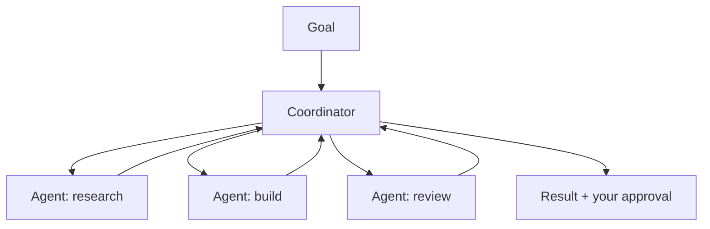

<LevelBadge level="advanced" />

<VerifyNote lastVerified="2026-06-20" source="https://docs.anthropic.com">
Cowork e i team di agent sono superfici del 2026 in rapida evoluzione — nomi, disponibilità e funzionalità cambiano spesso. Conferma i dettagli attuali nella documentazione/negli annunci ufficiali di Anthropic.
</VerifyNote>

Oltre al singolo agent, Anthropic ha rilasciato superfici a **livello di prodotto** che permettono agli agent di svolgere un lavoro collaborativo e prolungato: **Cowork** (uno spazio di lavoro desktop agentico) e i **team di agent** (più agent che collaborano). Questa pagina è una mappa ad alto livello — verifica le specifiche nella documentazione ufficiale, poiché evolvono rapidamente.

## Claude Cowork

Pensalo come uno **spazio di lavoro dove un agent svolge un lavoro reale, in più passaggi** accanto a te — operando su file e strumenti su un orizzonte più lungo di un singolo turno di chat, con te a supervisionare. È il cugino consumer/pro della costruzione di un agent sull'API: il loop è fornito, tu indirizzi gli obiettivi.

## Team di agent

Quando un singolo agent non basta, **più agent collaborano** — dividendosi un obiettivo, ciascuno con un ruolo e degli strumenti, coordinandosi verso un risultato. Concettualmente rispecchia i [subagent](/docs/claude-code/subagents) di Claude Code, ma come superficie di prodotto per una collaborazione multi-agent prolungata anziché un singolo sottocompito delegato.

## Come si collega al resto del sito

- Costruirlo da solo, programmaticamente → [Costruire agent](/docs/api/building-agents) + l'[Agent SDK](/docs/claude-code/headless-and-agent-sdk).
- Delega all'interno di una sessione di coding → [Subagent](/docs/claude-code/subagents).
- Loop/stato/scheduling gestiti → [Agent gestiti](/docs/api/managed-agents).

## La costante: la supervisione

:::warning Più autonomia, più attenzione
Il lavoro multi-agent e a lungo orizzonte amplifica sia il valore *sia* il rischio. Mantieni gli umani nel loop sulle azioni di rilievo, limita strettamente l'accesso agli strumenti e verifica gli output — vedi [Uso responsabile](/docs/security/responsible-use) e [Mettere in sicurezza gli agent](/docs/security/securing-agents).
:::

## Avanti

- [Subagent e agent paralleli](/docs/claude-code/subagents)
- [Agent gestiti](/docs/api/managed-agents)
- [Uso responsabile, etica e verifica](/docs/security/responsible-use)
