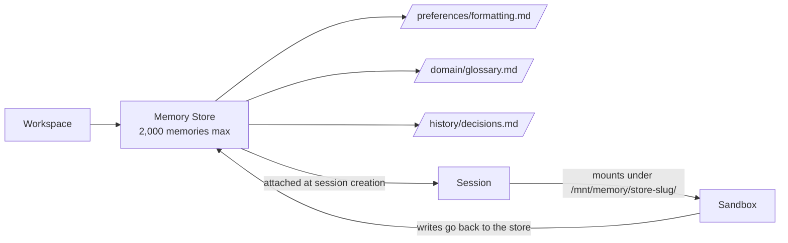

<LevelBadge level="advanced" />

<Callout type="objectives" items={["Cos'è un Memory Store — e in cosa differisce dal precedente memory tool client-side", "Come i store si montano nella sandbox della sessione in /mnt/memory/ e come l'agente li usa", "La regola del beta header che frega tutti (agent-memory-2026-07-22 vs managed-agents-2026-04-01)", "Il ciclo di vita completo: create → seed → attach → read/write → audit delle versioni → redact", "I limiti concreti: 8 store per sessione, 2.000 memorie per store, 100 kB per memoria"]} />

<VerifyNote lastVerified="2026-07-30" source="https://platform.claude.com/docs/en/managed-agents/memory">
I Memory Store sono in **public beta** dal 22 luglio 2026. Endpoint, stringhe degli header e limiti cambiano durante la beta — verifica contro il riferimento ufficiale prima di andare in produzione.
</VerifyNote>

Se hai lavorato con i [Managed Agents](/docs/api/managed-agents), sai che di default ogni sessione parte con un contesto pulito. Quando la sessione finisce, tutto quello che l'agente ha imparato se ne va con lei. I **Memory Store** sono la soluzione first-party: collezioni versionate di documenti di testo, gestite server-side, che persistono tra sessioni e si montano nella sandbox dell'agente come una normale directory che può leggere e scrivere con i suoi file tool.

## Memory Store vs il memory tool client-side

Nella piattaforma Claude esistono ora **due primitive "memory" diverse**. Non confonderle.

| | **Memory Store** (questa pagina) | **Memory tool client-side** ([pagina separata](/docs/api/memory-and-context-editing)) |
|---|---|---|
| **Dove vive la memoria** | Ospitata da Anthropic, scope di workspace | Il tuo storage (Redis, Postgres, file…) |
| **Chi guida il loop** | Managed Agents | Tu (Messages API + tool loop) |
| **Beta header** | `agent-memory-2026-07-22` | `context-management-2025-06-27` (memory tool) |
| **Come l'agente la legge** | Montata come file in `/mnt/memory/` | Chiamate a tool (`view`, `str_replace`, `create`…) |
| **Audit trail** | Versioni immutabili, endpoint di redact | Quello che costruisci tu |

Stessa *idea* (stato persistente); *primitiva* diversa. Tutto quello che segue riguarda i **Memory Store** — quelli server-side, solo per Managed Agents.

## Il modello mentale

Un store è una cartella di piccoli file Markdown/testo (memorie), con scope di workspace. Quando lo colleghi a una sessione, appare come un mount dentro la sandbox, e Claude lo legge e ci scrive con il [toolset agente](https://platform.claude.com/docs/en/managed-agents/tools) standard — gli stessi tool che usa per il resto del filesystem.

Due corollari importanti:

- Una **nota su ogni mount** (nome, mount path, access mode, descrizione e le eventuali `instructions` per la sessione) viene inserita automaticamente nel system prompt. L'agente sa che il mount esiste senza che tu debba dirglielo.
- Le scritture **fuori** dal mount path — ovunque altro sotto `/mnt/memory/` — finiscono in scratch container-locale e si perdono quando la sessione termina. Persistono solo le scritture al mount path.

## La regola del beta header (l'inghippo)

Qui la gente perde 20 minuti.

<Callout type="warning" items={["Gli endpoint dei memory store usano anthropic-beta: agent-memory-2026-07-22 — nient'altro.", "Gli endpoint delle sessioni (compreso il collegare un memory store a una sessione) usano ancora managed-agents-2026-04-01.", "Inviare entrambi in una richiesta a un memory store restituisce HTTP 400. Se il tuo codice imposta beta header espliciti, sostituisci — non aggiungere."]} />

Se usi l'SDK ufficiale, imposta l'header corretto in automatico. Se sei su HTTP raw, separa i call site:

| Chiamata | Header |
|---|---|
| `POST /v1/memory_stores` (create) | `agent-memory-2026-07-22` |
| `POST /v1/memory_stores/{id}/memories` (create/list/update/delete di una memoria) | `agent-memory-2026-07-22` |
| `POST /v1/memory_stores/{id}/memory_versions/…/redact` | `agent-memory-2026-07-22` |
| `POST /v1/sessions` — collegare uno store in `resources[]` | `managed-agents-2026-04-01` |

## Il ciclo di vita

<Steps items={[{title: "1. Crea lo store", body: "POST /v1/memory_stores con un nome e una descrizione. La descrizione viene passata all'agente, quindi dovrebbe leggersi come un brief: 'Preferenze per-utente e contesto del progetto'."}, {title: "2. Fai il seed (opzionale)", body: "Precarica materiale di riferimento con memories.create a path come /formatting_standards.md. Perfetto per conoscenza condivisa in sola lettura che ogni sessione deve vedere."}, {title: "3. Collega alla creazione della sessione", body: "Metti una voce in resources[] con type: memory_store, memory_store_id, access e opzionali instructions su POST /v1/sessions. Gli store possono essere collegati solo alla creazione della sessione — non aggiunti o rimossi in corso."}, {title: "4. Lascia che l'agente lo legga e scriva", body: "Lo store si monta in /mnt/memory/[store-slug]/ (leggi l'esatto mount_path dalla risposta). I normali file tool dell'agente fanno il resto, e le loro chiamate compaiono come eventi agent.tool_use/agent.tool_result nello stream."}, {title: "5. Audit e redact", body: "Ogni scrittura crea una memory version immutabile. Usa memory_versions per ispezionare la history, tornare indietro riscrivendo un contenuto precedente, o cancellare contenuti sensibili dalla history con l'endpoint redact."}]} />

## Crea uno store e una prima memoria

Nome e descrizione dello store sono ciò che l'agente vede — scrivili come scriveresti il README di una cartella.

<PromptCard title="Crea lo store (curl, HTTP raw)">{`curl -s https://api.anthropic.com/v1/memory_stores \\
  -H "x-api-key: $ANTHROPIC_API_KEY" \\
  -H "anthropic-version: 2023-06-01" \\
  -H "anthropic-beta: agent-memory-2026-07-22" \\
  -H "content-type: application/json" \\
  -d '{"name": "User Preferences", "description": "Per-user preferences and project context."}'
# -> {"id": "memstore_01Hx...", ...}`}</PromptCard>

<PromptCard title="Fai il seed di una memoria">{`curl -s "https://api.anthropic.com/v1/memory_stores/$store_id/memories" \\
  -H "x-api-key: $ANTHROPIC_API_KEY" \\
  -H "anthropic-version: 2023-06-01" \\
  -H "anthropic-beta: agent-memory-2026-07-22" \\
  -H "content-type: application/json" \\
  -d '{"path": "/formatting_standards.md", "content": "All reports use GAAP formatting. Dates are ISO-8601."}'`}</PromptCard>

## Collega uno store a una sessione

Nota che l'header ritorna a `managed-agents-2026-04-01` — gli endpoint di sessione, incluso l'attach, usano l'header dei Managed Agents.

<PromptCard title="Attach alla creazione della sessione (read_write)">{`curl -s https://api.anthropic.com/v1/sessions \\
  -H "x-api-key: $ANTHROPIC_API_KEY" \\
  -H "anthropic-version: 2023-06-01" \\
  -H "anthropic-beta: managed-agents-2026-04-01" \\
  -H "content-type: application/json" \\
  -d '{
    "agent": "$AGENT_ID",
    "environment_id": "$ENVIRONMENT_ID",
    "resources": [{
      "type": "memory_store",
      "memory_store_id": "$STORE_ID",
      "access": "read_write",
      "instructions": "User preferences and project context. Check before starting any task."
    }]
  }'`}</PromptCard>

Il campo `instructions` ha un tetto di 4.096 caratteri ed è mostrato all'agente insieme a `name` e `description` dello store.

## Modalità di accesso e rischio di injection

`access` di default è `read_write`. È la scelta giusta quando l'agente deve *imparare* dalla sessione. È la scelta **sbagliata** per uno store che non vuoi che nessuno (o niente) modifichi.

<Callout type="warning" items={["Uno store read_write è a valle di qualsiasi rischio di prompt injection nella sessione. Se l'agente elabora input non fidato (prompt utente, pagine scaricate, output di tool di terze parti), una injection andata a segno può scrivere contenuto malevolo nello store. Sessioni successive lo rileggeranno come memoria fidata.", "Regola pratica: materiale di riferimento condiviso (standard, glossari, doc di dominio) si collega come read_only. Solo lo stato per-utente o per-sessione che deve crescere si collega read_write.", "Collegane due se serve: uno store di riferimento read_only più uno scratch read_write. Fino a 8 per sessione."]} />

## I limiti concreti

Tutti presi dai docs ufficiali, tutti da tenere a mente:

| Limite | Valore |
|---|---|
| Memory store per sessione | **8** |
| Memorie per store | **2.000** |
| Byte per memoria | **100 kB** (~25k token) |
| Lunghezza `instructions` (per attach) | **4.096 caratteri** |
| Retention delle versioni | **30 giorni** (le versioni recenti restano sempre) |

Quando uno store raggiunge le 2.000 memorie, le scritture successive — chiamate API dirette *e* le scritture di file dell'agente — iniziano a fallire. Il fix consigliato dai docs non è "uno store gigante": usa **tanti store piccoli e focalizzati** (uno per utente, uno per il riferimento condiviso, uno per progetto), pota le voci obsolete con `memories.delete`, o lancia una [dreaming session](https://platform.claude.com/docs/en/managed-agents/dreams) per consolidare.

## Audit trail, versioni e rollback

Ogni scrittura su una memoria crea una **memory version** immutabile (`memver_...`). Le versioni appartengono allo store, non alla memoria, quindi sopravvivono anche dopo che la memoria stessa viene cancellata — l'audit trail resta completo.

Pattern utili:

- **Ispezione point-in-time:** `GET /v1/memory_stores/{id}/memory_versions?memory_id=…` per vedere chi ha cambiato cosa, dal più recente.
- **Rollback:** non c'è un endpoint di restore dedicato. Recupera la versione che vuoi e riscrivi il suo `content` con `memories.update` (o `memories.create` se la memoria genitrice non c'è più).
- **Edit concorrenti sicuri:** passa una precondizione `content_sha256` su `memories.update`. Se l'hash della head non corrisponde più, il tuo update viene rifiutato e rileggi prima di riprovare — classica optimistic concurrency.

## Compliance: redact di una versione

Quando PII, un segreto o una richiesta di cancellazione utente richiedono che il contenuto sia *sparito dalla history*, usa redact. Cancella il contenuto ma preserva l'audit trail (chi ha fatto cosa, quando).

<Callout type="tip" items={["Non puoi fare redact della head corrente di una memoria viva. Prima scrivi una nuova versione (o cancella la memoria), poi fai redact della versione vecchia.", "Poiché le versioni sopravvivono alla memoria genitrice, cancellare la memoria non cancella automaticamente la history — devi comunque fare redact per versione.", "La retention delle versioni è di 30 giorni minimo. Se ti serve una retention più lunga per compliance, esporta le versioni via API prima che scadano."]} />

## Errori comuni

<Callout type="tip" items={["Inviare entrambi i beta header su una chiamata memory store — ottieni HTTP 400. Sostituisci, non aggiungere.", "Provare ad aggiungere o rimuovere uno store da una sessione in corso — non supportato. L'attach avviene alla creazione della sessione, punto.", "Collegare uno store di riferimento condiviso come read_write — una injection dopo, i tuoi standard sono corrotti per tutte le sessioni future.", "Uno store gigante invece di tanti focalizzati — ti scontri con il cap di 2.000 e blocchi le scritture successive.", "Scrivere in /mnt/memory/scratch/ sperando che persista — qualsiasi cosa fuori dal mount path è container-locale ed evapora a fine sessione."]} />

## Verifica

<Quiz title="Verifica" questions={[{q: "Invii una richiesta di creazione memory store con entrambi anthropic-beta: agent-memory-2026-07-22 e anthropic-beta: managed-agents-2026-04-01. Cosa succede?", options: ["Entrambi gli header vengono accettati", "La richiesta restituisce HTTP 400 — gli endpoint memory store devono usare agent-memory-2026-07-22 da soli", "Vince silenziosamente l'header più recente", "L'SDK rimuove automaticamente l'header più vecchio anche su HTTP raw"], answer: 1, explain: "I docs sono espliciti: non combinare i due sugli endpoint memory store — inviare entrambi restituisce un 400. Gli endpoint di sessione (compreso l'attach) usano ancora managed-agents-2026-04-01."}, {q: "Dove appare un memory store dentro la sandbox della sessione?", options: ["/etc/memory/[store-id]", "/mnt/memory/[store-slug]/, dove lo slug dello store è il display name sanitizzato", "/tmp/memory-[store-id]", "Non appare — l'agente deve chiamare un'API per leggerlo"], answer: 1, explain: "Lo store si monta sotto /mnt/memory/ a uno slug del nome dello store. Leggi sempre il mount_path esatto dalla risorsa memory-store della sessione invece di costruirlo."}, {q: "Il tuo agente elabora email da utenti esterni. Quale access mode è più sicuro per uno store condiviso di 'standard e glossario'?", options: ["read_write, così l'agente può migliorare il glossario nel tempo", "read_only, perché una prompt injection potrebbe altrimenti avvelenare il materiale di riferimento condiviso", "read_write con un system prompt severo", "Non importa — le modalità di accesso sono indicative"], answer: 1, explain: "L'access è applicato a livello di filesystem. Gli store read_only rifiutano le scritture anche sotto una prompt injection riuscita, proteggendo il riferimento condiviso dall'essere avvelenato per le sessioni future."}, {q: "Devi cancellare un segreto trapelato dalla history. Quale sequenza funziona?", options: ["Cancella la memoria — la history si cancella con lei", "Fai redact della head corrente direttamente", "Scrivi una nuova versione (o cancella la memoria), poi fai redact della vecchia versione", "Archivia lo store"], answer: 2, explain: "Non puoi fare redact della head corrente di una memoria viva. Prima scrivi una nuova versione (o cancella la memoria), poi chiama redact sulla vecchia versione — le versioni sopravvivono alla memoria genitrice."}, {q: "Qual è il cap di dimensione per memoria e il conteggio di memorie per store?", options: ["10 kB per memoria, 200 memorie per store", "100 kB per memoria, 2.000 memorie per store", "1 MB per memoria, 500 memorie per store", "Non ci sono limiti espliciti durante la beta"], answer: 1, explain: "100 kB (~25k token) per memoria e 2.000 memorie per store. I docs raccomandano tanti file piccoli e focalizzati, non pochi grandi."}]} />

<Callout type="takeaways" items={["I Memory Store sono la primitiva server-side di memoria persistente per i Managed Agents — diversa dal memory tool client-side.", "La regola degli header: agent-memory-2026-07-22 sugli endpoint memory store, managed-agents-2026-04-01 sugli endpoint sessione. Mai entrambi.", "Gli store si collegano alla creazione della sessione e si montano in /mnt/memory/[store-slug]/; aggiungere/rimuovere in corso non è supportato.", "Default a read_only per il riferimento condiviso; solo la crescita per-utente o per-sessione deve essere read_write.", "Ogni scrittura crea una versione immutabile; il rollback è 'recupera + riscrivi'; redact cancella la history per la compliance."]} />

## Prossimi passi

- [Managed Agents](/docs/api/managed-agents) — il concetto padre: agenti, sessioni, environment, vault, deployment
- [Costruire agenti sull'API](/docs/api/building-agents) — se ti gestisci il loop
- [Memory Tool & Context Editing (client-side)](/docs/api/memory-and-context-editing) — l'*altra* primitiva di memoria
- [Prompt Injection](/docs/security/prompt-injection) — perché `read_only` conta sugli store condivisi
- [Architetture di Agent Memory](/docs/frontiers/agent-memory-architectures) — i design pattern dietro i sistemi di memoria persistente
