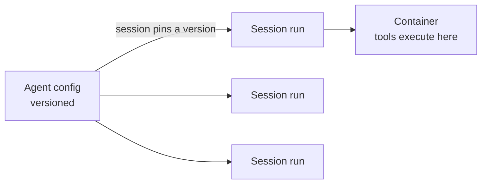

<LevelBadge level="advanced" />

<VerifyNote lastVerified="2026-06-26" source="https://platform.claude.com/docs/en/docs/agents-and-tools">
Le capacità e la disponibilità degli agent gestiti cambiano — l'API è in beta. Conferma endpoint, nomi dei campi e accesso nella documentazione ufficiale prima di costruirci sopra.
</VerifyNote>

<Callout type="objectives" items={["Capire cosa delega per te un loop di agent gestito (ospitato da Anthropic)", "Distinguere i due oggetti fondamentali: un Agent versionato vs una Session per singola esecuzione", "Iniettare segreti in sicurezza con i Vault — senza che il modello li veda mai", "Mettere un agent su una pianificazione cron con i Deployment pianificati — nessuno scheduler da ospitare", "Sapere quando il gestito batte un loop personalizzato, e i guardrail che restano comunque validi"]} />

Se [costruire il tuo loop di agent](/docs/api/building-agents) è più infrastruttura di quanta tu voglia gestire, un agent **gestito** (ospitato da Anthropic) esegue il loop per te — così ti concentri sul *lavoro* dell'agent, non su plumbing delle sessioni, retry, stato e pianificazione.

## I due oggetti: Agent vs Session

Questo è il modello mentale a cui tutto il resto si aggancia. Sono separati di proposito.

- Un **Agent** è una *configurazione persistita e versionata* — modello, system prompt, strumenti, server MCP e skill. Lo crei una volta. Ogni aggiornamento crea una nuova versione immutabile.
- Una **Session** è un'*istanza runtime* — una singola esecuzione che punta a un agent tramite ID. La configurazione vive sull'agent, mai sulla session.

<Callout type="tip">
Le session **si agganciano** (pin) alla versione dell'agent con cui sono state create: le session in esecuzione mantengono la loro versione, le nuove session ottengono l'ultima. È così che rilasci modifiche di configurazione senza rompere il lavoro in corso.
</Callout>

## Cosa ti garantisce il "gestito"

Invece di costruire e ospitare il loop a mano, ottieni building block ospitati:

- **Session** — esecuzioni persistenti che crei per ogni esecuzione e riprendi; gli eventi vengono trasmessi in streaming via SSE.
- **Ambienti** — infrastruttura di container, o `cloud` (ospitata da Anthropic) o `self_hosted` (gli strumenti vengono eseguiti nel tuo VPC). Un container per session è il workspace dell'agent.
- **Memory store** — stato persistente tra le session, con versioning e redazione, senza che tu cablaggi un database.
- **Vault** — segreti per l'autenticazione MCP e altri servizi.
- **Deployment pianificati** — agent che girano su una pianificazione cron, senza supervisione.

<PromptCard title="Crea un agent (config versionata), poi esegui una session contro di esso">{`# 1. Create the agent once
POST /v1/agents        -> returns $AGENT_ID
# 2. Each execution is a session pinned to that agent
POST /v1/sessions      { "agent": "$AGENT_ID" }`}</PromptCard>

## Vault: segreti che il modello non vede mai

Un agent autonomo ha spesso bisogno di una chiave API — ma il *modello* non dovrebbe mai leggerla. Le credenziali Vault (`mcp_oauth`, `static_bearer`, `environment_variable`) vengono sostituite in uscita (egress): una credenziale `environment_variable` viene iniettata nella sandbox al momento dell'esecuzione e *non è mai visibile* al modello.

<Callout type="warning">
Questo è il pattern sicuro per dare a un agent un accesso potente. Non incollare chiavi nel system prompt o in un messaggio — diventano parte del contesto che il modello (e i tuoi log) possono vedere. Mettile in un vault.
</Callout>

## Deployment pianificati: un agent su un cron

Un **deployment** collega una pianificazione cron a un agent. Quando la pianificazione scatta, avvia una session nuova e completa il suo compito — nessuno scheduler da costruire o ospitare. Ottimo per una sincronizzazione dati notturna, una scansione di conformità settimanale o un digest giornaliero.

<Steps items={[
  {title: "Definisci la pianificazione", body: "POST /v1/deployments con agent, environment_id, initial_events (deve includere un user.message) e una schedule: un'espressione cron POSIX più un fuso orario IANA."},
  {title: "Ogni scatto = un'esecuzione", body: "Ogni tentativo di trigger crea un record di esecuzione (prefisso drun_). Il successo porta un session_id; il fallimento porta un error.type (es. environment_archived, session_rate_limited). Elenca le esecuzioni via GET /v1/deployment_runs?deployment_id=..."},
  {title: "Controlla il ciclo di vita", body: "La pausa sopprime i trigger futuri (le esecuzioni manuali continuano a funzionare); la ripresa riparte alla prossima occorrenza e NON recupera i trigger mancati; l'archiviazione è terminale."},
  {title: "Trigger on demand", body: "POST /v1/deployments/{id}/run avvia una session immediatamente — anche durante la pausa — con trigger_context.type: manual."}
]} />

<PromptCard title="Una scansione di conformità settimanale, il venerdì alle 20:00 ora di New York">{`POST /v1/deployments
{
  "name": "Weekly compliance scan",
  "agent": "$AGENT_ID",
  "environment_id": "$ENVIRONMENT_ID",
  "initial_events": [
    {"type": "user.message", "content": [{"type": "text", "text": "Run the compliance scan and summarize findings."}]}
  ],
  "schedule": {"type": "cron", "expression": "0 20 * * 5", "timezone": "America/New_York"}
}`}</PromptCard>

<Callout type="tip">
Il cron è `minute hour day-of-month month day-of-week`, con granularità al minuto. Il DST usa la semantica dell'orologio a parete: un orario che non esiste con il passaggio all'ora legale (spring-forward) viene saltato; un orario che si verifica due volte con il ritorno all'ora solare (fall-back) scatta due volte. Scegli un fuso orario e un'ora che evitino questi casi limite per qualsiasi cosa sensibile.
</Callout>

## Quando scegliere il gestito vs il personalizzato

| Scegli il **gestito** quando… | Scegli un **loop personalizzato / SDK** quando… |
|---|---|
| Vuoi hosting, stato, pianificazione e segreti gestiti | Ti serve pieno controllo sul loop e sugli strumenti |
| Stai prototipando rapidamente | Hai esigenze rigide di infrastruttura/conformità personalizzata |
| La semplicità operativa conta più del controllo | Stai integrando in profondità nel tuo stack |

È uno spettro — singola chiamata → workflow → agent personalizzato (SDK) → gestito. Parti dal più semplice che il compito permette; sali solo quando ne hai bisogno.

## Valgono gli stessi guardrail

Gestito o no, un agent autonomo compie comunque azioni. Mantieni il **privilegio minimo**, **costo/iterazioni limitati** e **l'approvazione umana per i passi rischiosi** — vedi [Mettere in sicurezza gli agent](/docs/security/securing-agents) e [Irrobustire le esecuzioni autonome](/docs/security/hardening-autonomous-runs).

<Callout type="takeaways" items={["Gli agent gestiti delegano il loop, le session, gli ambienti, la memoria, i vault e la pianificazione così ti concentri sul lavoro", "Un Agent è config versionata; una Session è una singola esecuzione che si aggancia a una versione — la config vive sull'agent, non sulla session", "Le credenziali environment_variable del vault vengono iniettate all'esecuzione e non sono mai visibili al modello — il modo sicuro di dare segreti a un agent", "Un deployment pianificato è un'espressione cron + un fuso orario IANA; ogni scatto crea un'esecuzione, e la ripresa non recupera i trigger mancati", "Il gestito sta all'estremità ospitata di singola chiamata -> workflow -> personalizzato -> gestito; i guardrail di autonomia restano comunque validi"]} />

## Mettiti alla prova

<Quiz title="Mettiti alla prova" questions={[
  {
    q: "Qual è la differenza tra un Agent e una Session?",
    options: [
      "Sono due nomi per lo stesso oggetto",
      "Un Agent è configurazione versionata; una Session è una singola esecuzione runtime che si aggancia a una versione dell'agent",
      "Una Session contiene il modello e il system prompt; un Agent è solo un ID",
      "Un Agent esegue gli strumenti; una Session conserva i segreti"
    ],
    answer: 1,
    explain: "Un Agent è la config persistita e versionata (modello, prompt, strumenti, MCP, skill). Una Session è un'istanza per singola esecuzione che fa riferimento all'agent e si aggancia alla sua versione al momento della creazione."
  },
  {
    q: "Come dovresti dare a un agent gestito una chiave API di cui ha bisogno?",
    options: [
      "Metterla nel system prompt così l'agent può leggerla",
      "Passarla nel primo messaggio utente della session",
      "Memorizzarla come credenziale del vault, iniettata all'esecuzione e mai visibile al modello",
      "Codificarla a mano (hard-code) nella definizione dello strumento"
    ],
    answer: 2,
    explain: "Le credenziali del vault (es. di tipo environment_variable) vengono sostituite in uscita e non sono mai visibili al modello — le chiavi nel prompt o in un messaggio diventano parte del contesto visibile."
  },
  {
    q: "Un deployment pianificato è stato messo in pausa per due giorni e poi ripreso. Cosa succede ai trigger che sarebbero scattati durante la pausa?",
    options: [
      "Vengono recuperati — ogni esecuzione mancata viene eseguita alla ripresa",
      "Non vengono recuperati; il deployment riparte semplicemente alla prossima occorrenza pianificata",
      "Il deployment viene archiviato automaticamente",
      "Tutte le esecuzioni mancate vengono accodate e girano a un minuto di distanza l'una dall'altra"
    ],
    answer: 1,
    explain: "La ripresa riparte alla prossima occorrenza e non recupera i trigger mancati. (Puoi comunque forzare un'esecuzione in qualsiasi momento con il trigger manuale, anche durante la pausa.)"
  }
]} />

## Prossimi passi

- [Costruire agent sull'API](/docs/api/building-agents)
- [Cowork e team di agent](/docs/api/cowork-and-agent-teams)
- [Modalità headless e l'Agent SDK](/docs/claude-code/headless-and-agent-sdk)
- [Mettere in sicurezza gli agent](/docs/security/securing-agents)
