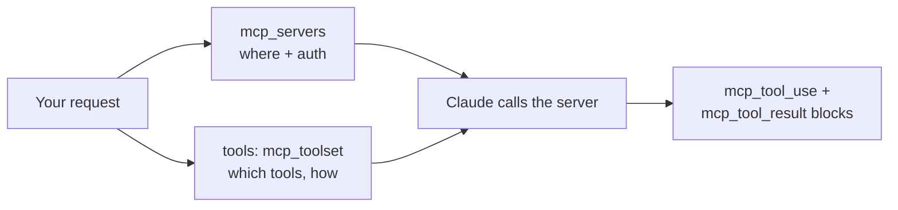

<LevelBadge level="advanced" />

Il **Model Context Protocol (MCP)** è lo standard aperto per collegare l'AI a strumenti e dati esterni. Sull'API non devi eseguire alcun client MCP: il **connettore MCP** ti permette di indicare un server remoto nella richiesta e Claude ne chiama gli strumenti dentro il normale loop dell'agent. Due campi della richiesta sostituiscono un intero livello di integrazione.

<Callout type="objectives" items={[
  "Quando il connettore MCP batte la definizione a mano degli strumenti — e quando no",
  "La forma esatta della richiesta: mcp_servers per la connessione, mcp_toolset per la policy",
  "Allowlist, denylist e configurazione per singolo strumento — e come si fondono i tre livelli di config",
  "I blocchi di risposta che devi gestire: mcp_tool_use e mcp_tool_result",
  "I limiti veri: solo HTTPS, solo strumenti, buchi di piattaforma e nessuna copertura ZDR",
]} />

<VerifyNote lastVerified="2026-07-20" source="https://platform.claude.com/docs/en/agents-and-tools/mcp-connector">
Il connettore è in beta e l'header è già cambiato una volta: la versione attuale è `mcp-client-2025-11-20`, mentre `mcp-client-2025-04-04` è **deprecata**. Nomi dei campi, disponibilità sulle piattaforme e stato beta cambiano — verifica sulla pagina ufficiale e su [modelcontextprotocol.io](https://modelcontextprotocol.io) prima di andare in produzione.
</VerifyNote>

## MCP vs strumenti definiti a mano

| | [Uso degli strumenti](/docs/api/tool-use) (personalizzati) | Connettore MCP |
|---|---|---|
| Cosa definisci | Lo schema di ogni strumento, e lo esegui tu | Una connessione a un server che *pubblica* strumenti |
| Chi esegue lo strumento | Il tuo codice, nel tuo loop | È il lato Anthropic a chiamare il server remoto |
| Ideale per | Poche funzioni su misura nella tua app | Riutilizzare integrazioni esistenti (GitHub, database, browser, SaaS) |
| Auth | Il tuo codice | Un bearer token OAuth che fornisci tu per ciascun server |

Coesistono. Definisci direttamente gli strumenti specifici della tua app e attingi a capacità già pronte tramite MCP.



## La forma della richiesta

Due pezzi, tenuti separati di proposito: **`mcp_servers`** dice *dov'è il server e come autenticarsi*; la voce **`mcp_toolset`** nell'array `tools` dice *quali dei suoi strumenti sei disposto a esporre e come*.

<Steps items={[
  {title: "Invia l'header beta", body: "anthropic-beta: mcp-client-2025-11-20 — senza di esso il campo mcp_servers non viene accettato. Negli SDK corrisponde alla lista betas in una chiamata beta.messages.create."},
  {title: "Dichiara il server in mcp_servers", body: "Assegnagli type url, un url https e un name univoco. Aggiungi authorization_token se il server richiede OAuth — il flusso OAuth lo esegui tu e passi l'access token risultante."},
  {title: "Aggiungi un mcp_toolset corrispondente in tools", body: "Imposta mcp_server_name sul nome che hai appena usato. Senza altra configurazione, ogni strumento di quel server è abilitato con i valori predefiniti."},
  {title: "Gestisci i nuovi blocchi di risposta", body: "La risposta di Claude può contenere blocchi di contenuto mcp_tool_use e mcp_tool_result. Mostrali o registrali come i blocchi degli strumenti — non dare per scontato che la risposta sia solo testo."},
]} />

<PromptCard title="Chiamata minima al connettore MCP (cURL)">{`curl https://api.anthropic.com/v1/messages \\
  -H "Content-Type: application/json" \\
  -H "X-API-Key: $ANTHROPIC_API_KEY" \\
  -H "anthropic-version: 2023-06-01" \\
  -H "anthropic-beta: mcp-client-2025-11-20" \\
  -d '{
    "model": "MODEL_ID",
    "max_tokens": 1000,
    "messages": [{"role": "user", "content": "What tools do you have available?"}],
    "mcp_servers": [
      {"type": "url", "url": "https://example.com/sse", "name": "example-mcp", "authorization_token": "YOUR_TOKEN"}
    ],
    "tools": [
      {"type": "mcp_toolset", "mcp_server_name": "example-mcp"}
    ]
  }'`}</PromptCard>

:::tip Non scrivere mai il modello in modo fisso
`MODEL_ID` qui sopra è un segnaposto voluto. Leggi l'ID attuale da [Modelli e prezzi attuali](/docs/whats-new/models-and-pricing) e tienilo in configurazione, così un aggiornamento del modello è una modifica di una riga.
:::

L'API impone un abbinamento rigido: ogni server in `mcp_servers` deve essere referenziato da **esattamente un** toolset, e il `mcp_server_name` di ogni toolset deve corrispondere a un server dichiarato. Le discordanze sono errori di validazione, non silenziosi no-op.

## Scegli cosa Claude può fare davvero

È la parte che la maggior parte delle integrazioni sbaglia. Un toolset accetta un `default_config` applicato a ogni strumento, più `configs` con override per singolo strumento. Precedenza, dalla più alta: **`configs` per strumento → `default_config` a livello di set → valori predefiniti di sistema**.

**Denylist** — abilita tutto, poi spegni i pericolosi. Ragionevole quando vuoi ampiezza ma nessuna scrittura distruttiva:

```json
{
  "type": "mcp_toolset",
  "mcp_server_name": "calendar-mcp",
  "configs": {
    "delete_all_events": { "enabled": false },
    "share_calendar_publicly": { "enabled": false }
  }
}
```

**Allowlist** — disabilita per impostazione predefinita, poi nomina i sopravvissuti. È la postura a privilegio minimo, quella da preferire per default:

```json
{
  "type": "mcp_toolset",
  "mcp_server_name": "calendar-mcp",
  "default_config": { "enabled": false },
  "configs": {
    "search_events": { "enabled": true },
    "create_event": { "enabled": true }
  }
}
```

:::warning Una denylist blocca solo ciò a cui hai pensato
I server possono aggiungere strumenti. Una denylist concede silenziosamente ogni strumento pubblicato dopo che l'hai scritta; una allowlist li *ignora* silenziosamente. Per qualsiasi cosa tocchi dati dei clienti o denaro, usa una allowlist. Nota inoltre che nominare in `configs` uno strumento che non esiste sul server produce un warning nei log del backend ma **non** un errore — quindi un refuso in una allowlist disabilita in silenzio proprio lo strumento che volevi abilitare. Verifica sulla lista di strumenti live del server.
:::

## Tieni gli schemi fuori dal contesto

La descrizione di ogni strumento abilitato viene inviata con la richiesta, quindi un catalogo grasso tassa ogni turno. La risposta del connettore è `defer_loading: true`: la descrizione resta fuori dal contesto iniziale e Claude la richiama su richiesta tramite il Tool Search Tool.

```json
{
  "type": "mcp_toolset",
  "mcp_server_name": "calendar-mcp",
  "default_config": { "defer_loading": true },
  "configs": {
    "search_events": { "defer_loading": false }
  }
}
```

Leggilo così: *differisci tutto tranne l'unico strumento da cui questo task parte*. Un toolset accetta anche `cache_control`, così un catalogo stabile può stare dietro un breakpoint di [prompt caching](/docs/api/prompt-caching) invece di essere rifatturato a ogni turno. Per i numeri dietro tutto questo — e per capire perché differire gli strumenti ha *aumentato* l'accuratezza di selezione invece di ridurla — vedi [La tassa sui token di MCP](/docs/claude-code/mcp-token-cost). Quando a inondare il contesto sono i *risultati* e non le definizioni, usa invece [Programmatic Tool Calling](/docs/api/programmatic-tool-calling).

## Cosa torna indietro

Due tipi di blocco di contenuto che devi gestire:

```json
{ "type": "mcp_tool_use", "id": "mcptoolu_...", "name": "echo",
  "server_name": "example-mcp", "input": { "param1": "value1" } }

{ "type": "mcp_tool_result", "tool_use_id": "mcptoolu_...", "is_error": false,
  "content": [ { "type": "text", "text": "Hello" } ] }
```

Nota `server_name` sul blocco d'uso: con più server collegati, è così che attribuisci una chiamata — essenziale per i log e per capire quale integrazione si è comportata male. E `is_error` è un campo, non un'eccezione: uno strumento MCP che fallisce torna come *risultato*, quindi il tuo loop deve ispezionarlo invece di dare per scontato il successo.

## I limiti che fanno male

<Callout type="warning" items={[
  "Solo strumenti. Della specifica MCP, il connettore supporta attualmente le chiamate agli strumenti — non prompt né risorse. Ti servono? Esegui un client tuo e usa gli helper MCP degli SDK.",
  "Solo HTTPS remoto. Il server deve essere raggiungibile pubblicamente via HTTP (transport Streamable HTTP o SSE). Un server stdio locale non può essere collegato così — è ciò che fanno Claude Code e le app desktop.",
  "Buchi di piattaforma. Disponibile su Claude API, Claude Platform su AWS e Microsoft Foundry (deployment Hosted-on-Anthropic). Attualmente non su Amazon Bedrock né Google Cloud.",
  "Nessuna zero-data-retention. I dati scambiati con i server MCP — definizioni degli strumenti e risultati di esecuzione — rientrano nella retention standard, non nella ZDR.",
  "OAuth è affar tuo. L'API accetta un authorization_token; ottenerlo e rinnovarlo prima della scadenza spetta a te.",
]} />

## Stesso standard, tre superfici

- **API** (questa pagina) — server remoti per URL, tramite il connettore.
- **[Claude Code](/docs/claude-code/mcp)** — server locali e remoti nelle tue sessioni di sviluppo.
- **[Le app](/docs/claude-app/connectors)** — MCP alimenta i Connettori.

Impara il protocollo una volta; si trasferisce. Cambia solo il cablaggio.

## Fiducia

:::warning Un server MCP è codice più accesso
Collega solo server di cui ti fidi, limitali al privilegio minimo con una allowlist e ricorda che i contenuti restituiti da un server sono input non fidati che possono trasportare [prompt injection](/docs/security/prompt-injection). Esamina i server di terze parti prima di collegarli — [Esaminare codice di terze parti](/docs/security/reviewing-third-party-code) e [Mettere in sicurezza i server MCP](/docs/security/securing-mcp-servers).
:::

<Flashcards title="Vocabolario del connettore MCP" cards={[
  {front: "Connettore MCP", back: "Chiamare un server MCP remoto direttamente dalla Messages API, senza un client MCP tuo."},
  {front: "mcp_servers", back: "Campo della richiesta che contiene la connessione: type, url https, name univoco, authorization_token opzionale."},
  {front: "mcp_toolset", back: "Una voce nell'array tools che dice quali strumenti di un server sono abilitati e come. Punta a un server tramite mcp_server_name."},
  {front: "default_config vs configs", back: "Valori predefiniti per l'intero set vs override per singolo strumento. configs vince su default_config, che vince sui valori predefiniti di sistema."},
  {front: "defer_loading", back: "Tiene la descrizione di uno strumento fuori dal contesto iniziale finché Claude non la cerca — il rimedio a un catalogo di strumenti gonfio."},
  {front: "is_error su un risultato di strumento", back: "Uno strumento MCP che fallisce restituisce un blocco risultato con is_error true — non un'eccezione. Ispezionalo nel tuo loop."},
]} />

<Quiz title="Mettiti alla prova" questions={[
  {q: "Vuoi che Claude usi solo search_events e create_event di un server calendario. Qual è la forma corretta del toolset?", options: ["Elencarli in un array allowed_tools nella definizione del server", "Impostare default_config.enabled a false, poi abilitare quei due in configs", "Impostare defer_loading true su tutti gli altri strumenti"], answer: 1, explain: "allowed_tools appartiene all'header deprecato mcp-client-2025-04-04. Nella versione attuale la allowlist si fa disabilitando per default in default_config e abilitando strumenti specifici in configs. defer_loading incide sul costo in contesto, non sui permessi."},
  {q: "Una chiamata a uno strumento MCP fallisce. Dove appare?", options: ["Come errore HTTP sulla richiesta Messages", "Come blocco di contenuto mcp_tool_result con is_error impostato a true", "La risposta omette silenziosamente la chiamata allo strumento"], answer: 1, explain: "I fallimenti tornano dentro la risposta come blocco risultato con is_error true. Un codice che dà per scontato il successo mostrerà tranquillamente una chiamata fallita come se fosse un fatto."},
  {q: "Ti serve che Claude legga risorse MCP da un server stdio locale. Il connettore può farlo?", options: ["Sì — imposta type a stdio in mcp_servers", "No — il connettore è solo HTTPS remoto e solo chiamate a strumenti; esegui un client tuo con gli helper MCP degli SDK", "Sì, ma solo su Bedrock"], answer: 1, explain: "Il connettore supporta chiamate a strumenti verso server HTTPS raggiungibili pubblicamente. Server stdio locali, prompt MCP e risorse MCP richiedono un client tuo, per cui gli SDK forniscono degli helper."},
  {q: "Il tuo catalogo di strumenti si estende su quattro server e domina la finestra di contesto a ogni turno. Prima mossa più economica?", options: ["Passare a un modello con contesto più grande", "Impostare default_config.defer_loading true e togliere il differimento solo agli strumenti da cui un task parte", "Dividere il lavoro su quattro richieste separate"], answer: 1, explain: "Il caricamento differito tiene le descrizioni fuori dal contesto finché Claude non le cerca. Taglia la tassa per turno sugli schemi senza perdere capacità — e tende a migliorare la selezione degli strumenti, perché meno strumenti affollano il contesto."},
]} />

<Callout type="takeaways" items={[
  "Il connettore sostituisce un client MCP con due campi della richiesta — ma solo per server HTTPS remoti e solo per chiamate a strumenti.",
  "mcp_servers è la connessione; il mcp_toolset in tools è la policy. Ogni server deve abbinarsi a esattamente un toolset.",
  "La allowlist (default_config.enabled false, più configs esplicite) batte la denylist: gli strumenti aggiunti al server in seguito vengono ignorati, non concessi.",
  "defer_loading e cache_control sono le tue leve quando gli schemi degli strumenti iniziano a mangiare la finestra di contesto.",
  "Gestisci i blocchi mcp_tool_use e mcp_tool_result — incluso is_error, che è un campo, non un'eccezione.",
  "Controlla l'header beta prima di andare in produzione: mcp-client-2025-11-20 è quello attuale, mcp-client-2025-04-04 è deprecato.",
]} />

## Fonti e approfondimenti

- [Connettore MCP — documentazione Anthropic](https://platform.claude.com/docs/en/agents-and-tools/mcp-connector) — il riferimento autorevole sui campi e la guida alla migrazione.
- [Specifica del Model Context Protocol](https://modelcontextprotocol.io) — lo standard aperto stesso, autorizzazione inclusa.

## Avanti

- [Uso degli strumenti / Function calling](/docs/api/tool-use)
- [Costruire agent sull'API](/docs/api/building-agents)
- [La tassa sui token di MCP](/docs/claude-code/mcp-token-cost)
- [Costruisci e collega il tuo primo server MCP](/docs/walkthroughs/first-mcp-server)
- [MCP Config Builder](/docs/tools/mcp-config-builder)
