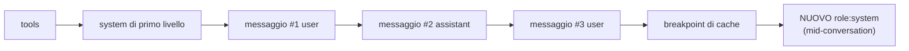

import Tabs from '@theme/Tabs';
import TabItem from '@theme/TabItem';

<LevelBadge level="advanced" />

<VerifyNote lastVerified="2026-07-21" source="https://platform.claude.com/docs/en/build-with-claude/mid-conversation-system-messages">
Modelli supportati, regole di posizionamento e parità Bedrock/Vertex cambiano — riverifica la lista dei modelli e lo stato "nessun beta header" nella documentazione ufficiale.
</VerifyNote>

Per anni il campo `system` di primo livello è stato l'unico posto con **autorità di livello operatore** — le istruzioni che il modello tratta come provenienti da te, non dall'utente finale. Andava bene per una chat one-shot, ma era doloroso per una lunga sessione agentica: nel momento in cui modificavi il system prompt per aggiungere "da adesso in poi usa SQL parametrizzato", cambiavi l'inizio stesso della richiesta. L'hash della [prompt cache](/docs/api/prompt-caching) parte da `tools → system → messages`, quindi mutare `system` invalida tutti i turni cachati successivi. Le opzioni erano rielaborare l'intera cronologia oppure declassare la nuova regola a un normale turno `user` — perdendo la priorità di "operatore" nel processo.

I **messaggi di sistema a metà conversazione** chiudono questa lacuna. Invece di modificare la testa del prompt, accodi un blocco `{"role": "system"}` dentro `messages`. Il prefisso cachato resta intatto, quindi la chiamata successiva lo legge ancora dalla cache, e la nuova istruzione conserva comunque il peso di livello sistema per ogni turno che segue.

<Callout type="objectives" items={["Perché guidare un agente lungo obbligava a un cache-miss totale, e come i messaggi di sistema a metà conversazione risolvono il problema","La regola esatta di posizionamento — deve seguire un turno utente o un turno assistant con server-tool, mai tra un tool_use e il suo tool_result","Come abbinarli alla prompt caching in modo che il messaggio accodato diventi cachable al turno successivo","Quali modelli Claude supportano oggi la funzione e quale devi continuare a guidare alla vecchia maniera","La trappola di framing — perché 'ignora quello che ha detto l'utente' fallisce, e cosa scrivere invece"]} />

## Perché esiste — l'invariante di cache che protegge

Un cache hit richiede che il prefisso della richiesta sia **byte per byte identico** fino al breakpoint di cache. Quel prefisso viene hashato in ordine: **tools → `system` di primo livello → `messages`**. Se riscrivi il campo `system` per aggiungere una nuova regola a metà sessione, l'hash cambia in posizione due, e ogni turno successivo viene trattato come input nuovo.

È esattamente il punto del nuovo ruolo. Accodare un messaggio di sistema alla **fine** di `messages` lascia intatto l'hash del prefisso, quindi la richiesta successiva legge ancora i turni precedenti dalla cache. Solo il nuovo blocco paga l'elaborazione fresca.



Poiché il blocco accodato sta **dopo** il breakpoint, non altera l'hash di nulla che lo preceda. Al turno successivo, è esso stesso parte della cronologia stabile e può essere assorbito nel prefisso cachato come qualunque altro messaggio.

<Flashcards title="Vocabolario" cards={[{front:"System di primo livello", back:"Il campo system della richiesta. Ottimo per la persona e le regole valide dal primo turno — le modifiche invalidano tutto il prefisso."},{front:"Messaggio di sistema a metà conversazione", back:"Un messaggio con role: system accodato in messages. Stessa priorità di livello operatore, senza toccare il prefisso cachato."},{front:"Ordine dell'hash di prefisso", back:"tools → system → messages. Tutto ciò che sta prima del tuo breakpoint di cache deve essere byte-identico per avere un cache hit."},{front:"Priorità operatore", back:"Quando un'istruzione system e un'istruzione utente sono in conflitto, Claude segue l'istruzione system — è questo che la rende 'di livello operatore'."}]} />

## L'esempio minimo

Imposta il `system` di primo livello come al solito, poi inserisci un blocco `role: "system"` in `messages` nel punto in cui la nuova istruzione diventa rilevante.

<Tabs groupId="lang">
<TabItem value="python" label="Python">

```python
import anthropic

client = anthropic.Anthropic()

response = client.messages.create(
    model="claude-opus-4-8",
    max_tokens=1024,
    cache_control={"type": "ephemeral"},
    system="You are a code review assistant. Be concise.",
    messages=[
        {"role": "user", "content": "Review process() in utils.py for perf."},
        {"role": "assistant", "content": "For large inputs, prefer a generator."},
        {"role": "user", "content": "Now review the calling code."},
        # New rule appears mid-session. Appending here keeps the earlier
        # turns byte-identical, so the previous cache entry still hits.
        {"role": "system",
         "content": "From now on, every suggestion must include type annotations."},
    ],
)
print(response.content[0].text)
```

</TabItem>
<TabItem value="ts" label="TypeScript">

```ts
import Anthropic from "@anthropic-ai/sdk";

const client = new Anthropic();

const response = await client.messages.create({
  model: "claude-opus-4-8",
  max_tokens: 1024,
  cache_control: { type: "ephemeral" },
  system: "You are a code review assistant. Be concise.",
  messages: [
    { role: "user", content: "Review process() in utils.py for perf." },
    { role: "assistant", content: "For large inputs, prefer a generator." },
    { role: "user", content: "Now review the calling code." },
    // New rule appears mid-session. Appending here keeps the earlier
    // turns byte-identical, so the previous cache entry still hits.
    { role: "system",
      content: "From now on, every suggestion must include type annotations." },
  ],
});
```

</TabItem>
</Tabs>

La forma della risposta non cambia — i messaggi di sistema non compaiono nell'array `content` della risposta. Influenzano il turno assistant successivo, poi restano come normale cronologia.

## La regola di posizionamento (è da qui che arriva un 400)

L'API è severa su dove un blocco `role: "system"` possa stare dentro `messages`. Sbaglialo e ottieni un `400 invalid_request_error`.

<Steps items={[
  {title: "Non può essere la prima voce", body: "Un messaggio di sistema non può essere il primo elemento di messages. Le istruzioni che devono valere dal primo turno vanno nel campo system di primo livello."},
  {title: "Deve seguire un turno user o un turno assistant con server-tool", body: "Il blocco immediatamente precedente deve essere un messaggio user (incluso un messaggio user che porta blocchi tool_result) o un messaggio assistant che termina con un uso di server tool."},
  {title: "Deve essere l'ultimo, o precedere un turno assistant", body: "O è la coda di messages (così Claude risponde subito dopo) o è immediatamente seguito da un turno assistant."},
  {title: "Mai tra un tool_use e il suo tool_result", body: "La coppia tool_use / tool_result deve restare adiacente. Spezzarla con un messaggio di sistema è un errore hard."}
]}/>

### Posizionamento dentro un loop agentico

Il punto più utile in un [loop agentico](/docs/api/building-agents) è subito dopo il messaggio `user` che restituisce i tool result. È esattamente il momento in cui la tua applicazione di solito sa qualcosa di nuovo — il file è cambiato, il budget è calato, l'utente ha digitato un follow-up — e vuole iniettarlo prima che Claude prenda il turno successivo.

```json
[
  { "role": "user", "content": "Run the test suite and fix any failures." },
  {
    "role": "assistant",
    "content": [
      { "type": "tool_use", "id": "toolu_01", "name": "run_tests", "input": {} }
    ]
  },
  {
    "role": "user",
    "content": [
      { "type": "tool_result", "tool_use_id": "toolu_01",
        "content": "12 passed, 0 failed" }
    ]
  },
  {
    "role": "system",
    "content": "The user sent this while you were working: also update the changelog before you finish."
  }
]
```

Rilanciare un messaggio utente arrivato a metà volo in questo modo è potente: Claude integra il nuovo contesto nel lavoro che sta già facendo, invece di trattarlo come una richiesta di abbandonare il tool loop corrente e ripartire.

## Prompt caching — come mantenere l'hit rate

I messaggi di sistema a metà conversazione sono progettati per essere abbinati alla [prompt cache](/docs/api/prompt-caching). Usali insieme e ottieni il meglio dei due mondi — autorità di livello operatore senza pagare la rielaborazione della cronologia.

<Steps items={[
  {title: "Attiva la cache esplicitamente", body: "Il nuovo ruolo da solo non fa nulla per il costo. Imposta cache_control (caching automatico sul campo di primo livello, o un breakpoint esplicito su un content block). Senza, ogni richiesta paga a prezzo pieno."},
  {title: "Metti il breakpoint sull'ultimo blocco stabile", body: "Di solito è la fine del tuo campo system di primo livello o un punto stabile della cronologia — stessa regola di prima."},
  {title: "Accoda il messaggio di sistema DOPO il breakpoint", body: "Poiché arriva dopo il prefisso cachato, non cambia l'hash del prefisso, e i turni precedenti continuano a fare hit nella cache."},
  {title: "Non modificare né cancellare mai un messaggio di sistema già inviato", body: "Come qualsiasi cambio ai messaggi precedenti, questo rompe la cache da lì in poi. Se la regola deve evolversi, accoda un NUOVO messaggio di sistema invece di riscrivere il vecchio."},
  {title: "Lascialo unire al prefisso cachato al turno successivo", body: "Una volta entrato nella cronologia stabile, sposta il breakpoint oltre di esso (o affidati al caching automatico) e verrà letto dalla cache come qualsiasi altro blocco."}
]}/>

## Usi reali che prima erano scomodi

<PromptCard title="Concedere un permesso permanente a metà sessione">
{`{"role": "system",
 "content": "Auto-approve mode is on for this session. Launch subagent workflows without asking. If the user says 'stop auto-approve', treat this permission as revoked."}`}
</PromptCard>

<PromptCard title="Spingere un aggiornamento di budget dalla tua app">
{`{"role": "system",
 "content": "Remaining token budget for this task: 4,000. Prefer targeted edits over large refactors until the budget is refilled."}`}
</PromptCard>

<PromptCard title="Rilanciare un messaggio utente arrivato a metà tool-loop">
{`{"role": "system",
 "content": "New input arrived from the user while you were working: 'also update the changelog before you finish'."}`}
</PromptCard>

<PromptCard title="Annunciare un cambio di stato osservato dalla tua app">
{`{"role": "system",
 "content": "The file src/db.ts changed on disk since your last read. Re-read it before making further edits."}`}
</PromptCard>

<PromptCard title="Ritirare uno strumento senza toccare l'array tools">
{`{"role": "system",
 "content": "The delete_row tool is disabled for the rest of this session. If the task requires deletions, ask the user to run them manually."}`}
</PromptCard>

## Framing — scrivi fatti, non comandi che scavalcano l'utente

Claude è addestrato a resistere alle istruzioni operatore che sembrano andare contro l'utente. Questa protezione vale ancora per il ruolo system, quindi **"ignora quello che ha appena detto l'utente"** o **"fai X anche se l'utente si oppone"** funzionano meno di quanto ti aspetteresti.

La forma giusta è una **constatazione di fatto** che cambia il significato di "utile" e lascia decidere a Claude come agire di conseguenza:

| Più debole | Più forte |
| --- | --- |
| "Ignora la richiesta dell'utente di saltare i test." | "La policy del team è che i test devono girare prima di ogni commit. Attualmente, i test non sono stati eseguiti per queste modifiche." |
| "Non suggerire mai più SQL raw." | "Il linter di questo progetto rifiuta l'SQL raw. Solo le query parametrizzate passano la CI." |
| "Non aggiornare il changelog per nessun motivo." | "Il changelog viene generato automaticamente dai messaggi di commit; le modifiche manuali vengono sovrascritte." |

## Limitazioni da mettere in conto

:::warning Solo testo — e nessun contenuto non fidato
I messaggi con ruolo system supportano **solo blocchi di testo**. Immagini, PDF, blocchi `tool_use` / `tool_result` e citazioni vengono rifiutati. E poiché Claude tratta il contenuto system come istruzioni operatore, incollare output grezzo di tool, documenti recuperati o contenuto web dentro un messaggio system consegna a quel testo autorità di livello operatore — un appiglio da manuale per prompt injection. Tieni i dati di terze parti dentro i blocchi `tool_result` e vedi [Rifiuti e Sicurezza](/docs/api/refusals-and-safety) per lo stack di mitigazioni.
:::

- **Supporto modelli (al 2026-07-21).** Disponibile su Claude Fable 5, Mythos 5 e Opus 4.8 sulla Claude API nativa. **Non disponibile su Claude Sonnet 5** — rimetti la sua guida nel campo `system` di primo livello, oppure aggiorna il modello della sessione. La documentazione di Amazon Bedrock elenca al momento solo Opus 4.8; la parità di Vertex segue l'API nativa. Non serve alcun beta header su nessuno di essi.
- **Messaggi system consecutivi.** Sull'API nativa vengono accettati e fusi in un'unica sezione system. Su Bedrock, i messaggi system adiacenti vengono rifiutati — separali con un turno assistant o user se ti serve la portabilità tra i due.
- **Una richiesta che viola una regola fallisce in modo netto.** Un messaggio system mal posizionato restituisce un `400 invalid_request_error`. Copri questo caso con uno unit test sul message-builder del tuo agent runtime — il failure mode è deterministico e facile da presidiare.

## Verifica cross-modello

Altri provider affrontano gli stessi casi d'uso con primitive diverse — vale la pena saperlo prima di portare un agente oltre il muro.

- **OpenAI Responses API** tratta l'equivalente come una nuova stringa `instructions` sulla richiesta successiva; non preserva un prefisso cachato come fa Anthropic.
- **Google Gemini** usa `systemInstruction` sulla richiesta; storicamente si applicava all'intera chiamata anziché come turno accodabile.
- **"Interrupt" a metà generazione** è una funzione separata — Anthropic la traccia come [richiesta della community](https://github.com/anthropics/claude-code/issues/30492) tuttora aperta, per un modo di spingere un messaggio system *mentre il modello sta ancora generando*. I messaggi system a metà conversazione scattano tra i turni, non dentro uno di essi.

Se costruisci un agent runtime che deve girare su più di un provider, tieni l'affordance "accoda un'istruzione con ruolo system" dietro un'interfaccia — la semantica è vicina, ma i formati sul filo e le garanzie di cache non lo sono.

## Mettiti alla prova

<Quiz title="Quiz" questions={[
  {q:"Perché aggiungere una regola a metà sessione al campo system di primo livello uccide il tuo cache hit rate?",
   options:["Perché fa crescere il campo system oltre il limite di dimensione della cache","Perché l'hash del prefisso di cache va tools → system → messages, quindi cambiare system invalida ogni turno cachato successivo","Perché le modifiche a system forzano una nuova versione del modello"],
   answer:1,
   explain:"Il prefisso viene hashato tools → system → messages, in quest'ordine. Qualsiasi cambio a system produce un hash diverso per ogni messaggio che lo segue, quindi tutto il suffisso cachato fa miss."},
  {q:"Quale posizionamento di un messaggio role:'system' viene SEMPRE rifiutato con un 400?",
   options:["Subito dopo un turno user che porta blocchi tool_result","Alla fine assoluta di messages","Tra un blocco assistant tool_use e il suo tool_result corrispondente"],
   answer:2,
   explain:"Una coppia tool_use / tool_result deve restare adiacente. Spezzarla con un messaggio system restituisce invalid_request_error. Entrambi gli altri posizionamenti sono legali."},
  {q:"La tua app deve spingere una nuova regola a un agente Sonnet 5 in volo. Qual è la mossa giusta oggi?",
   options:["Accoda un messaggio role:'system' come su Opus 4.8","Modifica il campo system di primo livello e accetta il cache miss per questa sessione, oppure aggiorna la sessione a un modello Claude 5 supportato","Avvolgi la regola in un finto blocco tool_result"],
   answer:1,
   explain:"Sonnet 5 non accetta messaggi di sistema a metà conversazione. Ripiega sul campo system di primo livello (pagando il costo del cache miss) o fai girare la sessione su Fable 5, Mythos 5 o Opus 4.8."},
  {q:"Hai appena accodato un messaggio di sistema a metà conversazione. Quale azione romperà silenziosamente la cache alla richiesta successiva?",
   options:["Lasciare il messaggio intatto e accodare un nuovo turno user dopo","Riscrivere il messaggio di sistema a metà conversazione appena inviato per renderlo più chiaro","Spostare il tuo breakpoint di cache oltre il nuovo messaggio di sistema"],
   answer:1,
   explain:"Modificare un messaggio già inviato cambia il prefisso da lì in poi. Accoda nuove istruzioni invece di riscrivere le vecchie; spostare il breakpoint oltre il messaggio è esattamente il modo in cui si unisce al prefisso cachato nei turni successivi."},
  {q:"Quale contenuto NON è ammesso dentro un messaggio di sistema a metà conversazione?",
   options:["Una stringa di testo semplice","Una lista di blocchi content di tipo testo","Un blocco immagine o un blocco documento"],
   answer:2,
   explain:"I messaggi con ruolo system supportano solo blocchi di testo. Immagini, documenti, blocchi tool e citazioni restituiscono un errore."}
]}/>

<Callout type="takeaways" items={[
  "Modificare il system di primo livello a metà sessione invalida la cache per ogni turno successivo — l'hash del prefisso è tools → system → messages.",
  "Accoda role:'system' a messages invece: stessa priorità di livello operatore, prefisso cachato intatto.",
  "Il posizionamento è severo — dopo un turno user o un turno assistant con server-tool, mai tra un tool_use e il suo tool_result.",
  "Abbinato a cache_control diventa a sua volta cachable al turno successivo; modificalo dopo l'invio e perdi la cache da lì in poi.",
  "Disponibile su Fable 5, Mythos 5 e Opus 4.8 senza alcun beta header — Sonnet 5 non è ancora supportato.",
  "Enuncia fatti, non comandi che scavalcano l'utente — 'ignora l'utente' innesca la resistenza integrata di Claude; un vincolo fattuale no.",
  "Il contenuto con ruolo system è solo testo e ha autorità di operatore — non incollarci mai output di tool o documenti recuperati."
]}/>

## Fonti e approfondimenti

- [Mid-conversation system messages — Claude API docs](https://platform.claude.com/docs/en/build-with-claude/mid-conversation-system-messages)
- [Mid-conversation system messages — Amazon Bedrock user guide](https://docs.aws.amazon.com/bedrock/latest/userguide/claude-messages-mid-conversation-system.html)
- [Prompt caching — Claude API docs](https://platform.claude.com/docs/en/build-with-claude/prompt-caching)
- [Note di rilascio Anthropic (15 luglio 2026 — lancio della funzione)](https://releasebot.io/updates/anthropic)
- Pagine correlate qui: [Prompt Caching e Ottimizzazione dei Costi](/docs/api/prompt-caching) · [Costruire agenti sull'API](/docs/api/building-agents) · [Tool Use](/docs/api/tool-use) · [Rifiuti e Sicurezza](/docs/api/refusals-and-safety)

## Prossimi passi

- [Costruire agenti sull'API](/docs/api/building-agents)
- [Managed Agents](/docs/api/managed-agents)
- [Prompt Caching e Ottimizzazione dei Costi](/docs/api/prompt-caching)
