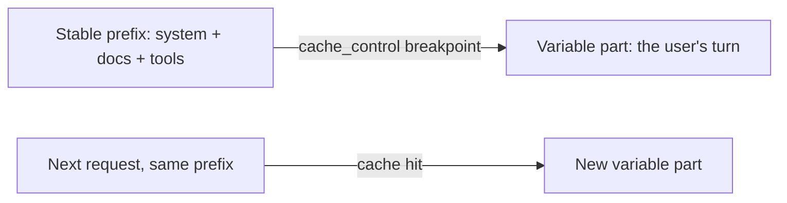

<LevelBadge level="advanced" />

<VerifyNote lastVerified="2026-06-20" source="https://docs.anthropic.com/en/docs/build-with-claude/prompt-caching">
Il funzionamento della cache, l'idoneità e i prezzi dei token in cache rispetto a quelli nuovi cambiano — conferma nella documentazione ufficiale sul prompt caching.
</VerifyNote>

Se molte delle tue richieste condividono un blocco grande e immutabile — un lungo system prompt, un documento corposo, un catalogo di strumenti — il **prompt caching** consente all'API di riutilizzare il prefisso già elaborato invece di rileggerlo a ogni chiamata. Questo riduce sia il **costo** sia la **latenza** sulla parte in cache.

## Come funziona (il modello mentale)

Marchi un **punto di interruzione della cache** dopo il prefisso stabile. Alla prima chiamata viene elaborato e messo in cache; le chiamate successive che condividono lo **stesso identico prefisso** colpiscono la cache e pagano molto meno per esso.

## L'invariante che lo fa funzionare o lo rompe

:::warning La cache è esatta sul prefisso
Un cache hit richiede che il prefisso in cache sia **identico byte per byte**. Il bug più comune: un *invalidatore silenzioso* vicino all'inizio del prompt — un timestamp, un nome utente che cambia, una lista di strumenti riordinata — che modifica il prefisso e azzera silenziosamente il tuo tasso di hit.
:::

**Metti tutto ciò che è stabile all'inizio, tutto ciò che è variabile alla fine,** e mantieni il prefisso davvero costante.

## Dove rende di più

- Lunghi **system prompt** riutilizzati tra più utenti.
- **RAG / Q&A su documenti** dove lo stesso testo sorgente viene interrogato ripetutamente.
- **Agent** con un catalogo di strumenti e istruzioni fissi attraverso molti turni.

Abbina il caching al **batching** per i carichi di lavoro offline e al dimensionamento corretto del modello ([Scegliere un modello](/docs/api/choosing-a-model)) per il massimo risparmio combinato — vedi [Costo e latenza](/docs/foundations/cost-and-latency).

## Avanti

- [Token, contesto e prezzi](/docs/api/tokens-and-pricing)
- [Streaming e multi-turno](/docs/api/streaming)
- [Costruire agent sull'API](/docs/api/building-agents)
