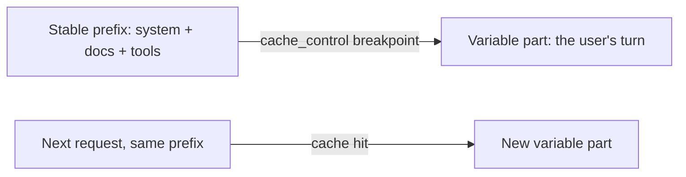

import Tabs from '@theme/Tabs';
import TabItem from '@theme/TabItem';

<LevelBadge level="advanced" />

<VerifyNote lastVerified="2026-06-21" source="https://platform.claude.com/docs/en/build-with-claude/prompt-caching">
Il funzionamento della cache, i requisiti di idoneità e i prezzi dei token in cache rispetto a quelli nuovi cambiano — conferma nella documentazione ufficiale sul prompt-caching.
</VerifyNote>

Se molte delle tue richieste condividono un blocco grande e immutabile — un lungo system prompt, un documento corposo, un catalogo di tool — il **prompt caching** consente all'API di riutilizzare il prefisso già elaborato invece di rileggerlo a ogni chiamata. Questo riduce sia il **costo** sia la **latenza** sulla parte in cache.

<Callout type="objectives" items={["Il modello mentale: un punto di interruzione della cache dopo un prefisso stabile, riutilizzato tra le chiamate","Come marcare il punto di interruzione in Python e TypeScript con cache_control","L'unica invariante che lo fa funzionare o lo rompe — il prefisso deve essere identico byte per byte","Come leggere i campi usage per confermare che stai effettivamente ottenendo cache hit","Dove il caching rende di più, e come abbinarlo al batching e al dimensionamento corretto"]} />

## Come funziona (il modello mentale)

Marchi un **punto di interruzione della cache** (cache breakpoint) dopo il prefisso stabile. Alla prima chiamata viene elaborato e messo in cache; le chiamate successive che condividono lo **stesso identico prefisso** colpiscono la cache e pagano molto meno per esso.



<Flashcards title="Vocabolario del caching" cards={[{front:"Punto di interruzione della cache","back":"Il marcatore cache_control posizionato dopo il prefisso stabile. Tutto ciò che precede e include il blocco marcato viene messo in cache."},{front:"Scrittura in cache","back":"Il piccolo sovrapprezzo della prima chiamata per popolare la cache."},{front:"Lettura dalla cache","back":"Ogni chiamata successiva con lo stesso prefisso lo rilegge a una frazione del prezzo di input."},{front:"Invalidatore silenzioso","back":"Un valore che cambia vicino all'inizio del prompt (timestamp, nome utente, lista di tool riordinata) che modifica il prefisso e azzera silenziosamente il tasso di hit."}]} />

## Marca il punto di interruzione (copia-incolla)

Aggiungi `cache_control` all'**ultimo blocco stabile** — qui, un grande system prompt. Il turno dell'utente viene dopo e varia liberamente; tutto ciò che precede e include il blocco marcato viene messo in cache.

<Steps items={[{title: "Identifica il prefisso stabile", body: "Trova il blocco grande e immutabile — un lungo system prompt, un documento corposo o un catalogo di tool riutilizzato tra molte richieste."},{title: "Allega cache_control al suo ultimo blocco", body: "Marca l'ultimo blocco stabile con cache_control di tipo ephemeral, così che il prefisso che lo precede e lo include venga messo in cache."},{title: "Lascia seguire la parte variabile", body: "Metti il turno dell'utente dopo il blocco marcato — varia liberamente a ogni chiamata ed è fatturato a prezzo pieno."},{title: "Conferma l'hit", body: "Leggi cache_read_input_tokens dal campo usage della risposta. Un valore maggiore di zero significa che hai ottenuto un cache hit."}]} />

<Tabs groupId="lang">
<TabItem value="python" label="Python">

```python
import anthropic

client = anthropic.Anthropic()

message = client.messages.create(
    model="claude-sonnet-5",
    max_tokens=1024,
    system=[
        {
            "type": "text",
            "text": LARGE_STABLE_PROMPT,  # long, unchanging — the cached prefix
            "cache_control": {"type": "ephemeral"},
        }
    ],
    messages=[{"role": "user", "content": "Summarize the key points."}],  # varies per call
)

print(message.usage.cache_read_input_tokens)  # > 0 means you got a hit
```

</TabItem>
<TabItem value="ts" label="TypeScript">

```ts
import Anthropic from "@anthropic-ai/sdk";

const client = new Anthropic();

const message = await client.messages.create({
  model: "claude-sonnet-5",
  max_tokens: 1024,
  system: [
    {
      type: "text",
      text: LARGE_STABLE_PROMPT, // long, unchanging — the cached prefix
      cache_control: { type: "ephemeral" },
    },
  ],
  messages: [{ role: "user", content: "Summarize the key points." }], // varies per call
});

console.log(message.usage.cache_read_input_tokens); // > 0 means you got a hit
```

</TabItem>
</Tabs>

La prima chiamata paga un piccolo sovrapprezzo di **scrittura** per popolare la cache; ogni chiamata successiva con lo stesso prefisso lo rilegge a una frazione del prezzo di input. Il prefisso deve essere abbastanza lungo da essere idoneo — qualche migliaio di token, a seconda del modello — altrimenti, silenziosamente, non verrà messo in cache.

## L'invariante che lo fa funzionare o lo rompe

:::warning La cache è esatta sul prefisso
Un cache hit richiede che il prefisso in cache sia **identico byte per byte**. Il bug più comune: un *invalidatore silenzioso* vicino all'inizio del prompt — un timestamp, un nome utente che cambia, una lista di tool riordinata — che modifica il prefisso e azzera silenziosamente il tuo tasso di hit.
:::

**Metti tutto ciò che è stabile all'inizio, tutto ciò che è variabile alla fine,** e mantieni il prefisso davvero costante.

## Verifica che funzioni davvero

Non dare nulla per scontato — rileggilo dal campo `usage` della risposta:

- **`cache_creation_input_tokens`** — token scritti nella cache in questa chiamata (la prima richiesta).
- **`cache_read_input_tokens`** — token serviti dalla cache (il risparmio).
- **`input_tokens`** — il resto non in cache, fatturato a prezzo pieno.

Se `cache_read_input_tokens` rimane a **zero** in richieste ripetute che dovrebbero condividere un prefisso, è all'opera un invalidatore silenzioso — confronta i byte del prompt renderizzato tra due chiamate per trovarlo.

## Dove rende di più

- Lunghi **system prompt** riutilizzati tra più utenti.
- **RAG / Q&A su documenti** dove lo stesso testo sorgente viene interrogato ripetutamente.
- **Agenti** con un catalogo di tool e istruzioni fissi attraverso molti turni.

Abbina il caching al **batching** per i carichi di lavoro offline e al dimensionamento corretto del modello ([Scegliere un Modello](/docs/api/choosing-a-model)) per il massimo risparmio combinato — vedi [Costo e Latenza](/docs/foundations/cost-and-latency).

<Quiz title="Mettiti alla prova" questions={[{q:"Cosa richiede un cache hit rispetto al prefisso in cache?",options:["Deve essere lungo almeno un token","Deve essere identico byte per byte al prefisso precedente","Deve venire dopo il turno dell'utente"],answer:1,explain:"Un cache hit richiede che il prefisso in cache sia identico byte per byte. Qualsiasi modifica — un timestamp, una lista di tool riordinata — lo invalida."},{q:"Quale campo usage ti dice che i token sono stati serviti dalla cache (il tuo risparmio)?",options:["input_tokens","cache_creation_input_tokens","cache_read_input_tokens"],answer:2,explain:"cache_read_input_tokens sono i token serviti dalla cache. cache_creation_input_tokens è ciò che è stato scritto alla prima chiamata; input_tokens è il resto non in cache fatturato a prezzo pieno."},{q:"Dove dovrebbe andare il contenuto variabile, specifico per ogni chiamata, rispetto al punto di interruzione della cache?",options:["Prima del prefisso stabile","Per ultimo — dopo il blocco marcato","Inframmezzato in tutto il system prompt"],answer:1,explain:"Metti tutto ciò che è stabile all'inizio e tutto ciò che è variabile alla fine. Il turno dell'utente viene dopo il blocco marcato e varia liberamente a ogni chiamata."}]} />

<Callout type="takeaways" items={["Marca un punto di interruzione della cache dopo il prefisso stabile; la prima chiamata lo scrive, le successive lo rileggono a basso costo.","Un cache hit richiede un prefisso identico byte per byte — tieni il contenuto stabile all'inizio e quello variabile alla fine.","Gli invalidatori silenziosi vicino all'inizio del prompt (timestamp, nomi, tool riordinati) azzerano silenziosamente il tasso di hit.","Verifica con usage: cache_read_input_tokens > 0 significa un hit; zero in richieste ripetute significa che è all'opera un invalidatore.","Il caching rende di più per system prompt riutilizzati, RAG e agenti; combinalo con il batching e il dimensionamento corretto del modello."]} />

## Avanti

- [Token, Contesto e Prezzi](/docs/api/tokens-and-pricing)
- [Streaming e Multi-Turn](/docs/api/streaming)
- [Costruire Agenti sull'API](/docs/api/building-agents)
